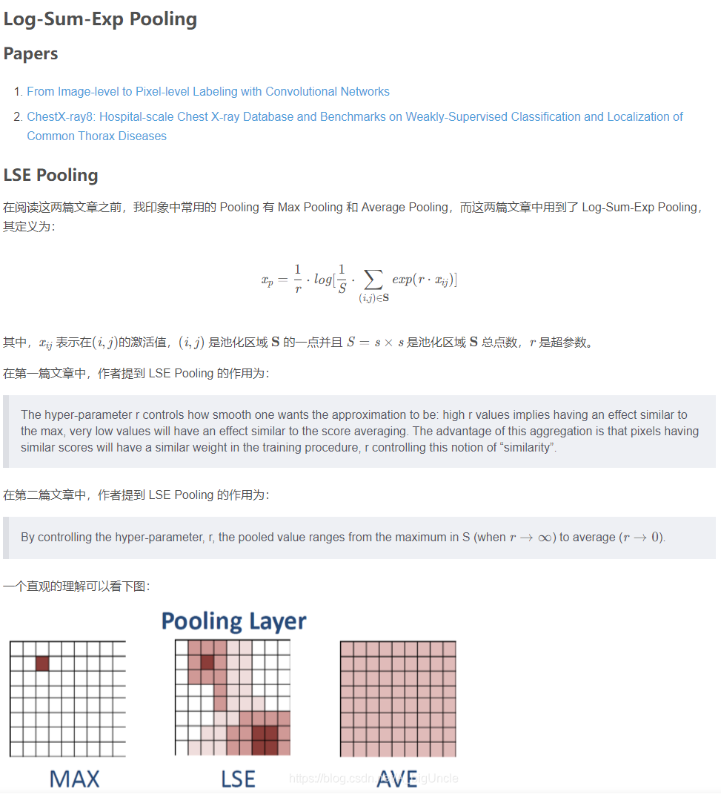
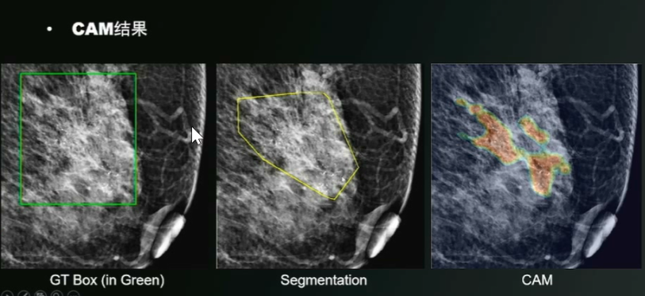
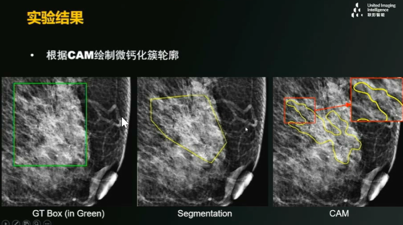

- 任务：先进行分割从而定位到钙化点；划分点簇，对每个点簇计算凸包分析，画出每个点簇的边界（注意目的是为了判断是否存在聚集）
  collapsed:: true
	- 
	- 
- 问题：是一个两阶段的过程，而不是端对端的，且需要人手工的参与；假阳率高
- 难点：
  collapsed:: true
	- 钙化点不像猫狗等自然图像具有很明显的boundary，其边界的形态非常多样化
	- 钙化点的尺寸不一，一般是0.1-1.0mm，但是也有小于0.1mmm的
	- 钙化点的亮度各异
	- 分割的准确率不够，导致后续的聚类结果也有误差
- 整体思路：
  collapsed:: true
	- 
	- 模型以Unet为主干网络进行分割；
	- 第一次上采样后的特征图 up_feature_maps_1   先经过log-sum-exp池化和一层fc就产生良恶性分类预测结果；
		- Log-sum-exp pooling
		  collapsed:: true
			- 
	- 将FC的权重作为1*1卷积的参数，然后对 up_feature_maps_1 进行卷积 得到  良性CAM图 和 恶性CAM图：
		- 【1】对两张CAM图与人工标注的检测框计算dice损失，以便CAM图的注意力区域能始终在有效范围内；
		- 【2】对良性CAM和恶性CAM都进行"擦除”处理：
			- 良性CAM中会定位到与乳腺点簇相似的密集腺体，CAM * Image 能够排除掉不感兴趣的区域，那么剩下的区域就是 已经关注到的乳腺钙化点簇 +  密集腺体
			- 恶性CAM中进行反向擦除，通过 （1 - CAM）* image的方式来擦除掉目前具有鉴别性的重点区域，那么剩下的区域其实就是无关区域和部分被遗漏掉的稀疏钙化点簇
		- 【3】Unet的encoder + bottleneck + one layer decoder + pooling + fc层  被复用为 鉴别器，这里的复用即共享参数的意思：
			- 对 良性擦除结果 进行 分类，GT也为良性，从而让网络注重如何区别  密集腺体  和  钙化点
			- 对 恶性擦除结果  进行 分类，GT也为良性，从而让网络学习到 剩余的稀疏钙化点簇中 小部分是与良性有关，而更多的一部分是与恶性相关的，从而使得最终的恶性CAM能定位到被遗漏的稀疏钙化点簇，定位结构更加完整 （待确定，待质疑）
	- 使用的损失函数：
		- 
		- 
			- 分割损失的分母不再使用图像的总像素个数，而是使用  预测分割 和 掩膜 中的 分割部分 的 像素数之和
				- 原因是 钙化点的尺寸过小，BCE 计算的结果可能很小，如果分母过大，最后的损失值也就很小
- Insights：
  collapsed:: true
	- 多任务且端到端：用钙化点的分割来辅助分类（良恶性）和聚类（钙化点簇的检测）
	- 分类和聚类任务相互促进：
		- 从分类任务推导出聚类结果：
			- 使用online CAM的定位图来划分点簇，并勾画点簇的边界，从而使得聚类任务变得可训练
		- 提高点簇边界勾画的准确率来提升分类效果：
			- 提出了自对抗的学习方式，即将网络本身也作为鉴别器
				- 使得CAM不仅是关注到最具区分性的区域，而是关注到更全面的钙化点簇，
				- 提升对于困难案例的提升效果
- 实验结果
	- 
	- 
	- {:height 459, :width 807}
	- 
- 总结
	- 
-
-