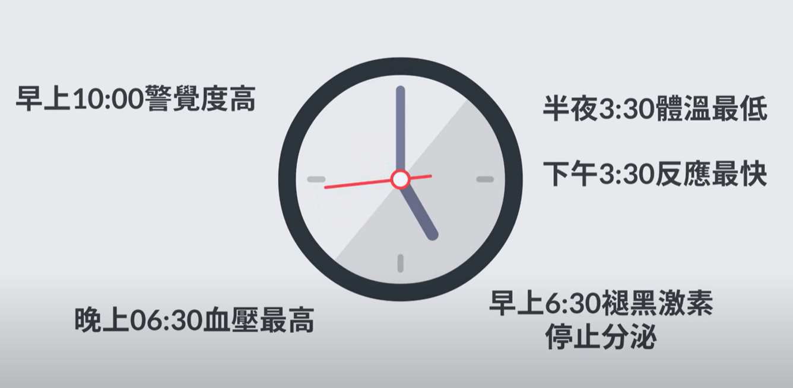
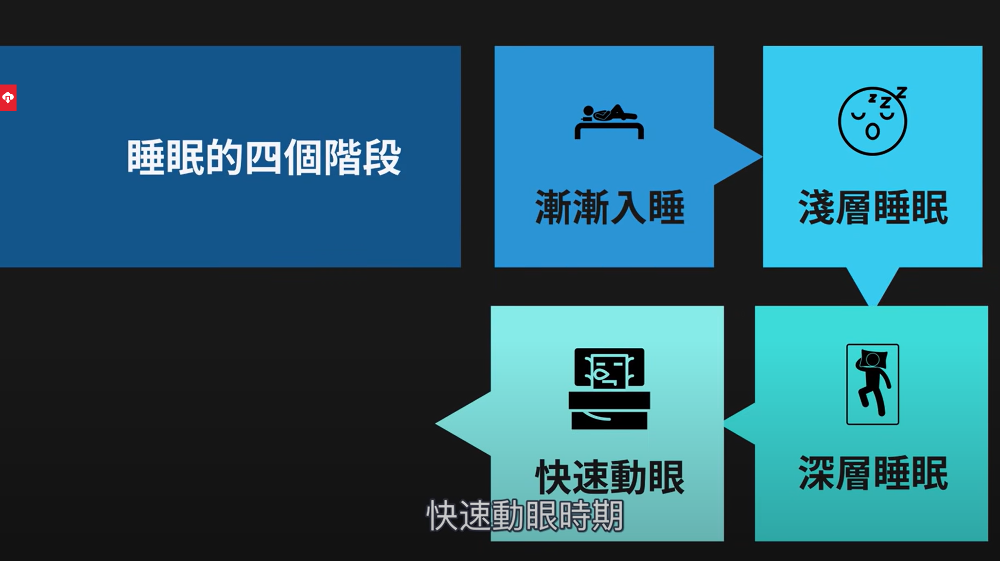
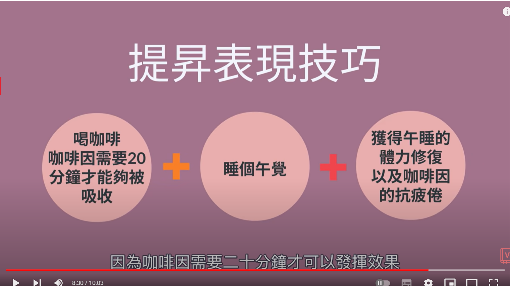
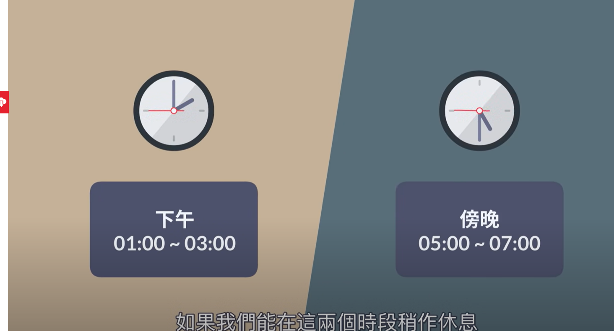
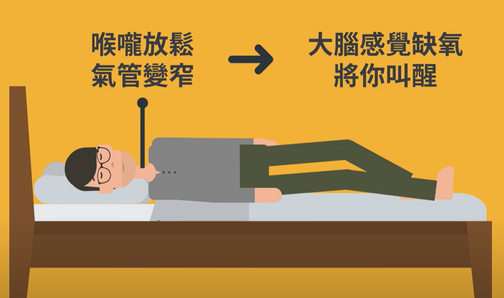
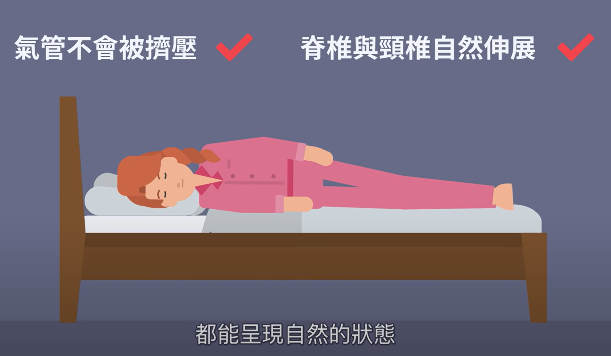
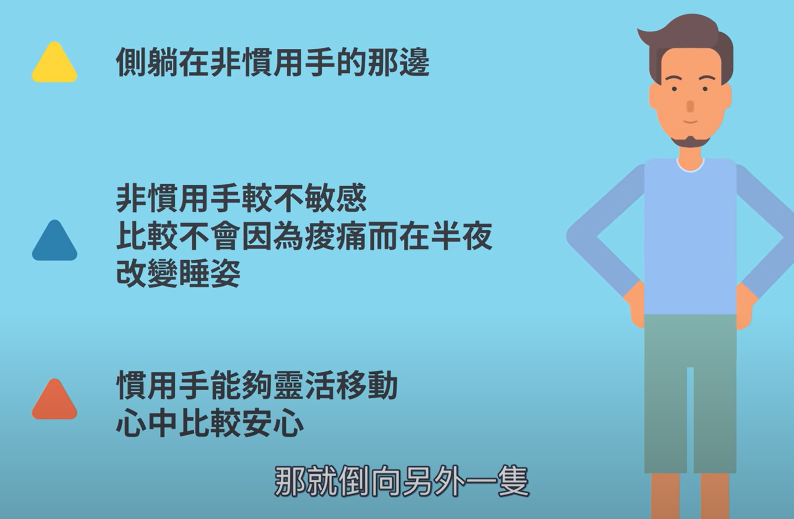

- [[#red]]==1.学会计算睡眠周期（一个周期是1.5h）==
  [[#blue]]==2.如果晚上追剧狂欢了，还是要同一个时间点起床，之后再补觉==
  [[#green]]==3.如果睡前感到焦虑，把焦虑的事写下來（无需写得非常程序化，只需要让焦虑有所寄托）==
  [[#blue]]==4.降低温度(洗热水澡再回到吹风的卧室内)==
  [[#red]]==5.侧睡(并且不要压到惯用手，也就是在非惯用手侧入睡，大多数人应该都是向左侧卧；仰睡气道变窄容易缺氧)==
- 小诀窍:
  [[#blue]]==1.在下午1:00-3:00 和 下午5:00-7:00午睡==
  [[#green]]==2.喝咖啡立刻休息20分钟
  3.喝咖啡不要习惯性地喝，等到需要大量精神再喝==
- PPT：
  collapsed:: true
	- 睡眠周期：
	  collapsed:: true
		- 
		- 
	- 午睡和喝咖啡：
		- 
		- 
		- 
		-
	- 为什么要侧睡：
	  collapsed:: true
		- 
		- 
		- 
		-
- [[$red]]==Records: 记录下睡眠状况特别不好、特别好两种情况，其余情况不做记录==
	- {{renderer :luckysheet, workbook@1673101802087}}
	-
-