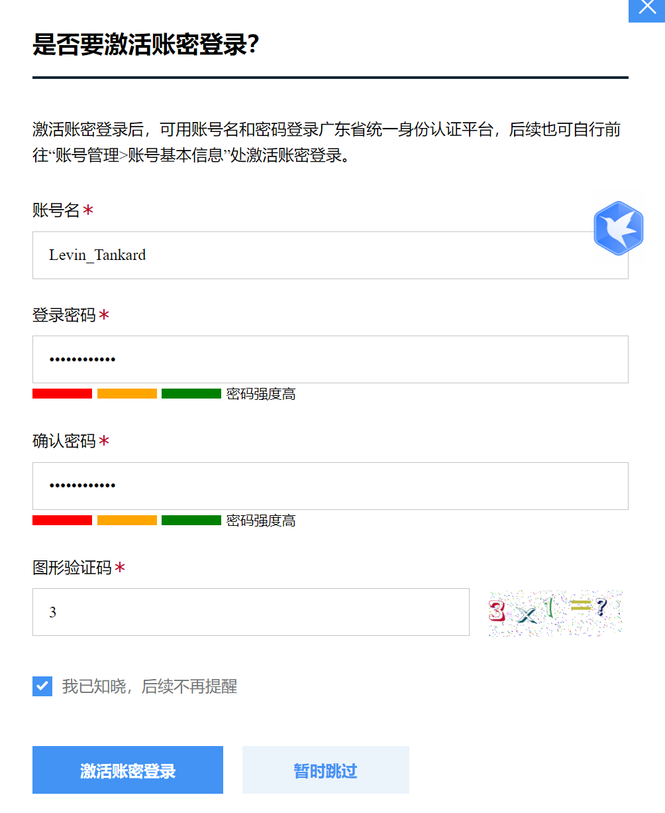

- DOING 进一步改进学习过程
  :LOGBOOK:
  CLOCK: [2024-07-03 Wed 12:33:02]
  :END:
	- TODO 寻找学go的技术群聊
	- TODO 寻找出海业务的群聊
	- TODO 寻找深圳工作、生活等相关的群聊
	- DOING 重新学习springboot
	  collapsed:: true
	  :LOGBOOK:
	  CLOCK: [2024-07-03 Wed 12:32:58]
	  :END:
		- 
		- 
		- 
			- Configuration、Bean还有Import都是Spring3+版本中都开始出现的注解，只是在springboot当中才被使用到，所以经常会被误解是SpringBoot的注解
		- 
		  id:: 6684dd27-de71-4615-ad8a-22dae8df5964
		- 
		- 
		-
	- TODO 重新学习redis
	- TODO 补充学习小付哥上的一些重要知识点
	- TODO 学会怎么用 + 学习有效记忆
	-
- DONE 出行
  collapsed:: true
  :LOGBOOK:
  CLOCK: [2024-06-05 Wed 22:42:46]--[2024-06-29 Sat 21:36:08] =>  574:53:22
  :END:
	- DONE 鸡鸣寺
	  :LOGBOOK:
	  CLOCK: [2024-06-05 Wed 22:42:32]--[2024-06-05 Wed 22:42:33] =>  00:00:01
	  :END:
	- DONE 老门东 + 小西湖
	  :LOGBOOK:
	  CLOCK: [2024-06-16 Sun 22:17:46]--[2024-06-16 Sun 22:17:47] =>  00:00:01
	  :END:
	- TODO 鱼嘴湿地公园
	- TODO 流徽榭
	- DONE 毗卢寺 + 颐和路 + 上海路
	  :LOGBOOK:
	  CLOCK: [2024-06-16 Sun 22:17:51]--[2024-06-16 Sun 22:17:52] =>  00:00:01
	  :END:
	- DONE 白鹭洲公园
	  :LOGBOOK:
	  CLOCK: [2024-06-05 Wed 22:42:36]--[2024-06-05 Wed 22:42:37] =>  00:00:01
	  :END:
- TODO 集中精力完成一些爱好
  collapsed:: true
	- TODO 批判过去写作中的问题
	- TODO 学习干货类型的文章如何写
	  collapsed:: true
		- TODO 各类综合征患者：美剧综合征、哲学综合征、诗歌综合征、青春伤痛文学综合征患者
		-
	- TODO 把英文的审美档次和语感档次上升一个级别
	- TODO 学完德语的基本发音
	- TODO 把《走遍美国》这本书听完
	- TODO 学习国际象棋的基本玩法
	- TODO 玄武湖夜跑
	  :LOGBOOK:
	  CLOCK: [2024-06-20 Thu 19:06:53]
	  CLOCK: [2024-06-20 Thu 19:06:55]--[2024-06-29 Sat 21:36:34] =>  218:29:39
	  :END:
	-
- TODO 集中精力调整下自己的习惯
  collapsed:: true
	- TODO 不良的作息习惯
	- TODO 过度的玩手机习惯
	- TODO 增加运动习惯
	- TODO 不良的思考习惯
- TODO 收拾行李和合租准备
  collapsed:: true
	- DONE 把需要打包回家的行李寄回去，使用最便宜且安全的快递方式
	  collapsed:: true
	  :LOGBOOK:
	  CLOCK: [2024-06-29 Sat 21:36:43]--[2024-06-29 Sat 21:36:44] =>  00:00:01
	  :END:
		- 圆通
	- DONE 把重要的档案材料进行归档，分清哪些需要带回家，哪些需要随身携带
	  collapsed:: true
	  :LOGBOOK:
	  CLOCK: [2024-06-29 Sat 21:35:11]--[2024-06-29 Sat 21:35:12] =>  00:00:01
	  :END:
		- 硕士毕业证、学位证最好还是直接携带过去，同时把这些扫描一下电子版吧
		- 本科毕业证和学位证就直接用电子版就行
		-
	- DONE 待整理的杂物
	  collapsed:: true
	  :LOGBOOK:
	  CLOCK: [2024-06-29 Sat 21:35:06]--[2024-06-29 Sat 21:35:08] =>  00:00:02
	  :END:
		- DONE 药物类
		  :LOGBOOK:
		  CLOCK: [2024-06-24 Mon 11:55:07]--[2024-06-24 Mon 11:55:08] =>  00:00:01
		  CLOCK: [2024-06-24 Mon 12:07:23]--[2024-06-24 Mon 12:07:24] =>  00:00:01
		  :END:
		- DONE 电子设备类
		  :LOGBOOK:
		  CLOCK: [2024-06-29 Sat 21:35:05]--[2024-06-29 Sat 21:35:05] =>  00:00:00
		  :END:
		- DONE 书本类
		  :LOGBOOK:
		  CLOCK: [2024-06-29 Sat 21:35:02]--[2024-06-29 Sat 21:35:03] =>  00:00:01
		  :END:
			- 一定要能够使用到
		- DONE 衣物再次整理下
		  :LOGBOOK:
		  CLOCK: [2024-06-29 Sat 21:35:00]--[2024-06-29 Sat 21:35:01] =>  00:00:01
		  :END:
			- 重点是秋冬天寒冷衣物要带多少，这个是可以缩减的地方
		- DONE 给小包换上拉链
		  :LOGBOOK:
		  CLOCK: [2024-06-24 Mon 11:55:02]--[2024-06-24 Mon 11:55:03] =>  00:00:01
		  :END:
		-
			-
	- DONE 租房的思考？
	  collapsed:: true
	  :LOGBOOK:
	  CLOCK: [2024-06-29 Sat 21:36:52]--[2024-06-29 Sat 21:37:10] =>  00:00:18
	  :END:
		- DONE 到底提前多久过去好呢？是不是得等hr告诉你具体的部门后再去考虑呢？
		- DONE 到底租在哪个区：上下班的时间、周围的基础设施环境、公寓还是小区
		- DONE 到底租半年还是一年呢？
		- DONE 到底是合租还是单人租房子：合租要找谁呢？
		- DONE 考虑一年内可能的工作转移：若是换工作，选择什么地点切换房子的成本比较低呢？
		- DONE 房屋内的室内环境需要实地考察：楼层是否太高？是否过于潮湿而导致蟑螂太多呢？做饭、洗衣服和无限网络设备是否正常使用且故障率低？水电是怎么计费的，会被坑吗？
	- TODO 入职材料提交
		- DONE 2寸证件照，要求白底正面免冠近照**（务必为白底证件照）**
		  :LOGBOOK:
		  CLOCK: [2024-06-24 Mon 11:55:14]--[2024-06-24 Mon 11:55:15] =>  00:00:01
		  :END:
		- TODO 团组织关系转接至公司
		- TODO 怎么落户到深圳南山区呢？
		  collapsed:: true
			- "人才落户支持。对实习结束后获得实训基地录用的实训人才，在该企业连续工作满一年且办理引进入户的，按其学历层次给予一次性生活补贴，补贴标准为：本科生2万元、硕士研究生3万元、博士研究生10万元。此补贴获得者不得同时享受市区级新引进人才落户同类补贴政策"
			- 入户账号和密码：
			  collapsed:: true
				- 
				-
		- DONE 办公地点
		  collapsed:: true
			- 深圳地区办公地点可能为创智天地大厦/软件产业园基地/顺丰前海总部大厦，具体办公地点将会在6月下旬邮件告知同学
		- DONE 完成医保报销
		  collapsed:: true
			- 体检都是自费，东大医院现在医药保险都是直接带上医保卡而无需提交报销单了
			-
	- TODO 待购置的东西
	  collapsed:: true
	  :LOGBOOK:
	  CLOCK: [2024-06-19 Wed 19:49:21]
	  CLOCK: [2024-06-19 Wed 19:49:27]--[2024-06-19 Wed 19:49:37] =>  00:00:10
	  :END:
		- DONE 多功能锅
		  :LOGBOOK:
		  CLOCK: [2024-06-29 Sat 21:37:23]--[2024-06-29 Sat 21:37:24] =>  00:00:01
		  :END:
		- DONE 雨伞
		  :LOGBOOK:
		  CLOCK: [2024-06-29 Sat 21:37:25]--[2024-06-29 Sat 21:37:26] =>  00:00:01
		  :END:
		- TODO 充电宝
- TODO 入职准备
	- DOING 到了广东再去买一些当地的裤子衣物吧
	  :LOGBOOK:
	  CLOCK: [2024-07-03 Wed 11:32:18]
	  :END:
		- 今天直接在村里看看有没有更便宜的，还是需要买长裤的
		- 感觉自己的鞋子特别容易发臭（到底是脚发臭还是鞋子不透气导致的汗水天然臭呢？），这会特别影响我的工作体验的
	- DOING 简单熟悉下周围的地理环境
	  :LOGBOOK:
	  CLOCK: [2024-07-03 Wed 11:31:06]--[2024-07-03 Wed 11:31:07] =>  00:00:01
	  CLOCK: [2024-07-03 Wed 11:37:40]
	  :END:
	- DOING 办完招商银行卡
	  :LOGBOOK:
	  CLOCK: [2024-06-30 Sun 10:37:49]
	  :END:
	- DONE 购买钥匙挂脖子
	  :LOGBOOK:
	  CLOCK: [2024-07-03 Wed 12:13:34]--[2024-07-03 Wed 12:13:36] =>  00:00:02
	  :END:
		- 出门一定带包吧，因为一定要带雨伞、水杯，可以把钥匙放在包里
	- DONE 给房东补交身份证复印件
	  :LOGBOOK:
	  CLOCK: [2024-06-30 Sun 10:38:18]--[2024-07-03 Wed 11:31:00] =>  72:52:42
	  :END:
	- DONE 理发
	  :LOGBOOK:
	  CLOCK: [2024-07-03 Wed 11:30:58]--[2024-07-03 Wed 11:30:59] =>  00:00:01
	  :END:
	- TODO 早上七点半从大新地铁站出发，看看过两站大概需要多久的时间
	- DONE 解决手机温度过高问题
	  collapsed:: true
	  :LOGBOOK:
	  CLOCK: [2024-07-03 Wed 11:58:50]--[2024-07-03 Wed 11:58:51] =>  00:00:01
	  :END:
		- 只能用湿纸巾 or 用水粘纸
		-
		-
-
	-
-