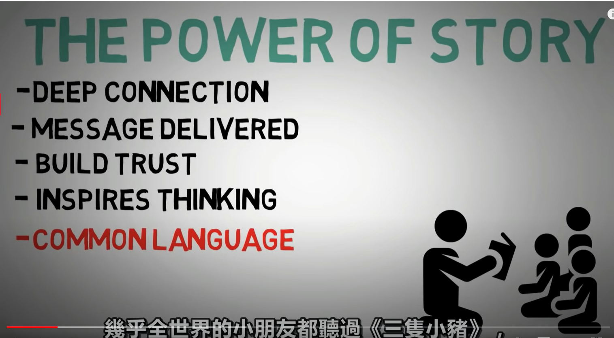
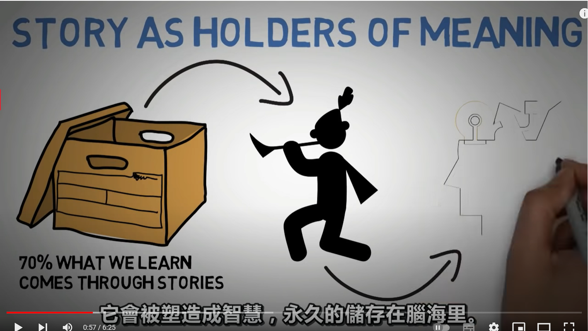
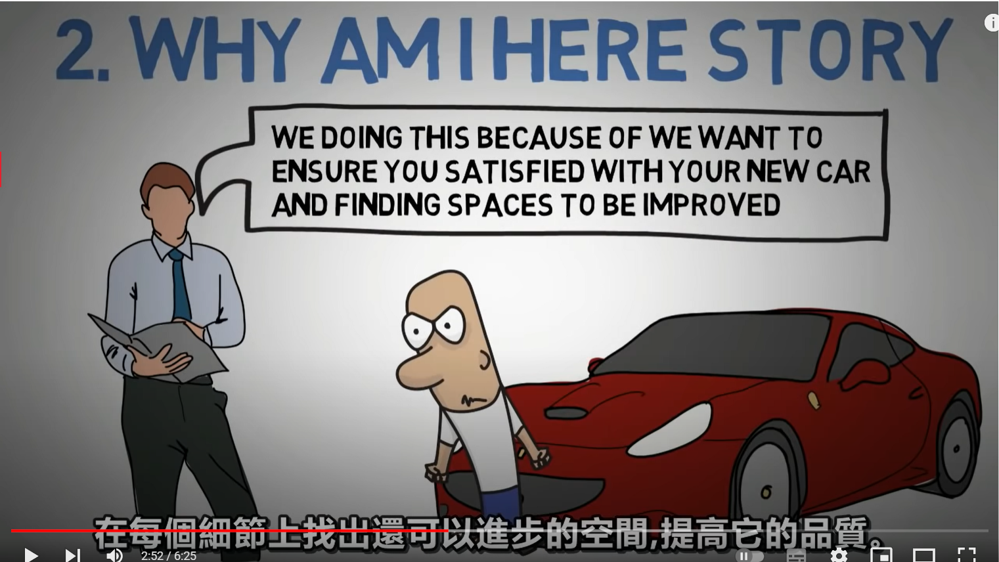
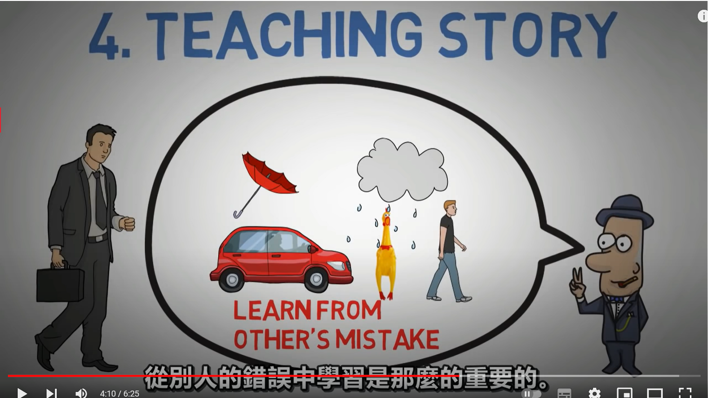
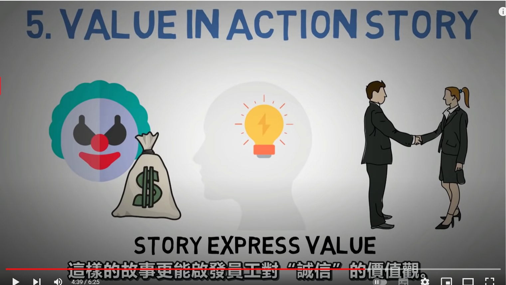
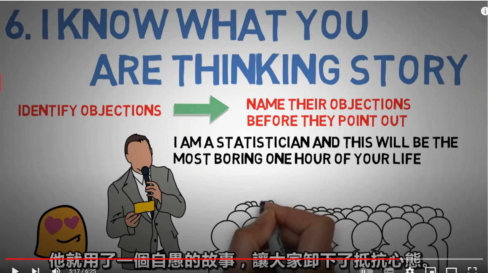

- {{youtube https://www.youtube.com/watch?v=Dwow0q2U7fU}}
	- [[故事(Story)]]
		- 讲故事比讲道理好在哪里？
		  collapsed:: true
			- 
		- 讲故事从科学原理上来说为何是有效的？[[NeuroScience]]
		  collapsed:: true
			- 因为我们学习的内容70%来自故事，而这些故事所带来的智慧，是一种永久记忆。
			- 
			-
		- 什么样的故事才能够影响到别人？ [[SolutionNotes]]
			- 有六种类型的故事可以：[[SixTypesOfStory]]
				- [[我是谁]]的故事
					- 快速建立起[[Trust]]
					- X因为曾经迟到而导致比别人更晚毕业，所以后面养成了提前10min的习惯。这比直接说”自己是一个守时的人”更靠谱
				- [[我为什么会在这里]]的故事:
					- 为了消除别人对你的[[Doubt]]
					- 汽车访问人员对新车车主进行调查时说明自己的目的是：我们想要确保新车车主对自己的新车满意，同时找出可以继续提升质量的空间
					  collapsed:: true
						- 
				- [[我要去哪里]]的故事：
					- 为了让别人和你产生[[共鸣]]
					- 一个广告公司的CEO从来不会说自己的宗旨是培养和缔造艺术家之类的话，而是把自己当作[[梵高]]，不断地讲梵高的故事，办公室里也挂满了梵高的作品，鼓励员工和自己一起成为疯狂怪异的[[艺术家]]
				- [[启发别人(Teaching)]]的故事：
					- 即使开个汽车也要记得带雨伞，不然如果见到顾客时自己是落汤鸡，会白白丢失一个机会。
					  collapsed:: true
						- 
				- [[带出行动价值(ValueInActions)]]的故事：
					- 比如员工向顾客或者企业直接承认自己的错误，反而会更能说明诚信
						- 
					-
				- [[我知道你在想什么]]的故事：
					- 如何你讲了一个故事能够解读对方的心思，那么对方一定会疯狂的爱上你
					- 要识别出对方的[[反对点]]，并在他们指出之前对他们的[[反对点]]进行命名
						- 
						-