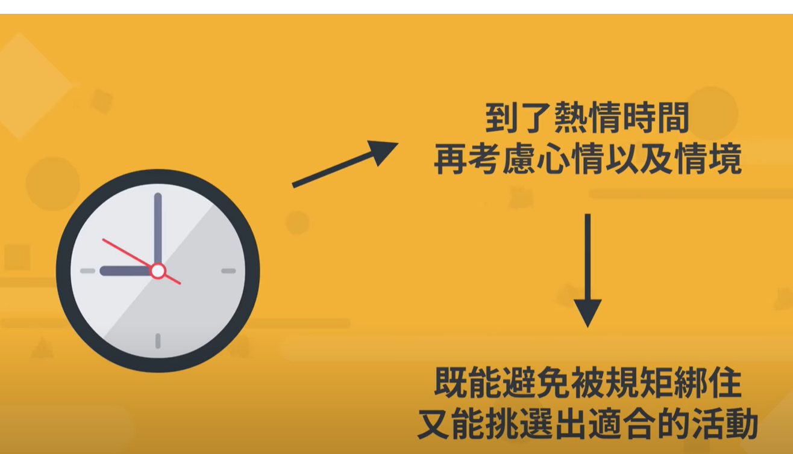

- {{youtube https://www.youtube.com/watch?v=vNYXeSKwnhY}}
	- [[LearningTricks]] [[ProfessionPlanning]]
		- 如果你是一个[[多兴趣的能力者]]，你的经历会有什么样的特点？
			- [[#red]]==在克服某一个行业方向最困难的部分后，就会对其丧失兴趣==，转而去寻找下一个兴趣点
			- 职业简历上会因此显得繁杂，每段职业的周期都不长
		- [[多兴趣的能力者]]在找工作中遇到的阻碍有哪些？
			- 会被hr质疑不能够 [[坚持(Persist)]]，缺乏[[耐力(Patience)]]
			- 会被hr质疑学习深度不够，无法解决公司更多的问题
		- [[多兴趣的能力者]] 该如何克服求职障碍？
			- 找出[[公分母]]
				- 在简历上罗列每个职业对应的技能点，然后找出自己以往所有职业的技能点的共同之处
			- 找出当前应聘职业的[[隐藏能力]]
				- 因为任何一个职业都是需要多种能力并用的，找出[[隐藏能力]]可以使得你过去的经历和经验被看见，也能展现出你的 [[Innovation]]
			- 使得面试中[[多元或者单一不是重点]]
				- 只要展示出你干活或者胜任这个职业的能力就可以了
				- 同时展示你的 [[热情(PASSION)]]将怎样提升工作绩效
		- 如何在多种 [[热情(PASSION)]]的兴趣中进行选择？
			- 使用[[四色冰淇淋哲学]]和[[五大价值观]]
				- 从日常爱好中找出[[重视的价值观]]：
					- 如果喜欢阅读，说明喜欢[[心灵上获得满足]]的感觉，所以[[身心平衡]]是你追求的价值观；
					- 如果喜欢烧脑电影或者数学，说明你喜欢[[在杂乱无章的表面底下找出规则]]的成就感，那么[[挑战(Challenge)]]和[[创造力]] [[Innovation]]可能是你着重的价值观；
				- 可以从找出的[[重要价值观]]中挑选四个感兴趣的
					- 假如[[安全感]]是你追求的 [[重要价值观]]，那么：找一份稳定的工作
					- 假如[[家庭]]是你追求的[[重要价值观]]，那么：参加孩子的重要活动、每周给爸妈打电话
					- 假如[[金钱]]是你追求的 [[重要价值观]]，那么：研究投资和副业
				- 不断更改这份生活套餐，直到它满足你现在的[[生活形态]]
				- 每周给自己设定[[热情时间]]
				  collapsed:: true
					- 
				- 如何挑选[[日间工作]]？
					- [[热情活动]]和[[工作(Work)]]需要[[相互补充]]
					- 三个原则：
						- 让你能保持[[心态平衡]]
							- 
						- 让工作能够赚钱的金钱不仅能够覆盖生活成本，还能提供额外资源作为[[附加效益]]
						- 不要盲从[[社会认同]]
					-
					-
				-