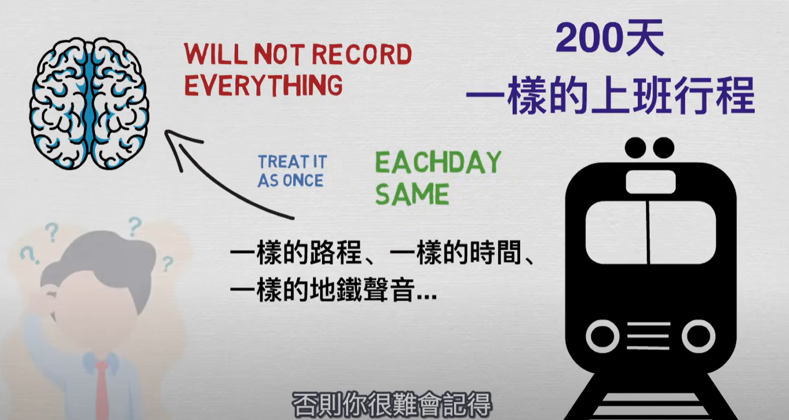
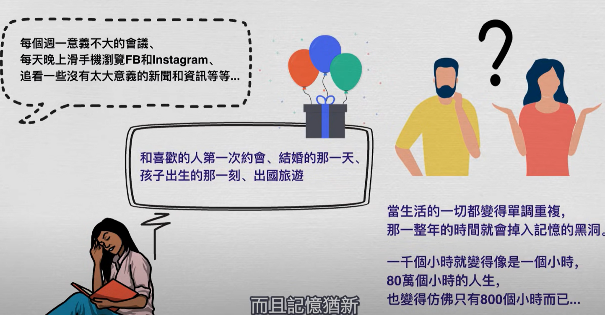
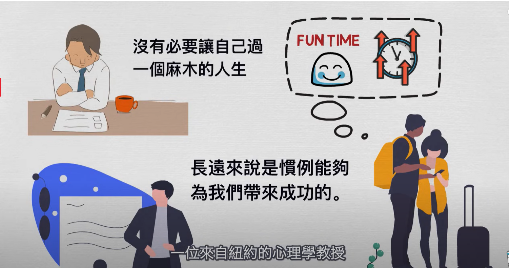
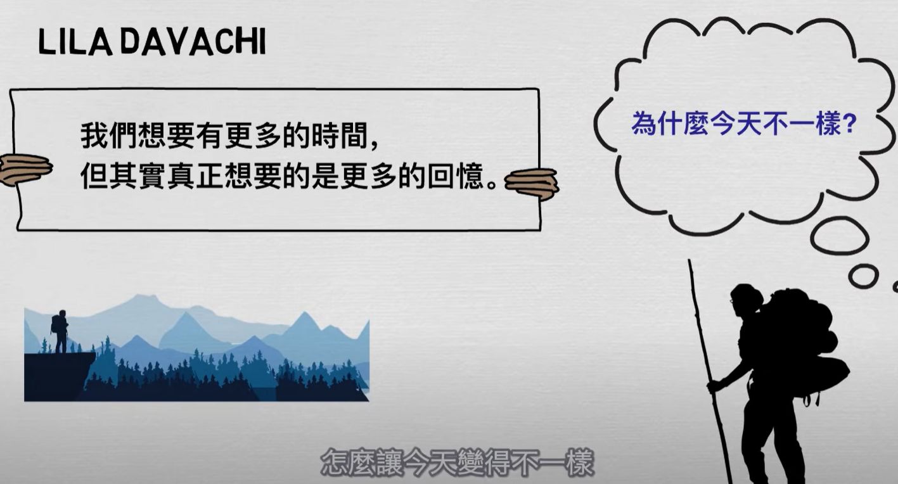
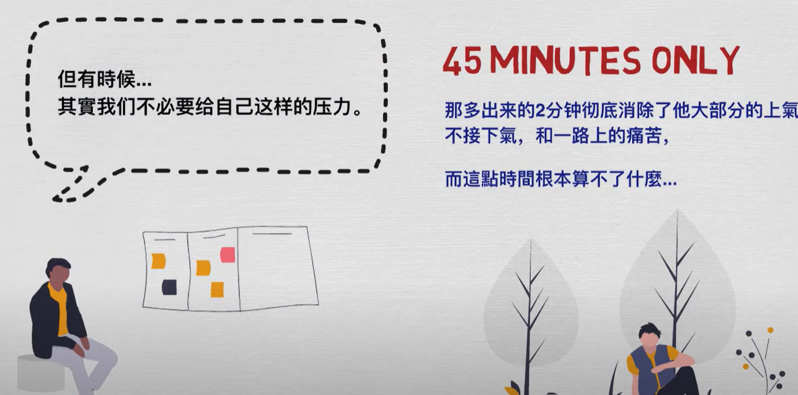
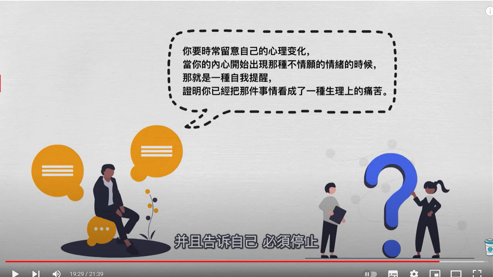
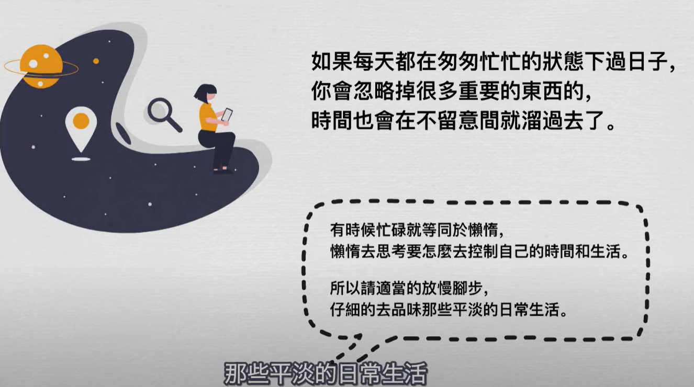

- {{youtube https://www.youtube.com/watch?v=OjSnwrZFJoc}}
	- [[DailyHighlight]]
		- 做小事并不能让生活发生真的改变
	- [[FocusOnlyOnOneThing]][[MakeAChoice]]
	  collapsed:: true
		- 
		- 
	- [[ImroveTimeFeeling]]
		- 
		- 
		- 
		- 
		- 
		- [[时间的巨人]] [[BooksReadingPlan]]
		  collapsed:: true
			- 
			- 
			- 
			-
-
-
- 避免[[时间黑洞]]
	- 反向利用推荐算法学习知识，一刷到搞笑的就不看
	-
	-
	-
- 如何应对 [[突发状况]]对时间安排的[[干扰(disturbance)]]？
	- 首先思考的就是如何立刻调整自己的时间安排，而不是被动地被时间牵着走；如果因为给别人帮忙、办公环境被干扰（比如小孩子的噪音、家里来了客人）等，要克服[[人情障碍]]，立即想出策略去除或者缓解这种干扰
	-