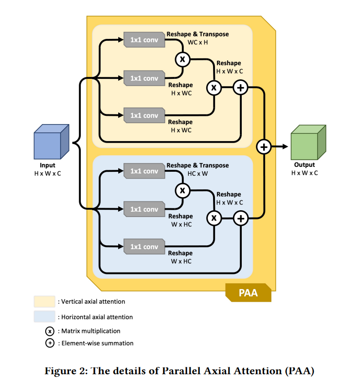

- https://arxiv.org/pdf/2107.02368v3.pdf
- 论文工作：
	- 提出了不确定性增强上下文注意网络(UACANet) ，用于考虑息肉分割中显着图（saliency map）不确定的区域。
	- 构建了 U-Net 的修改版本，使用额外的编码器和解码器塑造网络并计算每个自下而上的流预测模块中的显着图和传播到下一个预测模块。 在每个预测模块中，先前预测的显着图用于计算前景、背景和不确定区域图，将特征图与每个表示的三个区域图聚合。 然后我们计算特征图中每个表示和每个像素之间的关系。
- 模型的主要架构：
	- 模型的整体架构是基于 [[Pranet: Parallel reverse attention network]]，这是MICCAI 2020上一篇对ECCV 2018 [[Reverse attention for salient object detection]]论文模型的改进；
	- 整体架构图：
		- 
	- 模型整体理解：
		- 论文里面主要设计了两个创新的模块，**一个是并行的轴向注意力编码器（Parallel Axial Attention encoder）和并行的轴向注意力解码器（Parallel Axial Attention decoder）**,  另外一个是不**确定增强的上下文注意力模块(UACA，Uncertainty Augmented Context Attention)**。 其中PAA-e模块会在侧外方向和自底向上的两个路径上参与融合。
		- 整个流程是：输入图像，经过连续五层连续下采样的编码器层，其中倒数最后三层的输出都分别通过PAA-e模块。**三个PAA-e模块的输出特征图在通道方向上进行连接**，然后再送入PAA-d这个唯一的解码器模块中**；PAA-d的输出特征图经过1层卷积，就直接得到了最初始的salience map**；最后一个PAA-e模块的输出与PAA-d的输出直接进行相连，然后**初始的salience map作为上下文的context guidance**也被一同送入UACA模块，UACA经过1层卷积的输出 与 初始的 salience map相加，就得到了第二代的salience map；后续过程继续重复。
		- 论文认为：[[$red]]==上一轮的salinece map送入UACA模块中，起到了引导上下文的作用，使得UACA模块学习到了salience map的残差部分，使得后续的UACA能够更加关注像边缘等更加不确定度区域。==
	- **PAA编码器 和 PAA 解码器** 模块理解：
		- Pixal Attention[[Axial attention in multidimensional transformers]]在单一轴上执行non-local操作（局部注意力），然后顺序地将每个轴上的操作连接起来来达到目的：将长距离和短距离信息结合起来
		- 模块图：
		  collapsed:: true
			- 
			- 
		- 本论文的改进思路：
		  collapsed:: true
			- 改进一：
				- 一般的注意力机制是考虑每个像素点对应的c维向量，利用QKV来对c维向量进行一次基于注意力的更新，但是这里是：[[$red]]==考虑 WC组成的平面上每个点对应的h维向量、考虑HC组成的平面上每个点对应的w维向量，也就是对 H * W * C的特征图换了两个方向进行注意力操作==
			- 改进二：
				- 轴向注意力原论文里是将不同轴向的输出结果按顺序拼接起来，这里则**采用了并行结构，并使用按位相加来合并特征图**
					- 这么做的好处有：
						- **这样能够使得不同轴向的特征图对最终特征图具有相同的贡献程度，原先的串行结构容易造成性能的较大衰减**
						- 基于单一轴向的注意力容易造成不可预料的变形，**按位置相加 能够中和可能产生的异常**
					- 注意：
						- **没有使用位置编码策略，因为在较小的尺度里其并非有效**
			- 改进三：
				- 原因：
					- 使用PPA编码器模块 来聚合低层次的特征，但是由于Unet结构中使用低层次特征时并没有降低维度，且由于是图像分类任务所以维度会设置得更大，这通常会降低性能
				- 设计：
					- 使用 **感受野块 Receptive Field Block策略** 与PPA编码器模块进行结合
					- 具体来说，就是从主干网络输出的特征图分别经过四个分支（单纯的1*1卷积、膨胀率分别为3、4、5的三个膨胀卷积分支），[[#red]]==PAA-e分别用于细化后面三个不同尺度分支的特征==
					- PPA的解码器模块设计得相对简单，是对三个尺度特征进行融合后的特征进行解码
					-
			-
	- **UACA 不确定增强的上下文注意力** 模块理解：
		- 这个模块受到  基于逆向注意力的论文[[Reverse attention for salient object detection]] 论文的启发：
		  collapsed:: true
			- 虽然逆向注意力在SOD和息肉分割当中并没有显著增加性能，但是在定性结果上展现出了更好的结果
			- 逆向注意力被认为是[[$red]]==潜在有效的方法==：[[$red]]==不用显示监督边缘的形状但是能引入隐式的边缘指导==
			- 从 saliency图 和 逆向saliency图 中，saliency score接近0.5的点 与 边缘区域高度相关，且[[$red]]==可以认为saliency图和逆向saliency图具有相同的边缘信息==
			- 逆向注意力机制的具体运算：
				- 
				- 对 [[$red]]==解码器深层输出的预测图== 先乘以（-1）再进行sigmoid，得到 逆向注意力权重，然后这个权重和 解码器浅层特征 进行相乘，得到[[$red]]==加权后的解码器浅层特征==；
				- 将 [[$red]]==加权后的解码器浅层特征== 进行卷积， 再与 [[$red]]==解码器深层输出的特征图== 进行相加
		- 关于前景图、背景图和uncertainty map的计算：
			- 
			- score大于0.5的像素点被归为前景部分，score小于0.5的被归为背景部分，而每个像素点与0.5的接近程度被计算得到uncertain area (像素点对应的值离0.5越近，那么uncertainty越大，反之则越小)
			- 三类map中每个像素位置的值的取值范围都是[0, 0.5]
		- 关于UACA具体的计算过程：
			- 模块图：
				- 
			- 流程的描述：
				- 我们已经得到了前景、背景、uncertain区域的三张map，每个map的通道数都是1
				- **获取每个像素点关于前景、背景、uncertain的三个特征向量：**
					- 输入的特征图 H * W * C，也就是HW个像素点都分别对应一个长为C的特征向量 v，每个特征向量分别与三张map进行相乘，也就得到了三个长度均为C的特征向量 vf、vb、vu
				- **计算加权聚合的权重：**
					- 三个特征向量进行相同的1 * 1卷积，同时原始的v也进行1 * 1卷积，v与这三个特征向量分别进行点积，得到三个权重
				- **利用加权聚合对每个像素点的特征向量进行更新：**
					- 三个特征向量需要先进行1 * 1卷积，然后再进行加权求和
					- 求和的结果需要再次进行1 * 1卷积
				- 残差连接：原始特征向量 和  更新后的特征向量  在通道方向进行连接
				-
			- 流程思路总结：
				- 每个像素点的特征 不是利用邻居信息进行更新，而是利用 前景、背景、uncertainty的这三类信息进行更新
-
-