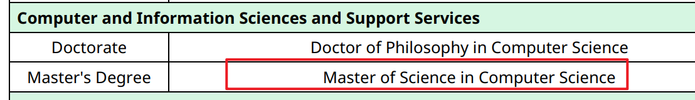
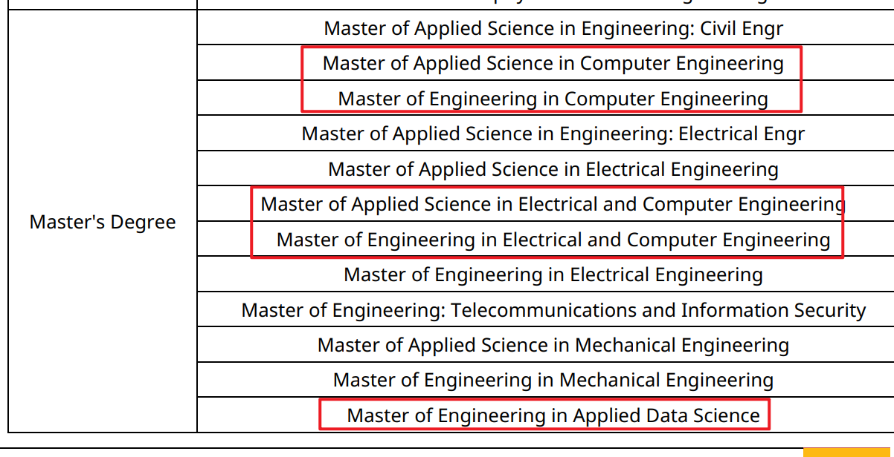
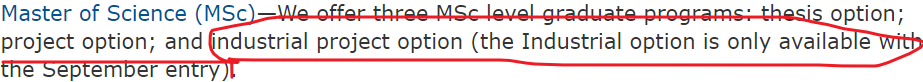
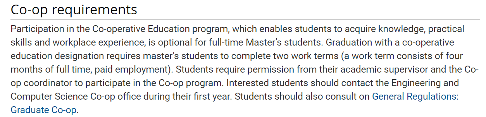
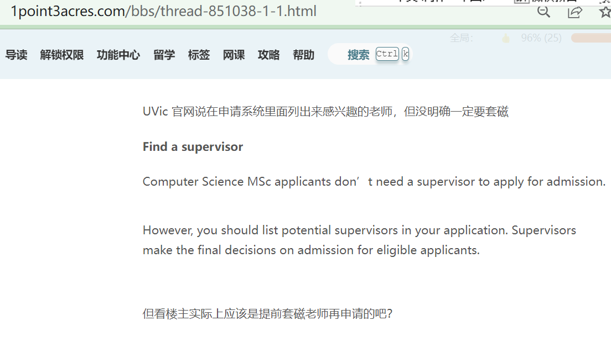
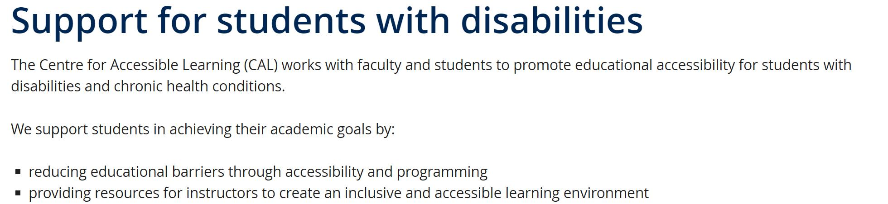
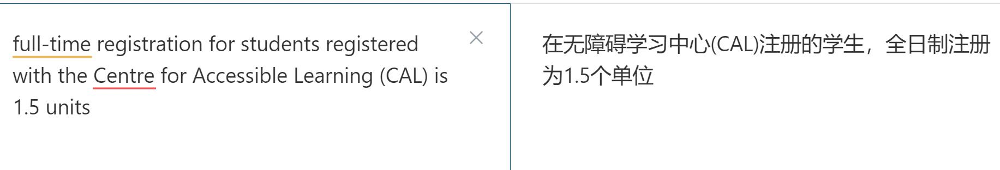
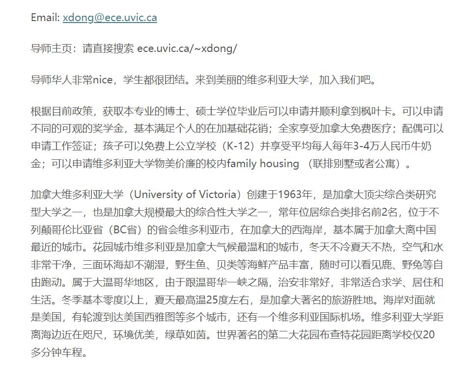

- [[ImmigrationRequires]]
  collapsed:: true
	- 
	- 
	-
	-
- [[ApplyProgramRequirements]]
  collapsed:: true
	- cs  project-based master #MasterProgram
	  collapsed:: true
		- https://www.uvic.ca/graduate/programs/graduate-programs/pages/computer-science.php
		- https://www.uvic.ca/graduate/programs/graduate-programs/credential-pages/computer-science-msc/computer-science-msc.php?residency=I
		- 基于project的master只有9月份才会开放：
		  collapsed:: true
			- https://www.uvic.ca/ecs/computerscience/graduate/?utm_medium=redirect&utm_source=/engineering/computerscience/graduate&utm_campaign=redirect-usage
				- 
		- 关于COOP：
		  collapsed:: true
			- {:height 313, :width 747}
			- 与温哥华中间隔着海，如果要去找温哥华的公司实习可能不太方便
			- 大公司少，中等规模公司也少，因为这个城市就这么大，主要是政府机关。维多利亚工作比较集中的是政府机关，然后大学，然后就是小公司；所以工资可能也不会特别高
			- **COOP的类似项目Worker Experience Program和一些其他要求**
			  collapsed:: true
				- https://www.uvic.ca/graduate/programs/co-op-program/index.php
				- 
			- COOP具体的细节需要与导师和相关负责人沟通询问：
				- 比如可以COOP几个学期？
				- COOP的公司到底怎么确定呢？
				- COOP的内容如何与自己的毕业Project联系起来呢？
		- 关于毕业要求：
		  collapsed:: true
			- https://www.uvic.ca/calendar/grad/index.php#/programs/SJgbspmAzE?bc=true&bcCurrent=Computer%20Science&bcItemType=programs
		- 应该thesis-based master需要陶瓷，但是project-based不确定是否需要？
		  collapsed:: true
			- 
			-
		- 【备注】：官网上有一些不太好理解的专业词汇  #ConceptDefinition
		  collapsed:: true
			- CSC:
			  collapsed:: true
				- https://www.investopedia.com/terms/c/csc.asp
			- CAL：
			  collapsed:: true
				- 
				- 
			- mature student：
			  collapsed:: true
				- A "mature student" is usually applicants who are over 19 years old and do not have a high school diploma or GED. Adults can apply to attend colleges or universities as mature students
			- What is the faculty of Graduate Studies?
			  collapsed:: true
				- The Faculty of Graduate Studies oversees graduate admissions, fellowships, grants, academic employment, preparation for teaching, supervision, advising, accommodations, concessions, oral exams, and degree completion.
				  collapsed:: true
					- 研究生院负责监督研究生入学、奖学金、助学金、学术就业、教学准备、监督、咨询、住宿、优惠、口试和学位完成。
			- Capstone project:
			  collapsed:: true
				- https://www.edglossary.org/capstone-project/
				  collapsed:: true
					- Capstone Project​ Definition. A Capstone Project ​is a multifaceted body of work that serves as a culminating academic and intellectual experience for students.
					  collapsed:: true
						- Capstone 项目定义。 Capstone 项目是一个多方面的工作，可为学生提供最终的学术和智力体验。
- [[LocalEnvironment]]
  collapsed:: true
	- 
	- https://forum.iask.ca/threads/615282/
	-
-
-