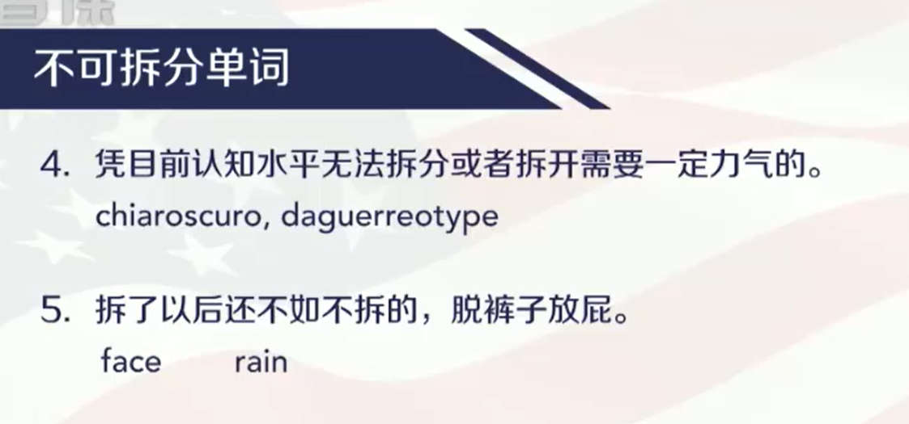
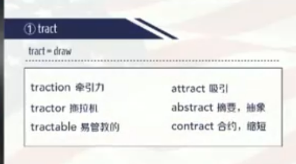
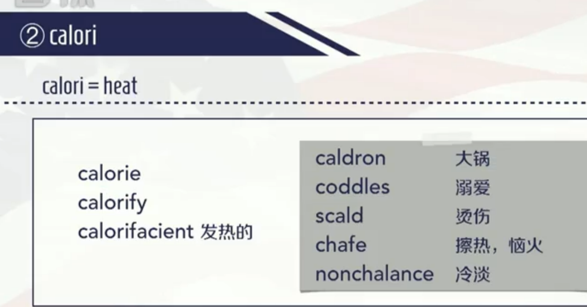
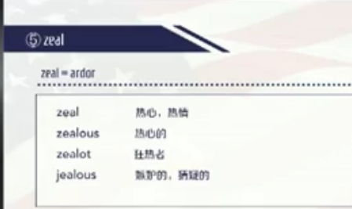
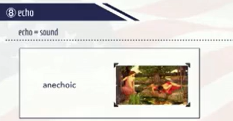
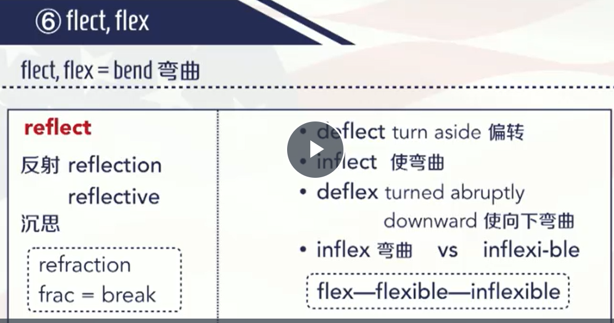

# Chapter 1
collapsed:: true
	-  #card
	  card-last-interval:: 4
	  card-repeats:: 2
	  card-ease-factor:: 2.46
	  card-next-schedule:: 2023-01-14T16:45:45.936Z
	  card-last-reviewed:: 2023-01-10T16:45:45.936Z
	  card-last-score:: 3
- ## 1 可拆分的
  collapsed:: true
	- ### 1.1 按规则出牌的
	  collapsed:: true
		- ### 1.1.1 词根
		  collapsed:: true
			- 
			  collapsed:: true
				- per的含义：
					- through, completely 全部
					- 贬义：**就是会对后面的单词产生贬义色彩**。perimeter表示全部测量，所以是周长
				- re的含义：1. repeat：重复  2.back：
				- dis的含义：1.no  2.away apart
				- di的含义：穿过。**diameter表示穿过去测量，所以是直径；dialogue表示你的话语和我的话语相互穿过、你一句我一句，所以表示对话**。diameter的重音在a上面。
				- tele表示距离、远，telemeter表示遥测仪
				- odo = od(o) 表示道路，odometer表示里程表
				- dromo = to run, 表示速度计（aerodrome机场， syndrome综合征）
				- opt表示光学，optometer表示视力计，optometrist表示验光师
				- geo表示地理，在测量地理的过程中发现了勾股定理，也就是发现了几何
				- decameter表示10米，decimeter表示10分之一米也就是分米。decade十年
				- centimeter表示100之一米也就是厘米，hectometer表示100米
				- kilometer表示1000米，millimeter表示1000分之一米也就是毫米。million百万 = 1000个1000
				- bar表示阻止，barometer表示气压计、晴雨表
				- alt表示高度，altimeter表示飞行器的高度计
				- density表示密度，densimeter表示密度计
				- therm = werm = warm ,  thermometer表示温度计
			- 
			  collapsed:: true
				- 阻止声音出来的人：男中音 baritone
				- 阻止坏事情发生的人：律师/诉讼律师 barrister
				- 精神上受到阻止的人：尴尬 embarrassed
			- 
				- relegate: re表示回来，所以表示降级流放
			- 
				- script表示写
				- man原本是男人，这里作为词根表示手的含义，用手写的东西就是手稿。**这里的u是元音连字符。**
				- a表示强调，ascribe表示一直写，所以是归功于。ascribe sth to sb 把某东西归功于某人
				- in表示向下，向下写就表示记下
				- circum可以类比circle或者cycle，表示圈子，绕着圈子写就是限制。孙悟空给唐僧画了个圈，限制了唐僧和猪八戒的活动范围
				- con表示一起，大家一块写就表示强行征召
				- pre表示在前面，写在前面的东西就是规定，医生在做手术前面的操作就是在纸上写药房进行开药
				- sub在下面，将一部分财产写在别人的银行账号下面就是捐款，在自媒体账号的评论区下面写文字评论（或者说是点击账号下面的“关注”或者“小铃铛”）就是订阅
				- transcribe中的tran表示变换，变换着写就是在抄写、转录，其名词是transcript成绩单
				- 
					- dis分开想，表示争论
					- im使得，使得某个人想，表示归结于、归罪于、归咎于
					- com一起想，表示计算
				- 
					- envious一直盯着你看，表示嫉妒
		- ### 1.1.2 词缀
		  collapsed:: true
			- 
				- super在位置上表示“在上面”，trans表示变换位置（transform）, under表示在什么什么底下
				- uni表示“单一”， uniform制服、unique独一无二的、united表示联合成一块的；bi、di、twi、du都表示二：【1】bicyle也就是两个圈，两个轮子也就是自行车【2】di之所以表示二是因为d和b是成镜像关系的字母，最早起源的时候d和b就是一个字符，divide表示分成两块，也就是划分，【3】twi来自单词two, twice、twins，twilight两个光表示黎明、傍晚、暮光之城【4】du，印度人说一二三发音是one du three, dual是双重的，duel是决斗（两个人打架）、duet是二重唱二重奏；centi表示百；milli表示千；mono表示单一，monday是星期一; in order to keep the peace around the world, we require multi-national cooperation;
				- hyper在程度上也表示过分，发音很像high, hyper-tension是高张力、高血压；well表示好、还不错地， well-educated表示受到良好教育地
				- co表示合作；mal表示坏的，mis表示错的，maltreat表示不好地对待也就是虐待，mistake表示错误，错事并不一定是坏事，比如打破了水杯是一件错事但不是一件坏事；self表示自己地，self-employed表示自己雇佣自己地
				- anti表示反对，antibody抗体、antibiotic抗生素；counter也表示反对；pro表示支持，pros支持点；
			- 
				- legislate立法、create；fish钓鱼、finish完成；satisfy、identify; watch、reach;stregthen、waken; realize; surprise
				- ant是一个非常像形容词但实际是名词的后缀，比如servant服务员、pendant挂坠；ary也是名词，比如anniversary周年纪念日；let表示小的东西，比如bullet子弹、booklet小册子；
			- 
				- sym表示same, 一样测量结果的就是对称的；a是否定前缀，表示不对称的
				- dung在美剧里经常出现，是屎的意思，dingy含义是肮脏的
					- trough是槽子、水槽，dinghy中的gh来自trough中的gh，其含义是一艘小帆船
	- ### 1.2 不按规则出牌的
	  collapsed:: true
		- 
		- he sit ate 他坐在那边吃饭，我很犹豫要不要想他打招呼；charisma china rise maozedong，中国升起毛泽东，表示领袖气质
		- chaos谐音吵死了，immigrant谐音移民
		- ca = cat, mou = mouse,  flage = 鞭毛【鞭毛（flagellum）长在某些细菌菌体上细长而弯曲的具有运动功能的蛋白质附属丝状物，称为鞭毛。鞭毛的长度常超过菌体若干倍。少则1-2根，多则可达数百根】。猫看到老鼠就变成了鞭毛，所以catmouflage含义就是掩饰、伪装、拟态（变色龙变色的过程）；san=三，gui=贵，吴三桂兵败之后到处躲，他老婆到处找他，我正在上课他老婆突然闯进来，就会很唐突，就会脸红，所以sanguine的含义就是脸色红润的、乐观的、积极向上的；abracadabra意思是胡言乱语、咒语，拼写可以记忆成a bra卡到另外一个bra
- ## 2 不可拆分的
  collapsed:: true
	- ### 2.1 不可拆分的几种类型
	  collapsed:: true
		- 
		  collapsed:: true
			- wax表示蜡，动词就是打蜡，打蜡会让图层变厚，所以也有变粗、变厚的意思；gin是杜松子酒
			- pysche是古希腊中最美女神的名字
			- magenta是紫红色，有个擅长染色的意大利城镇，其最出名的染色是紫红色，后面就以magenta来命名这个城镇；尼古丁是把烟草带入欧洲的人名，nicotine; oratorio是宗教中的歌唱曲，原本是宗教中的一首歌，后来所有的歌都被叫做oratorio; sandwich是一个港口，这港口的工人最先开始吃的东西就被叫做了sandwich；maverick含义是想法与众不同的人（贬义），故事是：一个法国的牧羊人A想法与众不同但是结果是不好的，别人给自己家的猪打上stamp用来计数，A则设想自己的猪不做任何标记，只要其他所有人的猪都做标记就行了，结果他的猪被偷走了被别人打了其他的stamp；utopian乌托邦；meander意为蜿蜒的、曲折的状态，原本是英国一条像羊肠一样的米安德河流。
		- 
			- silhouette是一个法国财政部长的名字，这个部长具有吝啬、任期短暂、喜欢装饰的特点，他特别喜欢把东西剪完贴墙上，所以silhouette本身就有剪影、轮廓像的意思；
		- 
			- serendipitious有天生的好运来获得某种事物的能力的，也意为有天赋的。serend是现在的斯里兰卡，斯里兰卡盛产红茶和顶尖的蓝宝石，三个王子能四处捡到蓝宝石。serendipity电影叫做缘分天注定或者缘定终身。
			- Serendipity has greatly influenced my thinkings.
			- 
				- chiaroscuro明暗对照法
	- ### 2.2 文化背景法
	  collapsed:: true
		- 
			- 拿铁咖啡是有牛奶的，Latte是意式浓咖啡加奶；
			- Cappuccino卡布奇诺
			- instant速溶咖啡。短信是instant message而不是short message
	- ### 2.3 典故法
	  collapsed:: true
		- 
		  collapsed:: true
			- Narcissus是希腊神话中看到自己很漂亮而跳湖的，意思是自恋；
			- Nemesis复仇女神  报应、应得的惩罚
				- The imminent crisis in its balance of payment may be my nemesis.迫近的收支平衡危机也许是对我的报应
	- ### 2.4 分类法
	  collapsed:: true
		- 
			- bark还有树皮的意思
	- ### 2.5 形近意近归纳法
	  collapsed:: true
		- 
		-
	- ### 2.6 例句法
	  collapsed:: true
		- 
			- 降落伞；图片中是说空投部队以及供给物资到汶川
		- 
			- 新加冕的美国小姐调整了她闪烁的王冠
			- 英美人很喜欢用副词，newly；crown本身就有王冠的意思，这里写成glittering tiara增加了多样性
		-
	- ### 2.7 诵读法
	  collapsed:: true
		- 
			- panacea 大力丸、万能药，也就是包治百病的药
	- ### 2.8 记忆过程
	  collapsed:: true
		- 
			- 图片中的最后一行的impudent应该改为imprudent
		- 
		- 
	-
	- ###
- ## 3 三种换字方法
  collapsed:: true
	- 
		- y是半元音，sym = same
		- wrack和wreck都表示废墟
		- 先有动词后有名词，所以先sing后song, i排在o前面
	- 
		- 一共七组，组内替换，组件不能替换
	- 
-
- # Chapter 2：表示学科的词根
  collapsed:: true
	- {:height 387, :width 673}
- ## 1 sci
  collapsed:: true
	- 【1】 
		- conscious想要去知道，也就是有意识的
		- ne是no替换元音字母得到的，也就是否定，nescient表示不知道知识的，也就是无知的
		- omn对应overall，也就是说所有知识都知道的，也就是博识的
		- science表示名词意味的知识，conscientious也就是说大家都学会的知识，自然也就是良知了；其还可以表示谨慎的、勤奋的，
	- 
		- prescience 提前就知道的知识，我们称作预知
		- pseudoscience 伪科学，假科学
	- 实例：
		- He is conscious to help her. 他是有目的的去帮助她（男同学有目的地去帮助女同学）
		- He is conscientious to help her. 他是怀着良心和道德去帮助她.
		-
- ## 2 log
  collapsed:: true
	- 
	-
- ## 3 nomy
  collapsed:: true
	- 
	  collapsed:: true
	- 
	  collapsed:: true
- ## 4 ics
  collapsed:: true
	- 
	-
- # 5 physics
  collapsed:: true
	- 
	- 力学
	  collapsed:: true
		- 
			- a表示强调，但是后面必须得加上tract这个词根的首字母t
			- tract拉力
		- 
		  collapsed:: true
			- dis表示away，向四面八方拉
		- 
			- carve是grave的词源
			- cradle-to-grave是一生一世、时间长的意思
			- gravid 是怀孕的（怀孕的时候肚子很沉重）,gravida是孕妇
			- aggravate 加重, aggrieve 侵害
		- 
		- 
			- 注意汽车中元音i要弱化读
		- 
			- higher, swifter,stronger 更高、更快、更强
		- 
			- celerity 速度
			- decelerate 减速
		-
		-
	- 热学
	  collapsed:: true
		- 
			- en表示吸热，所以endothermic是恒温的
			- exothermic 向外放热的、散热的、冷血动物
		- 
		- 
			- 制冷剂
		- 
			- fervid  impassioned 慷慨激昂的
			- per表示“全”，全热的，就是非常热心的
			- escen表示“散”，散出去热的，意思是散热的
			- 热出来  表示冒泡、兴奋
		- 
		-
		-
		-
		-
		-
	- 声学
	  collapsed:: true
		- 
			- 莎士比亚的十四行诗
		- 
			- ferous 带有什么什么的
			- vociferous 带有声音的
			- revoke  中的re是回的意思，发声撤回的，就是废除和取消
		- 
		- 
		  collapsed:: true
			- 
				- 看得远的、有远见的
				- voyant是航行，clair等同于clear，那么就是说航行中视线很清楚
		- 
			- monotonous单调的、乏味的
		- 
			- eu 表示好的、优秀的、不错的。eu的发音读“U”。
			- sym = sam， sam也可以元音互换成sim = similiarity
			- symphony  大家一起响的声音就是交响乐
			- 波士顿交响乐团
		- 
			- 象声词，砰的一声
			- plaudit 表扬或者赞美
		- 
		- 
			- anechoic  没有回声的
		-
		-
	- 光学
	  collapsed:: true
		- 
		- 
		- 
		- 
		- 
		- 
		- 
		- 
			- inflexible是不可弯曲的
			- inflex中的in表示强调
		- 
			- ob表示过去的
			- ium表示场所
			- par表示撑开
		- 
		- 
			- resplendent和splendid没有什么区别
		- 
		- 
		- 
		- 
		- 
		- 
		-
		-
	-
-