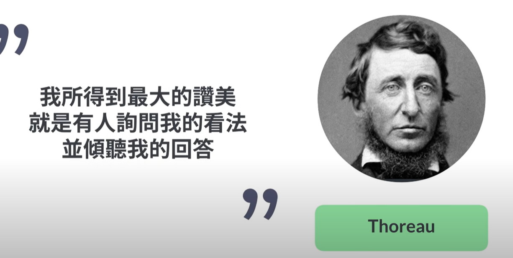
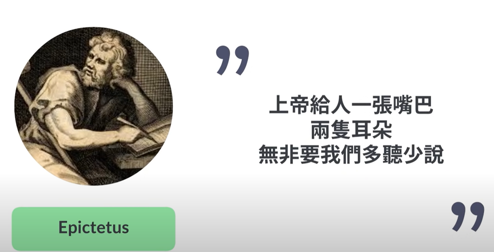

- {{youtube https://www.youtube.com/watch?v=tulgErDvm7g}}
	- [[InterpersonalSkills]] [[聆听(Listening)]]
		- 如何做一个好的聆听者？ [[SolutionNotes]]
			- [[对别人的言外之意不要视而不见]]
				- 比如对方想请你吃饭、想请你帮忙、想给你送东西、想要巴结你、想要和你聊天、想要感谢你、想要与你交往、想讽刺你、想挖苦你等等
			- [[不要试图完全了解一个人]]
				- [[#red]]==每个人都有些事情或者回忆只想说给某些人听，这当中的区别无关乎亲密程度==
				- 有些事只想说给自己听，而放在心底，所以[[#green]]==当我们不再用尖锐的问题来打探对方的所有事情，往往能够获得要比原先预期的要多==
				-
			- [[不要预测对方会说些什么]]
				- 只要当我们对对方失去好奇心，对方说不出什么新东西时，关系很容易走向毁灭
				- [[#green]]==一个对话之所以走向无聊==，是[[#red]]==因为聆听者没有认真在听==
			- [[自己不是重点]]
				- 让对方继续把事情讲下去，而[[#red]]==不是把重点转移到自己==
				- 
		- [[#blue]]==做一个好的聆听者有什么意义？==[[意义(Significance)]]
			- 学会聆听[[外在世界的对话]]，也能更好地升级[[内在对话]]，[[#green]]==会让我们在道德判断时有更多面向、在生活决策方面有更多参考==；而[[内在对话]][[#red]]==影响个人决定，决定造就你将成为什么样的人==
			- 
			-
		- 什么时候该停止聆听呢？
			- 需要自己阅读原书做出解答
-