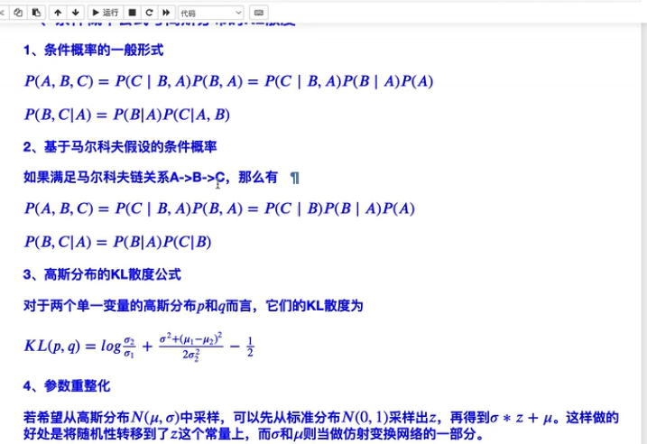
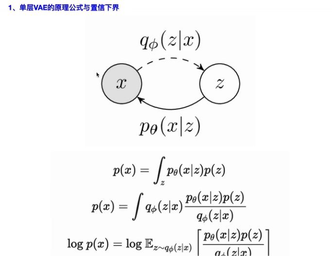
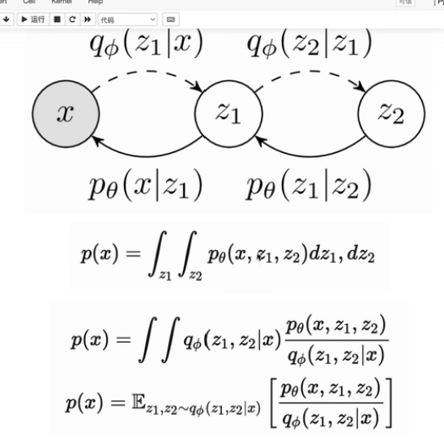
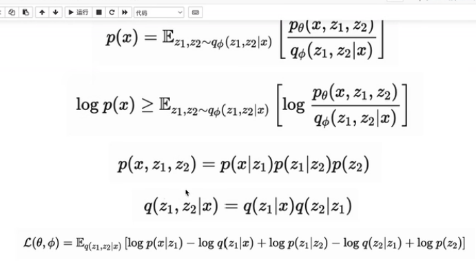
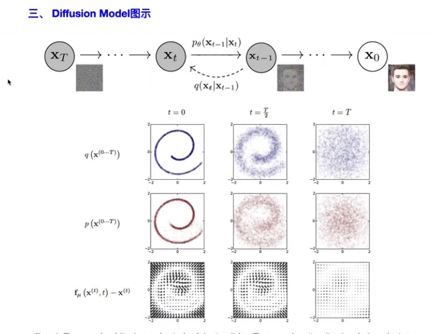
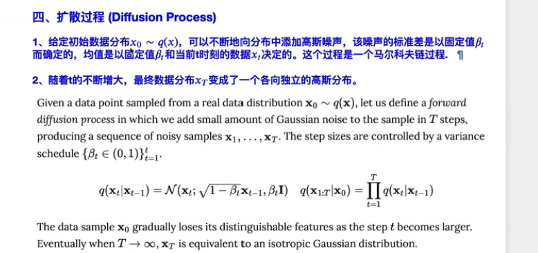
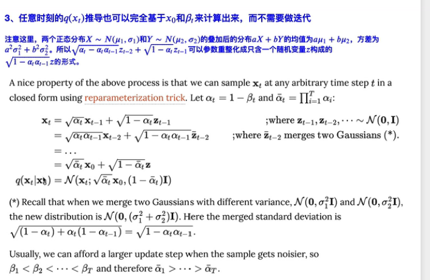
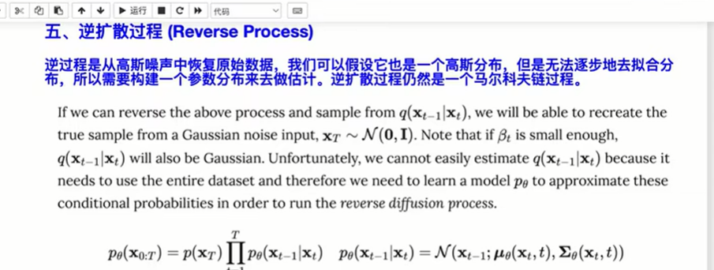
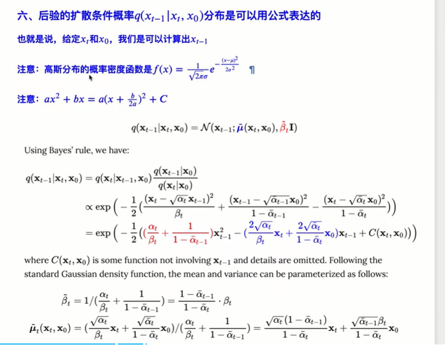
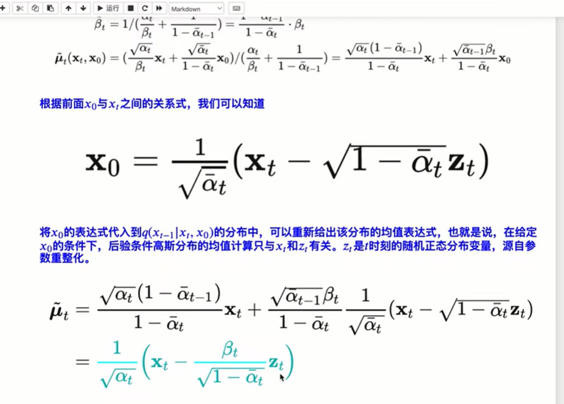

- 概率基础知识回顾
  collapsed:: true
	- 
	  collapsed:: true
		- 直接从N中采样，对于std和均值都是不可导的；而通过这种方式就变成可导的了
		- 参数重整化的技巧在VAE和diffusion中被大量使用到
- VAE与多层VAE回顾
  collapsed:: true
	- 
	- 
	- 
	-
- Diffusion Model
  collapsed:: true
	- 
	- 
	  collapsed:: true
		- βt是逐渐增大的
		- 扩散过程是无参的
		-
	- 
	  collapsed:: true
		- 此扩散过程与VAE的三大区别：
			- VAE中X和Z不一定是等大小的，但是这里是相同尺寸的
			- VAE中X和Z还是存在一定的关系的，但是这里X和Z没有任何关系，因为X已经是各项同性的高斯噪声了
			- VAE中是通过网络来生成的，但是这里是无参的
		-
	- 
	- 
	- 
	-
- https://www.bilibili.com/video/BV1ne411u7J6/?spm_id_from=333.788.recommend_more_video.0&vd_source=d5d1fc8415f24c1c58b672ffc7c48680
- https://www.bilibili.com/video/BV1b541197HX/?spm_id_from=333.337.search-card.all.click&vd_source=d5d1fc8415f24c1c58b672ffc7c48680
- 
-