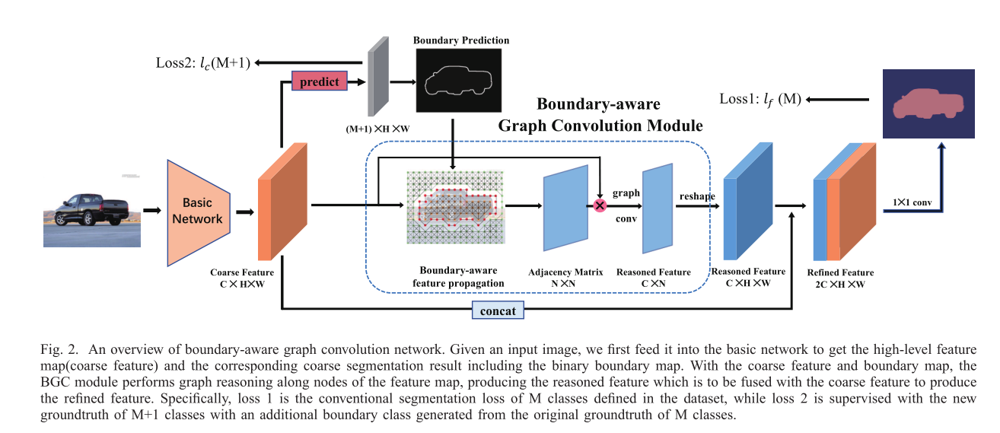

- 模型的整体架构：
	- 
- 模型思路概述：
	- 【1】首先，使用**基础网络**来提取高层次的粗糙特征 X =  C * H * W
		- （1）使用在ImageNet上预训练的resnet-101，**但做以下改进：**
			- **将最后的两个下采样替换掉并在随后的卷积层中使用 空洞卷积
			  collapsed:: true
				- 
				- 
				- 
			- 改进的结果：
				- 扩大了输出特征图的分辨率为两倍，output_stride从原来的16变成了8
				  collapsed:: true
					- 
					- 
					-
				- 增加了感受野
		- （2）resnet-101接上一个ASPP模块
	- 【2】然后，利用此粗糙特征 X 来获得分割的预测结果
		- 这里将边界作为单独的类别，所以分割预测结果的通道数 = 类别数 + 1 = M + 1
		- **将边界类的序号固定为0或者M, 则能从分割结果中直接预测出边缘图**
		- **此模块对（M+1)类的分割结果进行深监督，以便X中能同时学习到边缘信息和分割类别信息**
			- 
将语义分割和边缘检测任务进行了整合，使得两者能够相互促进

			  collapsed:: true
				- 
	- 【3】将 **X  + 预测的边缘图** 送入到 **BGC模块（Boundary-aware graph convolution)来对粗糙特征图进行优化，优化的方向是：提高对象内部像素的特征之间的相似性，增加不同对象的像素的特征之间的鉴别性**
		- 采用空域图卷积：能够获得比普通卷积更宽的感受野
		  collapsed:: true
			- 
		- 构图方法：
			- 邻接矩阵一般是binary的，一般采用top-k binary matrix或者dynamic learnable matrix的方法
			- **此处提出使用 boundary-aware sampling method**
				- 将特征图中的每个像素作为graph的顶点
				- **初始的边**：最先开始特征图中除了边界线上的像素点，每个像素点都与3 * 3矩阵块中的其他8个像素点连接，也就是有8个边，每个边的权值通过 **计算结点特征之间的内积得到相似性矩阵 - 行归一化得到（取值范围为【0，1】）。【注】相似性矩阵计算时需要对i结点特征和j结点特征分别进行不同的线性转换，所以相似性矩阵是可学习的**
					- 
				- **利用边缘进行采样：连接的邻居顶点如果在边缘上，那么这个顶点的权值直接赋值为0，也就是丢弃这个邻居；实际操作就是把初始的邻接矩阵中的对应顶点的列全部赋值为0**
	- 【4】**优化后的特征图和原始的粗糙特征图进行拼接**，然后再利用1 * 1卷积得到优化的分割预测结果
		- 原始粗糙特征图保留了不同物体之间的差异性，而优化后的特征图增强了物体内部的相似性，所以需要进行连接
	- 【5】模型的损失函数：
		- 粗糙的分割预测使用标准交叉熵损失，细化的分割预测使用OHEM损失
		- **此外还在resnet101的第三阶段增加了一个辅助的分割输出，这个辅助的分割输出同样使用标准交叉熵损失**
- 论文里面有关于 [[boundary-detection]][[boundary]]的 [[hls__icpr20Boundary-aware_Graph_Convolution_1670430588132_0]]
- 
-
-