public:: true

	- webserver
	  collapsed:: true
		- 
		- 静态服务器一般是缓存资源用的，动态服务器是动态来产生内容的。Http是应用层的协议，而UDP和TCP都是TCP层的。
		- 缓存服务器是用来提高性能的，而数据服务器是用来存储数据的。
		- 
	- 反射
	  collapsed:: true
		- 
			- **理解方式1**：当我们使用new SomeClass创建一个类的对象时，实际上JVM会在字节码存储区域或者类加载器中丢一个类的模子，或者说丢一个类的信息，然后有了这个模子才能创建我们的对象。反射机制的作用就是，让模子的准备者 从  JVM这个虚拟机 转变为 程序运行期时的使用者。因为，反射机制 对 使用者的角色进行了反转，使得  其从单纯的使用者身份  变成了 类信息的提供方。
			- **理解方式2：** 通过镜子我们才能看请 自身的样貌和体型， 通过反射我们才能够看到类名、类的属性、类的构造器和类的方法，换句话说 单纯有JVM创建类的模子的过程对我们使用者来说是隐藏不可见的。
			- **反射的意义：因为框架是需要变动的，利用反射能够实现这种变动**
			- **反射获取的三种方式：**
			  collapsed:: true
				- 通过类的对象来获取class对象：类比于拿到iphone手机来推测出其设计图纸
				- 直接通过类本身的class属性来获取：相当于是联系到了iphone的设计师，直接从设计师拿来拿来了设计图纸
				- 通过类的完全路径来获得：相当于知道了设计图的藏匿地址，通过寻宝或者说东洋大盗方式直接盗取
					- 这种方式的好处是能降低程序的耦合度，因为前两种方式都要求类必须已经实现存在，不然会报错，而这种方式中的字符串地址可以后期再补加类
			-
	- XML解析
		- 流程
		  collapsed:: true
			- 
			- 
				- 树形结构或者文档树
			- XML在JAVA中有四种解析方式，这里推荐其中的SAX方式，是一种流模式。还有DOM解析方式，就是将整个文档树都加载到内存中去。
		- 数据处理
- [[java基础]]
	- [[DataStructure]]
	- [[JavaScatteredKnowledge]]
	  collapsed:: true
		- python中的模块是一个.py文件，而Java中的模块应该是一个包；python中一个模块子功能的实现是通过函数，而 java中的子功能是通过一个类。这样看上去python模块的大小要比java小，但是因为python的代码量低，所以不一定。
	- [[DesignPattern(设计模式)]]
	- [[八股文]]
- [[ProgrammingTools]]
	- [[maven]]
- [[微服务]]
	- [[spring]]
	- [[springboot]]
- [[分布式中间件]]
	- [[Kafka]]
	  collapsed:: true
		- kafka2.8.0以前必须要安装对应的zookeeper才能使用，2.8.0版本以后（包括3.0.0）可以不安装zookeeper就能独立地进行使用
		- kafka的定义：
		  collapsed:: true
			- 
			  collapsed:: true
				- 前端埋点通过接口将数据发送到日记服务器，日志服务器上使用文件存储来保存数据，Flume用于监测日志文件的数据变化（每增加一条日志文件都会被记录下来），Hadoop是用来进行大数据分析的。在日常情况下，日志服务器Flume的采集速度< Hadoop的上传速度, 所以Hadoop能够应付得过来；但是在双11期间，Flume的采集速度会大于200MB/s，这时只能使用Kafka集群来进行流量缓冲，Hadoop仍然保持自己的处理速度不变。Kafka集群里“浏览”、“点赞”、“收藏”的数据量本身不一样，因而发送给Hadoop的速度也会有差异，这样Hadoop端就不好调控自身的速度，故这里采用“订阅”模式
				-
				-
		- kafka的功能：
		  collapsed:: true
			- 缓存/消峰
			  collapsed:: true
				- 
			- 解耦
			  collapsed:: true
				- 
				-
			- 异步通信
			  collapsed:: true
				- 
		- 消息队列的两种工作模式：
		  collapsed:: true
			- 
			- 为什么一般来说生产者只有一个，而消费者会有多个呢？这个和制造业的情况很相似吧，比亚迪电动车生产者只有一个，但是消费比亚迪的顾客却很多，本质就是生产难度 > 消费难度
			- 为什么发布/订阅模式里的消息从来都不删除呢？如果队列满了，也还是不删除吗？不同主题对应的消息量应该是不同的，比如一般浏览数据量 > 点赞数据量 > 评论数据量，那么为了保证消息队列的可用性，队列的长度岂不是要满足“最长木板原理”？如果是这样，那必然占用空间比点对点模式大得多？
			-
		-
	- [[Dubbo]]
		- dubbo是面向接口代理的、高性能的RPC调用框架，它最重要的功能就是服务的自动注册和发现：能够支持多种注册中心服务，服务实例在注册中心上的上线和下线能实时感知
		- dubbo架构图：
		  collapsed:: true
			- provider建立在container启动的基础上，然后向registry进行register动作；同时，consumer从registry上进行subscribe，当registry上已经有相应的provider后就会notify给这个consumer；consumer调用provider；在整个过程中，会有monitor对consumer和provider的行为进行监控
		- dubbo支持的注册中心：
		  collapsed:: true
			- multicast注册中心
			- zookeeper注册中心
			- redis注册中心
			- Simple注册中心
			-
		- 若干问题：
			- DOING 如果一个消费者同时也是提供者，要怎么处理？
			  :LOGBOOK:
			  CLOCK: [2024-09-14 Sat 00:08:18]
			  :END:
			- DONE 如何理解dubbo中的服务化最佳实践原则的“分包”？
			  collapsed:: true
			  :LOGBOOK:
			  CLOCK: [2024-09-11 Wed 20:37:18]--[2024-09-13 Fri 20:22:59] =>  47:45:41
			  :END:
				- 
				- 因为API就是接口，一个接口会需要使用到相关的模型（bean或者说模型类），也会有对应的接口实现类。如果在模块中把模型、接口和接口的实现类全部耦合在一起，多个模块就对应多个耦合，在模块之间存在复杂调用关系时就不够方便。比如模块A、B、C中的service实现中都需要调用模块D中特定的service，那么在A、B、C三者中就需要重复引入关于D的依赖注入。
			- LATER xml里的命名空间到底要如何理解？那个空间对应的链接是什么含义呢？
			  :LOGBOOK:
			  CLOCK: [2024-09-11 Wed 23:08:25]
			  CLOCK: [2024-09-11 Wed 23:08:26]--[2024-09-14 Sat 00:08:17] =>  48:59:51
			  :END:
			- DONE 如何理解Dubbo的“代理过程”？为什么要把提供 提前缓存和参数验证的 设计称作“Stub”?
			  collapsed:: true
			  :LOGBOOK:
			  CLOCK: [2024-09-13 Fri 20:24:03]
			  CLOCK: [2024-09-13 Fri 20:24:05]--[2024-09-14 Sat 00:08:15] =>  03:44:10
			  :END:
				- 
				-
			- DONE 如果zookeeper宕机，会影响dubbo中已有消费者调用已有服务者吗？zookeeper作为注册中心宕机后，会产生什么影响呢？
			  collapsed:: true
			  :LOGBOOK:
			  CLOCK: [2024-09-14 Sat 00:14:29]--[2024-09-14 Sat 00:14:31] =>  00:00:02
			  :END:
				- 不会，因为如果只是zookeeper对等集群中的一台机器挂掉，则可以随时切换到另外一台；如果集群里的所有机器都宕机，则可以通过本地缓存来进行通讯
				- 不能再注册新服务了，只含有缓存的服务列表供查询
			- DONE 如果服务提供者宕机后，服务消费者还能消费吗？
			  collapsed:: true
			  :LOGBOOK:
			  CLOCK: [2024-09-14 Sat 00:22:19]--[2024-09-14 Sat 00:22:22] =>  00:00:03
			  :END:
				- 当服务提供者中的一台机器宕机后，因为服务提供者是无状态的，所以消费者将自动切换进行使用；当服务提供者的所有机器都宕机后，服务消费者应用将不能使用，并会无限重试直到服务提供者恢复
				-
			- DONE dubbo的负载均衡策略有哪些呢？默认使用哪种策略？
			  collapsed:: true
			  :LOGBOOK:
			  CLOCK: [2024-09-14 Sat 03:19:04]--[2024-09-14 Sat 03:19:05] =>  00:00:01
			  CLOCK: [2024-09-14 Sat 03:19:06]--[2024-09-14 Sat 03:19:07] =>  00:00:01
			  :END:
				- 服务消费者会按照总体大概率来调用不同机器上的服务提供者：下一次的调用机器是不确定的
				  collapsed:: true
					- 
				- 基于权重来轮询不同机器：调用机器的顺序是确定的，但是某个机器的调用次数会在某一轮中用完
				  collapsed:: true
					- 
				- 最小活跃数 是指 上一次调用中 调用提供者接口所花费时间 最小：
				  collapsed:: true
					- 
					-
				- 根据 方法名 + 参数名，通过一致性哈希来计算 路由到的机器：
				  collapsed:: true
					- 
				- 默认使用 Random Loadbalance
				-
				-
				-
			- DONE RPC的实现原理是什么？Dubbo的实现原理呢？
			  :LOGBOOK:
			  CLOCK: [2024-09-14 Sat 07:59:44]
			  CLOCK: [2024-09-14 Sat 07:59:45]--[2024-09-14 Sat 08:38:56] =>  00:39:11
			  :END:
				- RPC的实现分为下面的9步：下图中其实2）-8）拆分成10小步更合理，前5步是：rpc call + bundle args + send + unbundle args + local call, 后5步是：local return + bundle ret vals + receive + unbundle ret vals + rpc return, RPC就是将该10步实现对用户的透明化
				  collapsed:: true
					- 
					- 
					-
				- Dubbo符合一般RPC的实现框架，但其中机器间通信使用的是Netty的非阻塞IO（NIO）:
					- BIO和NIO的区别：
					  collapsed:: true
						- BIO: 每条请求进来都会开启一个Socket, 在这个Socket上会执行“读取输入流”的线程，该线程会慢慢执行，在这阻塞
						  collapsed:: true
							- 
						- NIO: Channel里面有buffer，Selector是选择器又叫多路复用器，Selector会同时监听多个通道的各种事情，等感兴趣的“Connect就绪”、“Accept就绪”、“Read就绪”或“Write就绪”事件发生时就开启一个对应的线程去执行
						  collapsed:: true
							- 
					- Netty使用NIO的简单描述：boss线程组是主线程，用来处理所有连接的accept事件，而woker线程组是在accept事件处理完成后执行读写等工作的
						- 
					-
			-
			-
			-
			-
		-
	- [[Zookeeper]]
	  collapsed:: true
		- 这节课主要讲什么？
			- 
				- 高性能指的是throughput比较高，也就是每秒能够执行的operations的数目
				- 高性能计算的两点原因，第二点强调其并不是strong consistency，而是一个instinct的一致性定义，会给你一些在任何replica上执行read操作的自由，因此reconform can scale
			- 
			-
		- Zookeeper是一个replicated state machine吗？
		  collapsed:: true
			- 是的，如下图所示，客户端的请求被传送进zk service，然后zk将操作stick into the ZAB, ZAB可以看作是raft库的equivalent，被插入操作的这台机器与其他的peer node通过ZAB进行交流，每台机器也有log来处理operations，最后ZAB通过apply channel发送回operations，ZK service将operation response返回给客户端
				- 
			- 上图中ZAB部分可以类似于lab2，从某个high level的角度来说ZAB实现了与raft类似的功能和保障(guarantees)，尽管实现方式相当不同，它提供了一个an order of all the operations，尽管会存在failures、network partition等raft也会遇到的问题
			- lab3关注在raft等分布式库之上的一个service实现，这篇paper关注的是zookeeper能够提供的coordination service，在lab3中我们要实现的则是一个key value store:
				- key value store 对应的数据结构是map，对应get和put操作：
					- 
				- zookeeper的数据结构是z node组成的tree：
					- 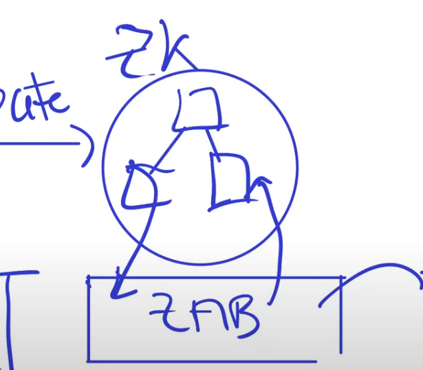
					-
			-
		- Zookeeper能够保证的high performance到底是什么样的？
		  collapsed:: true
			- 先假设最基础的场景如下图所示：没有失败。那么执行一次put操作至少需要1轮Leader和1个follower的通信来回、follower和Leader各自需要将log写入stable storage：前者通常需要1ms，这个时间估计并不重要；后者取决于具体的存储介质是什么，如果是SSD，一般写入一次需要2ms，这里的两次写入是synchronous（同步的），所以两次写入是4ms；总时间就是5ms。那么1s 就大概能够执行200次put操作了 （1000ms / 5ms = 200）
			  collapsed:: true
				- 
				- 
				-
			- 论文中使用throughput metric来进行衡量：
			  collapsed:: true
				- 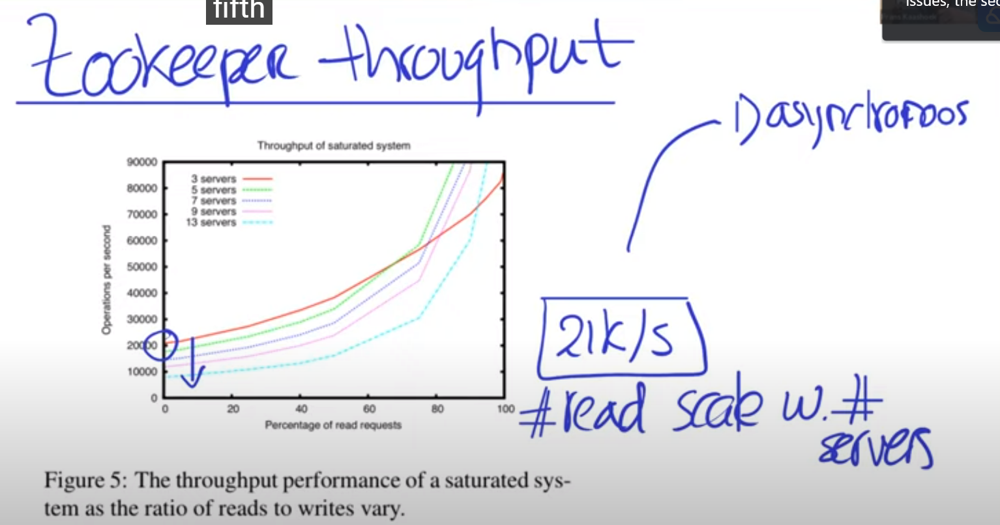
				- 从上图中可以得出的几点是：
					- n台机器的性能不是单台机器的n倍
					- 在写操作比较多时，三台机器比5、7、9等更多台机器组成的集群的性能反而要更好，这是因为当节点数目更多时，需要进行通信的机器更多
			- Zookeeper中对于操作进行了怎样的优化设计，以使得有更好的性能：
			  collapsed:: true
				- Asychronous Write
				  collapsed:: true
					- 允许多个客户端发送的请求被异步进行处理，也就是一个操作不必等上一个操作处理完成后才能开始处理；甚至可以把一系列的operations以一个batch的方式打包发送给leader，leader一次性地将所有的operations都写入disk中，而不是一个operation一个operation地写入
				- Read
					- 允许read操作被任何一个server所执行，而不是让leader来执行所有的操作，这里在individual follower上执行read时是不需要和leader进行通信的，目的是为了获得perfect scalability
					- 下面案例两次接连的get操作将会返回什么值呢？（两次get操作不一定是同一个individual follower，也就是说是随机的peer node）当集群中有3台机器或者5台机器时，结果有什么不同吗？
					  collapsed:: true
						- 
						- 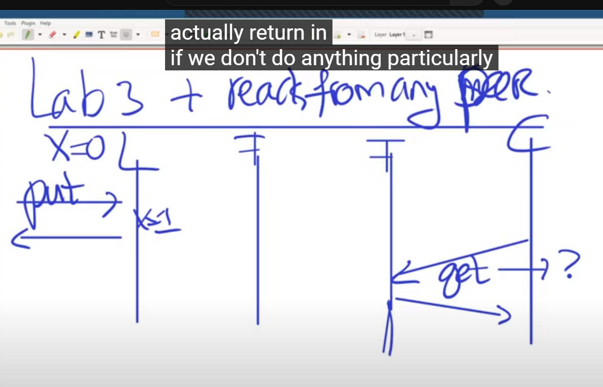
						- 
						- 无论是三台机器还是五台，当put操作将X从0修改为1时，第一次get操作可能会读到0，这是一个stale data；第二次get操作时即便在第一次get操作读取到1的情形下，也可能会读取到0，这时候就会感觉数据是back in time了。
						-
					- 从linearizability的角度来说，上面案例满足吗？
					  collapsed:: true
						- 
						- 
						- 两个都不被linearizability所allow
						-
					- 那么，我们怎么确保gets操作是operational和linearizable的呢？
					  collapsed:: true
						- 最简单的方式就是让leader来完成所有的read操作，这个过程中leader可能会发生变化，但是raft协议会保证即便在发生了network failures或者network splits的情况下所有的操作都能够以total order执行，这是因为log中的entry在raft中被保证按照一定的total order来执行的，replicated state machine本身就是通过维持每个replica中接受和应用operation时的total order的一致性来保证最终状态相同的。lab3中的所有requests都是synchronous的
							- 
						- 这个简单方式中是怎么保证linearizability的rule 2： match real time的呢？
							- 这是自动实现的，在一个操作完全地被完成后，会响应客户端，如果之后客户端想要start the operation，那么它一定会在leader的log中
						- 这种简单方式的downside是什么呢？
							- 在raft论文中针对read-only operations有一个optimization，但是这个optimization也会要求一些communication
							- 使用这种简单直接的方式，那么此时read operations的执行性能不会与服务器的数量有关了，因为此时所有的读操作都要经过leader
					- 那么，zookeeper是怎么在违背linearizability的情况下实现high performance呢？
						- zookeeper其本身就没有实现linearizability， 修改了correctness definition，也就是：它也不会表现得像a single machine，也就会出现单机永远不会出现的结果。
						- 它提供的功能是：
							- linearizable write
								- 注意这并不是说write操作也像linearizable read那样是以total order方式来执行的，但是linearizable write和read是相关的
								- 在论文中linearizable write并没有给出清晰的描述，只能按照自己的理解有一个rough guess：
									- client想要使用Zookeeper Service就要与zookeeper之间建立一个session （课程老师说的是差不多也就是前面提到的clerk需要实现的功能），client在与leader交互的过程中会用到一些session info；老师说zk service提供的写入和raft的策略基本上是一样的，当leader将来自client的写请求接受后，就会commit一个entry到log中，然后返回一个Zxid给client，也就是说the id of last write;
										- 
										  id:: 64d0a7ed-f750-4c57-862a-68d469887a7b
									- 当client后面想要发起一个read请求时，为了保持高性能不会通过leader来处理，而是通过one of the followers,  将这个处理read请求的follower记作A，A的log中可能已经有前面write请求的entry了，但是也可能没有，也就是A不在前面write请求对应的大多数follower中时会这样，在这里我们假设是没有这个entry；当A接受到这个read请求时，很明显它里面的log是lag behind的，A 不会例句response to client，而是一直等待自己的log中有这个Zxid了
										- 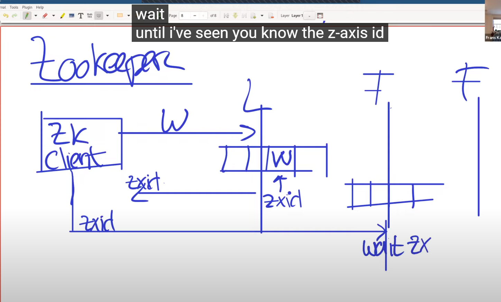{:height 312, :width 503}
										- 
									- 如果此时另外一个client发送了又一次的write请求，对一个没有记录到第二次该write请求但是记录了第一次write请求的follower来说，此时若client发送携带有zxid的read请求，那么它会立即response，只是它没有获得其他客户端写入其他follower的最新writes的entry，所以会返回stale data
										- 
										-
									- 其他需要注意的问题：
									  id:: 64d0a7ed-4aa7-46d8-87ea-6e5dd1f53f70
										- 在论文里面写到write操作不完全是go to leader的，也会go to one follower的，这不是说明write不完全是由leader来处理的吗？
											- 不是，发送给follower的write，还会被redirect给leader来进程处理
										- 为什么read请求不会固定于某一个follower呢？
											- 一方面有些follower会出现network partition或者network failure，为了保持快速响应，所以需要及时切换到其他follower来处理；另一方面zookeeper为了保证read请求的负载均衡 load balancing, 会自动进行这样的切换
										- 前面图示中的要等待zxid被当前的follower看见，这具体是什么意思呢？是说这个zxid对应的entry必须在当前follower上被commit吗？
											- 是的，必须被commit，这是因为此时客户端要能够发送这个zxid的话，客户端必须从leader中获得包含这个zxid的response，而leader只有对客户端发送的write请求commit之后才会返回zxid
							- all the asynchronous operations from clients are in the FIFO order (客户端是随机发送，不会等待操作的完成就会发送下一个操作，FIFO由zookeeper本身来控制)
								- 与此对应的是此时的write操作也是FIFO order
								- read操作是read the last write from the same client，但是对于来自其他client的write操作zookeeper并不能保证当前客户端能够读到那个客户端最新写入的结果，能够保证的是能够读到prefix of the log （也就是当前client会落后一部分其他客户端的写操作，所以也就是会读到stale data）
								- No reads from the past: 意思是假设第一次read时的prefix是P1，那么后面第二次read时很有可能还是P1，或者是P1 plus more，而不可能是P1前面的某个位置，也就是不能够read backwards:  下图中就是先读取了1，那么第二个不可能读取到0
									- 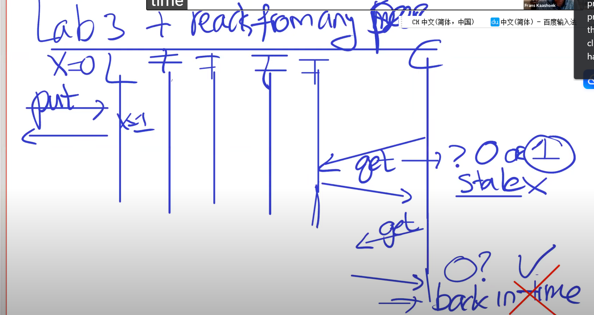
								-
								-
		- 在使用linearizability时，编程会很容易，那么zookeeper在违背linearizability时要使用什么样的programming model呢？
		  collapsed:: true
			- just ignore the sync operation in the program，尽管可以像之前针对read那样，通过issue a sync来使得每个操作变得linearizable，但是这会使得程序变慢，我们将无法获得我们的performance advantage,
			- 我们会使用 a couple of operations，以ready file的case来说明：
			  collapsed:: true
				- CASE 1：
				  collapsed:: true
					- 图示：
						- 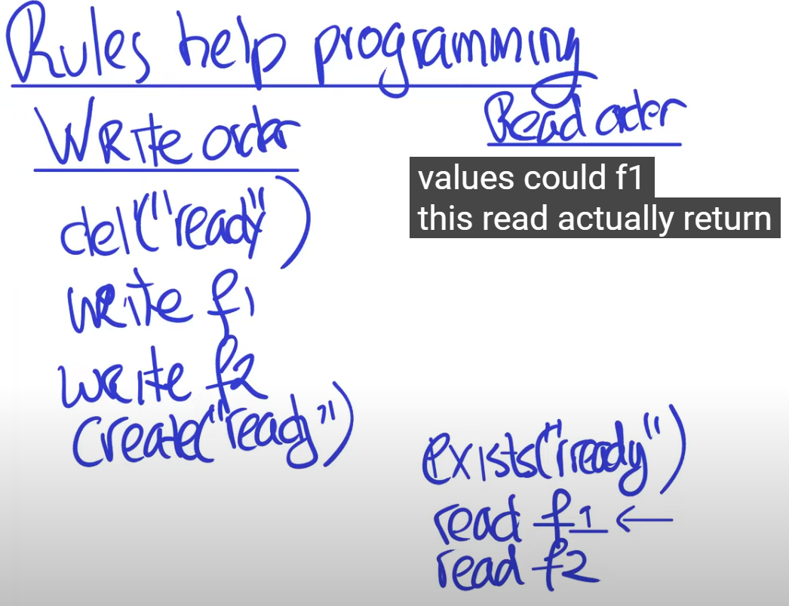
						- 
						- 
					- Write Order：
						- cluster中的某个机器变成new leader，此时它需要写入一些新的configuration information （比如谁是集群的leader，谁是follower），先使用del命令来删除原来的ready file，再write f1，f2（f1, f2是一些配置文件），最后使用create命令来创建这个ready file；
						  id:: 64d0a7ed-ff0c-49f3-945e-c7aa19e6c901
					- Read Order:
						- exists命令的含义是如果ready file存在，那么就立即返回true
						- 假设之前有一个client执行了在f1上的write操作op1，也就是第二张图中箭头所指的当前leader的Write Order之前的某个位置（也就是说f1这个配置文件除了切换到new leader时会被修改，也会被客户段的请求所修改），那么如果这时候有第二个client请求在f1上的read操作的话，那么会读取到op1的结果吗？
							- 不会，不管op1具体写入了什么，第二个client都不会读取到，client只会读取到the last of the write, 也就是当前leader的write order中write f1后的结果
							- 实际上exists本身是一个read命令，是读取zxid是否存在，所以exists("ready")返回成功，也就说明了create ("ready")这个命令对应的write操作执行成功；如果exists返回成功，也就说明了它看见了create命令之前的write f1, f2操作也执行成功，因为所有的write是linearizable的，所以read f1返回的必然是write f1之后的结果，这带来的好处是：当出现了一个new leader更新了配置信息后，follower能够马上读取到最新的配置信息
					- 这整个过程都是被仔细设计的，所以就configuration service 来说，完全是work out的
				- CASE 2:
				  collapsed:: true
					- 图示：
						- 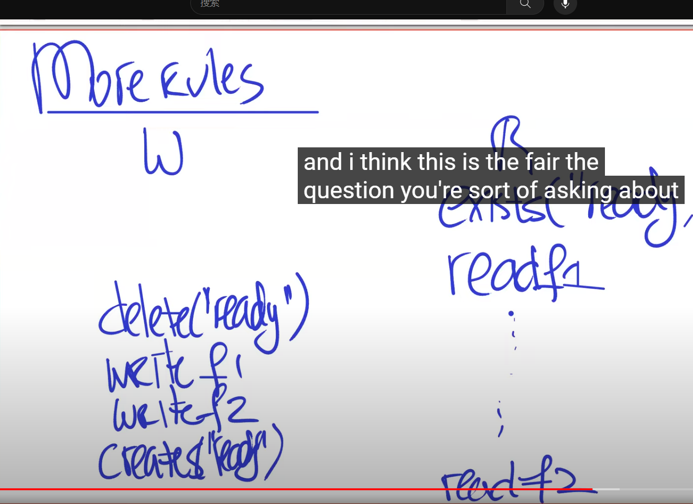
						- 
					- 分析说明：
						- reader在read f1和read f2之间由于机器本身原因出现了某种延迟，read f1操作开始与new leader的del("ready“) 操作之前，所以读取的f1的值来自old configuration，而read f2在new leader完成create("ready”）之后，所以读取的f2的值来自new configuration。很明显，这是messed up的，是一个糟糕的结果
						- zookeeper是怎么解决整个问题的呢？
							- 使用watch来解决，watch表示关注一个文件，并且在文件发生改变时会被通知。下图中，delete("ready")执行时会发送notification，而且这个notification会在这个命令之后的write操作之前给deliver（rule of notification) 。在这个case中，也就是说notification会在write f1操作执行前被发送，那么这个notification是在reader的read f2之前还是之后呢？如果是在read f2之后执行，那么read f1和read f2的结果都来自old configuration；如果在read f1之后执行，那么你需要做的就是在notification发出后，对reader上的read操作进行restart，start it over.
								- 
								- 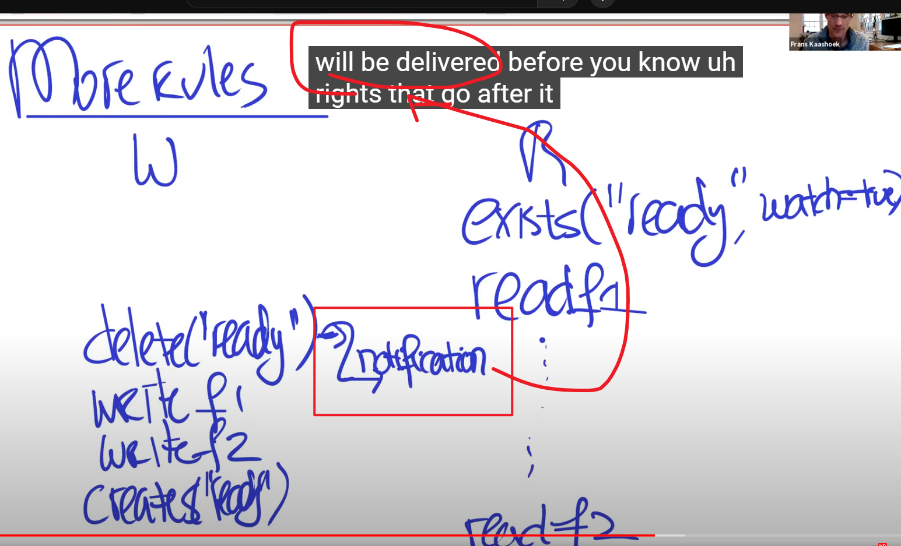
								- 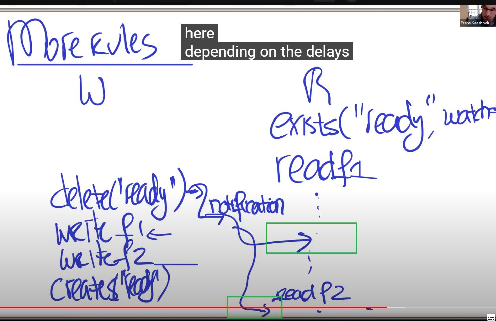
								- 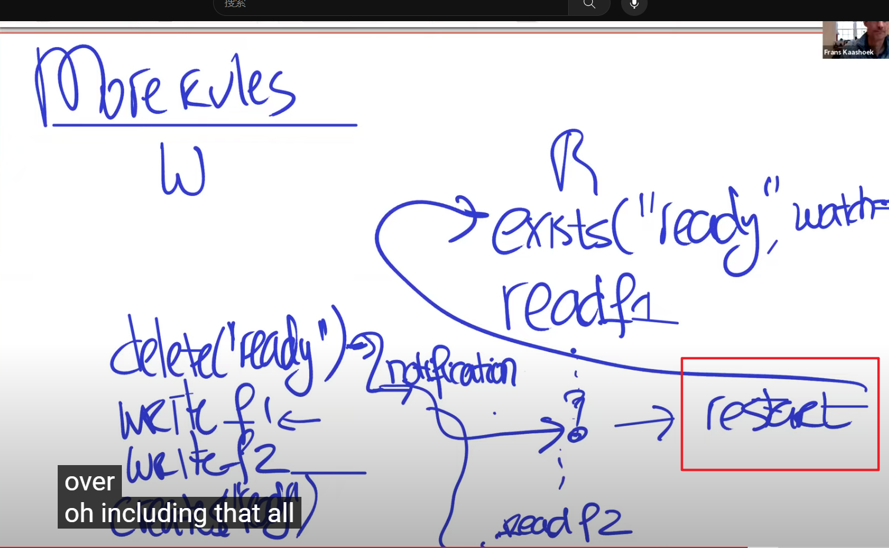
								-
							- notification rule的wording是什么呢？
								- notification几乎就像是一个write operation，是由follower来实现的；当改变由del触发时，notification会被发送给client，并携带zxid。教授在这里说notification像write operation的意思并不是说它可以像write operation那样被直接applied到某个变量上去，而是说watch是local的，当local watch发生时必然是某个变量相关的write操作执行了，这个变量相关的任何write操作都会被observe到，或者说watch和zxid一起被propogate给客户端，并且确保它们被执行了。
								- 其实论文中关于notification的具体实现比较模糊，但是你可以想象不同的场景，但是notification rule是可以被保证的
								  id:: 64d0a7ed-c104-489d-a22f-b4d2e20893df
								-
								-
				-
			- 从这两个CASE中，我们能够收获的是：
			  collapsed:: true
				- 尽管人们喜欢linearizability的一个原因是，整个性能表现会更intuitive，会使得集群表现得像一个单机，且编程更容易，但是如果要保证fault tolerance和scalability，它能难保持good performance。一个获得good performance的方式，就是compromise the consistency guarantee,  在这里就是compromise linearizability, and provide some other   consistency guarantee，很明显这会complicate user experience or programmer experience，but it is doable
				-
				-
				-
				-
			- 关于这个programming model中与coordination service相关的部分，有哪些细节呢？
				- coordination service可以用VM-FT中test-and-set operation为例来进行说明，它的作用是：两个客户端会run test但是只有一个会赢，赢的那个会conclude到自己将是primary：
				  collapsed:: true
					- 
					-
				- lab3中test-and-set操作的一个简单实现：但是当put和get之间没有提供atomicity时，两个put操作都会执行成功，后面get时就会得到两个leader了，这说明这个简单实现是不足够的
				  collapsed:: true
					- 
					- 
					-
				- Zookeeper需要解决的两个问题是：
				  collapsed:: true
					- 怎么保证put和get操作的atomicity呢？
					- 如何进行CPU design来使得应用能够知道一些node宕机了，也就是go down了？
					-
				- Zookeeper进行的设计：
					- 三类node：第一类是有fault tolerance和replicated state machine那种regular machine；第二类是empheral，是说node会自动消失 （with that machine three goes away),  也就说出现了network partition，没有heartbeats来自machine three了，但是zookeeper在某个时刻决定那个session已经是gone了，所以zookeeper就会自动删除那个node了；第三类是sequential node, 这些node在名字中关联了它们的版本号，一个一个地创建，在z node下每个children的name中都有一个sequence number，现在nodes是按照sequence number来进行排序的，下图中创建一个new node时sequence number会增加
					  collapsed:: true
						- 
							- app one对应一个Z Node
						-
					- Z node API：
					  collapsed:: true
						- 
							- P是Path
						- 
						  id:: 64d0a7ed-b8b3-4f41-bbbe-e814efea6923
							- V # 代表的是版本号
							-
					- 为什么version number是handy的？
					  id:: 64d0a7ed-0491-4f79-8f63-481e7218a4bb
						- 以下面的counter实现的小例子来进行说明：如果setData中的version number和getData中的version number还是一致的话，那么自增实际上发生了，否则没有发生，这样是为了protect against什么呢？这防止你interleave get and set
						  collapsed:: true
							- 
							-
						- 怎么理解阻止 set操作 和 get操作 interleave？
							- 
							- 
							- 以图1为例，两个客户端都请求将VersionNumber = 0的X=0修改为1，因为write操作是linearizable的，也就是两个setData操作会以一定的total order而先后执行，那么那个先执行的那个setData，会发现版本号0和X=0的版本号match，于是执行成功返回true，但是后执行的那个setData，此时node的版本号已经从0自增为1了，于是会与X=0的版本号不match，于是第二个node上的setData就没有执行成功，会重试。最终x的结果会是2，而不是1.
							  id:: 64d0a7ed-f55d-424f-85d2-79cb9caf1b98
							- 这是一种lock-free programming，不过是使用versioning的方式来实现的。那么这种方式的效率和lock方向相比如何呢？因为看上去这种方式需要不停地retry直到成功，这个实际上和test-and-set操作有类似的性质，test-and-set操作失败了就需要不断地重试，在lock-free programming中经常是有这种loop的，所以会有很多的contention，如果没有contention，就不会retry了。实际上，这些lock-free算法在怎么做back off方面非常小心，所以它们并不是真地需要马上就进行retry，因为存在backup plan。所以，这种versioning的方式相比于lock方式有什么优势吗？此处是一个比较简单的例子，是implicit lock，如果你使用zookeeper的API来实现lock的话，且如果你do the stupid lock( 也就是lock使用不当），你同样会有contention issue，当然那儿存在一种smarter way without the hurting。在这里强调的是，使用这些primitive可以进行lock-free programming。
		- 对这节课的简单总结是什么？
		  collapsed:: true
			- 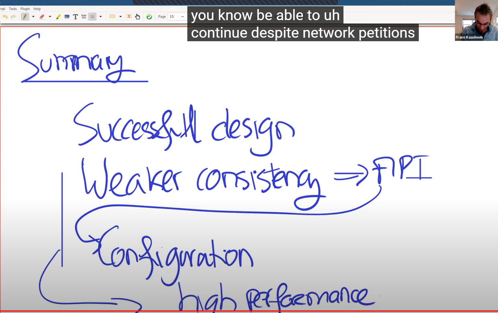
			  id:: 64d0a7ed-4399-4d4c-a32b-0d590909dd6a
				- 使用weaker consistency这种trick，将能够导致high performace，以及在出现network partition时能够继续运行
				-
- [[JavaProjects]]
	- [[抽奖系统]]
-
-
-
-
-