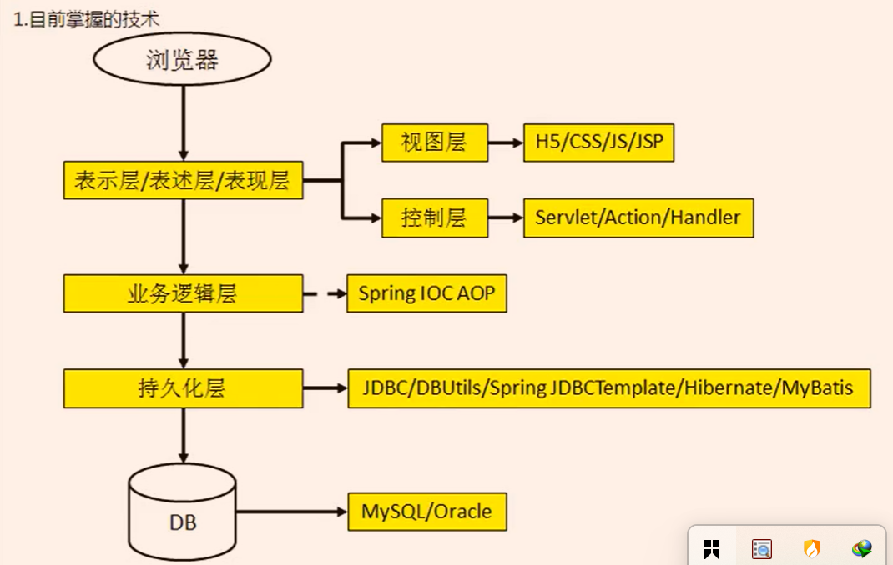
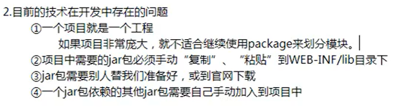
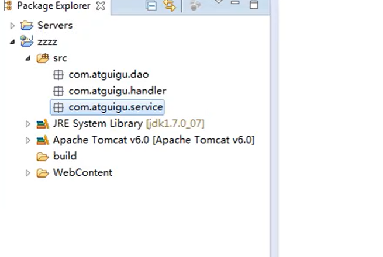
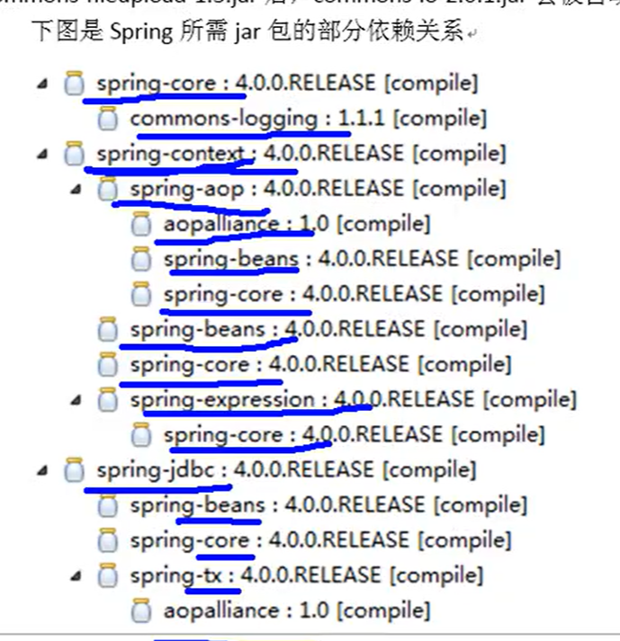
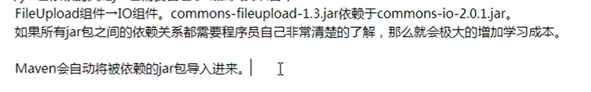
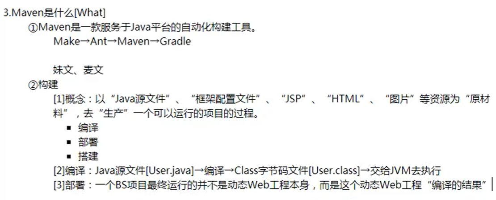
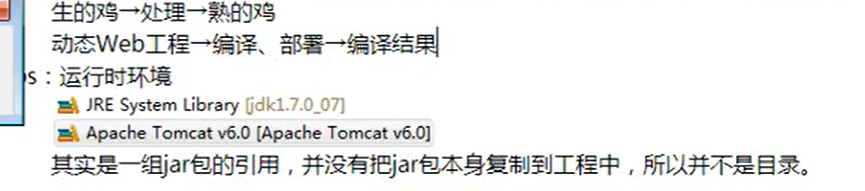

public:: true

- 
	- JSP不是前端技术
	- 持久化层指的就是数据库层
	- MySql已经被oracle收购了
	- Spring IOC AOP起到一个承上启下的作用，其实与业务逻辑并没有那么直接相关
- 
  collapsed:: true
	- 针对第一个问题：
		- 比如如果存在多个模块，那么dao、handler、service也存在多个了，项目就非常臃肿
		  collapsed:: true
			- 
		- 所以我们希望每个模块自身就是一个工程，那么一个完整的项目就是多个工程，不同小组在不同的工程进行开发，这有利于分工协作，但是难点是多个工程之间必须能够相互通信。借助maven可以将一个项目拆分成多个工程。
	- 针对第二个问题：
		- 会导致同样的jar包文件重复出现在不同的项目工程里，一方面会浪费存储空间的资源，另一方面也会导致项目比较臃肿
		- 借助于maven可以将jar包仅仅保存在仓库中，有需要使用的工程只需要“引用”就行，并不需要真的把jar真的复制过来
	- 针对第三个问题：
		- 不同技术网站上下载jar包的方式不统一，五花八门的
		- 部分技术官网通过maven或者SVN专门的工具来提供下载的，比如mybatis官网里面就只提供了maven的依赖信息
		- 如果下载jar包的方式不规范，其jar包的内容也极有可能是不规范的
		- 借助maven可以以规范方式来下载jar包，因为所有知名框架或者第三方工具都已经将其含有的jar包按照统一的规范存放在了maven的中央仓库里面
			- 
	- 针对第四个问题：
		- 
		- 
		-
	-
	-
- 
	- 
- 当需要的依赖不在本地仓库时，maven都会从远程仓库下载下来到本地，还是说只需要引用到远程仓库中的地址就行了呢？
-