public:: true
title:: mit/6.824

- 课程信息：
  id:: 64c73e88-ca09-468e-9e52-6360950342d3
  collapsed:: true
	- 课程链接：https://pdos.csail.mit.edu/6.824/schedule.html
	- 课程笔记：
		- https://www.qtmuniao.com/2020/03/14/6-824-vidoe-notes-3-gfs/
		- https://mit-public-courses-cn-translatio.gitbook.io/mit6-824
		- https://space.bilibili.com/61981458
		- https://ashiamd.github.io/docsify-notes/#/study/%E5%88%86%E5%B8%83%E5%BC%8F%E7%AD%96%E7%95%A5/MIT6.824%E7%BD%91%E8%AF%BE%E5%AD%A6%E4%B9%A0%E7%AC%94%E8%AE%B0-01
		- https://github.com/1345414527/MIT6.824-2022
- Introduction:
  collapsed:: true
	- 分布式系统是什么呢？
	  collapsed:: true
		- multiple networked cooperating computers
	- 主要使用场景，可以举例吗？
	  collapsed:: true
		- 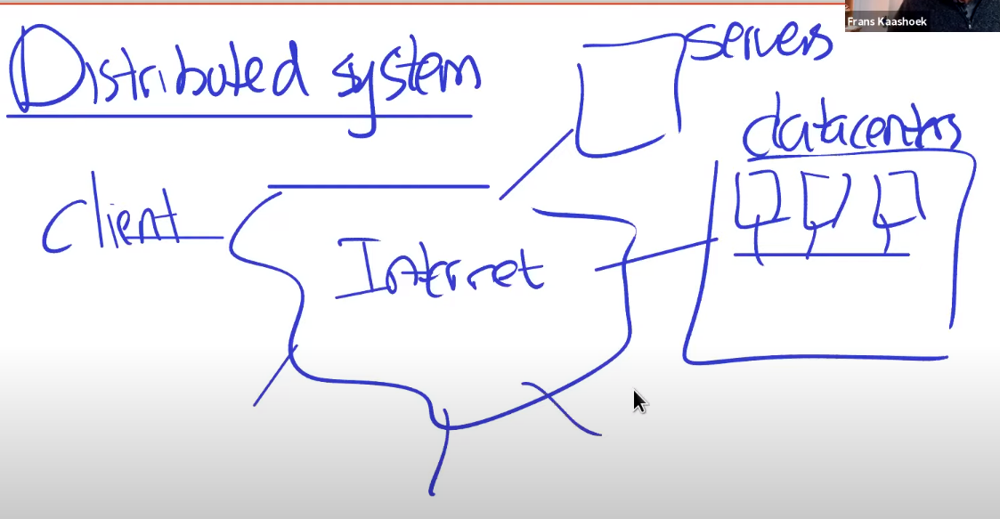
		- 协调完成服务器、客户端和数据中心这三者的工作
		- 比如说ZOOM应用
	- 为什么要使用分布式系统？或者说，为什么分布式系统会变得流行起来？
	  collapsed:: true
		- Connect [[$red]]==physical==ly separated machines => allow data sharing
			- 当我和你的两台机器连接到同一台电脑时，我们可以分享数据、共享文件、共享屏幕、共享计算基础设施，即能够允许一系列的协作可能性
		- Increase capacity through [[$red]]==parallelism==
			- MapReduce是一个重要的例子
			- 在同一个时间段内有很多的Zoom Session在进行
		- [[$red]]==Tolerate faults==
			- 当一个机器或者部分损坏时，不会影响到另外一个机器或者部分，比如存储可以始终分发
			- 容错能力保证了整个系统的可用性
		- Achieve [[$red]]==security== by physical separation / isolation
			- 比如如果你有一个管理顾客密码的服务，所以通常会把它对外的接口设计得非常狭窄
		- 四个重要原因中第二个和第三个是最重要的
	- 分布式系统的Historical Context大概是什么样的？
	  collapsed:: true
		- 1980s年代的local area network
			- 比如MIT的校园网络、连接像Athena集群一样的工作站 (Athena Clusters (亚瑟纳集群) 是谷歌开发的一种分布式计算框架，主要用于数据分析和大规模数据处理)
			- AFS（Andrew File System）是一种分布式文件系统也是在那时发明出来
			- 那时候的主要应用只有DNS和Email系统
		- The rise of Data Centers along with big websites (1990s or early 1990s)
			- web search: 大量的数据进行indexing不能放在一个电脑上
			- shopping: 有大量的用户
			- MapReduce的论文也是在这个时期出来的
		- Cloud Computing (mid late 2000s)
			- 这个过程随着云计算的出现而加速了
			- 将数据和计算移动到数据中心
		- Current state: active
	- 分布式系统的Challenge有哪些？
	  collapsed:: true
		- 两个主要的挑战为：
			- many concurrent parts
				- 并行的计算机数目太多，导致难以推断和理解整个运行的过程
			- must deal with partial failure
		- 这两个挑战导致的问题是：
			- 高并发度和部分出错导致系统的复杂度越来越高，比如系统的一个部分可能认为系统的另外一个部分故障了，但是实际可能不是的，实际可能的是有一个网络划分(network partition)，被划分的系统两边分别保持计算，分别与一部分client进行交互，甚至两边交互的这部分client是完全一样的，因为client可以与系统两边都发生交互，而系统的这两边并不发生交互，这个问题被称作Split Brain Syndrome（大脑分裂综合征）,  这使得design distributed system和protocol statistical system变得复杂；
		- 最后一个挑战是：
			- tricky to realize the performance benefits that in principle are possible with distributed system
				- 也就是在给定数量的机器下来实现high throughput和throughput scaling并没有那么简单直接
	- 为什么要学习这门课？
	  collapsed:: true
		- 
		- hands-on指的是特别的编程体验
	- 怎么学习这门课？
	  collapsed:: true
		- 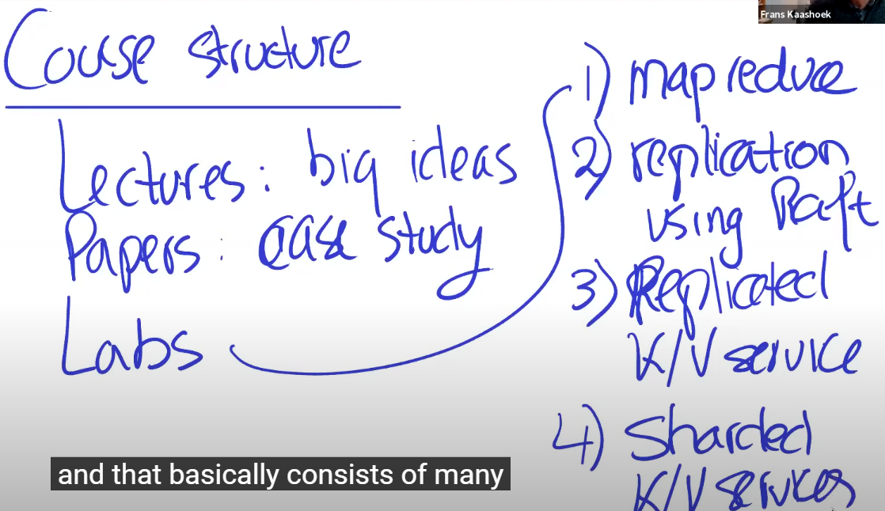
		- 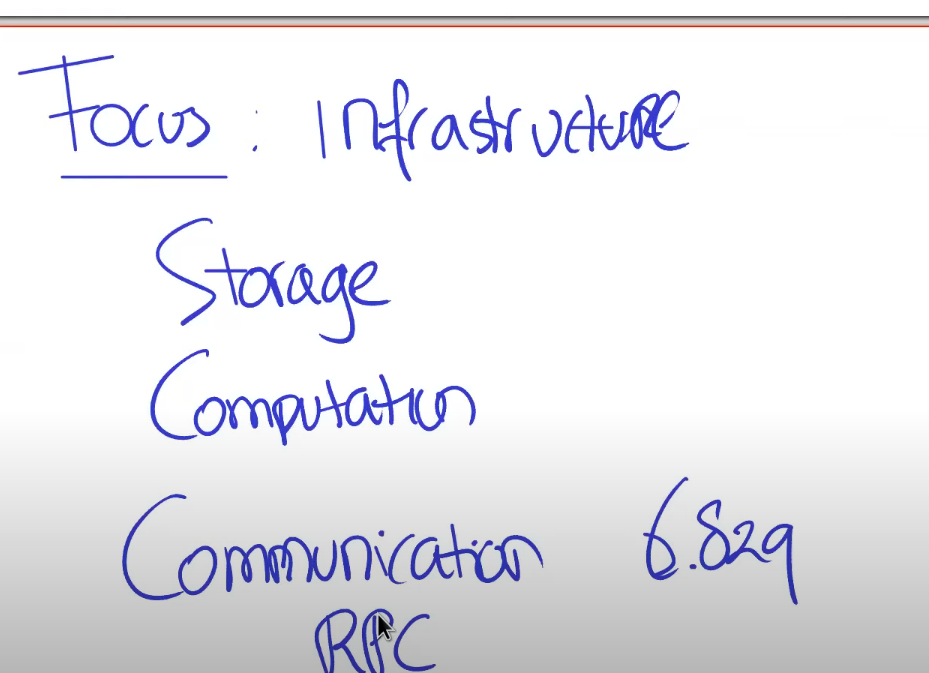
			- 网络系统和分布式系统存在交叉，关于通信的知识主要在MIT6.829中学习到
			- 存储指的是key value存储系统 或者  文件系统
		- 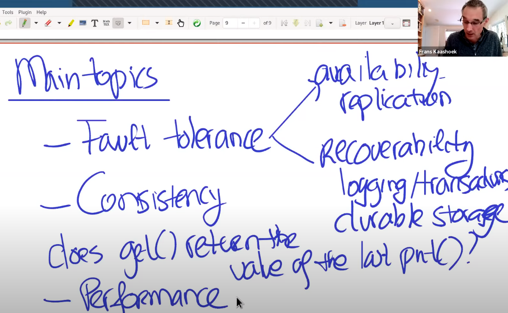
			- 可恢复性指的是直接重启故障的机器后继续保持可用性，而不是修复系统，因为修复系统必须要将一台一台的机器全部关闭最终导致系统服务不可用
			- 可用性的关键技术是：replication
			- 可恢复性的关键技术是：logging or transactions (durable storage)
			- 一致性希望分布式系统的性能 和 sequential machine尽可能保持一致
			- 不一致性有很多不同的contract，比如最终一致性，关键在于对于Performance的要求不同
			- Performance和Fault tolerance和Consistency是相互矛盾的，为了实现一致性，则需要不同机器之间进行通信，这可能会降低性能；而为了实现容错，则不得不把数据从一台机器复制到其他台机器，而如果把数据写入可持久存储的话，其开销也是非常昂贵的，这会消耗性能。所以，通常会牺牲部分一致性或者部分容错性来提升性能
			- Performance实际包含两个方面：
				- 一个是Throughput, 这个可以通过增加更多的机器来实现
				- 另外一个是low latency,  比如disk不能百分百处理等导致处理用户请求需要很久，
			- 第四个topic是Implementation, 主要是concurrency和RPC
			-
			-
	- MapReduce的历史context是什么？
	  collapsed:: true
		- 
		- Mapeduce方法包含两个部分：
			- 一是map方法和reduce方法，都是functional or stateless function，方法内都是sequential code
			  collapsed:: true
				- Functional function 和 Stateless function 都是程序中的两种函数类型，具体含义如下：
				- Functional function 是指在程序中定义时只参考了输入和输出之间的关系，它不会改变程序的状态或任何外部变量，也没有任何副作用。这种函数通常被称为纯函数，因为它们只关注给定的输入及其返回的输出。由于纯函数不会对程序的状态造成任何影响，因此它们通常易于调试和测试，并可以提高程序的可读性和可维护性。
				- Stateless function 是指在程序中定义时不保留任何状态信息，只根据其输入来计算输出。它们不依赖于任何外部环境或变量，并且不会对程序的状态造成任何影响。这种函数通常用于函数式编程，它们的目标是简单、干净且易于测试的代码。
				- 总之，无论是 Functional function 还是 Stateless function，它们都面向纯粹的函数计算，不依赖外部状态，而是根据输入计算输出。唯一的区别在于前者特别强调不会产生副作用，后者不会保留任何状态信息。
			- 二是处理distributedness，需要解决load balancing、运行缓慢的机器、crash的机器等，使得写map和reduce方法的程序员不用关心这些
		- mapreduce并不是general purposed的？
			- 对，因为需要自己根据case来写对应的map和reduce方法
			- 比如你要写一个key value的服务，将不能使用MapReduce这个库，因为这个库假定了一个特定的计算模型，我们要应用程序必须要fit in这个计算模型，其适用于做一些网页的大数据分析，需要大量计算来处理这些大量的数据，并且基于这些数据来计算值
			-
	- 关于MapReduce的一些问题？
		- 同样的一个Map Task有可能执行两次吗？同样的一个Reduce Task也可能执行两次吗？
		- Map Reduce当中的master可以fail吗？为什么？
		- 一个Map Worker对应的机器上是只执行一个map function还是说可以执行多个map function？
		- 当一个Map Worker对应的机器crash了，要怎么做呢？
- RPCs and threads:
  collapsed:: true
	- 为什么使用Go而不是用C++？
		- C++处理垃圾回收非常麻烦，而多线程应用中需要判断某个对象什么时候不再被任何一个线程使用了
		- C++的语法过于复杂
	- 为什么需要使用线程？
		- I/O  Concurrency
		- Parallelism
			- 充分利用一台机器上的所有核/CPU
		- Convenience
			- 一些程序会需要在后台运行，周期性地运行然后休眠
			- the overhead is worthy ?
				- yes
	- asynchronous program和vent driving program的区别？
	  collapsed:: true
		- Asynchronous programming and event-driven programming are both ways of handling concurrency in software development, but they are not the same thing.
		- Asynchronous programming is a programming paradigm where tasks are executed concurrently without blocking the main thread. This means that a program can execute multiple tasks at the same time, without waiting for one task to complete before starting the next one. Asynchronous programming is typically used in situations where a program needs to perform I/O operations, such as reading from a file or making a network request, without blocking the main thread.
		- Event-driven programming, on the other hand, is a programming paradigm where the flow of the program is determined by events that occur, rather than by a sequential order of execution. In an event-driven program, the program waits for events to occur, such as mouse clicks or keyboard presses, and then responds to those events. Event-driven programming is often used in graphical user interfaces, where the program needs to respond to user input in real-time.
		- While there is some overlap between asynchronous programming and event-driven programming, they are not the same thing. Asynchronous programming is a way of handling concurrency, while event-driven programming is a way of structuring the flow of a program based on events.
		- 线程比事件驱动更容易，因为它只需要写直接的流程控制代码：计算、发送信息、等待响应，
			- 而后者它需要把无论什么活动都分割成很多小的片段，这些小的代码片段会不时地被相应的事件驱动循环在某个时刻激活，因此编程来说会更加困难；此外如果在事件驱动编程下如果你想要获得并发，将无法获得CPU的并行，比如你要写一个保持32核都忙碌的繁忙的服务器，一个单一的循环不是一个自然的方式去利用超过一个核；
			- 通常这种方式的开销会比线程稍微小一点，为什么呢？
				- 因为当多线程的数量超过1000时，管理线程的开销就开始变大，包括维持每个线程的状态、决定下次该执行哪一个线程
		- 进程是由操作系统来控制的，与具体使用什么语言无关
	- 当一个context发生切换时，所有的线程都发生了对应的切换吗？
	  collapsed:: true
		- 假如你有一台单核的机器，你在上面运行了多个进程，OS会给不同的进程time slicing来进行来回切换，所以当硬件计时结束时，CPU从一个进程拿走，被放置到另外一个进程之上；context切换时只有操作系统知道的线程会进行切换
		- go cleverly multiplex as many go routines on top of single operating system threads to reduce overhead
			- 这句话的意思是，在单个操作系统线程上巧妙地多路复用多个Go协程，以减少开销。
			- 在Go语言中，协程（goroutine）是一种轻量级的线程，可以在单个线程上同时运行多个协程，而不需要为每个协程分配一个单独的线程。这种设计可以提高程序的并发性能，但也会带来一些开销，例如上下文切换、协程调度等。
			- 因此，这句话的意思是，为了减少这些开销，可以在单个操作系统线程上巧妙地多路复用（multiplex）多个Go协程，即在单个线程上同时运行多个协程，从而减少上下文切换和调度的开销。这种方式可以提高程序的并发性能，同时也可以减少系统资源的使用
		- 这是一个两阶段的调度，先决定哪个大线程去运行，然后go决定哪一个协程在那个进程中运行
		-
	- 线程有哪些缺点？
	  collapsed:: true
		- Race conditions:
		  collapsed:: true
			- 虽然线程之间可以共享内存或者缓存，但是可能会存在很多的bug，比如下面这个共享变量的例子
			  collapsed:: true
				- 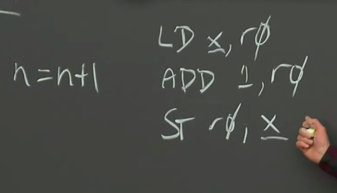
					- 一般来说存储原语是原子的，而INCREMENT原语非常有可能不是原子的
					- 不同线程运行同一段代码的过程，可以被称作RACE，因为第二个线程可能在第一个写入更新后的X之前或者之后就Load X的值了
			- 怎么解决Race Conditions呢？
			  collapsed:: true
				- 有两种解决方法：
					- 一是Avoid Sharing,
						- 这是Go所鼓励的编程风格：鼓励使用channels来communicate变量的值，而不是通过共享内存
					- 二是使用locking使得一组操作序列变成atomic的
						- Go怎么知道哪个变量在上锁，比如是X + Y这种操作？
						  collapsed:: true
							- Go并不知道任何变量和锁的关系，这是由程序员来控制的
						- 锁应该是private的吗？
						  collapsed:: true
							- 数据结构的私有就好像市政规划地图（Zoning Map）内部有一个lock在保护它。这会是一个合理的策略，define a data structure that needs to be locked to have the lock be sort of interior that have each of the data structure methods be responsible for acquiring that lock and the user the data structure may never know：
							  collapsed:: true
								- This sentence means to create a data structure that requires locking, where the lock is an internal mechanism and each method within the data structure is responsible for acquiring the lock before proceeding with its task. The user who interacts with the data structure may not be aware of the existence of the lock as it is handled automatically by the data structure's methods. This approach helps to ensure thread safety and prevent data corruption from multiple threads accessing the same data simultaneously.
							- 唯一的崩溃点是：
								- 如果一个编程人员知道这个数据将从来不会被分享，他们可能会失望他们为了不需要被locked的东西而付出了额外的锁的开销
								- if there's any inter data structure of dependencies，so we have two data structures  each with locks and they may use each other and then there's risks of cycles and deadlocks
									- 通常解决deadlock的方法是requires lifting the locks out of the implementations up in the calling code（需要将锁从实现层面提升到调用代码层面）
							- 隐藏锁是一个good idea，但不总是
						- Go语言中有一个RaceDetector，大多数的lab会鼓励你使用dash race flag来运行go，这不会捕获每个可能的Race，但是它已经能很好地识别races了，所以默认情况下你应该开启race detector enabled来运行go。
		- Coordination：一个线程必须等待另外一个线程完成某些事
		  collapsed:: true
			- Go中的channel不仅用来交流值，也可以同时用来coordinate
			- 通过条件变量
		- DeadLocks
		  collapsed:: true
			- 在Go中最trivial的出现死锁的情况是：
				- 有一个单线程，此时它block了，等待其他的线程从它的channel里面读取数据，但是很明显并没有其他的channel存在
				- Go将会捕捉到这种情况，并且会报出一个razor runtime error
			-
	- Go语言解决并发问题的两个Plan是什么？
	  collapsed:: true
		- 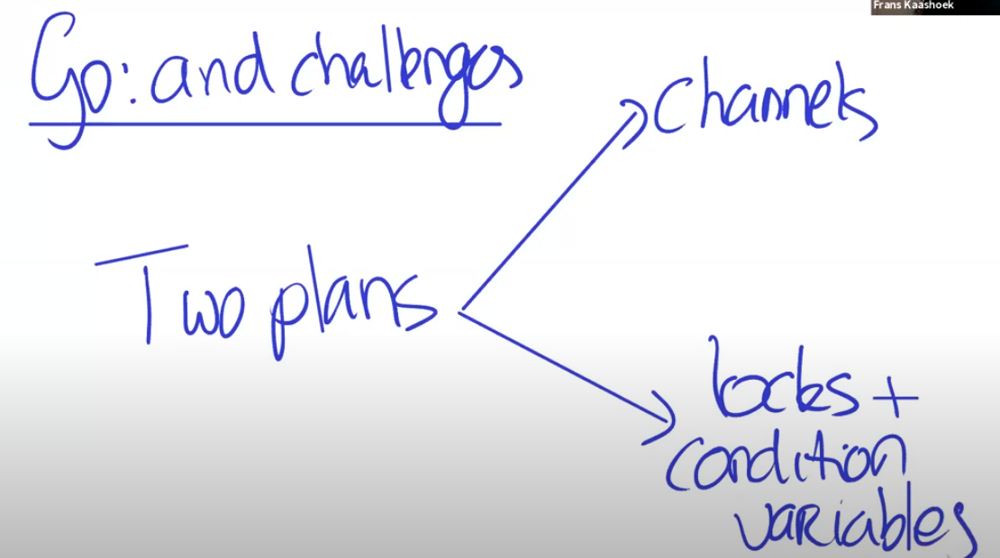
		-
	- Go中的条件变量可以被看作是什么？
	  collapsed:: true
		- 可以看作是协调进程之间的coordination原语(primitive)，尤其是当使用lock来保护共享状态(shared state) 的时候
		-
		-
	- Web Crawler项目的目标是什么呢？
	  collapsed:: true
		- 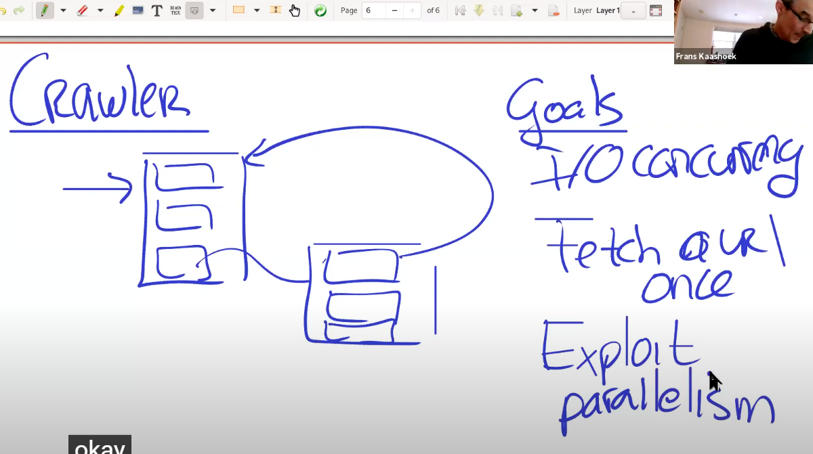
			- 第二个目标一次性获取到URL，是在说correctness的要求
		-
	- Go当中的RPC是如何工作的？
	  collapsed:: true
		- 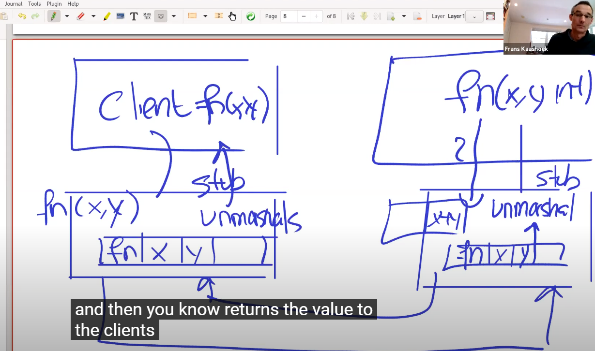
			- marshal 和 unmarshal 是序列化和反序列化的过程。序列化是将数据结构或对象转换为字节流的过程，以便将其从一个应用程序发送到另一个应用程序或存储在磁盘上。反序列化是将字节流转换回原始数据结构或对象的过程
			- 序列化和反序列化的方法可能有所不同，但通常采用比较常见的方式，比如 JSON、XML、Protobuf、MessagePack 等
			- 这些stub使得远程过程调用和regular/local procedure call的效果差异不大，并且这些stub通常都是自动生成的
	- RPC的failures有哪些可能的语义呢？
	  collapsed:: true
		- 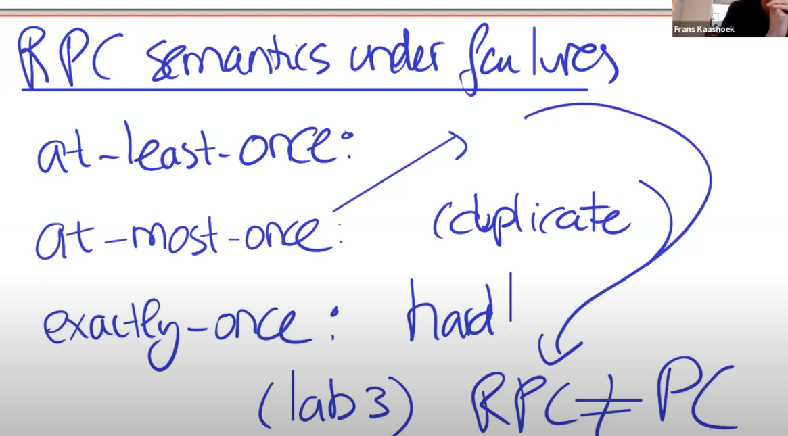
			- 至少一次：
				- 如果server fail了，那么client应该做什么呢？此时当client第一次向crashed的server发送请求时，必然得不到响应，所以会time out，然后client就会自动进行重试，直到server的函数调用至少执行了一次
				- 这种至少一次的rpc系统的downside是同一个操作可能会被执行很多次，这并不适用于许多应用
			- 最多一次：
				- 对应的服务端的请求要么执行1次，要么就不执行，不会超过1次
				- 这典型是由filtering duplicates来实现的
				- 服务器端可能同时接受到两个request，或许这时的网络就像一个临时请愿 (temporary petition) 且服务器接受到两个requests，此时的服务器必须进行管理：先检测a recent request, 但是并不会execute两次
			- 刚刚好一次（理想情况下）：
				- 因为这是normal情况下的procedure call会展现的
				- 但这通常非常难去进行管理或者说安排arrange,  要求你不得不维持磁盘上的状态, 这个维持操作是昂贵的。在实践中，只有很少的RPC系统是exactly once的
	- Go语言中的rpc的failures的语义是哪一种呢？
	  collapsed:: true
		- 是at most once
		- 通过tcp channel来发起调用，tcp channel将会保证没有duplicates。应用程序可能会进行重试，但将是应用程序的责任来处理duplication和failed message的问题
		- rpc和pc的区别是通过failure时的goal来体现的
		-
	-
	-
- GFS：
  collapsed:: true
	- 课程计划是什么？
	  collapsed:: true
		- 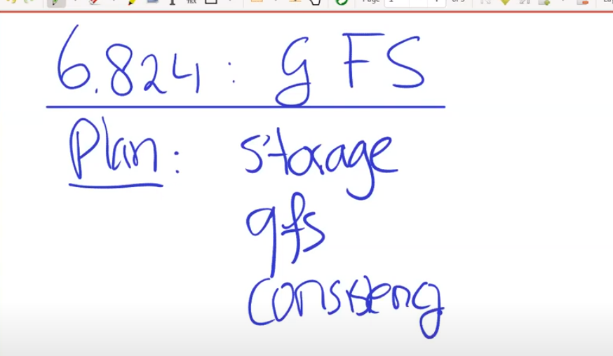
		- 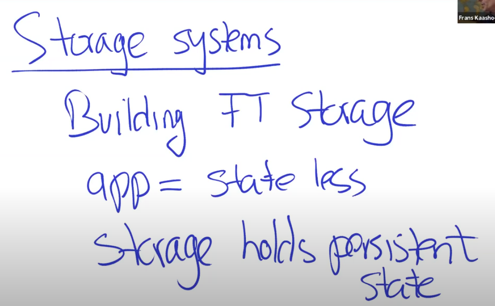
		-
	- 为什么涉及存储系统会很难？
	  collapsed:: true
		- 存储系统有high performance的要求 =》需要有many servers
			- shared data across multiple servers
		- many servers意味着会有 ==> constant faults
		- constant faults => fault tolerance design =》replication
			- 在存储系统通常的方式是replication，也就是将数据在多个disk上进行复制
		- replication =》potential inconsistency
		- strong consistency protocol =》low performance caused by sending messages
			- 不是发送的消息有多大，而是协议的一部分是对可持久存储进行读或者写，而这个操作是开销昂贵的
			-
			-
	- 分布式存储系统中一致性的两大hazard是什么？
	  collapsed:: true
		- 一是一致性问题
		  collapsed:: true
			- 什么是ideal consistency？
			  collapsed:: true
				- 通过一个具体的执行案例，明确合理的值是什么、不合理的值是什么来定义什么是consistency
					- 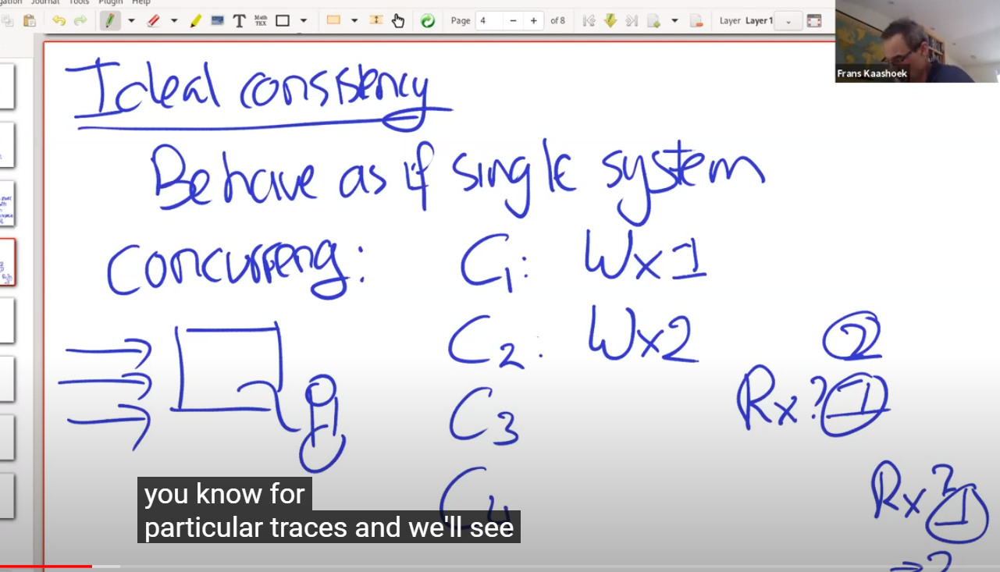
						- C3读取的结果可能是1或者2，这取决于C1和C2并发执行的相对顺序
						- C4读取的结果和C3完全保持一致
						-
				-
		- 二是failure问题
		  collapsed:: true
			- 对于复制没有任何约束时，是最坏的复制策略，也可以视作no protocol
				- 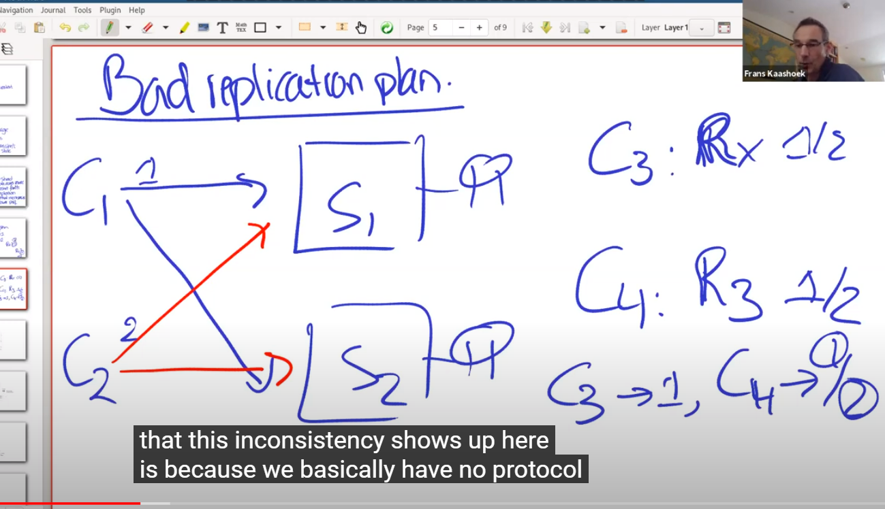
	- GFS的case study主要学习些什么？
	  collapsed:: true
		- 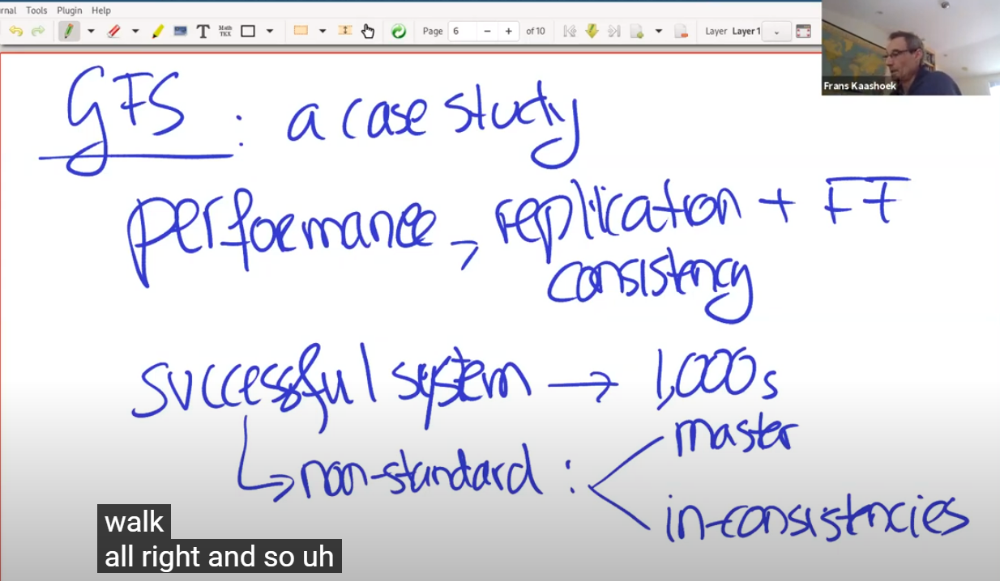
	- GFS 有哪些特点？
	  collapsed:: true
		- 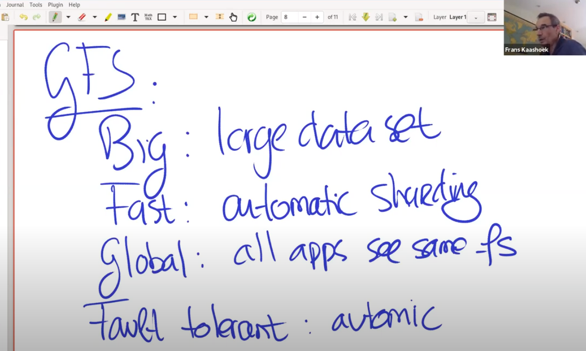
- Primary / backup replication:
  collapsed:: true
	- 课程简介是什么？
	  collapsed:: true
		- Minica Summary：
			- Detailed Summary for [Lecture 4: Primary-Backup Replication
			  不公开](https://www.youtube.com/watch?v=gXiDmq1zDq4) by [Monica](https://monica.im)  
			    
			  [00:03](https://www.youtube.com/watch?v=gXiDmq1zDq4&t=3.199) This section is an introduction to primary-backup replication and discusses failures that can be tolerated and challenges in backup schemes.
			- There are failures that can be tolerated using primary-backup replication and some that cannot.
			- The main challenges in any backup scheme are discussed.
			- Two dominant approaches to replication are presented: state transfer replication and replicated state machines.
			- The VMware fault-tolerant system is used as a case study to make everything more concrete.
			      
			  [11:36](https://www.youtube.com/watch?v=gXiDmq1zDq4&t=696.959) The lecture discusses two main approaches for primary-backup replication: state transfer and replicated state machine.
			- Failover means the backup takes over in case of failure.
			- State transfer involves the primary transferring state changes to the backup.
			- Replicated state machine involves sending operations to the backup to update its state.
			      
			  [23:13](https://www.youtube.com/watch?v=gXiDmq1zDq4&t=1393.679) The VMFT paper proposes exploiting virtualization to make business applications more fault-tolerant.
			- The paper suggests using fertilization and virtualization to make replication transparent to the application.
			- The replication scheme used by VMFT provides strong consistency and appears to use a single machine.
			- The paper is about a real product that is still in use, although the current version is different from the one described in the paper.
			      
			  [34:51](https://www.youtube.com/watch?v=gXiDmq1zDq4&t=2091.839) In primary-backup replication, the backup becomes the primary after a failure and both sides can communicate in the case of network partitions.
			- Virtual machine monitor sends packets periodically over the logging channel and if it doesn't get any responses from the other side, it assumes there's a problem.
			- If the network partitions, both primary and backup will notice the problem and at some point, decide to promote themselves to primary.
			- Both sides can still communicate in the case of network partitions and they can go back into single mode with one primary.
			      
			  [46:28](https://www.youtube.com/watch?v=gXiDmq1zDq4&t=2788.4) The section explains the design of primary-backup replication and the role of the arbitration server.
			- The primary and backup servers are connected to a storage server.
			- The storage server has two roles: storage for primary and backup, and arbitration server.
			- The arbitration server has a flag that is initially zero and is used for promoting one of the servers to be the single server that serves client requests.
			      
			  [58:07](https://www.youtube.com/watch?v=gXiDmq1zDq4&t=3487.359) Interrupts, including input packets and timer interrupts, must be delivered at the same point in the instruction stream to avoid divergence in the system state.
			- If interrupts are delivered at different points, the state of the system might be different and produce different results.
			- Concurrency can also produce non-determinism, but controlling interrupts can help control this potential source of divergence.
			- The solution in the paper is to only allow uni-processors to avoid the problem of multi-core divergence.
			      
			  [01:09:43](https://www.youtube.com/watch?v=gXiDmq1zDq4&t=4183.6) The virtual machine monitor executes instructions and sticks the value from the message into the red register to ensure the same effect on both primary and backup in primary-backup replication.
			- The virtual machine monitor doesn't execute the instruction at all.
			- The hypervisor will do some work before putting up the virtual machine.
			- The backup and primary should run at the same speed.
			- Communication over the channel will always happen because of periodic interrupts.
			      
			  [01:21:22](https://www.youtube.com/watch?v=gXiDmq1zDq4&t=4882.48) The lecture discusses the performance of primary-backup replication system.
			- The system runs at the level of machine instructions which results in a performance hit.
			- The left table in the paper shows that performance is good when running the backup on the primary.
			- In the receiving case, there is a 30% reduction in performance when running in backup mode.
		- 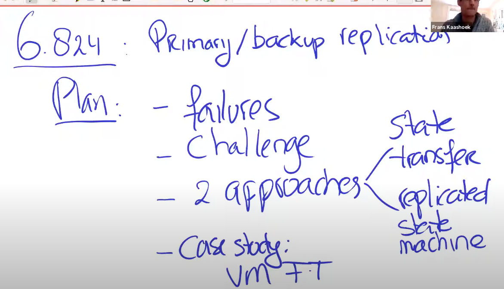{:height 421, :width 718}
	- replication scheme可以handle和不可以handle的failures分别有哪些呢？
	  collapsed:: true
		- 可以处理的：
		  collapsed:: true
			- 
			- 由计算机的component造成的计算机运行停止；从working到not working的时间非常短；不会产生奇怪的错误结果
			- 案例包括：
				- 电脑的风扇坏了但是电脑overheat会导致电脑自动shut down
				- 踩到了power cord（充电的线缆）造成了爆炸，整个电脑消失
				- 切断网络连接
			- 计算机有时候会把软件上的failures给转化成fail-stop failure
				- 比如某个软件计算数据的checksum，如果发现不正确，可能会stop the computer
				-
			-
		- 不可以处理的：
		  collapsed:: true
			- logic bugs
				- 在primary和replication中软件的逻辑错误将会重复出现
			- configuration errors
			- malicious errors
				- 比如黑客故意发送不正确的数据来spoof（伪装、欺骗）整个system
				-
		- may or may not be handled:
			- 比如earthquake，我们会希望backup能够维持原有的数据
			-
	- 构建primary backup system可能会出现的issues or challenges？
		- Has the primary failed?
			- 在一个分布式系统中，很难区分是network partition还是machine failed，前者是说primary is still up但是部分计算机无法和primary进行通信，那么此时backup就会认为primary is dead，但是实际上一些client仍然可以与primary进行通信，这样也就会造成“two primary”的情形了。当network被heal了之后，那么原先的primary就能够正常继续工作了，此时一部分client与原先的primary进行通信，另外一部分client与新选出来的primary进行通信，于是整个系统就处于incorrect state当中
			- 所以，我们必须avoid this split brain syndrome at all costs
		- How to keep the primary and backup in sync ?
			- 当primary crash了，切换到backup时需要backup能够与原先primary的state保持一致，这样的切换就像是在一台电脑上无缝般切换一样流畅
			- 要求：
				- apply changes in the right order
				- avoid the non-determinism
					- 非确定性（Non-determinism）指的是在一个系统或算法中存在多种可能的结果或行为，无法准确预测或确定具体的结果。换句话说，非确定性描述了一个系统在某些情况下可以有多个可能的状态或演化路径
					- 这里是说我们要确保primary和backup中的changes和effects是完全identical的
			- fail over：the primary fails and the backup takes over
				- primary fail时可能正处在某个操作当中，比如正在发送一个数据packet给client作为response，但是也可能没有，我们需要搞清楚这个packet是否已经被发送了还是说只是处于发送阶段（如果被发送了要知道这个packet是否被client接收到了，如果接收到了，则不需要重发，否则发送了但未被接收或者只是处于发送准备，那么都需要进行packet的重发）
				- 如果所有的backup都fail了，那么当它们重新back up时，我们需要判断哪一个是具有最新的state
	- 两种deal with primary backup replication的方法分别是什么？
		- 第一种：
			- 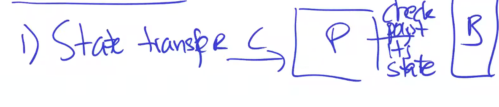
			- primary在给客户端响应之前，要先执行相关的操作，同时需要把这个操作产生的状态变化同步给backup machine，这样才能保证两者的一致性
		- 第二种：
			- 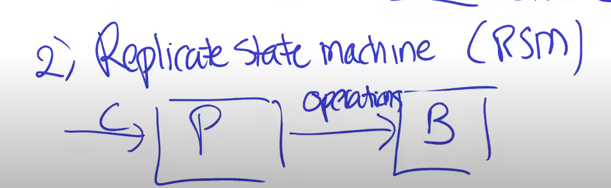
			- primary在执行操作前，会把操作发送给backup，等待backup执行完这些操作后，发送acknowledgement给primary，然后primary再执行这些操作，最后才给客户端响应
			-
		- 第一种方法的缺点是什么呢？
			- 如果一个operation会产生很多state的话，那么state tranfer方式将变得代价很高，所以一般使用第二种方法，GFS中追加数据时没有send data而是发送operation就是这种方法
			-
		- 为什么在第二种方法中客户端不用发送数据呢？
			- 因为这些发送的operation是deterministic的，只要两台machine的当前state是一样的，那么应用这些操作，就一定会end up in the same state，因而也就保证了不同的machine具有最终相同的数据
		- 那么，对于所有程序的所有操作，要怎么判断它是deterministic的还是non-deterministic的？
			- 在replicated state machine中，是将所有的operation都变成deterministic
			-
		- 可以使用两者的混合方法吗？
			- 可以，你可以默认设置使用replicated state machine的方式来运行系统，但是如果primary或者backup fail了，那么就只剩下一台机器，然后需要创建一个新的replica，通常对于这个新的replica，实际上需要将  当前存在的replica的状态 或者  当前存在的replica的状态的副本 transfer到 它上面去
			- 整体上，这个混合方法中使用state transfer的operaton并不frequent，因为fail的情况并不总是出现，而replicated state machine方法的复制operations的行为比较频繁
			-
		- What level of operations to replicate ?
			- application-level (gfs file append, and write)
				- 这意味着应用必须参与其中，也就是应用能够知道这些操作的semantics是什么，能够知道一个操作或者事件实际上要去做什么，比如写实际上要去做什么
				- 如果在应用层面来使用replicated state machine这个方法，应用自身需要被进行修改，从而成为执行replicated state machine的一部分
			- machine level （processor level,  computer level）
				- 此时的state指的是x86 register和memory的状态，而operation指的是普通的电脑指令（instructions）
				- 在这个level进行replicate，可以使得replication完全透明：
					- 因为一台机器的应用是运行在OS之上的，应用底层只是运行了x86的指令，在replicated state machine方法中，backup只会重复这些x86指令的执行即可（add, divide, conditional branching and interrupting），所以应用无需进行修改
					- 那么这个replication是否很expensive呢?
						- 是的，因为machine level的replication意味着可能需要买很多台机器，也就是处理器会replicate若干次，这些处理器会ran exactly in lockstep （并行且高度一致），有很多的hardware machinery（硬件机械设备，可以指计算机硬件部件，也可以指其他行业中的物理设备或工具）可以做到这一点，但是在VMFT这篇论文中很cool的一点是可以使用virtual machine来替代hardware replication
						- pure hardware replication也有，比如在aeronautics中，通常是duplex  replicated或者triple replicated，且会有一个hardware voting scheme来使得processors保持同步以及检测failures
						- VMFT中并没有太focus fault tolerance的内容，通常是使用fertilization技术 [[存疑]]
						-
	- 关于VMFT这篇论文，你有哪些认识或者理解？
		- 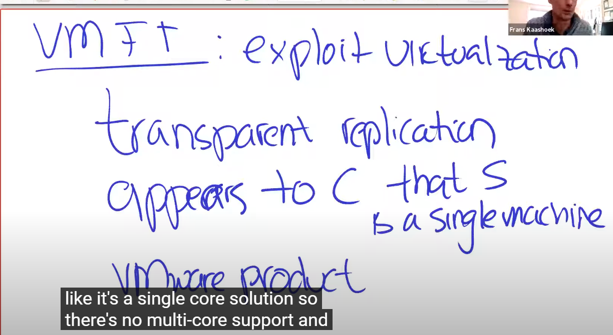
			- 论文中的solution支持多核吗？为什么？
			  collapsed:: true
				- 论文中是single-core的，所以对多线程、多应用是无法在单核机器上并行运行的；但是之后版本的ft课程老师认为是可以multi-core support的，但是没有一篇详细的论文对此进行了描述，课程老师认为实际上可以使用state transfer approach来实现这一点
			- virtualization的好处是什么？
			  collapsed:: true
				- 使得replication是transparent的
				- 对于客户端来说，会认为服务器端只有一台机器
				-
			- VMFT这篇论文为什么有阅读价值？
			  collapsed:: true
				- 因为它非常详细地阐述了复制状态机，后续我们要学习的replication scheme都是属于复制状态机这种方法
			- 关于virtualization的overview？
			  collapsed:: true
				- virtual machine monitor / hypervisor
					- 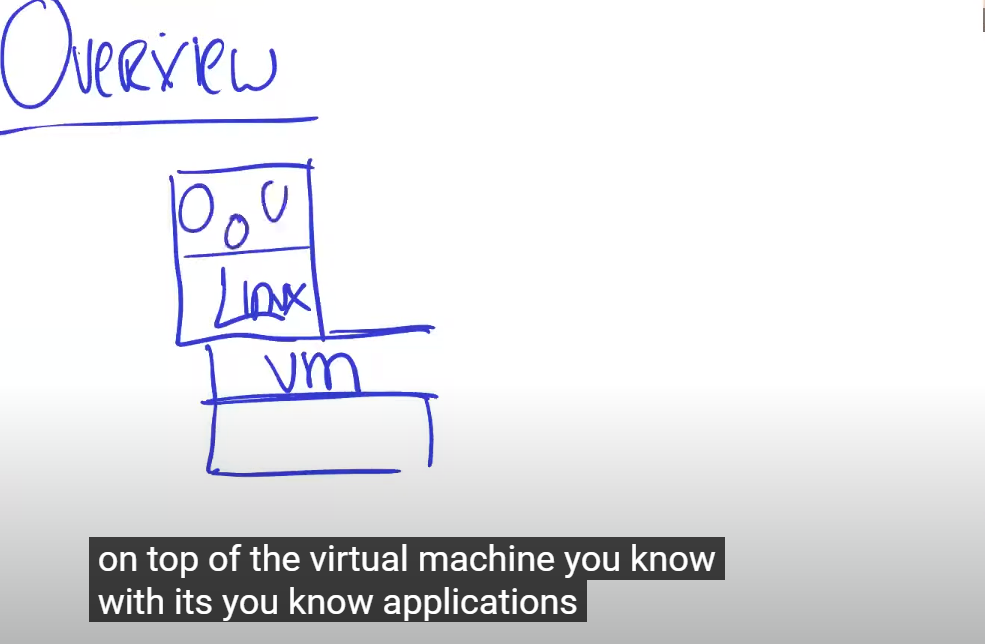
						- 指的是在一块硬件的基础上使其成为电脑的end pieces（硬件系统的末端设备或者组件，通常直接与外部环境交互或者与其他系统进行连接）
						- 我们可以在x86 box（Hardware，图示中最底下的矩形）的上层运行一个virtual machine monitor，而在这个monitor上层通常是多个virtual machine，在论文中该vm monitor上层只有一个linux系统和相关的应用
						- vm monitor也被称作Hypervisor（虚拟机监控器），这里也就是论文中的vmft（vm with fault tolerance）
						  collapsed:: true
							- 是一种虚拟化技术，它允许在一台物理计算机上运行多个虚拟机操作系统。Hypervisor 可以将计算机的物理资源（如 CPU、内存、存储空间等）划分为多个虚拟机，每个虚拟机都可以独立运行不同的操作系统和应用程序。Hypervisor 可以提高计算机资源的利用率，同时也可以提供更好的安全性和可管理性。
						- 当最底层发生了Hardware interrupt，整个系统会怎么做？
							- 这个中断会先通过vm monitor，然后再由这个monitor将这个中断deliver给linux系统
							- 实际上，任何的external event，都会首先被hypervisor所捕获到，然后才会被vm捕获到
							- 如果有一个external interrupt，我们要怎么replicate this？
							  collapsed:: true
								- hypervisor实际上控制了interrupt的转发，所以replicate也与hypervisor有关。实际上，hypervisor是一个强有力的工具，能够使得指令变得deterministic
								- 如果有一个中断发生，不管是网络中断还是硬件中断（比如timer interrupt），vmft会做两件事：
								  collapsed:: true
									- 把这个中断给deliver给linux文件系统的application
									- 通过一个logging channel把这个中断发送给backup
									- 例子图示：
										- Client通过网络向Hardware发送一个packet，造成一个中断（下图中最底层的横线表示same network）
										  collapsed:: true
											- 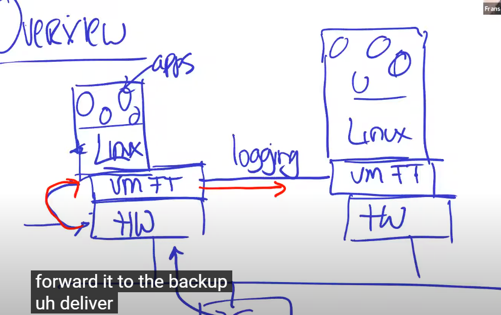
										- linux系统接收到monitor传送过来的中断后，按照正常应对中断的方式进行处理，然后把想要发送的packet传送给monitor，linux系统会以为自己正在通过实际的网卡（network interface card）写入数据，但是实际上它是通过由monitor所仿真的（emulated）virtual network interface card来写入数据；当linux系统向virtual card写入一系列的指令时，它实际上正在通过monitor来进行写入；monitor通过对硬件编程（programming the real hardware）来代表os发送packet, 然后the real hardware将真正的响应返回给客户端
										  collapsed:: true
											- 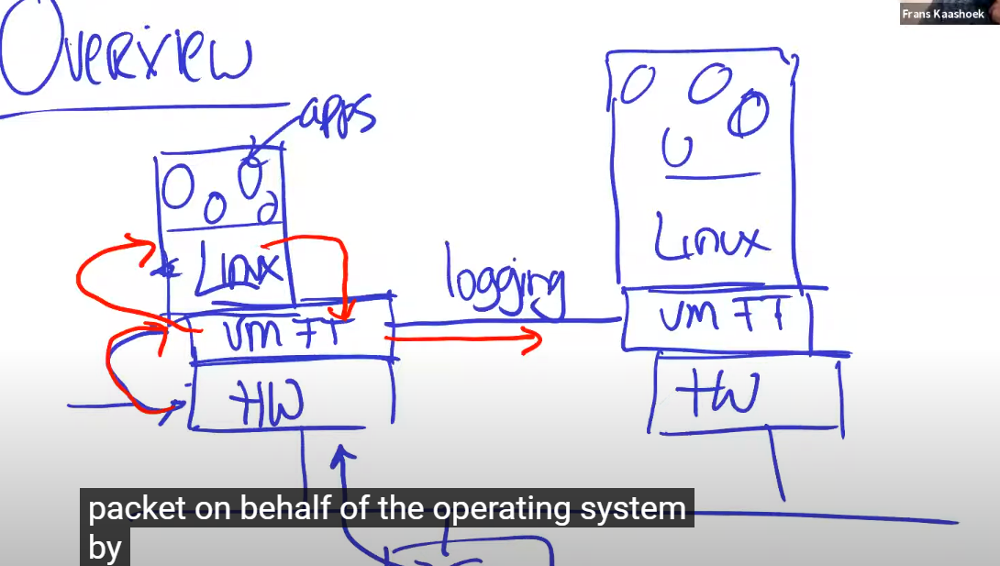
										- 如果primary和backup初始时处于相同的state，如果它们同时接受同样的中断请求，monitor可以控制中断在同一时刻被delivered，且中断对应完全一样的指令；由于发送的中断需要通过logging channel才能传递到backup，所以中断在primary的monitor处会显buffer一段时间，直到中断也已经到达backup的monitor了
										- backup上linux返回的packet不会send到网络上
										  collapsed:: true
											- 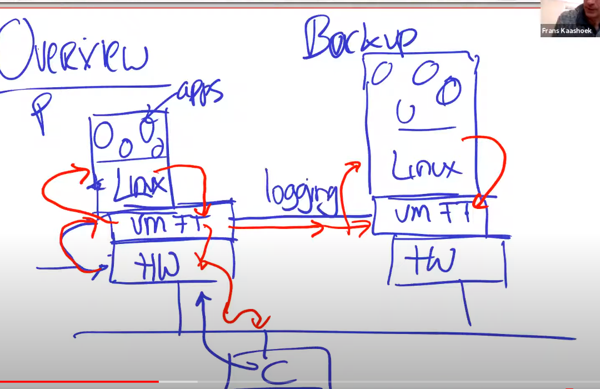
										-
						- 还存在额外的component需要注意的吗？
							- 有，是在同一个网络上的Storage Server
							  collapsed:: true
								- 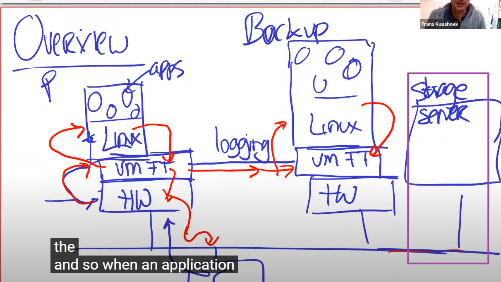
							- 它可以看作是primary和backup上两个virtual machine的hard disk：
							  collapsed:: true
								- 当一个应用试图给一个文件里写入数据，文件系统就会mount上linux系统（下图中green arrow表示了相关的控制流程）
								  collapsed:: true
									- 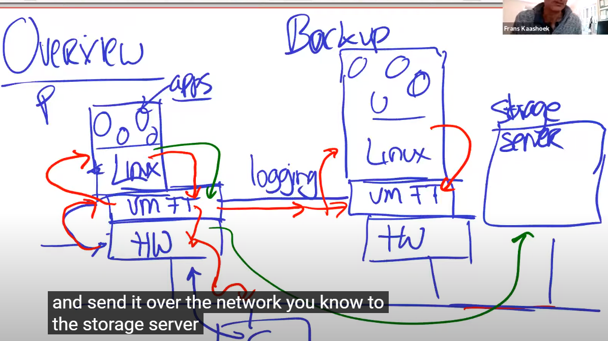
								- 有时候是客户端发起存储相关的communication，有时则是storage server主动发起存储相关的communication
							- storage server扮演了除了存储服务器以外的其他的额外的角色：arbitration server
							  collapsed:: true
								- 在storage server内部会有一个block用作flag，来arbitrate（make a formal judgment or make an official decision）当发生failure将成为primary的那台机器是哪一个
								- 主要原因是当primary和backup中某一个crash或者network fail时，无法区分是哪一种情况，但此时两者和storage server内部的这个flag block都是可以进行通信的；
								  collapsed:: true
									- 为什么这样做能够区分crash或者network fail呢?
										- 当crash时，其实只有一台仍旧alive的机器会进行 test and set操作，crash的那台无法与存储服务器通信，自然也没有机会成为primary
										- 而当network fail时，两台机器都会进行test and set 操作，两台机器中与存储服务器通信速度更快的将成为primary
										- 无论是哪种情况，最终得到的primary的选择项都是合理的
										-
								- 于是，primary和backup都是尝试往这个flag block里面写入1，谁先写入1谁就就是primary：假如backup比primary率先抢到了1，server就会给backup返回0；那么当primary读取这个flag block时就会发现它已经是1了，server就会返回给它1；这种操作被称作 test and set （先进行读取测试，然后依据测试结果进行相应的set），其中返回结果得到0的machine将会处理client发送的请求，而返回结果为1的machine将会terminate and done
							- arbitration server避免了split brain syndrome
						- vmft中的repair plan是什么？repair的意思是说当primary宕机了，现在就只剩下一台backup机器了，但是这台backup的机器也有可能进一步宕机，所以必须需要再有一台replica
						  collapsed:: true
							- vmft中的repair plan是手动的，就是 ：
								- 人通过monitor software会notice到这一点
								- 然后会主动创建一个新的replica，或者 基于第一台机器的镜像来创建：注意在这个复制或者说克隆期间，primary是不会处理来自客户端的请求的
								- 一旦second backup被创建成功，logging channel就会重新启动，如果我们follow the protocol, 这个flag就会被重设为0：这些操作是为了保证secondary backup和primary保持同步的状态
								  collapsed:: true
									- 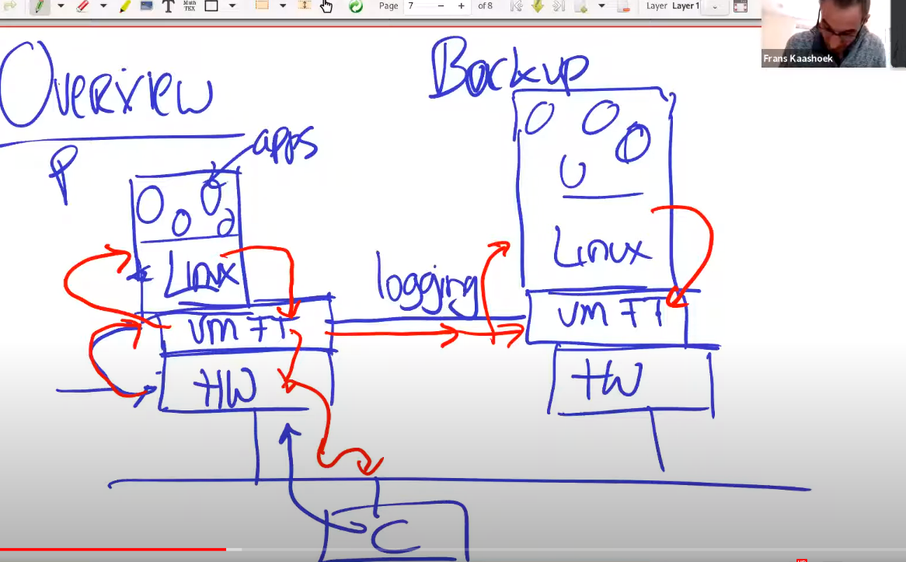
								- 整个系统恢复对客户端的服务
						- 如果 logging channel或者the channel to the sever broke了，那我们就得不到响应了，所以怎么办呢？
						  collapsed:: true
							- sytem将直接stop，直到故障被repair，没有其他的补救措施
							- 且之后的所有客户端请求都不会再被接受处理，因为我们并不清楚当前的state是什么
						- 你认为disaster failures是什么？
						  collapsed:: true
							- 所有的网络电缆都断了
							- primary和backup同时都宕机了
							-
						- client什么时候会从storage server进行读取？
						  collapsed:: true
							- 不会，只有linux上的应用和vmft会与存储服务器进行交互，图示中的绿色箭头表示了这种流向：
								- 
				-
			- primary / backup 的目标是两台机器工作的结果就像一台机器在运行，那么论文中这种replication sheme会存在哪些sources of divergence?
			  collapsed:: true
				- 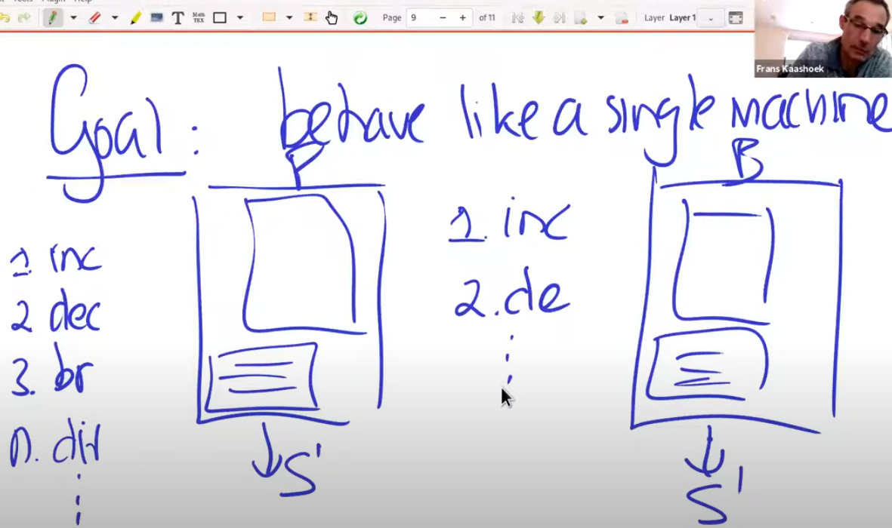
				- 指令可能是non-deterministic的
					- 比如关于time的指令，如果两台机器的定时不同步，那么同一个指令的运行结果可能会是不同的
				- packets input or timer interrupt在不同机器的指令流中的位置可能不同（这里的位置可以理解为interrupt被deliver到指令流中的时机）
					- 当客户端发送packets时，或者产生了interrupt，必须要进行执行或者处理，这是由linux系统中对应的interrupt handler来具体进行处理
					- 比如primary中interrupt在指令1：inc 和 指令2：deck中发生，而同样的interrupt在backup中的指令2和指令3中发生了，这就是说中断不处于指令流中的same point，会导致指令流执行的最终结果可能不同
				- concurrency / multi-core 可能导致的non-determinism
					- 论文中的solution是disallow多核，只匀速进行uni-core的处理
					- 这是因为：
						- hypervisor控制了interrupt的处理，如果是uni-core就不会发生线程切换
						- 假设我们有multi-core，此时两个thread正在同一个processor的不同core上运行，两个thread争夺一个lock，其中一个会win，另一个会失败，如果我们要执行replicated state machine策略的话，在backup上的两个thread竞争lock的结果必须与primary是一致的，而这需要大量的machinery，这带来的额外的machinery和complexity是论文不想要或者无法解决的；所以，我们就直接通过uni-core来避免这种divergence的出现
						- uni-core导致的结果是：
							- primary上切换到某个thread A，backup也同步切换到A
					-
				-
			- 当interrupt comes in，primary和backup是怎么保证中断的同步的？
			  collapsed:: true
				- 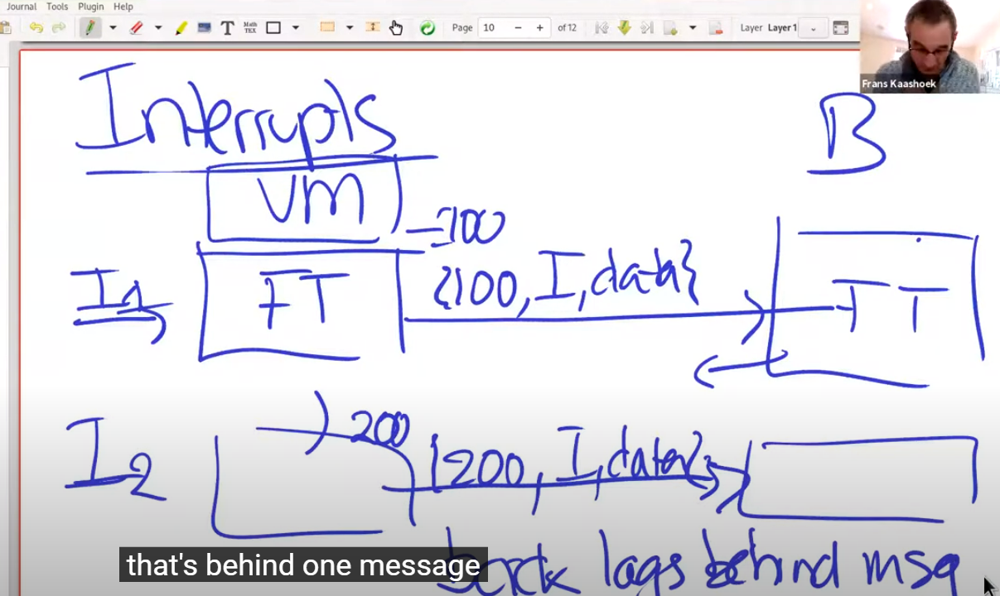
					- VMFT判断应用或者linux系统要在哪个指令之后执行这个中断
					- 将【中断的前一个指令序号】+【中断指令本身】+【中断关联的数据】一并作为消息通过logging channel发送给backup，所以backup会lag behind one message
					-
			- 是不是只有interrupt等这些会造成potential divergence的指令才会需要通过logging channel来进行通信？
			  collapsed:: true
				- 是的，这里需要把operation和instruction两个概念区分清楚，linux系统执行program实际上底层是执行这些computer instructions，而在primary和backup上linux的所有computer instructions都是一样的，只有external interrupt是primary当前有而backup暂时还没有的，所以才需要通信来传递
				-
			- primary和backup对应的linux系统，对non-deterministic instruction是怎么进行处理的呢？
			  collapsed:: true
				- 首先，在linux系统通过image启动前，会先扫描找出linux binary中所有的non-determin instructions，比如 get the time of the day, 然后将它们转化成某种invalid instructions；
				- 然后，当linux实际去执行non-determin instructions时，它将控制权转交给hypervisor（hypervisor会把自动地识别到这条指令将cause a trap），hypervisor会对这个指令emulate(仿真），也就是知道这个指令将会产生的所有effects但只记录这些effects所产生的results，比如说执行指令“go into a0”，它会把a0的值记录下来并传递给backup
				- 最后，backup的vm monitor会使用同样的a0的值，将a0存入对应的需要更新数值的寄存器中，而不会重新执行指令
			- primary和backup执行的速度谁快谁慢呢?
			  collapsed:: true
				- 在几乎一样的硬件条件下，如果要执行的instructions完全没有中断的话，那么primary和backup的运行速度几乎是完全一样的；但是实际上总是不可避免地会有一些中断，比如定时中断，而处理中断时backup必然是lag behind primary one message 的，也就是primary会比backup要运行得可能慢一点，但是两者的运行速度不会差距太多，一方面是因为中断不会特别频繁，另一方面如果运行速度差太多会影响后面failure时backup取代primary提供服务时的性能
			- 关于failover的更多场景，能给出一些解读吗？
			  collapsed:: true
				- 场景1：
					- 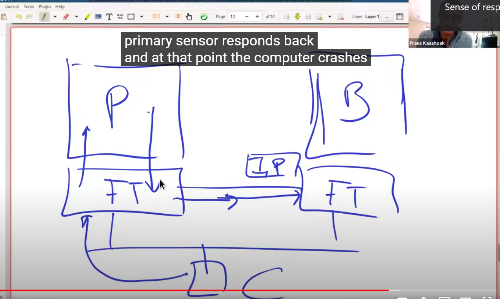
					- 此时backup会先等待中断的消息完全接受，然后执行与primary相同的指令，但是并不响应回客户端；backup会通过arbitration server成为primary，客户端然后会超时重试，重新发送一个tcp packet，一切开始正常工作
				- 场景2：
					- 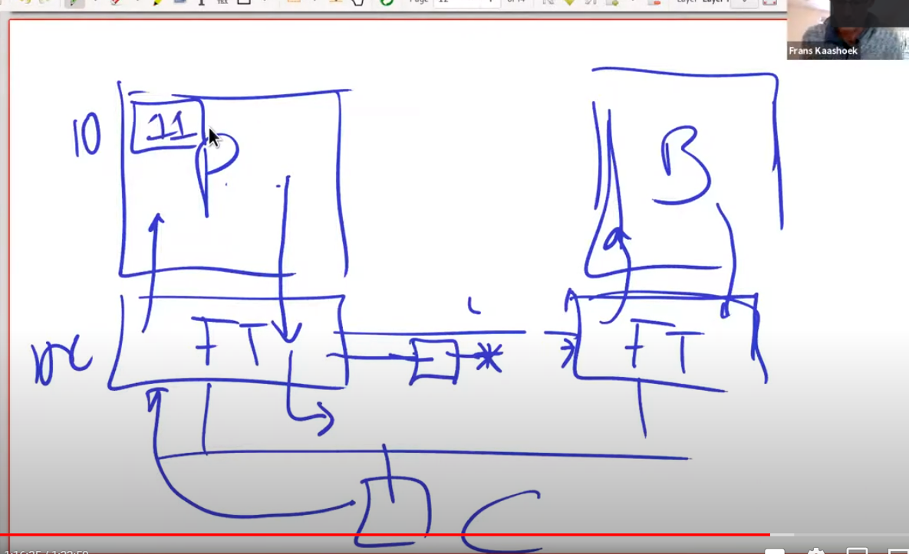
					- 场景描述：
						- 客户端发送请求让primary把变量从10增加到11，假如primary通过logging channel发送的消息never made it to the backup，primary在刚好把response返回给客户端前就fail了
					- 场景分析：
						- 当backup接管时，它不会意识到该自增操作，只会继续执行下去，比如继续自增1，它会返回给客户端11而不是正常的12
					- 场景解决：怎么避免？
						- 当primary通过logging channel给backup发送消息时，需要等待来自backup的acknowledgement，一旦primary接受到了这个acknowledgement，primary才会send output
						- backup并不需要实际上真地去执行这些命令，它只需要在它的logs进行记录，在成为primary之前catch up到这些信息就行
						- 这个被称作“Output Rule”：在primary发送输出前，它必须保证proceeding messages已经被backup所接收了
						-
			- 关于VMFT这篇论文中replication schema的性能，要如何进行评价？
			  collapsed:: true
				- 因为VMFT是在machine instruction的level上进行replication，所以不可避免地会损伤一些性能
				- 原论文中其性能有关的两张表如下：
					- 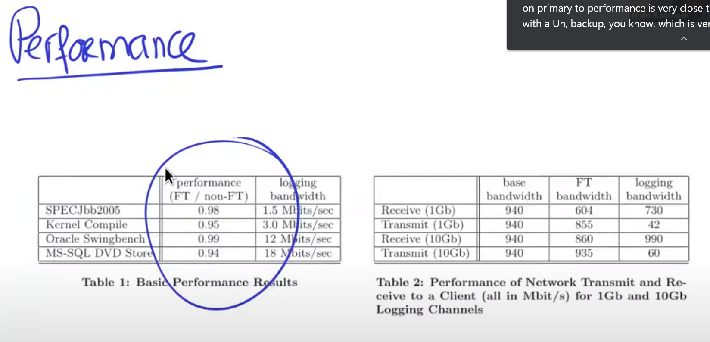
					- 从第一个表中可以得出什么结论？
						- FT就是有backup，non-FT就是没有backup，FT的性能会比non-Ft要差，因为会涉及backup的切换和同步等开销，但是表中的0.98、0.95等都只是略小于1，说明这种开销在VMFT中并不高，所以总体的performance很不错
					- 从第二个表中可以得出什么结论？
						- base指的是没有backup，FT就是有backup，Receive从940到604可以看到带宽解决有30%的下降。究其原因，primary从输入这里接收客户端发送的packet，但是它必须等到接收到了通过logging channel发送的来自backup的acknowledgement，才能最终给客户端一个response，所以有backup的结构不可能具有和单个机器一样的处理packet的速度
						- 但是，总体来说这个performance还是impressive的
						- 鉴于速度原因，通常人们使用replicated state machine方法不是像这篇论文中的instruction level，而是在application level，因为这将获得更高的性能，但需要application被modified，这一点我们已经在gfs系统中得见了
						-
						-
						-
			- 使用VMFT是否是一个design decision？
			  collapsed:: true
				- 是的，它使得这种replication变得transparent
				- 整个系统的设计目的就是：fault-tolerantly replicated
			- 在Output Rule下，客户端是否会两次看到同样的response呢？
			  collapsed:: true
				- 是，因为网络的fault-tolerant model总是assume：网络无论如何都可以duplicate message，而像tcp这样的协议在用来duplicate message方面已经可以说是完全设计好了, 无论应用使用什么样的replication或者duplication策略都是这样
				-
				-
				-
				-
			- 论文中如果出现了多个backup，那么对应的storage server除了arbitration还有其他的功能吗？
			  collapsed:: true
				- 不会出现这种情况，因为论文中的策略就只有一个backup
				-
			- 论文中说logging channel使用udp是为了传输的performance（延迟低），那么当primary通过这个channel发送packet但是没有收到acknowledgement时，是不是就会认为backup fail了，并且也不会重新再次传送（retransmit）?
			  collapsed:: true
				- No，比如说timer interrupt每隔开10毫秒就产生一次，如果primary发送的heartbeats返回，那么系统就会继续做一些timer interrupt，直到放弃
				- 这个heartbeats sort of来说是由timer发送的，但是由于每隔10毫秒就会发送一次interrupt message,所以会产生一些间接的副作用
- Fault Tolerance: Raft (1)
  collapsed:: true
	- 主要讲什么？
	  collapsed:: true
		- Raft是分布式replication协议的核心元素
		- 这一讲对应lab2A和lab2B，分别是 the election  of the leader 和 pushing the logs around
		- 下一讲Raft2对应 lab2C 和 lab2D, 分别是 snapshots 和 the lock compaction
	- 之前的GFS、mapreduce、VMFT有什么共同的缺点？Raft协议有什么改进？
	  collapsed:: true
		- 尽管它们进行replication都进行了fault tolerance的处理，但是都存在single point of failures
			- 在GFS中是coordinator
			- 在Mapreduce是master，masters用来hand out lease的
			- 在VMFT中是storage sever
		- 在避免split brain syndrome的过程中，引入或者maintain了单点失败
		- 因为down time的概率不高和发生时处理的时长不久，所以在大多数场景下这些协议都work fine，但是我们甚至可以没有单点失败，也就是进一步来降低宕机的时长，这也就是raft协议能够做到的
	- 关键性的单点失败，比如test and set操作，可能导致脑裂症状，所以为什么不对单点失败也进行replicate呢？
		- 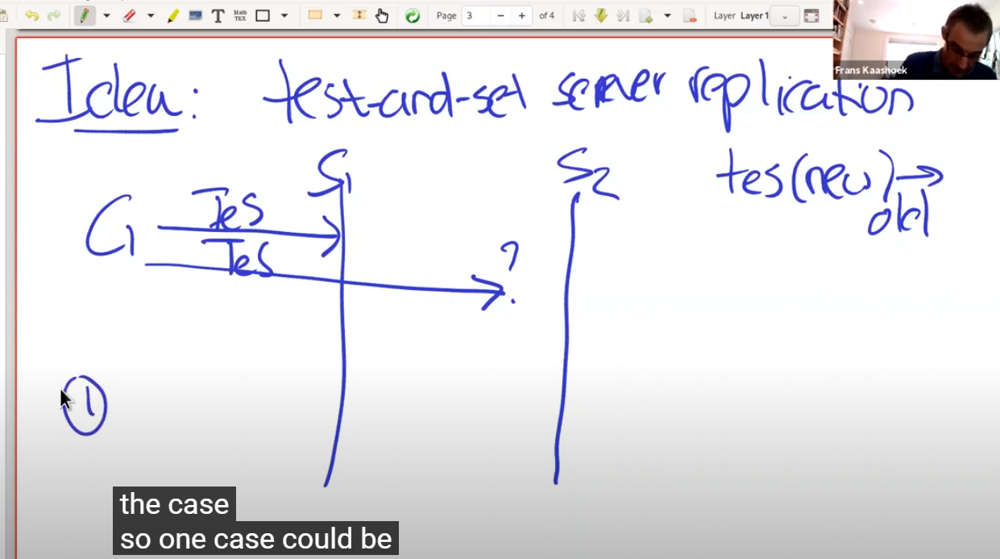
		- 场景描述：
			- 假设S2是第二台的test and set server，客户端可以同时向S1和S2这两个服务器发送 test and set操作（这个操作的输入参数是new value，返回是old value，在VMFT中primary和backup同时发送这个操作请求时，只有一个会win）；如果此时S2没有response，可能的原因有哪些呢？
		- 场景分析：可能的case有两种
			- 第一种是：S2 failed
				- 这种情况下C1 declare victory，因为S2中的值是没有办法被看见或者说观察到的，C1可以继续后续的请求等
			- 第二种：network partition exists between C1 and S2
				- 这种情况下C1不能proceed，因为此时会有另外一个客户端C2与S2通信，如果C1 proceed, 那么它会更新S1，然后会得到false value，会以为C1 win了，然后C2与S2通信也认为C2 win了，这就违背了contract of the test and set operation：因为两个server同时up and runnning，并且分别服务于客户端的一部分子集
			- 但是，真正具有挑战性的是，C1无法区分这两种case
	- raft是怎么解决network partition的？
		- 提出了majority rule
			- 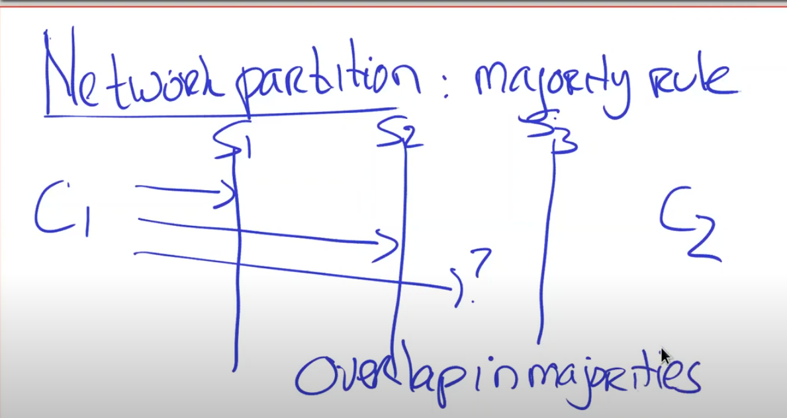
			- 规则描述：
				- 只有当超过一半的servers都成功执行了该操作，才会返回postive response
				- 在图示的场景中，C1同时在S1和S2上都执行了test and set操作，都返回了false（也就是old value都是false，现在已经被C1赋值成new value = true了），因为一共就只有三个server，所以majority rule规则生效，响应被返回给C1, C1认为自己已经win了；假设C1与S3的通信没有response，客户端C2又向S3发送了请求并且成功执行返回false，C2必须至少要与S1和S2中的任意一个继续通信以满足majority rule，很明显S1和S2已经受到了C1操作的影响，所以会返回给C2的值是true（C2对已经执行过操作的S1和S2的重复请求被看作是overlapping in majorities），所以最终C2 lose
				-
		- 在Raft中该规则是怎么使用的呢？
			- 结论M：由于每次都要超过一半以上的follower支持，所以当发生因为任期而导致的leader切换时，必然至少会有一个follower看见过由上一个leader所执行的上一个操作
			  collapsed:: true
				- 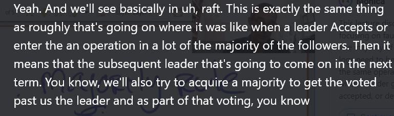
				- 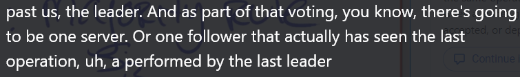
			- 后续所有的容错服务都是建立在结论M上
			  collapsed:: true
				- And so now it's going to basically be able to building stone on which we can build these fall tolerance services that can handle network partitions and failures of services while still achieving strong consistency
			- 另一种理解这种majority business的方式是：
				- 如果发送了network partition，只会有一个partition能够在顺序上包含majority，另外一个partition必然只能说是有minority，所以只要包含majority的那个partition才能够proceed
				- 如果network中出现了超过1个以上的partition，那么没有哪一个partition能够包含majority，此时整个系统都不能继续proceed，直到网络被healed到出现一个majority的partition才行
				- 而对于只有三个server的这种情况，其只能允许一个server宕机，因为如果两个server都宕机了，那么无法获得majority了（也就是>=2台server），没有客户端能够get any operation through
				  collapsed:: true
					- 这种idea可以怎么进行拓展呢？
						- 可以拓展成 2f + 1 replication：如果想要容忍f个faults，那么至少要有 2f + 1个servers
						- 很好理解，当有2f + 1个servers，如果出现了f个faults，也就是有f台servers挂掉了，那么还会剩下f+1台，这很明显是超过 2f + 1 这个总数的一半的 （f + 1 > f）；自然，当 总数 = 2f + 1 + m (m >= 1)时，那么f台挂掉之后还剩下 f + 1 + m 台server，f + 1 + m > (2f + 1 + m) / 2 = f + (1 + m) / 2;  当总数 = 2f + 1 - m (m >= 1)时，那么 f 台挂掉之后 还是剩下 f + 1 - m 台server, f + 1 - m <= (2f + 1 - m) / 2 = f + (1 - m) / 2
						-
			- 怎么理解majority这个概念呢？
			  collapsed:: true
				- 它是所有当前alive的servers中的majority吗？
					- 不是，其所属的范畴指的是系统中的所有servers，不管它们当前是alive还是down
				- 它计算majority的总体范畴时包括当前考虑的server呢？
					- 是的，包括
				- majority对应的servers的总数可以是偶数吗，还是说必须是奇数？
					- 可以是偶数，比如7台servers有一台宕机了，那么剩下的6台server的运行也必须要满足majority rule啊，所以必然不会设计成只让奇数个servers使用这个规则，不然就太不方便了
			-
			-
	- 关于使用quorum想法的protocols，你了解哪些？
	  collapsed:: true
		- 背景解释：
		  collapsed:: true
			- Quorum是一个基于以太坊的私有区块链平台，它是由JPMorgan Chase开发的。Quorum使用了一种名为Istanbul BFT（Istanbul Byzantine Fault Tolerance）的共识算法，该算法结合了PBFT（Practical Byzantine Fault Tolerance）和RAFT（一种共识算法）的特点，可以实现高效、高性能的共识机制。Quorum还使用了IDEA（Improved Distributed Encryption Algorithm）加密协议来保护数据的安全性。这意味着，在Quorum平台上进行的交易和数据传输都是加密的，并且只有授权用户才能访问这些数据。因此，Quorum是一种适用于企业级应用的区块链平台，可以提供高效、安全的数据管理和交易服务。
		- 协议的context：
		  collapsed:: true
			- 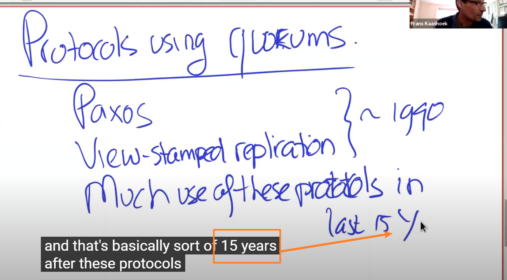
			- 2014年的Raft构建了一个完整的replicated state machine，且可以被看作是这个协议的lineage （ancestor）
		-
	- 你知道如何使用raft来构建一个replicated state machine吗？因为这是我们的end goal，将帮助我们推理raft的行为（raft应该做什么以及怎么做）
	  collapsed:: true
		- raft在我们的设置中只不过是一个go中的package，我们只需要import进程序即可
		- 构建过程图示：
			- 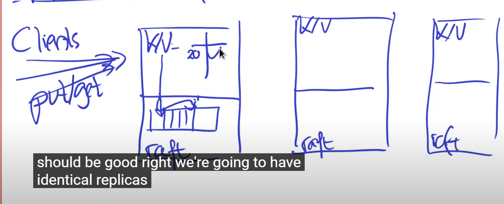
			- 
			-
		- 过程描述：
			- 使用raft协议作为底层可以构建key/value server，客户端向该server发送get/put操作，该操作被server转交给log（一个新的log entry会追加在log的末端），然后这些operation被传递给其他该server的replica中，这些replica也会先把operation放在log中，按照相同的顺序来执行；
			- 一旦这个operation被足够多也就是majority数目的机器都replicate了，那么就认为已经commit了，最后leader单独将response返回给客户端；而对于uncommited的operation，会被deliver到key value server然后执行并响应给客户端，或者就直接删除对客户端的响应
			- 其中第一个server是leader（L），其余都是follower，因为每个server都把log中operation写在了对应的stable storage中，所以它们中的任何一个fail了，起码都能恢复到某个最终的时间点
			- 一旦leader crash了，a new leader将被选举出来开始下一任期，客户端会因为没有得到响应超时，而fail over到这个新的leader，然后重试同一操作，如果lucky的话，我们最终将在新的leader上没有failure地执行成功
		- 一些问题：
			- 这里new leader的log里面会可能出现重复的这个operation对应的entry吗？可能会重复执行吗？
			  collapsed:: true
				- 有可能，因为原先这个operation可能在new leader这个replica的log channel里面存储并执行了，但是由于总体上没有满足majority rule，所以这个operation没有commit，结果也没有响应回client端，于是client重试时，已经可能将这个operation发送给了new leader了，new leader还会继续把same operation放入log并执行
				-
			- leader能够通信的客户端的数目是多少？
			  collapsed:: true
				- 没有一个明确的limit，因为不断增加replica，将会不断scale能够交互的客户端数目
			- 客户端要怎么知道当前的leader fail后要去与哪个new leader进行通信呢？
			  collapsed:: true
				- client会维护一个系统所有的server的列表，首先会随机选择列表中的一个server，如果那个server不是leader的话，那么就会redirect到列表中的合适的另外一个server，直到它是leader为止
				-
			- 在KV存储服务器中被执行的log entry被commit到底是什么意思？
			  collapsed:: true
				- 一旦log entry被raft协议所commit了，也就是说raft已经决定：已有足够的replica已经接受到了这个log entry并且不可能取消对应的操作（back out of that operation）时，就会把这个operation给hand out给key/value server了，也就是说被这个KV存储服务器所执行（这整个过程是通过go的channel和goroutine来实现的）
				- 那什么时候其对应的replicas会在什么时候、以什么方式来执行这个log entry对应的operation呢？
				  collapsed:: true
					- 可以用下图来详细说明：
						- 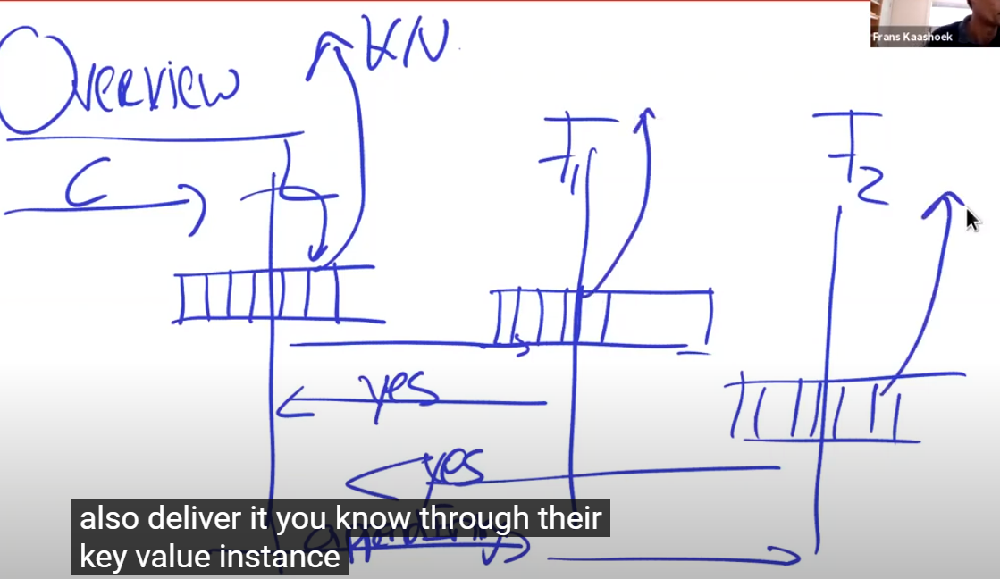
					- 说明：
						- 只有leader才会依据 "发送log entry（记作N）并成功接收到response的replicas的数目" 来判断是否满足了majority rule，满足了之后会认为已经可以commit当前的log entry了；而接收log entry的这些replica（F1、F2）对此是不知情的，它只知道leader向它push了一个new log entry
						- 当这个entry对应的operation在KV存储服务器上被执行完毕后，后续的客户端C还会继续发送operation给当前的leader，当前leader将这个new operation追加到log的末端（假设这个追加的log entry是M），然后[[#red]]^^M发送给F1、F2时，还会将“前一个operation N 已经commit”的消息一并发送；F1、F2在接收后，会将这个N分发给上层的KV server执行^^
					- 问题：
						- leader的log entry被发送到majority的followers中去了，但是这些followers中如果有server crash了，那么要怎么办呢？
							- 系统中所有的servers中的log中的数据都必须进行stable storage，与term number等一样都要写入disk，且raft的论文中指出无论log发生什么change，都要写入disk。所以当有server crash了，无需担心，后续server recovery时，可以从disk中找到这些log entry。
						- 当log entry A被发送给replicas并且成功返回给leader“yes”时，leader会commit this operation，而当客户端发送的下一个operation B还没有被传送到leader时，[[#red]]^^leader crash了，那么那些接收到A的replicas要怎么知道A已经被commit了呢，这些剩余的follower会commit A吗？^^此时的B没有到达leader，也就无从谈起到达F1和F2了，或者就算B刚好到达leader，B也无法被传送到F1和F2，客户端会重新发送B操作吗？如果重发，发送的server对象会发生变化吗？
							- 都会commit
							- 依据后面的leader election的rule，可以知道在log中包含entry A的一个follower将会成为新的leader，这个新leader会将entry A给propagate到其他的followers中，然后这些followers都会应用entry A对应的operation
						- 对于所有的followers来说，并不存在一个完整的log？[[存疑]]
						- 如果有一个follower丢失了它所有的log entry，那么这个follower会replay来自new leader的完整的所有的log entries吗？
							- 会有这个可能性
							-
			- KV存储服务器中同样有用于保存KV table的database，那为什么raft中还会有logs呢？那岂不是重复存储了两次吗？
			  collapsed:: true
				- 用于Retransmission
					- 当leader发送给follower的append entry丢失了，那么需要重发，所以有必要记录所有的append entries，使得它们能够被再次重发
				- 用于保持order
					- 每个attempted的操作或者命令在leader和follower中必须以相同的order来进行deliver，而log则是维持这种order的一种非常方便的方式
				- make log persistent
					- 几乎所有的followers都可能crash，甚至是同时crash，当它们恢复后，我们需要立马可以retransmit相关的append entry使得整个system都是up-to-date的，通过将log存储进disk可以做到
				- leave space for tentative operations or tentatively commited
					- 比如followers不知道什么时候operation是否已经被commited了，所以我们需要为这些标准的delay operation留出一些空间，而log是一个很合适的地方来执行这些操作
				- 尽管不同server的logs在不同的时间段可能是out of sync的，但是只要持续运行系统，在停止client请求后的一段时间内，所有的logs最终都会是identical的。因为整个过程中所有的操作在每个server上都被fed了，执行order都是一样的，所以最终这些servers都会处于same state了
			- 如何理解单个的log entry？
			  collapsed:: true
				- 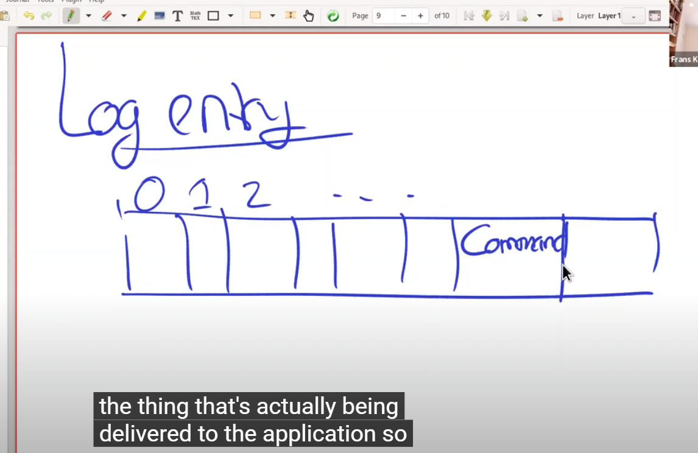
					- Command在log entry中存储，但它是用于被deliver到application的，所以在entry中不怎么关系
					- command无法是包括入参、出参、命令本身
				- 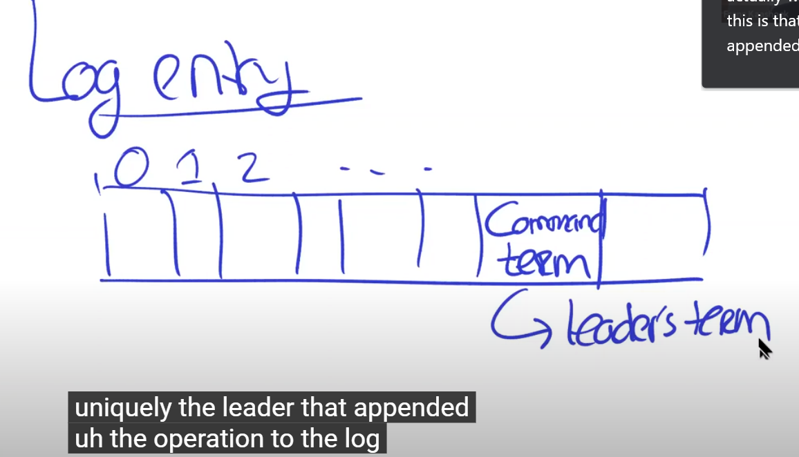
					- term唯一地标识了将这个operation追加到log中的leader，因为在每个term期间都只会有一个leader，所以term Id实际上隐式地标识了leader
				- 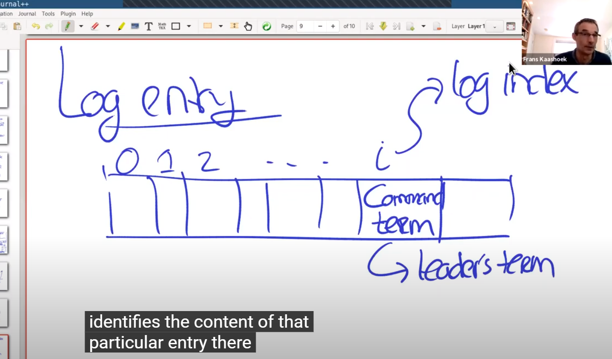
					- log index 和 leader term id合并在一起，实际上表示了每个particular entry的content
				- 问题：
					- log entry可以被overwritten吗？
						- 有可能的
					- entry说明了raft协议需要做哪两件事？
						- 
						-
			- 什么时候leader会detect duplicates in log channel呢？
				- 当client发送request给了当前的leader，当前的leader在完成了“将log entry追加到log channel”、“将entry分发给majority的其他followers并得到成功的response”、“commit当前的操作并交给KV server执行”后刚好crash了，那么leader无法将执行操作后的response返回给client；因为client得不到response，就会再次发送同样的request，此时将会选出一个new leader，由于new leader内部已经有了同样的append entry了，所以它如果直接继续接收新的request，那么log channel里面就会有两个一模一样的append entry了，最终也就会导致这个操作很有可能被执行两次。
				- [[#red]]^^所以，new leader将进行detect duplicated log entry操作，如果log channel里面已经有了uncommited的same的log entry，就不会把本次的log entry继续追加了。^^ [[存疑]]
					- 视频中老师说的是：第一次leader会把这个response存储到KV server中，尽管这个response并没有返回给客户端；后续客户端重新发送请求时，对应的重复的log entry还是会加入到log channel中去，然后被pop up, 由于leader中会存在一个duplication table（存储 log entry和对应的response），所以不用重复执行operation就可以send back response
					- 但是老师的这个描述是leader不变化的情况下，如果leader发生了变化，新选举的leader会有duplication table的副本吗？就算有这个副本，那么新选举的leader的上一个log entry还没有commit啊，所以有可能会重复 从duplication table中获取两次吗？
			- leader是在commit one operation同时接受client的又一个log entry后，将new log entry转发给其他follower的过程中顺带传递之前operation被commited的msg的，那么：当当前leader已经commit了最后一个command时刚好crash了，那么它就没办法发msg给其他follower了，那么这些follower就不知道最后一个command已经被commited了，所以它们要怎么对待uncommited的command呢？
				- 这取决于[[#red]]^^谁会成为new leader以及log channel中的log的情况^^，所以这个command可能会被commited，也可能会不被commited
			-
	- raft中是怎么进行leader的选举的？
	  collapsed:: true
		- 什么时候才会重新选举leader呢？
			- 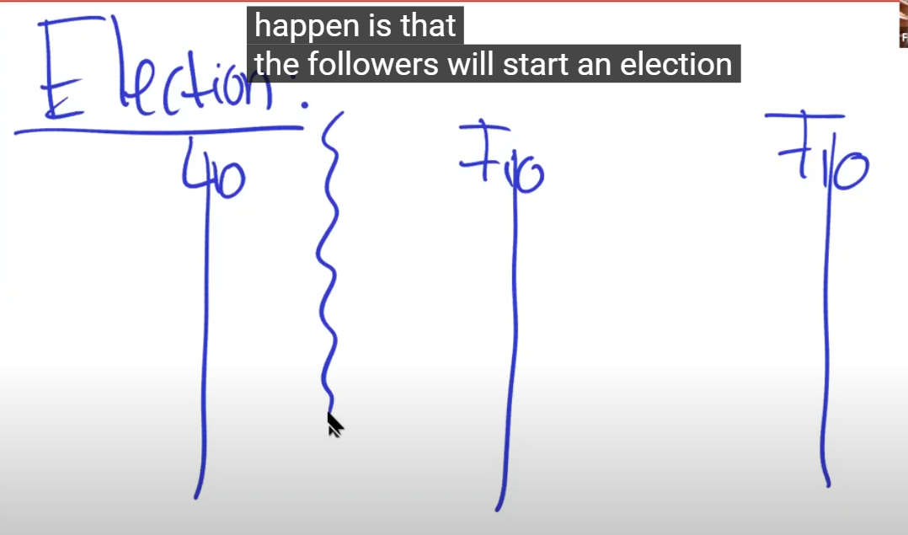
			- 如果leader crash或者在网络上和followers断开了，那么followers会马上开始一轮选举
			- 之所以马上开始选举的原因是：
				- 这些followers将会miss heartbeats from the leader, 而leader本身的主要工作就是以相对固定的周期将append entry发送给其他的followers；通常来说客户端很多且非常活跃，所以followers会持续不断地获得append entry，但是如果leader没有收到来自client的any commands，那么它理应定期地去发送heartbeat给其他followers，目的是为了通知其他的followers它依旧是leader；heartbeat采取的form是normal append entry而不是new log entry，是leader告知自己的log的长度以及log中的最后一个entry是什么
			- 当leader fail了a couple of heartbeats的时长之后，也就是说leader timeout了后，每个follower中运行的timer会发生什么样的变化呢？
				- 当leader没有fail时，这些timer每接收到一个heartbeat或者append entry时，就会reset the timer；
				- 而当leader fail了，这个timer就会goes off（达到某个预设的事件或者时间点时会发出信号），followers就会开始新一轮的选举。新一轮的选举是怎么样的呢？
					- 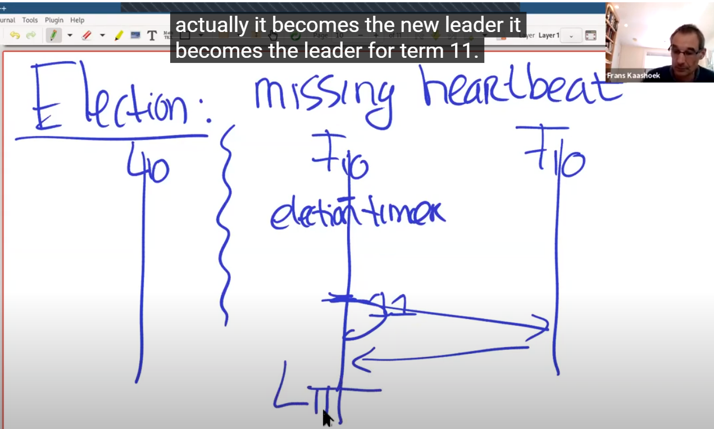{:height 516, :width 846}
						- F0得到自己和F1的两个投票，但是由于原先的leader宕机了所以没有得到来自原先leader的response，所以F0成为新的leader，增加term number为11，此后客户端就会fail over到F0
				- 新一轮的选举会存在哪些问题呢？
					- 如果L0和F0之间的network partition被heal了，那么客户端的请求也可以到达L0了，就会出现两个leader的split brain syndrome，是这样的吗？
						- 并不会出现，因为网络恢复后的L0试图将append entry传送给F0，但F0会告诉L0“你不再是leader了，因为你的term id = 10， 比我的term id = 11 要小，所以你要修改term id为11，变成follower了”
						- 简而言之，通过term id的变化能够保证原来fail的leader恢复后不能再get any operation through old followers
						- [[#red]]^^整个过程是 majority rule + term number 共同起作用，前者保证能进行有效的新一轮的leader的选举，后者能够old leader能够意识到new leader的存在并成为新leader的follower^^
					- 可能会出现 split vote的现象：也就是当L0 fail了之后，F0和F1几乎同时开始执行自己作为leader的选举，F0和F1都希望自己和对方都能给自己投票，但是F0和F1两者不可能都得到两票，这是因为每个follower只有一个vote且优先投给自己，假设F0给自己投了一票后同时接到了来自F1的vote request，F0会拒绝这个请求，同理F1也会拒绝来自F0的vote request，所以F0和F1最终都只会有1个vote，都无法满足majority rule，所以之后系统要怎么继续进行leader的选举呢？
						- 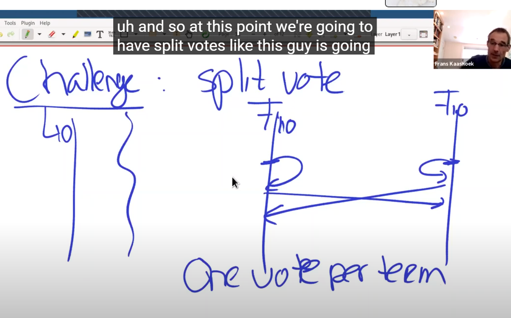
						- F0和F1的这轮选举没有选出leader，但是term number还是要加一（10 + 1 = 11），表示进行了一轮选举，只是选举结果是无效的；F0和F1会继续开启下一轮选举，但是仍然可能双方都只得到一票，term number变成12；如果非常不幸的话，这个过程就会over and over gain的执行下去
						- 为了避免split vote，要怎么做呢？
							- 要确保election timeout is randomized：每个follower会从[150ms，300ms]中随机选择一个值v，当timer经过了v时长后才会开始执行选举，只要这个election timeout的时长宽度足够宽，那么不同follower的election timeout随机选举的结果就相差越大，假设这里F0的timeout是v1，F1的timeout是v2，v1>v2，那么当经过v1这么久，F0便可以同时接受到自己和F1的vote了，再过一段时间累计时长变成v2后，F1会发现自己已经投票过了
							- 那么，这个election timeout的时长，有一些具体的约束要求吗？
								- election  timeout一般是  单个heartbeat传送时长的 倍数 （>=1）:
									- 因为当election timeout小于这个传送时长时，不管heartbeat是否成功传送到follower，follower都会启动一轮选举，很明显当heartbeat传送成功时，这轮选举是没有必要的，尽管启动新的选举后不会造成系统停止运行，但是会使得系统停止对客户端的服务（be blocked）
									-
								- 
									- 如果造成宕机时间太久，会影响系统的整体性能
							-
						- 每个follower是否需要将它投票过的candidate进行stable storage呢？
							- 需要，为了ensure系统中只会有一个leader，每个follower对于自己投票过的candidate要记忆，否则当follower crash了，它可以选择其他的candidate了，存储了包装了每个term内投票的选择都不会反悔
							-
	- raft中的logs may diverge，要怎么理解呢？
	  collapsed:: true
		- 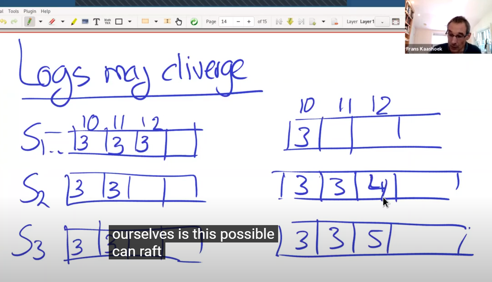
		-
- Fault Tolerance: Raft (2)
  collapsed:: true
	- 该讲的主要topic是什么？
	  id:: 64ad6e6a-9483-4a17-a10d-f84f2421d6c4
	  collapsed:: true
		- 
		-
	- 课程作业：
	  collapsed:: true
		- 当下图中第一个log对应的机器宕机了，那么abcdef中的哪些follower有可能成为leader？能成为leader的，哪些只能在一个特定场景下成为leader，哪些可以在多个场景下都可以成为leader呢？
		- 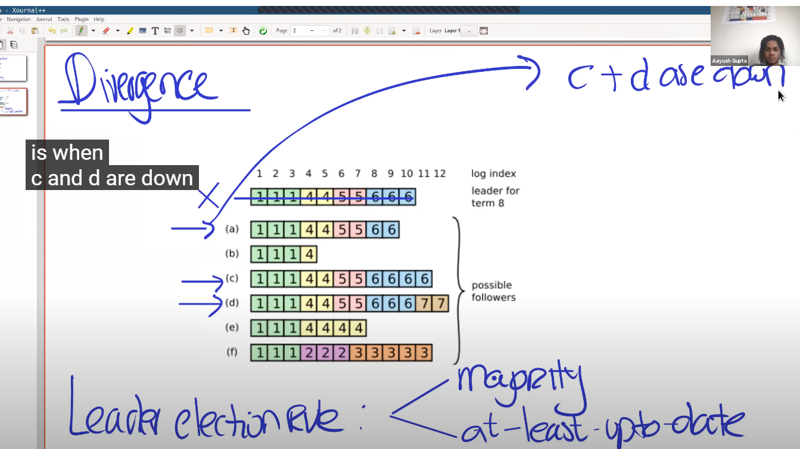
		- 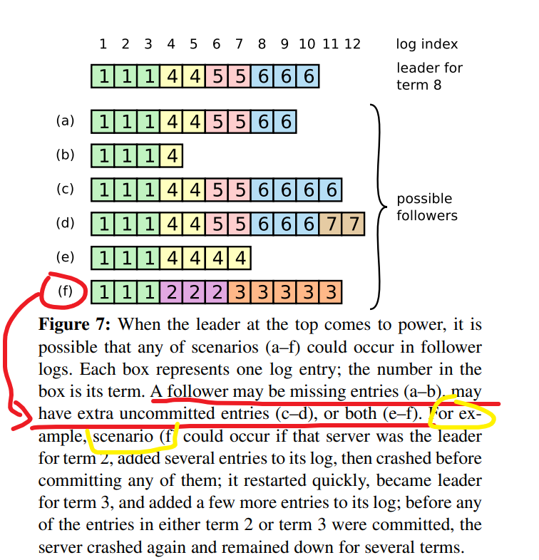
	- 课程作业解析：
	  collapsed:: true
		- a什么时候可以成为leader？
			- 当c和d都down 或者说offline， a可以收到bef三者的投票，满足majority的条件；此时f的log虽然最长，但却不是最新的（up-to-date），所以不会成为leader
		- 当c和d都是up（也就是reachable或者participate），a是否还有可能成为leader呢？
			- 这个问题也就是在说，如果a是candidate，c和d是否会投票给a呢？因为此时c or d or a 都可能获得majorities（bfe三个节点）的vote，如果a能够获得c或者d中的一个vote，那么 a 能够成为leader
			- c是完全可以投票给a的，并不会在投票规则上出现矛盾
			- 但是d不同，有一条投票规则是：如果一个follower has seen a higher term (也就是说 own  a higher term)， 那么 it will stop the process of leader election，a这个candidate就会退回（step down）到follower状态，那么此时d自己的term就一定是7吗？
				- 不一定，此处并没有一个whole picture，所以d的term并不一定是7， d有可能作为candidate进行了一轮leader election，term增加到8，但是并没有成为succeeded leader，此时 d 会告诉 a：“我的term是8，比你大，所以我不会给你投票” （重要结论是：raft中某个follower最后一个log entry的term并不一定等于该follower的term）
				- 即便d宕机了，因为必然有一个机器节点（比如说7）在term 7中获得了majority了，所以a 无论如何都不可能在 term 7中被elected，这句话对吗？
					- d中含有term为7的log entry，如果d为term 7的leader，那么说明d已经获得了majority，如果其他机器节点m为term 7的leader，那么d就是已经复制了来自m的term为7的log entry了，不管是哪种情况，term 7的选举已经进行过了，所以a 不会在term 7中进行选举
					-
			-
		- c 和 d 都可以成为leader
		  id:: 64d0a706-c4e1-4692-a428-562e13acd858
		-
	- log catchup：
	  collapsed:: true
		- 这个对齐的过程大概是怎么样的？
		  collapsed:: true
			- 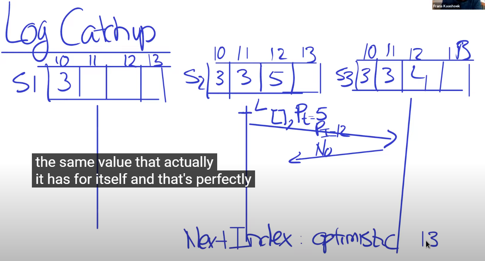
			- 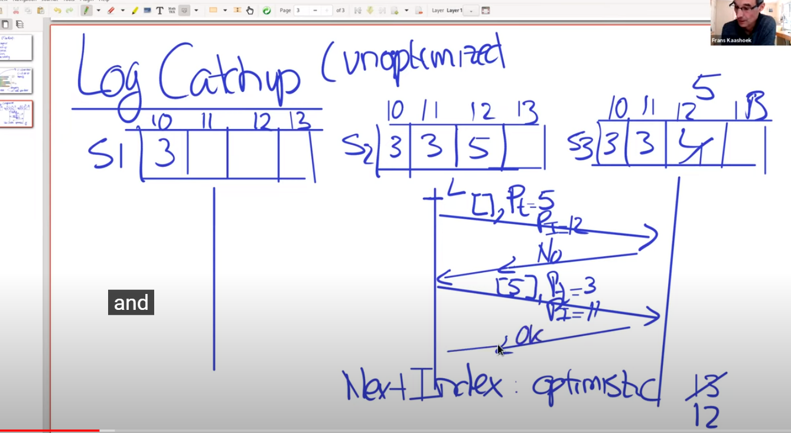
			- 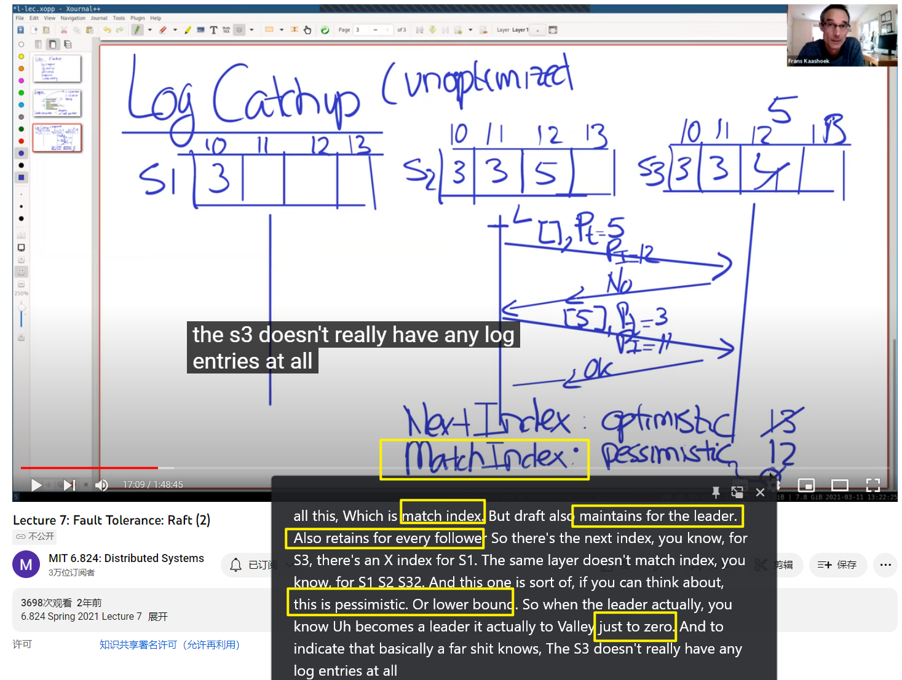
				- MatchIndex是一个pessimistic的low bound值，在leader和每个follower中都保存了
				- S2也就是leader的MatchIndex最先开始被设置为0，也就是认为S3没有任何log entry
				- 当S2发送给S3的append msg被成功返回Ok后，matchIndex被设置为13，也就是说S3这个follower的up-to-date的log entry的下一个index是13
				- 当S2发送第二轮的([5]，P（term）=3，P（index）= 11 ) 的append msg给S3时，S3匹配成功，返回给leader OK，此时S2就已经知道已经有两个节点复制了term 为 5 的这个log entry了，也就是majority了，那么就可以deliver to application了，但是这不是实际的case，close to true, but not completely true, 为什么呢？
					- 因为此时S2将某个人放入S3的log value给擦除了，这可能是dangerous的，所以存在一个corner case。当declare 一个message是commited时，需要特别小心
					- 将实用下图来说明擦除log的相关issue：
						- 
						  id:: 64d0a706-926c-49d4-a463-3f289b46302c
							- （a）log 1被everybody都commited了，然后S1或者S2在term 2成为了leader，它们中的leader追加了一个term 2的entry，但是并没有被commited，因为 可以很确定 it is not on the majority
							- （b）S5 与S1和S2中的leader disconnect了，所以并没有监听到 term 2 的leader的心跳，S5成为了term 3的leader并追加了一个term为3的log entry，这个entry很明显也没有commited，因为不是on the majority
							- (c)  S5 再次get disconnected，S1成为了term 4的leader，S1将term 2的这个entry给replicate到S3结点了，S1知道实际上这个entry已经有3份copy了，所以它可能deliver这个entry到应用，可是this is not true。关于commit有一些更subtle的reasoning需要去执行：You can commit after the leader has committed one entry in its own term，当前达到majority的entry的term为2，不等于当前leader所在的term 4，这个entry是来自以前的term的，所以 commit rule实际上不会允许commit two immediately to the surface。所以，在你的代码中，关于something是否可以被deliver到applied channel上，需要考虑这一点，需要进行考虑的原因如图de所阐述的那样。
								- c的情况，在正常的情况下是可能出现的，比如网络延迟了，在term 2的时候的appendentry当s1在term 4的时候 start了之后才到
								- c中如果term 2的appendentry先到达了S3  已经是majority了 然后term4的log entry到达了  这时term 4同样能commit term2的这个日志；
								  id:: 64d0a706-042c-41b8-9956-cd3ce92de041
								- c到d，就是S1的leader身份又过期了，重新选举，5成为了leader，此时任期是5或者更高
							- (e) 中当term 4的log entry被replicate到S2, S3之后，已经形成了一个majority，那么这个entry可以被commit，当它被commit之后，之前term内的entry节点就都可以被commit了
							- 为什么上图所示的擦除过程中，d中不是用count replicas的方式来使得term 2的log entry存活下来呢？
								- raft的设计者认为不如当前的方法更简单
								-
							-
					-
		- 为什么会需要有optimized version的对齐？
		  collapsed:: true
			- 如下图所示，可能会有S1这种远远落后于Leader的follower，这时候未被优化的对齐方法就需要进行反复多轮的S2->S1和S1->S2这样的通信，很明显成本昂贵
				- 
			- 什么时候会出现far behind leader的这种类型的follower呢？
				- 一个new machine加入了当前的cluster中
				- 一台机器crash了，并且在好几个term之后或者说在某一个date才成功恢复至online状态
			- 那要按照什么样的思路去进行优化呢？
				- nextIndex是一个optimistic的guess，也就是说它会认为follower有最大程度的log是与leader重合的，所以nextIndex是通过不断从后往前、依次单减1的方式来查找follower与leader中相同的log entry的最大下标位置，所以nextIndex并不需要如此的accurate
				- 在follower给leader返回的rejection中加入其他的info，这个info能够帮助leader更快地back off到准确的匹配位置：此处的info实际被设计为conflicting term 和 conflicting index这两个参数，只有当follower和leader产生冲突时才会发送这两个参数，下图图例中conflicting term为follower中index=5对应的term，与Pt = 6 不一致，conflicting index为follower中第一个term为5的log  entry的index，[[#red]]^^这两个参数能够说明从conflicting index到Pi这些位置的log entry的term都是conflicting term，也就是这些位置的entry必然都和leader不一致，所以leader对应这些位置的entry都要拷贝给follower^^；leader一次性发送给这些需要拷贝给follower的entry，也就是[6,6,6,6]，此时nextIndex = follower发送过来的conflicting index = 2, 所以previousIndex = 1, previos term = 4；再然后follower的index为1的term为4，和follower一致，于是返回okay
					- 
					- 
					- 
					-
				- 上述这种具体优化思路的本质改进在什么地方呢？
					- 原先未优化的版本中follower的catchup是以entry为单位来进行协商的，而优化后的版本中是以term为单位来进行协商的，而通常一个term会对应多个entry，所以能在follower的log entry中一次性排除掉连续term相同的不匹配的entry
					-
				- 上述具体优化思路中，如果要一次性发送的packet太大了，那么要怎么办？
					- 考虑一种alternative scheme，也就是leader将全部的log都发送给follower，而follower自动地从中fish out自己需要复制的entry，那么这种方法当packet是large时，就是problematic的，所以上述优化思路已经是针对这种情况进行了优化的：假设了每个follower的log基本上是非常接近的
					-
					-
					-
				- 为什么response中需要同时返回term和index？
					- 这取决于你是如何在leader上保存状态的，以及leader是如何决定去back off的
					-
				-
		- 当存在node crash了，reboot过程中需要怎么进行catchup呢？
		  collapsed:: true
			- 有两种策略：
				- 第一种是crashed的这个node当做new node来join进当前的cluster，这意味着cluster中的其他node会将up-to-date的log发送给当前node，然后进行replay以恢复状态，[[#red]]^^这个过程即便加入snapshot功能也是costly的^^
				- 第二种是从persistent storage中来直接恢复。前一种策略中crash前可能cluster已经运行了一年以上，这时候replay whole log就会比较expensive，而后一种策略由于保存了所有的state，所以reasonably可以很快地catchup
				- 
			- 那么为了应对reboot，哪些state需要是persistent呢？
				- voteFor:  每个follower在一个term只能给一个candidate投票，所以必须要进行记忆
				- log[] : log本身
					- 如果不将log写入disk，那么对于已经commited的entries可能会lose the majority，这些entries将无法在remaining的replicas上被deliver to the surface,  之后client就会看到strange  result: 首先看到这个操作happen了，过了一段时间后发现这个操作又没有happen (leader虽然commit并执行了这个entry，但是不会保存执行后的响应，这里说的不把log写入disk同时包括leader和disk，所以leader面对同样的appendentry时，不会记得自己已经处理过一模一样的entry了，所以认为这个操作是全新的[[存疑]])
					- 我们promise所有的log是被commit的，不能back out at this promise
				- current term: monotonic increasing
					- term被用来detect rpcs from stale leaders and candidates
				- 注：persistent也就是写入disk或者stable storage，而这是expensive的，所以容易成为bottleneck
				-
			- 什么时候 server会决定去persist呢？
				- 无论何时 voteFor、log、current term中的任何变量发生了改变，都需要将这个change给flush到disk，换句话说在lab中通过persistent module来实现
				- log中是每加入一个entry就开始写入disk还是说等log写满才写入?
					- 加入一个就开始写，log在磁盘中是一个文件，node中每次append一个entry，就把这个entry追加到文件中去
					-
	- service recovery的方法有哪些？
	  collapsed:: true
		- 有两类：
			- 
			- 第一种和reboot时catchup的第一种策略类似
			- 第二种periodic snapshot的方式能够以fast manner来重建service state，也能够compact the log。一个基本的观察是如果一个应用运行了一段时间，并且已经应用了first  a thousand或者first a million个基本操作 (全部的操作序列记作C)，那么那个point的state就包含了所有的这些ops。在state replication和log replay or replication之间存在一种duality (双重性或者二元性)，也就是说在执行C之后保存状态，和 逐个地reapply或者redo每个操作得到的结果是完全一样的。所以，这意味着一旦 你有一个snapshot，并且将snapshot以persistent state的方式稳定存储在disk上，就可以将log从C这个位置处cut off，这将允许你可以控制log的大小，这种控制主要通过periodically要求surface (接口）去拍摄SnapShot、并在之后让service通知raft library当前的snapshot拍摄成功来实现。
			-
		- 问题：
			- 第二种策略，是否违背了 raft本身和raft之上应用之间存在的某种抽象层？因为按照第二种策略，现在需要理解怎么将commands应用到state machine上，而不是像之前将commands分发到外部的state machine上（give commands to some external state machine）
			  collapsed:: true
				- 是的，可以看作是abstract violation，此时的raft library和service必须cooperate，这么做的原因是限制raft library不得不maintain的state的数量，否则raft将不知道什么时候去cut the log，除了service通知raft library外，没有其他方式可以让raft library知道该移除从0到哪个位置的log entry
				- 这个点与lab2D相关，lab2D是关于snapshots和log compaction的。在servers和raft之间必须有一些api能够使得它们collaborate。lab2B和lab2C中api非常简单，这些api仅仅是把log message给deliver到application channel上去，几乎没有从servers向raft流动的信息。论文中并没有lay out应该使用的API具体是什么
				- 在API中有一个conditional install的operation call，它的语义是允许你在one single operation中atomically地来改变raft state和service state，partly这个operation是用来限制抽象边界的
				-
				-
				-
				-
				-
				-
			- 在snapshot的过程raft和server进行交流时，是不可能repeat 的？
			  collapsed:: true
				- 对，snapshots是由surface来驱动的，所以surface会时不时地告知raft：我已经完成了一个snapshot，这是我的snapshot，且这个snapshot包括了所有从0到C的operations，然后raft会：写入snapshot，从i位置处truncate log， 将所有的这些info都写入disk中
				- 当一个follower crash后reboot，会从persistent disk中load snapshots，然后再重建应用的state（key value store）
				  id:: 64d0a706-92f9-4303-8fbb-d257f1bf2025
			- 当log被从i处cut时，剩下的log entry为 [i, n], 此时若有一个new node加入了system，那么这个new node必然没有log前面的一部分，同样也没有snapshot，那么后续该怎么做呢？
			  id:: 64d0a706-1261-4649-b66c-5902e3e6258d
				- 此时raft必须要把snapshot给communicate到follower，这是由leader来发送的。在lab2D中需要实现snapshot RPC or install snapshot RPC
				  id:: 64d0a706-a808-4ba5-857a-19ec09c5bfda
					- 
					  id:: 64d0a706-b58d-4586-92fa-c7206808c74b
					-
			- 什么时候不能install old snapshot呢？
			  collapsed:: true
				- 因为一个拥有more recent snapshot的server可能会回应客户端：yeah，你的operation成功了，然后如果你想要restore一个old snapshot，就会back out到那个状态，所以client就会看到old version的server，这显然不是legit （合法的），所以你应该果断reject old snapshots。当follower的log中存在一个log entry是beyond the snapshot的，那么必须得保持log中除了snapshot部分以外的remainder part，因为follower已经向leader承诺过已经接收了那个message，所以不能删除没有被snapshot cover的the rest of the log.
				-
			- snapshot是如何与state machine来communicate的？
				- 在lab3中it goes over the applied channel，所以state machine会通过applied channel来获取snapshot
				-
		-
	- Using Raft:
		- 一般是怎么使用raft的？
		  collapsed:: true
			- 使用raft来完成key value service：比如client C1向leader发送get请求（获取某个key对应的value），leader的service会首先发送start命令给raft，然后raft会与其他follower的raft进行chit chat，其他follower返回msg后，leader就准备commit本次的command，然后通过applied channel告知service 本次的command is ready to commit了，servcie然后就会execute the operation，最后把执行完的结果返回给客户端C1。整个过程的流程图如下：
			  collapsed:: true
				- 
				- 
				- 
				- 
				-
		- 有可能client发送RPC给leader，但是RPC在发送过程中可能会disappear，所以client需要resend这个RPC，但是此时cluster中的leader可能会发生改变，client需要redirect到此时的new leader处，那么对client有什么要求呢？
		  collapsed:: true
			- client处的代码需要能够理解replicated state machine，也就是它[[#green]]^^需要maintain一些信息^^，比如who is the leader,  who are the other followers, 所以在有必要的情况下可以在它们之间switch。
			- 之前我们曾经谈论过duplicated operation是possible的，client可能会send an operation并且把这些put operation to servers，client没有获得response，但是servers实际上都receive到了这些operation，且会遍历整个operation sequence然后启动raft append等raft的相关motion，最终把这个operation发送到applied channel。于是，client会发送second same operation，最终也会在applied channel中come out，所以你需要做一些duplicate detection。[[#green]]^^所以，除了位置leader和follower的信息，put和get操作实际上都有一个id，client需要维持它实际上trying to get through的last id，这个id是用来进行duplicate detection的。这部分的代码通常被称作Clerk，Clerk用于与service交互，做一些工作来与server来进行合作来get right things done，^^
				- 
			- 关于这些put和get operation，servers和clerk一起可以向client做出的gurantee是什么呢？
				- 这涉及到Correctness Criteria：一般我们说两台机器表现得像一台机器就行，但是这个表述还不够准确，比如当两个客户端同时执行put和get操作时，什么才算是correct outcome呢？所以需要一个preciser definition，论文中的term就是linearizability。linearizability就是关于在一个get put操作中什么值可以return的spec，一般来说get操作会return，而put操作不会return，这个规范规定了允许哪些可以被return，哪些不可以被return。
				  collapsed:: true
					- 
					- 
					-
					-
				- linearizability有哪些component？
					- 三个组成部分：
						- arrange all the operations in total order
							- 就是查看所有的operation sequence，其中一些operation是并发执行的，但是还是可以有一个total order
						- match real-time
							- 这意味着即便operations是在不同的机器上的，一个operation也必须在另外一个operation开始之前完成，也就是必须保证那个total order。这与single machine是一致的，一个operation接着一个operation
						- read operation should always return the results of the last write
							- 在这里，就是get操作应该观察最后一次put操作的结果
					- 决定一个system是否有linearizability的三个condition就是这三个组成部分
				- 一般要如何判断一个system是否有linearizability呢？
					- 一般是通过particular histories和particular executions来判断，看你是否能将那些history转换成total order，即便operations可能并发执行
					- 一个linearizable的案例：
					  collapsed:: true
						- 
						- 
						- 
						- 如何理解上图中的Wx1的含义？为啥这个写操作需要花费这么长的时间？
							- Wx1是指给x这个变量写入1这个值
							- 这个写操作的start point是：client将写的request发送给leader，end point是：leader返回response，中间发生的stuff包括：request被发送给servers，server发送给raft，raft运行，将operation发送到applied channel上
							- 实际上我们并不关心写操作内部的实现细节
						- 上图是说明一个怎样的场景呢?
							- C1、C2、C3这三台机器自由地并发运行，也就是自由issue concurrent operations
						- 请问上图是一个linearizable 的history / execution 吗？
							- 依据total order来判断这个outcome是不是legit的：正确的total order应该如下图一所示，先向X写入1，然后从X读出结果为1，然后再向X写入2，从X读出结果为2，一个operation必须在前面一个operation end之后才start；如红色箭头所示，后面一个操作必须在前面操作完成之后才能开始，所以当前的outcome是完全legit的
								- 
								- 
								- 
								- 
								-
					- 一个non-linearizable的案例：
					  collapsed:: true
						- 
						- 
						- 
						- 
						- {:height 366, :width 625}
						- 这里不可能construct一个能够match linearizability的total order。上图中Rx1发生在Rx2之后，这在一个真实的单台机器中是不可能发生的，因为这意味着在RX2和RX1之间value发生了改变，with few operations on the board,  这里没有办法在Wx1和Wx2之间slot Rx1，
						  collapsed:: true
							- {:height 387, :width 594}
					- 这个过程中考虑的是strong consistency吗？
					  collapsed:: true
						- Linearizability is a precise definition of what strong consistency is
						-
					- 论文作者是如何决定需要这个property的？
					  collapsed:: true
						- 如果你想要replicated machine behave like a single machine or an unreplicated machine, 只允许outcome是单个机器可以执行出的，那么linearizability是一个非常intuitive的definition。在数据库领域类似的term是serializability，linearizability和serializability的区别是后者不要match real time
						-
					- 当发生network partition时，比如leader完全与其他follower get partitioned，只有自己一个，之后timeout重新选举了一个leader，那么leader会意识到自己已经成为了stale leader吗？我在想，是否会有client与这个leader通信？这个client会做些什么呢？
					  collapsed:: true
						- leader不会commit any operation，也不就不会把任何operation给communicate给apply channel了，所以也就不会给client任何响应，client就会keep retrying，直到network heals或者client给another one of the followers发送请求并成功响应了（成功响应的这个node要么是new leader本身，要么就是new leader的一个follower），当前的client就会恢复正常。clerk会进行此种场景的处理
						- 所以leader不会里面告诉client“我已经get your request”或者leader会一直等待直到这个operation commit了吗？
							- 在raft中如果leader没有process the request，它是不会和client交流的
						-
					- 请再形象地解释一下clerk？
					  collapsed:: true
						- 功能一：
						  id:: 64d0a706-94ba-4c85-9638-a53501e5d8b5
							- clerk是client所link的一个stub或者一个little library，所以client 发起 puts and gets calls时，实际上clerk是client沟通的接口，clerk同时保存了一些who's leader and who's follower的信息，clerk存储的信息只是当前它认为是这样的，不一定是up-to-date和完全正确的
							- 当clerk里保存的当前leader是完全正确的，当client发送RPC消息给leader时，它就知道发送的机器就是当前的leader；而当clerk里面保持的leader有误时，接受到RPC消息的机器就会告诉client“我不是当前的leader，你应该发送给当前的leader XXX”，于是client就会转而发送RPC消息给XXX，同时clerk会更新关于当前leader的信息
						- 功能二：
							- clerk会给client发送的每个operation打上tag，也就是id，那么service就可以利用id来做duplicate detection了
						- 在lab2中并没有clerk，而是直接通过raft interface来交互，在lab3中才有
						-
						-
					- clients是如何产生unique ids？
						- 使用big random numbers
						- 但是为了使得其more guaranteed，就是 使用 ip address + big random numbers
		- 关于使用raft的其他问题：
			- 在论文P12中说，当存在conflict时，follower就会discard entire log，so I wonder why ？
			  collapsed:: true
				- uncommitted log entries could go back,  而不是state machine could go back.  换句话说, We can never bail out committed operations, can never bail out uncommitted operations
			- 怎么理解matchIndex？
			  collapsed:: true
				- 
				- 
					- 当返回ok时，也就是找到了catchup进行的位置并完成了catchup，也就是保证了“leader和follower在某个位置对齐”的条件，此时matchIndex = nextIndex + 1 = 13。这个过程的形象图示如下：[[#red]]^^这里在index = 11时S2和S3 match了，同时也意味着11位置以前的所有entry两者都是完全相同的，所以才可以直接更改matchIndex^^
						- 
							-
			- 关于在任何snapshot上的copy on write，真正被copy的是什么呢？copy的是page table吗？
			  collapsed:: true
				- snapshot可能是gigabyte的，所以直接copy是比较expensive
				- 拷贝和更新的确实是key value page table；当把一个key value store写入disk中时，如果你不进行一些巧妙的处理的话，那么你就无法再处理那些通过channels进入的any other get or put operations了，该课程的老师认为这篇paper所暗示的plan是：当需要make a checkpoint时，service调用fork () 命令，fork命令会对那个process进行一次copy，当进行这次copy的时候它只拷贝page table但是并不拷贝physical memory，也就是说这两个process共享一个shared physical memory，这个共享的物理内存里面存储的是key value store； 当child process开始运行，它就会开始make a checkpoint or snapshot,  也就是它会把key value store写入到disk中；与此同时并行进行的是parent process会继续处理new get or put operations，当它执行put operation时，它会向与key value store对应的page中写入，这会造成一个page fault，这时候os会有一个page fault，在那时就会copy that page，repair process就可以更新它，这一切都是对child process透明的，因为child process在整个地址空间在fork命令调用时会有一个一致的snapshot，这使得parent 和 child process能够同时并行地执行，并且有一个consistent的snapshot；
				  collapsed:: true
					- 
				- 用一句话来概括上段的内容就是：父进程和子进程共享一个存储有key value store的物理内存区域，子进程从该物理内存区域中不停地进行copy并写入到snapshot中，而父进程则不断处理新的put get操作，特别是把put操作的结果write到该物理内存，这个并发进行的在同一物理内存上的copy和write操作被称作copy and write
				-
				-
			- 假设我们一直在一个term上，在某个时刻一些node已经被disconnected了但是它们依旧处于同一个term，leader也处于同一个term，之后某个时刻会做一个snapshot并且所有的log都会被压缩，然后它们继续go forward，logs会被再次populated，比如说15个logs已经被添加了，在10这个位置压缩它们，它们又会重新在5这个index处，其他这些被disconnected的node此时重新join in，它们也会在index 5，且也是同一个term，这会是一个problem吗？因为它们好像在某种snapshot epoch上
			  collapsed:: true
				- 
					- 这里需要注意的是在10位置对log进行snapshot之后，比如S1所示，前面10个entry（假设这里包括10）都被snapshot过了，此时并不会重置index为1，而是会继续counting，后续都要带上这个offset 10来计算index
					- 所以，并不会出现你所描述的这种情况，也就是：S1和S2在index 5处有相同的term，但是是两个不同的entry，因为重置index是不被允许的
					-
					-
			- return immediately并不意味着reply，对吗？
				- 是的，return immediately只是return to the service 而不是client
				-
				-
- Zookeeper:
  collapsed:: true
	- 这节课主要讲什么？
		- 
			- 高性能指的是throughput比较高，也就是每秒能够执行的operations的数目
			- 高性能计算的两点原因，第二点强调其并不是strong consistency，而是一个instinct的一致性定义，会给你一些在任何replica上执行read操作的自由，因此reconform can scale
		- 
		-
		-
	- Zookeeper是一个replicated state machine吗？
	  collapsed:: true
		- 是的，如下图所示，客户端的请求被传送进zk service，然后zk将操作stick into the ZAB, ZAB可以看作是raft库的equivalent，被插入操作的这台机器与其他的peer node通过ZAB进行交流，每台机器也有log来处理operations，最后ZAB通过apply channel发送回operations，ZK service将operation response返回给客户端
			- 
		- 上图中ZAB部分可以类似于lab2，从某个high level的角度来说ZAB实现了与raft类似的功能和保障(guarantees)，尽管实现方式相当不同，它提供了一个an order of all the operations，尽管会存在failures、network partition等raft也会遇到的问题
		- lab3关注在raft等分布式库之上的一个service实现，这篇paper关注的是zookeeper能够提供的coordination service，在lab3中我们要实现的则是一个key value store:
			- key value store 对应的数据结构是map，对应get和put操作：
				- 
			- zookeeper的数据结构是z node组成的tree：
				- 
				-
		-
	- Zookeeper能够保证的high performance到底是什么样的？
	  collapsed:: true
		- 先假设最基础的场景如下图所示：没有失败。那么执行一次put操作至少需要1轮Leader和1个follower的通信来回、follower和Leader各自需要将log写入stable storage：前者通常需要1ms，这个时间估计并不重要；后者取决于具体的存储介质是什么，如果是SSD，一般写入一次需要2ms，这里的两次写入是synchronous（同步的），所以两次写入是4ms；总时间就是5ms。那么1s 就大概能够执行200次put操作了 （1000ms / 5ms = 200）
		  collapsed:: true
			- 
			- 
			-
		- 论文中使用throughput metric来进行衡量：
		  collapsed:: true
			- 
			- 从上图中可以得出的几点是：
				- n台机器的性能不是单台机器的n倍
				- 在写操作比较多时，三台机器比5、7、9等更多台机器组成的集群的性能反而要更好，这是因为当节点数目更多时，需要进行通信的机器更多
		- Zookeeper中对于操作进行了怎样的优化设计，以使得有更好的性能：
		  collapsed:: true
			- Asychronous Write
			  collapsed:: true
				- 允许多个客户端发送的请求被异步进行处理，也就是一个操作不必等上一个操作处理完成后才能开始处理；甚至可以把一系列的operations以一个batch的方式打包发送给leader，leader一次性地将所有的operations都写入disk中，而不是一个operation一个operation地写入
			- Read
				- 允许read操作被任何一个server所执行，而不是让leader来执行所有的操作，这里在individual follower上执行read时是不需要和leader进行通信的，目的是为了获得perfect scalability
				- 下面案例两次接连的get操作将会返回什么值呢？（两次get操作不一定是同一个individual follower，也就是说是随机的peer node）当集群中有3台机器或者5台机器时，结果有什么不同吗？
				  collapsed:: true
					- 
					- 
					- 
					- 无论是三台机器还是五台，当put操作将X从0修改为1时，第一次get操作可能会读到0，这是一个stale data；第二次get操作时即便在第一次get操作读取到1的情形下，也可能会读取到0，这时候就会感觉数据是back in time了。
					-
				- 从linearizability的角度来说，上面案例满足吗？
				  collapsed:: true
					- 
					- 
					- 两个都不被linearizability所allow
					-
				- 那么，我们怎么确保gets操作是operational和linearizable的呢？
				  collapsed:: true
					- 最简单的方式就是让leader来完成所有的read操作，这个过程中leader可能会发生变化，但是raft协议会保证即便在发生了network failures或者network splits的情况下所有的操作都能够以total order执行，这是因为log中的entry在raft中被保证按照一定的total order来执行的，replicated state machine本身就是通过维持每个replica中接受和应用operation时的total order的一致性来保证最终状态相同的。lab3中的所有requests都是synchronous的
						- 
					- 这个简单方式中是怎么保证linearizability的rule 2： match real time的呢？
						- 这是自动实现的，在一个操作完全地被完成后，会响应客户端，如果之后客户端想要start the operation，那么它一定会在leader的log中
					- 这种简单方式的downside是什么呢？
						- 在raft论文中针对read-only operations有一个optimization，但是这个optimization也会要求一些communication
						- 使用这种简单直接的方式，那么此时read operations的执行性能不会与服务器的数量有关了，因为此时所有的读操作都要经过leader
				- 那么，zookeeper是怎么在违背linearizability的情况下实现high performance呢？
					- zookeeper其本身就没有实现linearizability， 修改了correctness definition，也就是：它也不会表现得像a single machine，也就会出现单机永远不会出现的结果。
					- 它提供的功能是：
						- linearizable write
							- 注意这并不是说write操作也像linearizable read那样是以total order方式来执行的，但是linearizable write和read是相关的
							- 在论文中linearizable write并没有给出清晰的描述，只能按照自己的理解有一个rough guess：
								- client想要使用Zookeeper Service就要与zookeeper之间建立一个session （课程老师说的是差不多也就是前面提到的clerk需要实现的功能），client在与leader交互的过程中会用到一些session info；老师说zk service提供的写入和raft的策略基本上是一样的，当leader将来自client的写请求接受后，就会commit一个entry到log中，然后返回一个Zxid给client，也就是说the id of last write;
									- 
								- 当client后面想要发起一个read请求时，为了保持高性能不会通过leader来处理，而是通过one of the followers,  将这个处理read请求的follower记作A，A的log中可能已经有前面write请求的entry了，但是也可能没有，也就是A不在前面write请求对应的大多数follower中时会这样，在这里我们假设是没有这个entry；当A接受到这个read请求时，很明显它里面的log是lag behind的，A 不会例句response to client，而是一直等待自己的log中有这个Zxid了
									- {:height 312, :width 503}
									- 
								- 如果此时另外一个client发送了又一次的write请求，对一个没有记录到第二次该write请求但是记录了第一次write请求的follower来说，此时若client发送携带有zxid的read请求，那么它会立即response，只是它没有获得其他客户端写入其他follower的最新writes的entry，所以会返回stale data
									- 
									-
								- 其他需要注意的问题：
									- 在论文里面写到write操作不完全是go to leader的，也会go to one follower的，这不是说明write不完全是由leader来处理的吗？
										- 不是，发送给follower的write，还会被redirect给leader来进程处理
									- 为什么read请求不会固定于某一个follower呢？
										- 一方面有些follower会出现network partition或者network failure，为了保持快速响应，所以需要及时切换到其他follower来处理；另一方面zookeeper为了保证read请求的负载均衡 load balancing, 会自动进行这样的切换
									- 前面图示中的要等待zxid被当前的follower看见，这具体是什么意思呢？是说这个zxid对应的entry必须在当前follower上被commit吗？
										- 是的，必须被commit，这是因为此时客户端要能够发送这个zxid的话，客户端必须从leader中获得包含这个zxid的response，而leader只有对客户端发送的write请求commit之后才会返回zxid
						- all the asynchronous operations from clients are in the FIFO order (客户端是随机发送，不会等待操作的完成就会发送下一个操作，FIFO由zookeeper本身来控制)
							- 与此对应的是此时的write操作也是FIFO order
							- read操作是read the last write from the same client，但是对于来自其他client的write操作zookeeper并不能保证当前客户端能够读到那个客户端最新写入的结果，能够保证的是能够读到prefix of the log （也就是当前client会落后一部分其他客户端的写操作，所以也就是会读到stale data）
							- No reads from the past: 意思是假设第一次read时的prefix是P1，那么后面第二次read时很有可能还是P1，或者是P1 plus more，而不可能是P1前面的某个位置，也就是不能够read backwards:  下图中就是先读取了1，那么第二个不可能读取到0
								- 
							-
							-
	- 在使用linearizability时，编程会很容易，那么zookeeper在违背linearizability时要使用什么样的programming model呢？
	  collapsed:: true
		- just ignore the sync operation in the program，尽管可以像之前针对read那样，通过issue a sync来使得每个操作变得linearizable，但是这会使得程序变慢，我们将无法获得我们的performance advantage,
		- 我们会使用 a couple of operations，以ready file的case来说明：
		  collapsed:: true
			- CASE 1：
			  collapsed:: true
				- 图示：
					- 
					- 
					- 
				- Write Order：
					- cluster中的某个机器变成new leader，此时它需要写入一些新的configuration information （比如谁是集群的leader，谁是follower），先使用del命令来删除原来的ready file，再write f1，f2（f1, f2是一些配置文件），最后使用create命令来创建这个ready file；
				- Read Order:
					- exists命令的含义是如果ready file存在，那么就立即返回true
					- 假设之前有一个client执行了在f1上的write操作op1，也就是第二张图中箭头所指的当前leader的Write Order之前的某个位置（也就是说f1这个配置文件除了切换到new leader时会被修改，也会被客户段的请求所修改），那么如果这时候有第二个client请求在f1上的read操作的话，那么会读取到op1的结果吗？
						- 不会，不管op1具体写入了什么，第二个client都不会读取到，client只会读取到the last of the write, 也就是当前leader的write order中write f1后的结果
						- 实际上exists本身是一个read命令，是读取zxid是否存在，所以exists("ready")返回成功，也就说明了create ("ready")这个命令对应的write操作执行成功；如果exists返回成功，也就说明了它看见了create命令之前的write f1, f2操作也执行成功，因为所有的write是linearizable的，所以read f1返回的必然是write f1之后的结果，这带来的好处是：当出现了一个new leader更新了配置信息后，follower能够马上读取到最新的配置信息
				- 这整个过程都是被仔细设计的，所以就configuration service 来说，完全是work out的
			- CASE 2:
			  collapsed:: true
				- 图示：
					- 
					- 
				- 分析说明：
					- reader在read f1和read f2之间由于机器本身原因出现了某种延迟，read f1操作开始与new leader的del("ready“) 操作之前，所以读取的f1的值来自old configuration，而read f2在new leader完成create("ready”）之后，所以读取的f2的值来自new configuration。很明显，这是messed up的，是一个糟糕的结果
					- zookeeper是怎么解决整个问题的呢？
						- 使用watch来解决，watch表示关注一个文件，并且在文件发生改变时会被通知。下图中，delete("ready")执行时会发送notification，而且这个notification会在这个命令之后的write操作之前给deliver（rule of notification) 。在这个case中，也就是说notification会在write f1操作执行前被发送，那么这个notification是在reader的read f2之前还是之后呢？如果是在read f2之后执行，那么read f1和read f2的结果都来自old configuration；如果在read f1之后执行，那么你需要做的就是在notification发出后，对reader上的read操作进行restart，start it over.
							- 
							- 
							- 
							- 
							-
						- notification rule的wording是什么呢？
							- notification几乎就像是一个write operation，是由follower来实现的；当改变由del触发时，notification会被发送给client，并携带zxid。教授在这里说notification像write operation的意思并不是说它可以像write operation那样被直接applied到某个变量上去，而是说watch是local的，当local watch发生时必然是某个变量相关的write操作执行了，这个变量相关的任何write操作都会被observe到，或者说watch和zxid一起被propogate给客户端，并且确保它们被执行了。
							- 其实论文中关于notification的具体实现比较模糊，但是你可以想象不同的场景，但是notification rule是可以被保证的
							-
							-
			-
		- 从这两个CASE中，我们能够收获的是：
		  collapsed:: true
			- 尽管人们喜欢linearizability的一个原因是，整个性能表现会更intuitive，会使得集群表现得像一个单机，且编程更容易，但是如果要保证fault tolerance和scalability，它能难保持good performance。一个获得good performance的方式，就是compromise the consistency guarantee,  在这里就是compromise linearizability, and provide some other   consistency guarantee，很明显这会complicate user experience or programmer experience，but it is doable
			-
			-
			-
			-
		- 关于这个programming model中与coordination service相关的部分，有哪些细节呢？
			- coordination service可以用VM-FT中test-and-set operation为例来进行说明，它的作用是：两个客户端会run test但是只有一个会赢，赢的那个会conclude到自己将是primary：
			  collapsed:: true
				- 
				-
			- lab3中test-and-set操作的一个简单实现：但是当put和get之间没有提供atomicity时，两个put操作都会执行成功，后面get时就会得到两个leader了，这说明这个简单实现是不足够的
			  collapsed:: true
				- 
				- 
				-
			- Zookeeper需要解决的两个问题是：
			  collapsed:: true
				- 怎么保证put和get操作的atomicity呢？
				- 如何进行CPU design来使得应用能够知道一些node宕机了，也就是go down了？
				-
			- Zookeeper进行的设计：
				- 三类node：第一类是有fault tolerance和replicated state machine那种regular machine；第二类是empheral，是说node会自动消失 （with that machine three goes away),  也就说出现了network partition，没有heartbeats来自machine three了，但是zookeeper在某个时刻决定那个session已经是gone了，所以zookeeper就会自动删除那个node了；第三类是sequential node, 这些node在名字中关联了它们的版本号，一个一个地创建，在z node下每个children的name中都有一个sequence number，现在nodes是按照sequence number来进行排序的，下图中创建一个new node时sequence number会增加
				  collapsed:: true
					- 
						- app one对应一个Z Node
					-
				- Z node API：
				  collapsed:: true
					- 
						- P是Path
					- 
						- V # 代表的是版本号
						-
				- 为什么version number是handy的？
				  id:: 64d0a734-57b6-4e01-9774-71ff7ac30109
					- 以下面的counter实现的小例子来进行说明：如果setData中的version number和getData中的version number还是一致的话，那么自增实际上发生了，否则没有发生，这样是为了protect against什么呢？这防止你interleave get and set
					  collapsed:: true
						- 
						-
					- 怎么理解阻止 set操作 和 get操作 interleave？
						- 
						- 
						- 以图1为例，两个客户端都请求将VersionNumber = 0的X=0修改为1，因为write操作是linearizable的，也就是两个setData操作会以一定的total order而先后执行，那么那个先执行的那个setData，会发现版本号0和X=0的版本号match，于是执行成功返回true，但是后执行的那个setData，此时node的版本号已经从0自增为1了，于是会与X=0的版本号不match，于是第二个node上的setData就没有执行成功，会重试。最终x的结果会是2，而不是1.
						- 这是一种lock-free programming，不过是使用versioning的方式来实现的。那么这种方式的效率和lock方向相比如何呢？因为看上去这种方式需要不停地retry直到成功，这个实际上和test-and-set操作有类似的性质，test-and-set操作失败了就需要不断地重试，在lock-free programming中经常是有这种loop的，所以会有很多的contention，如果没有contention，就不会retry了。实际上，这些lock-free算法在怎么做back off方面非常小心，所以它们并不是真地需要马上就进行retry，因为存在backup plan。所以，这种versioning的方式相比于lock方式有什么优势吗？此处是一个比较简单的例子，是implicit lock，如果你使用zookeeper的API来实现lock的话，且如果你do the stupid lock( 也就是lock使用不当），你同样会有contention issue，当然那儿存在一种smarter way without the hurting。在这里强调的是，使用这些primitive可以进行lock-free programming。
	- 对这节课的简单总结是什么？
	  collapsed:: true
		- 
			- 使用weaker consistency这种trick，将能够导致high performace，以及在出现network partition时能够继续运行
			-
- Chain Replication:
  collapsed:: true
	- 这节课大概讲些什么呢？
	  collapsed:: true
		- 
			- defer返回的结果是在function return之前的那个点执行，而不是在basic block return之前的那个点
		- 
			- 继续补充zookeeper logs的知识
	- Zookeeper的场景回顾 以及 zookeeper lock相关的内容 有哪些呢？
	  collapsed:: true
		- 
			- 上图中的圆圈代表的是Zookeeper Service, 使用tree结构来存储state；client向zookeeper service发送create命令，operation先进入service，service将使用底层的replication library ZAB，ZAB使得operation在不同的server之间进行通信，最后zookeeper service apply this operation并把结果返回给client
			- Zookeeper允许每个服务器或者说peer接受read请求，这使得集群的读性能可以随着服务器数量的增加而提高，但是这种思路的flip side就是它放弃了linearizablitity。在raft中无法让每个服务器都执行read的原因是，不是每个服务器都见到了最新的更新操作，比如9个机器组成的集群，可能只有5/9 见到了最新的写操作；在zookeeper中也会面临同样的问题，这通过改变correctness guarantee来解决，这个correctness guarantee对于 “写 关注于configuration或者coordination的set of programs”来说是非常有用的; zookeeper is really intended for the master or coordinator rule, 它提供了一系列的primitive来使得这个目的doable，主要涉及atomic increment和lock两个方面，上一节课主要讲述了atomic increment相关的内容，这一节主要讨论lock相关
		- 
			- 第一个关于lock的是acquire operation：上图中的while块给出了对应的伪代码。首先，创建名为“lf”的log file，并将ephemeral设置为true，如果创建成功并且成功获得了log，那么就会退出for loop；如果没有创建文件的话，那么就判断exits( "fl", watch),  其中的watch被设置为true，很显然我们必然知道这里的“fl”文件是不被当前进程所创建成功的（其他的某一个进程率先创建了“fl”文件，当其他的这个进程创建完成后，当前进程的exits判断就为true），这里主要是为了设置watch，当file actually disappear时watch将会go off，client会收到一个关于file disappear的notification，所以我们在这里需要做的就只是等待notification
			- 第二个关于lock的是release operation：只需要向zookeeper service发送一个delete “lf”这个log file的operation。当这个删除的operation被发送给zookeeper service之后，会使得所有的文件都go away，会fire  the watch, 会使得所有的客户端都等待通知，一旦得到通知，它们就会进行重试，其中的一个客户端会重试成功，我们将会获得log file或者创建log file, 而其他的客户端将会call exists并且将会等待notification
				- 
			- Zookeeper的semantic是足够good的，体现在：linearizability for write operations + rules when notifications go off.  这实际上实现了一个faithful的lock，因为当有很多的客户端同时尝试去获得lock时，只有一个客户端将会获得这把lock，而当lock的release完成后，或者当文件被删除后，下一轮中只有一个客户端将会获得这把lock，所以build this foundational primitives and use these primitives that zookeeper offers是有趣的，
			- 除了这里的watch的角色，另一个重要的角色是：ephemeral
				- 当客户端cause release之前就crash或者fail了，会发生什么呢？ephemeral files的semantic是：如果zookeeper service已经decide到客户端已经crash了，那么它会执行这个操作，它会代表客户端来remove这个文件，所以即便客户端crash或者fail，zookeeper server decides that at some point the client is done,  那么我们就会移除当前名为“rf”的log file，这会造成notifications将会被发送给其他正在等待的客户端。所以，它是以powerful abstraction来build的primitives，这将在应用中非常有用
			- 这种实现的downside有哪些呢？
				- 其中一个被称作“herding effect”：假设你有1000个客户端想去grab the log file 或者 make the log file acquire lock，其中只有一个会成功，其余的999都会去call exists并且等待notification，那么当一个客户端release the file lock或者delete the file，999个客户端会进行重试来获得这把lock，当然只有一个会成功，剩下的998个客户端将会继续重试；每一轮的file disappearance将会造成huge traffic，也就是会bombard zookeeper service，所以这是一个undesirable property。
				- 这是一个很实际的问题，不管是在小型的多核机器上，还是在当前的这样一种网络消息不是free的设定下。但是，Zookeeper提供的primitive可以使得你构建一个不需要suffer from herding effect的lock：
					- 
						- 为什么这个lock会更好呢？
							- 之前没有得到lock的所有客户端都需要重试，但是这里这些客户端形成了一个line，可以get the log one by one。
							- 该lock与之前的lock在很多方面有区别，可以参考伪代码中使用primitive进行的实现：
								- create中增加了一个sequential的flag，这意味着在创建文件时，文件的名称包含了顺序的序号，比如第一个文件是lock-0，下一个文件就是lock-1；create命令返回的结果n代表已经创建的文件数量，比如创建lock-0文件的客户端会返回0，创建lock-1文件的客户端会返回1
									- 
								- getChildren返回的是创建文件的目录下的所有文件，在这里也就是会返回1000个file或者1000个Znode
								- 如果n是C中的lowest node，那么意味我们get the lock，比如第一行代码我们返回了0，那么当前客户端是第一个创建lock文件的，那么后续的其他客户端将会创建lock-1、lock-2、lock-3、lock-4等，那么0必然是C中的lowest Znode，所以lock-0首先获得lock；如果不是，那么得不到lock，那么首先找到C中排序刚好在n之前的Znode p，然后put watch on p， 比如当前是创建lock-10文件的客户端，那么n = 10，对应的p就是lock-9的Znode，这也就是说每个客户端都会在previous session上have a watch
								- 所以，这些lock形成了一个line，当log-i的lock被释放时，那么log-(i+1)文件对应的客户端将会唯一地得到这个lock
								- zookeeper是怎么判断出客户端已经failed然后因此释放了ephemeral lock呢？
									- client和zookeeper service之间存在一个session，zookeeper service和client之间会相互发送heartbeats。如果zookeeper service有一段时间没有监听到来自客户端的heartbeat时，那么它就会决定客户端宕机了，就会关闭掉当前的session；客户端可能会尝试给session发送消息，但是session关闭了，所以消息会丢失，任何在那个session之间创建的file都会被删除；当network reconvene或者reveal后，客户端会给那个session重新发送消息，zookeeper servers会说“这些session已经不再存在了，你得重试或者重新启动一个new session”
								-
							- 这种特殊类型的lock在multi-core programming中被叫做ticket locks，zookeeper提供的primitive足够powerful，使得我们能够构建这样的lock
						- 需要注意的是zookeeper lock和go locks or mutexes具有完全不同的语义，它们不如go locks那样strong，是吗？
							- 是的，当lock holder fail了，那么zookeeper能够决定lock holder确实已经真的fail了，那么我们有可能会看到一些intermediate state。locks的whole rule是关于某个critical session，一些不变量（invariant）为true，当当前进程 go through the  critical session时，那个invariant可能不为true，但是在最后会重建invariants，在这里的情况像是，一个客户端要求lock、does some steps，然后zookeeper会决定：客户端决定要decline the crash and basically revokes lock，系统可能会处于某些intermediate state中，因为那个invariant的return值（return on that invariant）不是true，所以“这些lock files保证critical section的atomicity”并不是真实情况 [[存疑]]
						- 那么，zookeeper locks在哪些场景（use cases）下是有用的呢？
							- leader election：
								- 所有的客户端都想要创建lock file，其中只有一个客户端会成功，成功的那个客户端会成为leader，这个leader在必要时会clean up所有的intermediate state，或者使用ready trick来进行atomic updates （对特定文件进行一系列的写入，但是只在very end来暴露这个文件，这会使得一系列的写入操作变得更加transactional）
							- soft locks：
								- 我们有一个map reduce style中的worker，我们想要使得每个worker执行特定的map task只执行一次，一种完成此类“arrangement”任务的方式是针对那个特定的文件 take the lock out， run the computation，然后一旦mapper完成，就去release log files;  so this will cost one mapper in the common case to execute the particular task
								- 如果在这个过程中mapper fail了，lock将会被release，我们再次执行它，因为someone else将会获得这把锁。在mapreduce的case中重复执行两次任务是可以的，尽管在通常情况下性能优化要求任务尽可能只被执行一次。
								- 这里的“soft locks”说的就是一个operation可以发生两次，在通常情况没有任何crash的情况下，客户端会take the lock out and do the operation，再然后会释放lock，但是如果客户端halfway crash，那么lock将会被zookeeper自动释放，经过一段时间后客户端将会重新执行一样的map task
							- 问题：
								- 如果持有lock的server dies，那么这个lock可以被revoke，在伪代码中如果不传入ephemeral这个flag，那么这种情况是否会发生呢？如果我们不传入这个ephemeral的flag，那么我们是否可以emulate the go locks ?
									- 当没有这个ephemeral时，你创建了一个persistent file，然后客户端dies，所以这个lock会持续存在，没人可以release它，这样就会造成一个deadlock，因为能够释放这个lock的机器已经dead或者crashed了
									- 可是，不是任何一个能够删除对应的log file的机器都可以被看作是能够释放这个lock吗，比如一个背景进程？如果是那样的，会break其他客户端正在运行的进程，因为其他客户端也会认为自己有相对应的一把lock
									-
								- 关于这里的leader election，可以被暴露的中间状态是什么？（intermediate state that could get exposed）
									- Pure leader election将不会产生任何中间状态，但是通常会创建一个configuration file，正如我们在zookeeper中使用ready trick可以看见的
									- 也就是写入whole file然后将它原子性地进行转换 （convert it atomically as we name it）
									-
							-
	- Chain Replication:
	  collapsed:: true
		- 构建RSM (Replicated State Machine) 的方法有哪两种呢？
		  collapsed:: true
			- Run all operations using raft or Paxos or any other distributed consensus algorithm
				- lab3 use this way
				- 使用raft来运行所有操作 并不是最标准或者常见的
			- Configuration service
				- 配置服务实际上扮演的是coordinator或者master的角色（像gfs master）
				- 配置服务可能内部会使用raft paxos zap等算法，这些配置服务的实现还需要运行primary / backup replication （GFS是一个master，实际上决定了which set of servers hold the trunk， 决定了chunk的replica group，replicated chunk group执行primary/backup replication，chunk中的一个是primary，其他是backups，在primary/backup replication中有对应的protocol）
				- 这种方法比第一种更为常见
				-
		- 当key value server要存储的状态达到terabytes数量级，潜在的risk和问题是什么呢？
		  collapsed:: true
			- 我们将不得不flush the log very often。checkpoint的size是和key value server的size线性相关的，所以当key value server is gigantic，那么checkpoint的size也会是巨大的，如果任何时候checkpoint将要被发送的话，那么这个检查点文件也会过大了
			- 在lab2D中new primary需要将snapshot发送给其他的servers，第一种方法会使得snapshot过大。第二种方法中configuration server将会管理更少的state，而primary / backup replication将能够复制大量的数据
			- 第一种方法中everything is in single component，所以更为简单方便
			-
		- Chain Replication是用来解决什么问题的？
		  collapsed:: true
			- 是用于方法2的primary / backup replication scheme，也就是说chain replication首先就assume了那儿存在一个configuration server，在论文中这被称作master processing
			-
		- Chain Replication 有哪些properties呢？
		  collapsed:: true
			- Read / query operations only involve one server
			- A simple recovery plan
			- Linearizability （Strong Property）
			- Influential System Design
			-
		- Chain Replication的过程是怎么样的？
		  collapsed:: true
			- 
				- tail对应的server专门负责将acknowledgement发送会客户端
			- 
				- 当tail 将操作或者说消息应用到state change时，可以被看作是commit point
				- 可以被看作是commit point的原因是什么呢？
					- 因为后续的所有读请求(subsequent reads) 总是来自tail， 也就是说如果有其他人或者其他客户端要执行一个read操作，这个操作总是go to tail，并且操作会很快返回给这个“其他客户端”
						- 
					- 因为在这一点，write操作对于readers来说是visible的，但是在任何其他点之前都是不可见的
		- Chain Replication整个过程中需要仔细理解的地方有哪些呢？
		  collapsed:: true
			- read operation只包含一个server
				- 在lab3中我们的实现中，read operation需要经过raft、log和所有其他类似的stuff，论文中讨论了optimization，但是read操作总是先走向leader，leader在局部执行操作之前必须先联系服务器中的majority，所以可以知道read操作需要经过的servers是与写操作完全不同的，read and write workload实际上被分散在至少两个servers上
				- 这里的read operation只需要go to tail，不需要与其他的server进行交流，所以能够立即返回结果
			- 在no crash的情形下，很容易判定这个scheme能够保证linearizability
				- 因为所有的write操作在head处都是以一种total order的方式被应用的
				- 当tail接收到那些write操作的update，在commit point它想给客户端发送响应，将request发送回去，此时同一个客户端里面发送了一个read操作，这个read操作将会被发到tail，它将会观察到最新的改变（last change）
				- 所以，winthin a single client, 所有的操作都是totally ordered，任何在client 1写操作之后的其他客户端的读操作都将能读取到lastest data
				- 所以，很容易获得intuition，这是能够保证linearizability的
			- 让head在接受到write operation后就马上返回结果给客户端，而不是让tail来返回结果，这是否会出错，或者是否仍然能够保持great linearizability呢？
				- 这将会break linearizability，这个protocol change会沿着s1、s2、s3不断地传递下去（keep propagating），当head也就是s1接受了write请求，然后把结果立马返回给客户端，然后客户端又向s3发送一个read请求，但是此时第一次的write请求还没有从s1传递到s3，所以此时s3只能返回给客户端之前的数据，而不是最新数据
				- tail将acknowledgement发送回给客户端之所以重要，是因为一旦tail处理完write操作之后，这实际上就是commit point
				- 以上讨论的都是没有failure的normal scenario
		- 当出现crash时，Chain Replication要怎么进行处理呢？
		  collapsed:: true
			- 需要分三种具体的case来处理，分别是head crash，head和tail中的某台机器crash，tail crash，如下图所示（u1, u2, u3是三种操作）：
				- 
			- 当head crash了，要怎么办呢？
				- 配置服务器将会发现head crash，那么只需要cut off当前的head，然后将s2提升为head，后续客户端发送的请求将通过s2来进行处理
				- 这是最easy的场景，此时原先的head s1将会丢失u3这个操作，但是u3这个操作并没有被commit，这是因为操作都在tail处被commit，所以这是一个fair game，客户端就相当于从来没有观察到u3操作发生过了（这里面的一个假设是操作在这个chain中传递时是按照FIFO的顺序进行的，这可能是通过tcp connection来实现的）
				- 为什么这里需要configuration server来决定s2成为new head，而不是s2自己来决定自己将要成为head呢？后面这种方式会是valid的吗？
					- 因为如果让s2来决定，可能会造成split brain现象：因为此时s2可能是与s1出现了网络分区而无法联系到s1，而不是s1宕机了，那么此时将会有两个head s1和s2同时处理command，这会违背having a total order这个属性
					-
			- 当中间的一台服务器crash了，要怎么办呢？
				- 
				- 
				- s1必须要使得s3 up-to-date，因为s1发送给s2的operations会随着s2的crash而无法发送给s3，在这里s1需要发送给s3 u2和u3这两个操作
				-
			- 当tail  crash了，要怎么办呢？
				- 
				- 
				- 客户端需要从configuration server那里知道s2成为了新的tail，除此之外无需做什么事，因为没有commited operations丢失
				- 当s2成为了tail，我们不需要向客户端发送acknowledgement来说明那些已经被自动commit的entries吗？就比如这里s3中的u1已经被commited，我们不需要把这个信息告诉给客户端吗，因为此时成为new tail的s2是不知道这个信息的，不是吗？
					- 这个问题是存在的，但是解决方法还可以像lab3中那样：客户端将会对u1操作进行重试，然后会有一个duplication detection scheme来进行检测
					- 论文中没有明确指出应该选择哪一种
					-
			- 与raft论文的图7 图8相比，这个case要简单得多，一方面是因为这里所有的operations等各种操作都是沿着replication chain来push down的，另一方面是这里的configuration part被外包给了outsource manager，而关于recovery plan的primary backup part，it is reasonable straightforward
			-
			-
			-
			-
		- 如何在复制链中增加一个new replica呢？
		  collapsed:: true
			- 
			- 
				- 第一步是将所有的state从s2拷贝到s3，如果数据量为GB或者TB，可能会花费多个小时
				- 第二步是记录一个列表，保存所有在s3到来之后已经发送但是还没有传送到S3的updates
			- 
				- 一旦S2到S3的状态拷贝完毕，S3会发送消息告诉S2“man， I am ready for becoming the new tail”， S2会回复说：“可以，但是once you apply all the updates”,  S3将会应用所有的后续更新，然后成为new tail，之后任何直接跟S2交流的客户端将会收到S2的消息：“我不再是tail，你需要跟新的tail S3来进行通信”
				- 这个过程中会出现infinite loop吗？当s2发送updates给s3，s3正在更新的同时也在服务更多的请求，所以需要有更多的请求需要被send back and forth
					- 不对，在S3处理完 所有拷贝 + 拷贝过程中s2中接受的request之后，才能接受从new requests
					-
					-
					-
					-
				-
		- Chain Replication的properties和raft的对比？
			- CR 实现了primary / backup schema 但是没有实现 configuration service
			- chain replication的positive aspect：
				- 客户端的RPC请求被split到head和tail之间，而不是像raft中那样所有的请求都要run through the leader
				- head只发送updates一次，而在raft当中leader将updates也就是log entries发送给每个peer。正是因为在CR schema中只用发送一次RPC，所以会包含更少的message
				- Read or query operations involve only the tail，而在raft中即便实现了read-only optimization，也就是避免让读操作go through the log, 避免其被追加到所有出现的log中，但是它仍然要求leader联系大多数的peer来帮助确定是否这个operation可以被serve
				  collapsed:: true
					- 这里的问题是，leader不是已经包含了所有被commited的entries吗？为什么leader还需要联系其他的peer来确定呢？[[存疑]]
						- 课程的老师说两种scheme下，一种是在leader上进行的所有recent write操作，另外一种是可能原则上可以有来自其他peer的read操作，都需要确保我们有last operation；所以如果要求是我们想把reads分散到所有的机器上，我们不得不更小心，我们不能由自己来实现，因为这样绝对会破坏linearizability，而当everything goes to leader，则不会；可以说，这是在每个new term时默认的empty agreement，我们不得不确保所有的是最新的，算是一个golden trick
						- 和MIT群里讨论的一个结果是：当leader和其他服务器出现了网络分区之后，会选举出一个new leader，因为分区的存在这个new leader也无法通知old leader它已经不再是leader了，所以old leader如果此时接受到了read请求，它必须联系peer来确认它还是不是leader，如果它不是leader了，new leader可能已经执行了很多新的写入操作，那么此时old leader返回的结果就不算最新的了
				- Simple Recovery Plan
			- chain replication 的 negative aspect：
			  collapsed:: true
				- one failure requires reconfiguration
					- 之所以需要进行重新配置，是因为write操作不得不go through the whole chain，并且只有当chain中的每个server都处理了这个操作之后才能被acknowledge，这意味着在CR scheme中一旦出现了一台服务器crash，那么可能会有一个短暂的宕机时段( short period of downtime) ；而在raft中只要peer servers中的大多数接受了这个特定的write操作且追加到它们的日志中，那么system就可以proceed，所以如果其中的一台服务器fail了，不一定会造成系统的中断(interruption), 只要remaining servers仍然可以形成大多数
					-
					-
					-
			- chain replication 的positive aspect有可以被进一步优化的吗？
			  collapsed:: true
				- 有，因为CR中read操作只涉及到tail这一台服务器，可以拓展来实现high performance：
					- 
						- 论文中把objects也称作volumes,  也就是把原本的single chain改成multiple chain
					- 
						- 三个chain上都标记为S1的三台服务器分别是S1的不同shard（分片），存储有不同的内容，三个shard一起才构成了一个完整的S1, 可以观察到在CH1、CH2和CH3中，S1、S2、S3的相对顺序是保持不变的，形成了一种错位有序
						- 这三个chain上的read operations都go to corresponding tail，而三个chain的tail都是不同的，所以读操作可以并行进行
						- read performance可以随着chain数量的增多而提高，因为读请求将会被spread到不同的chain上，这达到了与zookeeper类似的性质：read操作的性能会随着服务器数量的增加而相应地scale，但是比zookeeper更好的一点是：这能够maintain linearizability
						- 当客户端发起一个read请求时，是客户端自己决定还是configuration server来决定要从哪个chain中读取呢？
							- 论文中关于这一点没有explicit的说明。但是猜测客户端和服务器通过proxy来进行沟通，在lab4中你将会从配置服务器中下载一份configuration，而这份configuration file中包含了shard assignment
						- 为什么变成multiple chain了依旧保持了linearizability呢，怎么理解呢？
							- 因为基本上没有东西发生改变，在一个单一chain上执行的是primary / backup plan, 而linearizability是在单一chain上被carry over的
						- 三个chain上的服务器的顺序需要如此仔细地安排，是为了防止某一个chain oversaturate或者某两个服务器之间有一种特定的link吗？
							- 这个CR scheme并没有很把这一点考虑在内，不如可以想象configuration manager有一个关于network如何lay out的sophisticated model，这个model可以很仔细地考虑chain是怎么搭建完成的（比如在一个chain上放置更多的shard，在另外一个chain上放置更少的shard）
						- chain的长度是由什么来决定的？为了把chain的长度从线性改成log级的，可以把chain改成tree的结构吗，tree的每个叶子对应一个tail？
						  collapsed:: true
							- 主要是failure的mean time来govern的。通常来说是三或者五个服务器，这对于保持high availability是很有好处的，因为在整个系统宕机之前我们可以从四个服务器中及时恢复。chain的长度当然会造成delay，但是一般来说chain不会太长
							- 改成tree的话可能是危险的，因为对于同一个叶子，之前可能被另外一个客户端修改过，所以可能会存在一些同步问题
						- 只有当chain上的所有服务器都go down了，整个chain才会go down吗？
						  collapsed:: true
							- 是的
			- 如何保持cross objects的strong consistency？
			  collapsed:: true
				- 完全没有理解，查看视频 {{video https://www.youtube.com/watch?v=1uUcW-Mqg5o}} 最后10分钟的内容
				-
			- chain中的successor中的操作始终是predecessor中的前缀，对吗？
			  collapsed:: true
				- 是的
			- 前面讨论的是chain中机器crash的情况，如果chain中机器是出现了网络分区呢，比如中间的机器s2和configuration server和其他机器断开了，之后又恢复了，那么此时s3不是同时接受来自s1和s2的operation了吗？
			  collapsed:: true
				- 
				- 论文中并没有谈论这一点，但是可以假定configuration server中会给configuration进行编号之类的，比如view number，所以恢复之后，会发现view number变了，所以s2即便重新连接了也不会再参与chain了，也就是s3也不会接受s2发送过来的东西了
			- 持有go locks的lock holder如果crash了，那么会出现intermediate state吗？这些中间状态会也是visible的吗？
				- 不会，因为go locks出现的场景是一台机器运行多协程，也就是goroutine，如果go locks的lock holder crash了，也就是这台机器crash了，那么所有的go协程都会停止运行。如果是以文件写入disk的方式来与lock绑定，那么lock holder crash了，那么这些文件都会丢失
		- 对前面内容的简单总结？
		  collapsed:: true
			- 
				- lab3中不管是replication还是configuration都使用的是raft
				- 第二种方法对性能的提升主要依赖于P/B using CR
				- 第二种方法一个特别nice的点是，当数据量非常大时，可以有更specialized synchronization or schemes来将state从一台机器拷贝到另外一台机器，任何允许将configuration server分离出来的primary backup scheme都能很容易地允许做到那一点
				- spanner使用的是第一种方法来do the operations
				-
				-
	-
- Distributed Transactions:
  collapsed:: true
	- 如何准确地理解Transaction？
		- 需要理解下图中的两个核心概念：这两个概念名字相似，但却是much unrelated的，分别是用于解决完全不同的问题的；这两个概念除了在事物中使用，也可以作为welfare ideas
		  collapsed:: true
			- 
		- transaction是用于解决什么问题的？
		  collapsed:: true
			- 
				- 业务通常是用来解决跨机器的原子操作问题，图中的X Y是两台机器
				- 保证向x和y的两个put操作要么同时发生，要么同时不发生：
					- 如果第一个操作失败了，那么第二个操作就不应该进行
				- 如果有其他客户端同时对同一个账号执行操作，那么
					- 其他客户端无法观察到当前账号的中间结果（中间结果比如只完成了第一个减操作，没有完成第二个加操作）
		- Transactions中的常见原语有哪些？
		  collapsed:: true
			- 
				- abort也是常见的事务的API之一：
					- 比如事务一中如果账号中没有足够的money来执行减1操作，那么就会abort，但是abort时之前已经执行完成的其他operation都会被撤销，也就是相当于没有发生
					- 当两个事务之间出现了deadlock，那么事务系统也会发出abort，来让其中的一个事务先被abort，好让另外一个事务继续执行，这个被abort的事务之后可以重试
				-
				-
		- transactions原语所保证的属性是什么？
		  collapsed:: true
			- ACID
				- atomic：
					- 与crash recovery plan有关
				- consistent：
					- 与数据库有关，数据库通常有内部的不变量（internal invariance）诸如referential integrity作为consistency的指标，数据库需要维持这种一致性
				- isolated：
					- 两个事务不应该能够观察到彼此的intermediate results
				- durable：
					- 一旦事务提交了，结果会被直接写入stable storage中，如果系统crash了之后恢复了，那么latest commited results已经被记录到stable storage中了
		- 为什么特别需要关注一下isolation这个属性？
			- 其他在数据库中的定义是serializability：要求事务按照一定的serial order执行，一定会有same result，也就是下图中T1和T2的先后执行顺序并不影响数据库里面的最终数据
			- 
			- serializability与linearizability的区别是？
			  collapsed:: true
				- linearizability有一个real-time component，也就是说如果T2在T1结束之后才开始的话，那么T2在total order中不得不show up later，而serializability中则没有这个要求，如果T2在T1 stop or finish后稍微晚一点点开始的话，系统依旧允许reward it
				- 也可以说，serializability比linearizability要更weak一点吧，但是serializability在编程area上来说要更为方便很多，因为事务的执行可以是serial order的，而不用考虑各种interleaving，也就不会有各种problematic cases
			- problematic cases通常是transaction system所要极力forbid的：
			  collapsed:: true
				- 
					- 图中的竖线反应了command的先后执行顺序，所以在transfer操作执行前，t1返回的值是10，因为x这时候还没有修改，在transfer执行成功后，x变成了9，y变成了11
					- 很明显，这种情况不是serializable的
				- 
					- 同样这不是一个serializable execution，因为执行的结果不是T1 T2或者T2 T1执行的结果
					-
				-
			- transaction system用来forbid execution的方法有哪些呢？
			  collapsed:: true
				- 其实，forbid execution也就是concurrency control
					- 
					- 第一种悲观法：
						- ask permission first and do the operations
						- 需要使用lock，只有当事务系统确认execution是serializable后，才会释放lock
					- 第二种乐观法：
						- just go ahead and if something went wrong, apologize later
						- 如果执行或者结果是serializable的，那么什么也不会发生
						- 如果不满足就会abort and retry，这将会在farm论文中详细讲解
					- 两种方法都有很多对应的 提升concurrency、提供更weak的consistency的很多具体实现
			- isolation其实有很多的degree，通常需要降低degree of isolation来获得更多的concurrency，那具体要怎么做呢?
				- concurrency的黄金标准是serializability，如果要满足这个黄金标准，那么方法是(2PL) ：
					- Two-phase locking （2PL)
						- 
						- 基本思想可以看作是对simple locking scheme（在文献中一般被称作simple locking或者是strict locking，也就是先获取所有需要的locks，然后使用再释放）的一个refinement或者说是improvement：也可以说是more fine-grained的，加锁不再是一次性，而是随着事务的运行incrementally来加锁，这会导致出现一些在simple locking下不允许的concurrency pattern（在下图中事务T1是先获取x的lock，再获取y的lock，而不是一次性地把x和y的lock都同时拿到）
						- 这个思路中的rule2是说必须等到T1事务commit point之后才能释放lock，所以T2即便早早地发起了获取lock的请求，也要一直等待到这个commit point
						- 
						- T1中有a set of locks，T2中也有，T1和T2的locks不能intersect，否则会出现另外一个事务可见的中间结果
						- 上图与problematic case中的一个是完全一样的，都是在x和y的put操作之间slot in了get操作
						- 
						- 是否有可能造成死锁呢？是可能的，如上图所示，如果事务T2'是先读取y的值，再读取x的值，那么就会出现deadlock，此时T1会等待T2'释放关于y的lock，而T2'会等待T1释放关于x的lock。之所以这里T1不能在put（x）之后立马释放lock，这是由two-phase locking的rule2所决定的，必须得等到commit之后才能释放lock。
						- 可以从这个例子中看出two-phase locking更像是optimistic lock，因为它是先执行，执行中如果出现了deadlock再去abort
						- 那么transaction system是怎么判断出现了deadlock呢？
							- 一种方法是timeout basis：如果两个事务的运行超过一定时间没有make forward progress了，那么就断定deadlock了，就abort其中的一个事务
							- 另外一种更systematic的方法是：transaction system会在transaction运行的过程中构建一个wait-for graph，如果graph中出现了cycle，那就一定有deadlock
								- 
								- 上面的箭头表示T1会先需要等待T2'释放lock，下面的反向箭头表示T2'会先需要等待T1释放lock
					- 什么时候two-phase locking会比strict locking（需要in advance地来提前索要所有的lock）有更多的concurrency呢？
						- 在原则上这是显然成立的
						- 比如audit function，可以在读完这个人的amount之后就立刻释放锁，而不必等到读完所有内容（read every once )，这是一个read lock的例子
							- 我猜测的是，有一大段数据需要读，比如既需要读取x，也需要读取y，如果是simple or strict locking的话，那么就是说事务先开始同时获取x和y的读锁，再读取x、读取y（也就是get操作），然后一起释放两把读锁；而如果使用two-phase locking的话，就是先获取x的读锁、读取x、释放锁，再获取y的读锁、读取y、释放锁，我感觉这样的话就相当于是两次“加锁-读数据-释放锁”的操作了，但是因为这个数据量更少，所以concurrency就增加了
							- 2阶段锁，只能在加锁阶段加锁，解锁阶段解锁，不会出现加锁，解锁，加锁、解锁这样的流程吧？是的，一般不会，但是这里是特殊的场景，和可以在commit point之前释放锁的场景((64dc4209-c9bd-4873-bb02-ea49505a2d61))都是一样的，就是多个读锁，没有任何写请求的参与
						- 假如存在一个condition，这个condition很少成立，但是当其成立时才会读取一块数据，那么在事务的开始并不需要就直接acquire the lock，而是真地需要去读这个数据时才会需要
							- two-phase locking就是incrementally地来加速，第二种情况地就会保证执行时按照具体的情况来判断是否加锁，而这个条件很少成立，那么也就是加上lock的概率或者说频率也不高，没有lock，那么concurrency自然也就高了
							- 第二个例子很清楚，说白了就是延迟加锁，需要读数据的时候加锁，而非有申请资源意向就加锁
							- 这个就有点那种pay-as-you-go的意味，就是跟云的思想类似，需要的时候才会去用云上的某些资源，而不会提前预先分配资源，就相当于动态的运行时的lock
					- 从前面的事务例子来看，都是在commit point才能去release lock的，那么有没有可能relinquish the lock before the commit point呢？
					  id:: 64dc4209-c9bd-4873-bb02-ea49505a2d61
					  collapsed:: true
						- 取决于具体的情况，如果是exclusive lock，那么lock point与commit point是类似的；而如果是read-write lock（也就是同时允许read locks and write locks) ,  那么是有可能在一些限制下提前释放read locks
							- read-write lock的理解
							  collapsed:: true
								- https://blog.csdn.net/qq_31780525/article/details/54376674
								- read-write锁就相当于时分复用“读锁”和“写锁”，需要写操作时就是写锁，需要读操作时就是读锁，互斥情况基本上没有太大变化，除了基本的多个读锁共存、写锁和其他写锁和所有读锁都互斥以外，增加了一点：当已经有多个读锁了，这是来了一个写请求会被阻塞，而这个写请求之后的所有读请求也要被阻塞，不然的话读请求就会长期占据锁 而写锁就会被永久堵塞了
								-
				- 另外一种针对crash情况的方法是：two-phase commit (2PC)
				  collapsed:: true
					- 这个方法有很多的variations，但是这里重点关注base version
					- 客户端向transaction system提交这个transfer transaction，接受这个事务的机器或者程序被称作coordinator，这个coordinator的机器会负责通过transaction system来运行事务
					- 先看一下没有任何crash时是如何work out的：
					  collapsed:: true
						- 
						- tid是事务的ID，后续发送的prepare这些消息都携带有tid
						- A和B是另外的两台机器，在A和B接受到commit ( tid ) 时，就会install the log，A机器中就是install x，B机器中就是install y，安装完成之后返回给coordinator说“yeah，I am done"
						- 在事务完成之后，transaction system无需记忆任何这些状态，但是A和B机器需要短暂地记忆一下这些状态，直到next transaction 被hear about
						- 整个事务的流程中，只有当 A 和 B都agree了，才能commit；如果B没有agree，可能的原因有发生了deadlock、log中没有空间了、在y的账号中没有足够多的钱了，那么b就是not consented，就会返回coordinator一个"no"；
						  collapsed:: true
							- 当b已经给coordinator发送yes了，这时候的B突然决定要单边abort这个transaction，这是可能的吗？不可能，因为当发送yes时，就一定是promise to execute the transactions，也就是所有的情况都被考虑完了才会对prepare消息发送response，而不是发出yes后再反悔
							-
							-
					- 再看一下有crash时要怎么work out：
						- 
						- crash的场景1：B已经prepared好了，然后给coordinatot发送了一个“okay”的消息，然后刚刚在发出这个消息后，B就crash了，我们要怎么做呢？
						  collapsed:: true
							- 此时不能够abort the whole thing，因为B已经promise to commit了，此时我们需要使用log，使得B从crash中成功恢复过来，crash之前需要被记住的内容是：它已经针对transaction id为tid的事务prepared了，且它持有y上的lock，所以这样在crash之后才能back to noraml；恢复之后，coordinator会重试commit message，B在接受到针对那个tid的commit message之后，会执行install的相关操作
							- 可以从这个过程中看到，two-phase commit方法是比较expensive的，因为不仅有多轮的消息来回发送，而且其中的participant实际上也需要将一些内容写入到stable storage中，而写入stable storage一般是比较expensive的，会需要花费若干毫秒，假设乐观得来说写入花费1毫秒，那么每秒钟要有1000次更多的写入
						- 
						- crash的场景2：当coordinator将commit message刚刚发出后就crash了，我们需要arrange什么来使得whole plan依旧能够work out呢？
						  collapsed:: true
							- 这时coordinator需要将这个需要被commit的事务的ransaction id变成persistent state，也就是写入stable storage中，然后coordinator可以从log中恢复过来
							- 假设这里的B在接受到来自coordinator的commit message时发生了延迟，B会认为coordinator crash了，所以B需要等待coordinator恢复后重新发送commit message，而不是直接abort B
							-
							-
							-
						- 
						- crash的场景3：A在接受到prepare的message后，并没有返回消息，或者说返回的消息始终没法成功到达coordinator，那么后续要怎么办呢？
						  collapsed:: true
							- 此时coordinator可以直接abort A，然后再去abort B，A无需知道coordinator的任何操作，当A从crash中恢复时，A会询问coordinator，但是coordinator无需记忆关于当前事务的任何细节（anything about this transaction),  它会回复给A：“那个transaction我已经abort了，因为我已经没有commit record了,  我没有等着去inform everybody"， B 在abort后可以继续参与到其他涉及y的相关事务的执行中去
							- 如果coordinator发送给A的消息丢失了，coordinator abort the transaction，然后B crash了，当B come back up时，B打算等待来自coordinator的关于当前transaction的commit message，但是当前的这个transaction已经abort了，那么后面会怎么做呢？
								- 在大多数的协议中B会ping to coordinator（因为B知道谁是coordinator），并且B会询问coordinator 事务的结果会是什么
							- 这里在y上的lock是从将y放入log，一直到将y install to actual state，所以问题是：这里的locks是分布式的吗，因为在这里是跨服务器来处理的，是这样吗？我的意思是说，如果y只存在于B之上，那么我们可能不需要distributed locking，我只是很好奇setup是什么
								- 这里的setup是：A将维持它所拥有的所有shards的locks，或者说它所拥有的所有的变量、所有的records的locks，B维持它所拥有的所有records的locks
								- 当accounts是shared between multiple servers，每一台server只有一个特定的account，这是一个shared case。在这种情况下，一个account可能会在多个服务器上被使用，所以需要分布式锁，这个后面还会继续讨论
							-
							-
						- 
						- 回到coordinator在commit point之后就恰好abort的情况，这个时刻到最终事务完全结束的时间间隔内，B是不能够unilaterally地来abort的，因为此时A和B都已经promise要去commit了。很有可能此时A已经did the commit,  但是它不再能单边地abort了，在这种case下只有一种option，那么这个option是什么呢？
							- 这时候B就只能wait，wait期间B依旧持有y的lock，那么其他任何需要使用y的事务也都无法获得该lock而阻塞，当coordinator comes back，coordinator宣传或者重新宣传（re-announce）自己关于这个特定事务的outcome的决定是什么
							- 这个也是两阶段提交的一个aspect，这个协议可能会使用block直到一个机器comes back
							- 我们可以怎么在coordinator上做些什么，来使得这个scneario unlikely呢？
							  collapsed:: true
								- 我们需要让这个coordinator变得fault tolerant，那么怎么做呢？我们先让coordinator不再是在single machine上来运行，而是在一个replicated state machine上来运行，然后我们在其上运行raft协议，那么RSM中如果一台机器crash了，hopefully其他机器依然能够保证服务正常运行
								- 然而实际上非常有可能不使用raft，来实际上replicate coordinator或者任何其他的participant
								- 关于raft的一些讨论点：
								  collapsed:: true
									- 
									- 使用raft可以避免系统因为coordinator而长时间被block
									- raft和2PC是否是相似的东西？
									  collapsed:: true
										- 因为它们有很多parallelism，比如2PC叫做coordinator，raft中被叫做leader；2PC中我们有很多的participants，raft中有followers；
										- 但是不同的地方在于，raft中的leader是可以change的，是为了防止单点失败，而2PC中coordinator是基本不变的；raft中leader依赖于大多数的概念，而2PC中coordinator需要获得包含commitment的每一个服务器的response；在概念上来说，raft是用来replicate the same thing，而2PC则做的是opposite的事，是将one thing spread across different servers and have to deal with problem
											- 或者更精简地来说，raft：all the servers do the same thing （about high availability )， 2PC: all servers operate on different data (about atomic operations across different servers,  其中data is living across on different servers)。raft和2PC的某些internal techiniques是非常相似的，但是解决的问题却是完全不同的，但是我们可以在2PC中使用raft来使得coordinator变得fault tolerant以及使得participants变得more highly available
											-
											-
											-
								-
						-
						-
				- 2PL 和 2PC 的核心不同点在哪里？
				  collapsed:: true
					- 单机和分布式
						- 2PL与分布式系统的关系不大，可以说是关于across single server上的atomic operations，可以在一台multi-core server上来实现2PL这个事务系统
						- 2PC主要是关于分布式系统的
					- 功能性
						- 2PC 主要是强调尽可能有效地使用lock资源，提高并发性
						- 2PL 强调的是reaching agreement that all parties agree to go along
						-
					-
				- 2PC最初就是用来shard data的吗？
				  collapsed:: true
					- 2PC的reputaion比较bad，因为它最先开始解决的是这样一个问题：一个travel agency website和一个hotel reservations website之间需要协同，就是客户通常买了某个城市的旅行车票机票之类的，也需要预定相应地点的hotel，如果其中一个组织比如hotel预定出了问题，那么客户会觉得去那个地方旅游不方便，所以就不去旅游了，取消了车票，而这些组织通常是相互不信任的，所以就用2PC来解决
					- 但是如果是一个组织内的data center，其中的database is sharded，在这种场景下2PC是widely popular的
					-
				- 为什么在case 1的crash里B需要记住接受prepare消息后自己的处理结果呢？
					- 因为当B从crash中come up时需要知道是否它实际上agree to commit or agree to abort，或者简单说是为了在recovery stage要使用这些信息；如果B在prepare消息接收之后决定要去abort，但是这个abort的消息并没有成功发送给coordinator，那么这个abort的消息很明显在B恢复之后是需要重新发送的，之后coordinator询问B关于transaction id为tid的事务B做了什么，B实际上会回复“No”
					-
					-
				-
	-
	-
	-
- Spanner:
	- Spanner的核心好处有哪些？
	  collapsed:: true
		- Wide-area transactions
		- R/W transaction：2PC + 2PL + paxos groups
		- R/O transaction
		  collapsed:: true
			- paper使得read-only transactions变得very inexpensive
			- read-only transactions可以在任何的data center来run，且可以运行得很快
			- 事实上paper中的表6的数据说明 read-only transactions要比read-write transactions差不多快10倍
			- 只读业务里面用到了两个核心的技巧：
			  collapsed:: true
				- 一是snapshot isolation，这其实是一个标准的数据库设计想法，用在这里是为了使得read变得快速，尤其是使得它在分布式的环境设置下也能工作得很好
				- 二是synchronized clocks，然而这些clocks并不是perfectly synchronized，所以它们的业务策略必须解决一部分的swap drift or error margin，因为true time也是不为我们所准确所知的
				  collapsed:: true
					- "swap" 指的是两个或多个线程或进程之间交换数据或状态的操作。这种交换可能导致潜在的问题，如数据竞争、死锁或活锁等
					- "drift" 通常指的是时钟漂移（clock drift）问题，时钟漂移是指计算机系统中的时钟不准确地运行，导致时间的偏移或不准确。时钟漂移可能由于一些硬件或软件方面的因素引起，如晶体振荡器的不稳定性、温度变化、电源波动、操作系统的时间管理等
					- 在计算机科学和数据分析中，（error margin）误差边界通常用于表示一个计算结果或数据估计的可信程度。它可以用来衡量测量或计算的准确性，并确定结果是否在可接受的范围内。
						- 误差边界可以是一个绝对值或相对值，具体取决于测量或估计的上下文
						- 它可以表示为一个特定的数字，也可以表示为一个百分比或比例
						  collapsed:: true
							- 如果某个测量结果的误差边界为±0.5，那么它意味着该结果与真实值之间的差异可能在±0.5的范围内。
							- 如果某个数据估计的误差边界为10%，那么它意味着该估计值可能与真实值相差不超过估计值的10%。
		- widely-used
			- 在谷歌的内部使用
			- 作为cloud service可以给google customer来使用，比如gmail的email system实际上就go through spanner
			-
	- Spanner的high-level organization是什么呢？
	  collapsed:: true
		- 
		- 可以想象成在跨不同数据中心上来运行一个kv server
		- 
		- 每个shard及其副本，在对应的数据中心上形成了一个对应的paxos group；每个shard的数据可能是database rows，也可能是key value stores
		- majority rule的应用带来了两点好处：数据中心的fault tolerance，以及 减轻了slowest machine对整个性能的影响
		- replicas最好被放置在需要使用它的某个server client的附近（这里的客户端指代的是某种backend google service，比如gmail ，而不是那些具体使用gmail的users）：read only transactions的执行可以在local replica处进行，而不用与其他的数据中心进行通信
		-
	- 这节lecture中的challenge有哪些呢？
	  collapsed:: true
		- Read of local replica yield the latest write
		  collapsed:: true
			- 之前说只读事务从最近的数据中心读取数就可以了，而不用从其他数据中心来传送数据，这样就必然要求本地数据中心读取的结果必须是最新写入后的数据
			- zookeeper中也面临这样的问题，但是它是采用了weak consistency，而并没有真的解决；而在spanner当中，保持了linearizability，甚至是shoot for a strikingly strong property than linearizability
		- Transactions Over Shards
		  collapsed:: true
			- 比如说bank transfer的事务，一个账号在一个数据中心的shard上，目标账户在另外一个数据中心的shard上，那么必须确保一次事务操作能够有一致的语义
		- Txns（Transactions） must be serializable
		-
	- Read write Txns是怎么工作的？
	  collapsed:: true
		- 
		- 这里的customer是server in the gmail system而不是web浏览器中的gmail，customer实际上负责orchestrate the transactions：customer里面有transaction manager or transaction library来实际进行管理
		- 这里先讨论没有timestamps时的情况，事实上在读写事务中时间戳没有那么重要，时间戳实际上大多数时候只用于只读的事务，所以需要对 r/w txns中的方法进行a little bit tweaking（一点点的微调）才能用于支持只读的事务，而r/w txns本质上就是：straight 2PL + 2PC
		- 
		- log table只在leader那里保存了一份，并没有被复制，所以当leader fail时，log table的信息就会丢失，这时候的事务会abort掉，所以必须得重新启动才能恢复。为什么只保留有一份呢? 是为了使得read操作更快
		- {:height 395, :width 718}
		- 所有的写操作都在客户端本地完成，然后它会需要向Spanner来提交这个事务：具体是向transaction coordinator（TC）来进行提交，TC是一组服务器组成的PaxosGroup。
			- 为什么TC需要是PaxosGroup呢？这与2PC protocol有关，当TC fail了，它会阻塞掉所有的参与者(block the participants)；为什么会阻塞参与者呢？一般参与者会准备好并且同意继续执行事务了(prepare and agree to go along with the transaction), 但是当这时候的TC挂掉了的话，这些参与者不得不一直持有它们自身的locks并且需要等待TC comes back。如果使用PaxosGroup的话，我们就可以对coordinator来进行复制，这样可以使得coordinator是highly available的，就可以避免这种特定的disaster scenario了。
			- 简单来说，也就是TC实际上是负责来运行2PC协议的
		- 
		- 
		- TC将x和y的更新（x减1，y增加1）分别发送给Shard A和Shard B的leader；实际上它们已经grab the locks了，或者说把locks给promote成read write locks了，它们通常使用write-ahead logging来进行prepare the changes，而不是实际进行执行；如果everything已经准备好了的话，就会commit to the transaction，也就是进入某种所谓的prepared state了，这是一个big moment point，因为在这一个point，所有的peers or participants are committing to the transaction
		- 
		- 从之前的lecture中可知，participant是必须要record some state的，这是为了防止当它们fail然后恢复之后，可以pick up from where they left off.  所以在prepared state这一点，这会导致一个paxos write操作。这个操作写什么呢？主要写2PC state和各种locks，且这时候shard的leader需要将这个write给复制到组内的其他不同的peers，目的是为了确保写入的state是可以fault tolerance的
		- 
		- 
		- 
		- 一旦participants已经准备好（prepared）并且同意去准备（agree to prepare），那么就发送回OK，这和我们之前谈到的两阶段协议非常类似；然后，TC就可以进行commit，在这个commit point，coordinator需要去记录：
		  "它实际上已经做出那个commit decision了"，这是因为participant在之后come back后有可能想要知道并且找出这一点（two-phase commit state should be written using Paxos and replicated using Paxos）
		- 在整个presentation里面，可以把Paxos认为是being complete substitute or equivalent to raft，尽管spanner predates raft，但是从概念上来说它们是一样的
		- 
		- 在coordinator写入commit state之后，coordinator会通知participants也就是这里的ShardA和ShardB：the transaction has already been committed；再然后，shardA和shardB将会response back：great！事务已经被提交了，coordinator可以clean up the state了；再过一段时间，shard可以开始clean up their state了
		- 
		- 
		- 需要注意的是，在participant接受到事务已经commit的消息后，将会立即release their locks
		- 我们在之前谈论过的一些two phase commit的问题，在这里是less relevant的，因为participants are all paxos groups and so they are replicated and much more highly available here
		-
	- 关于read write Txns的一些问题？
		- spanner中是存在log table还是lock table？
		  collapsed:: true
			- 在Google Cloud Spanner中，存在日志表（log tables）的概念，而锁表（lock tables）的概念并不适用于Spanner。
			- 日志表（log tables）在Spanner中用于记录数据库的更改操作，包括事务的提交和回滚等。它们用于维护数据的一致性和持久性，并提供恢复功能。
			- 锁表（lock tables）的概念通常与传统的关系型数据库管理系统（RDBMS）相关，用于管理并发访问和事务的隔离级别。但是，在Spanner中，使用分布式事务协议和多版本并发控制（MVCC）来实现事务的隔离和一致性，因此不需要显式的锁表概念。
			- 所以，在Spanner中，你会看到日志表（log tables）的概念，但是锁表（lock tables）的概念并不存在。
		- 每个shard是会replicate the log table吗？
			- 不是在复制log table，而是会复制它在do the prepare时所hold的lock，因为这个是在do the two phase commit时它所需要的state
			- 一些事务的current locks没有reach到prepared stage，这些事务会lost吗？
				- 是的，会lost，这些事务然后会abort，这些participant将不会再participate其中了，并且会告知coordinator：我的locks被我所丢失了，所以我不能再执行这些事务了
				-
	- Read only Txns是怎么工作的?
	-
- Spark：
  collapsed:: true
	- Spark是什么呢？
	  collapsed:: true
		- Spark（2012）可以被看作是Hadoop的successor，而Hadoop则是mapreduce的open-source version
		- 但是现在一般使用spark来替代Hadoop了，spark被widely used in data science computation尤其是大量数据时；spark是由databricks公司所管理研发的，被加入了apache这个open-source project，成为了apache spark
		- 相比于Hadoop，它的优势是可以应用于a wide range of applications，尤其是iterative operations（也就是有many rounds of map-reduce operations），之所以其能支持a set of map reduce operations，是因为它在内存当中保存了immediate results (中间结果)并且在编程上对此有很好的支持
		- Spark的目标是in-memory computations for data sets that basically fit in memory，而不是像之前的论文中的database fitting in memory
			- "Database fitting in memory"是指将整个数据库完全加载到计算机的内存中进行操作和查询的过程。通常情况下，数据库的数据存储在磁盘上，而不是内存中。当数据库的大小超过计算机内存的容量时，查询和操作数据库的速度可能会受到限制，因为需要频繁地从磁盘读取和写入数据。然而，如果数据库的大小适合计算机的内存容量，那么整个数据库可以被加载到内存中，这样就可以在内存中直接进行查询和操作，而无需频繁的磁盘访问。这提高了数据库的性能和响应速度，因为内存访问速度比磁盘访问速度快得多。数据库在内存中的操作通常比在磁盘上的操作更快，从而提供更高效的数据管理和检索功能。
		- Spark不是和scala语言strongly tied的，有很多其他的front end language：
		  collapsed:: true
			- Spark并不是与Scala绑定的，尽管Scala是Spark的首选编程语言，因为它与Spark的内部结构和API非常契合。Spark是用Scala语言编写的，并且提供了Scala API作为主要的编程接口。
			- 然而，Spark也支持其他编程语言作为前端语言，这使得开发人员可以使用自己熟悉的语言来编写Spark应用程序。除了Scala之外，Spark还支持Java、Python和R等编程语言。这些语言都有与Spark交互的专门API，并且可以使用相同的Spark集群进行分布式计算。
			- 支持多种编程语言的前端语言选择使得Spark非常灵活和易于使用。开发人员可以根据自己的喜好和项目需求选择合适的编程语言来编写Spark应用程序，而不仅仅局限于Scala。这种灵活性使得Spark成为了一个受欢迎的大数据处理框架。
		- Spark论文中的RDD已经deprecated了，现在是data frame（带有explicit columns的RDDs），RDD中比较好的设计思想在data frame中也是为true的；这篇论文获得了ACM doctoral thesis award，而对于一般的doctoral thesis来说这是非常unusual的impact
		-
	- RDDs的Programming Model是什么呢？
	  collapsed:: true
		- RDD的example：
		  collapsed:: true
			- 
			- 当你startup workstation or laptop时，可以交互式地使用spark
			- 第一行的lines就是RDD, 命令里的hdfs表示这是一个实际存储在hdfs的RDD，这个hdfs可能包含了很多的partitions；当输入第一行命令时，实际上没有发生什么，论文中把这个称作lazy computations，它会在之后的某个时间点开始执行
			- RDD支持很多种操作，主要包含两类
			  collapsed:: true
				- 
				- actions是那种实际将导致计算发生的operations，之前所有lazily built up的操作会在这个点被执行
				- RDDs是read-only或者immutable的，所以transformations操作只能从一个RDD中产生出一个新的RDD，而不是在原来的RDD上进行修改
			- 第二行命令对lines这个RDD中以message ERROT或者string ERROR开头的进行过滤，实际上这行也并不实际执行，只是生成了recipe性质的东西：data flow or lineage graph of the computation，意思是说这些操作是pipelined的。比如，stage1中先从Partition 1中读取相关的记录，stage2中对其进行filter，而当stage2正在运行时，stage1则从file system里面取出next set of records，等待feed to stage2；当stage越来越多，就可以实现某种程度上的并行
				- 为什么是并行的？
					- 与mapreduce类似，可以看作是一个job或者一个task pertain to某一个特定的partition，不同的partition对应的job可以看作是并行执行的。lineage graph对应的pipeline上不同stage上的job也可以看作是parallelism
				- lineage graph和log of transactions有什么区别呢？仅仅是granularity的区别吗？
					- 这两个概念有一些similarity，比如说如果节点共享相同的beginning state，然后所有的操作都是deterministic的，那么最终的end state也一定是一样的
					- 但是，还是差别蛮大的，比如lineage graph中的RDD之前可以有多个RDD，而log of transactions通常是严格线性的
			- 最后一行的errors.persist()是让spark将内存的RDD进行拷贝
			- 如果后续需要继续对errors这个RDD进行操作时，那么只需要从内存中读取original RDD就行，而不用像mapreduce那样需要从disk中重新进行读取，因而节省了很多时间
		- RDD开始执行computation的例子：
		  collapsed:: true
			- 
			- 这个例子是接着前面一张图的，说明可以resue RDDs
			- 在本例中的filter操作和map操作之后的RDD没有命名，所以可以看作是一个anonymous RDD，这里的lineage graph只是自己命名了一下
			-
			-
		- RDD 执行computation的过程该怎么理解呢？
		  collapsed:: true
			- 
			- 
			- 
			- 为什么HDFS的分区数目要多于worker数目？
			  collapsed:: true
				- 因为这样的话，HDFS的分区就比较小，一个worker就可以同时处理几个分区的内容，实现了load balancing
			- 这里的wide dependency和narrow dependency分别是什么意思呢？通常来说，哪种类型的计算更好呢？
			  collapsed:: true
				- count操作的执行过程与mapreduce很像，都是先将任务分发到各个分区上，然后再将各分区上的结果进行合并，所以wide dependency说的就是计算的执行过程需要依赖多个分区；
				- 而像单纯的filter操作，只唯一地依赖parent partition，所以narrow dependency就是说计算的执行过程只依赖于唯一的分区
					- 论文中指出“narrow dependency中parent RDD的每一个partition最多被child RDD的一个partition所使用”，也就是说从parent RDD partition to child RDD partition是一对一的关系，那么从child RDD partition to parent RDD partition呢？同样也是一对一的关系，因为如果是一对多的关系，也就是有多个parent RDD partition隐射到同一个child RDD partition了，那么这就是wide dependency了
				- 通常来说，更偏好于有narrow dependencies的computation，因为这些计算可以不需要任何通信地在本地运行；而对于一个wide dependency的computation来说，很有可能不得不collect partitions from parent RDD from all the machines
				-
				-
			- 如果不调用errors.persist()的话，会有什么不同？
				- 如果不调用的话，那么后面的errors再次filter并执行collect操作时，必须要重新进行计算
			- 整个workflow都是在内存中的吗？为啥不会像mapreduce那样把中间结果存储起来？
				- 除了one exception，都是在内存中的
				- 前面的errors.persist()可以作为另外一种flag，我认为它被称作“reliable”的，也就是它实际上被存储在HDFS中，也可以把它称作“a checkpoint”
			- 这些partitions是由谁来划分的呢？
				- 这种partitions的定义是由HDFS中的files来决定的（这些文件通常是由一些logging system来创建的），可以进行重新划分 (repartition)且可以看到这样做是advantageous的，比如可以使用hash partition trick，或者你可以定义你自己的partitioner
			- 图示中的schedulers的作用是什么呢？
				- driver把code发送给worker，worker询问scheduler自己要去执行的partition具体是哪一块，scheduler内部有保存lineage graph的信息
		- RDD计算过程中是怎么来处理fault tolerance的呢？
		  collapsed:: true
			- 如果在计算过程中某个worker crash了，要怎么做才能保证fault tolerance呢？
			  collapsed:: true
				- 与mapreduce中map worker crash了需要重新执行map task甚至需要重新执行部分reduce task类似，这里也需要重新执行。但是这里的计算过程更为复杂，是多个stage组成的，所以这里worker是需要recompute the stage
				- 
				- 在RDD之上定义的api，所有的这些transformation是functional的，也就是给定输入的RDD, 就会产生特定的输出的RDD，这个过程是completely deterministic的，所以当crash之后，需要restart a stage or sequence of transformations from the same input，就会产生同样的输出，就可以recreate the same partition
			- narrow dependency和wide dependency下的fault tolerance有区别吗？
			  collapsed:: true
				- 有，narrow case下和mapreduce基本没有什么区别，但是wide dependency下将会是一个tricky case
				- tricky case：
					- {:height 354, :width 656}
					- 
					- 这里的join操作会需要多个RDD的输入
					- 一旦一个worker fail了，那么需要在很多的partition上重新进行计算，所以是slightly costly的，比如上图中的woker crash了，需要先计算紧临的上一个RDD，也需要计算这个map操作之前的join之后的RDD，很明显这个RDD需要从所有不同的partitions中来重新进行计算
					- 对于程序员来说，一种解决方案是：
						- 将RDD checkpoint或者persist到stable storage上，checkpoint的位置是那些不方便进行recompute的RDD，比如上图中join操作之后的RDD就可以保存为检查点
						- 这里的persist和errors.persist()这种命令所代表的reliable flag有什么区别呢？
						  collapsed:: true
							- 使用reliable flag的含义是：
								- 将要把RDD一直保存在内存中而不会throw it away，所以可以在later computation来resue these RDDs
							- 而checkpoint or liability flag的含义是：
								- 将整个RDD的copy写入到HDFS中，而HDFS是一个persistent或者说stable的storage file system
								-
							-
						- 是否可以让spark un persist some RDDs呢？因为这些persisted的RDD在后面的计算中不一定会被一直使用，如果一直让这些RDD驻留在内存中的话，会占据不必要的内存空间。
						  collapsed:: true
							- 我presume在spark中存在一个general的strategy能够这样做：当内存中的空间不足后，能够将一些RDD给spill to HDFS 或者说 remove from HDFS，但是论文中的plan比较vague。唯一可以肯定的是，当计算结束 或者 用户退出登录、停止drive时，内存中的RDDs全部都会be gone
							-
		- Could you give an example that really shows off where spark shines?
		  collapsed:: true
			- 论文中给出了关于iterative structure的pagerank的例子：
			  collapsed:: true
				- 
				- 
				- 
				- 
				- 
				- 
				- 
				- 
			- 上面例子中的links ranks file都是share among all the iterations
			- pagerank例子的lineage graph是什么样的呢？
				- 
				- 这个lineage graph为什么是dynamic的？
					- 因为迭代的次数并不确定，随着迭代次数的增加，loop中的每个操作都会继续叠加
				- 这个lineage graph是wide dependency吗？
					- 是的，join across links and ranks，需要分别来自links和ranks的partition
				- 生成contribs RDD的过程看上去需要network communication，但是可以有optimization，具体要怎么进行优化呢？
					- 可以使用你自己指定的hash partition方法来对已有的一个RDD进行划分，在这里让links和ranks这两个RDD使用相同的方式来进行partition （hash partition是standard database partitioning scheme），按照key或者key的hash来进行划分。在pagerank的例子中，ranks和links的key都是u1, u2, u3, 所以同一个key的rank和link将会被划分到同一个机器上去，这样wide dependency将能够以narrow dependency的方式来执行，这里具体的划分函数将由编程人员或者scheduler来决定
						- {:height 248, :width 594}
						- 
						-
						-
				- 在这个过程中，links将会调用persist call，但是intermediate RDDs不会调用，为什么呢？
					- 因为像rank1、rank2这些都是new RDD （every time），而links在一个partition的数据计算过程中是不会变的，需要驻留在内存中；但是，这些中间的RDD可以occasionally地存储在HDFS中，所以当发生失败时，不用从iteration loop的开头重新执行
		- 对RDD进行一下summary？
		  collapsed:: true
			- 
			- MR是mapreduce
			- 论文中可以依据 每个计算 需要花费的时间这一数据，来进行automatic checkpointing，怎么来看待这个思想呢？
			  collapsed:: true
				- 其实 执行checkpointing以及从checkpoints中读取数据  和  重新执行计算 的开销都是比较大的，只是当计算开销更大时，使用checkpointing会更好，比如pagerank中也是推荐每10次iteration就进行一次checkpointing比较好
				-
			- driver是在客户端吗？
				- 是的，但是当driver crash时，不确定要怎么做，scanner可能会自动进行reconnect
	- 关于spark中的fault tolerance，怎么理解下面的这张图？
	  collapsed:: true
		- 
		-
	- lineage graph中不能仅仅通过图本身，比如单向箭头来判断是narrow dependency 还是 wide dependency，对吗？
	  collapsed:: true
		- 
		- 是的，比如最后的collect，虽然是单向箭头执向它，但是它很明显是一个wide dependency
		-
	-
-