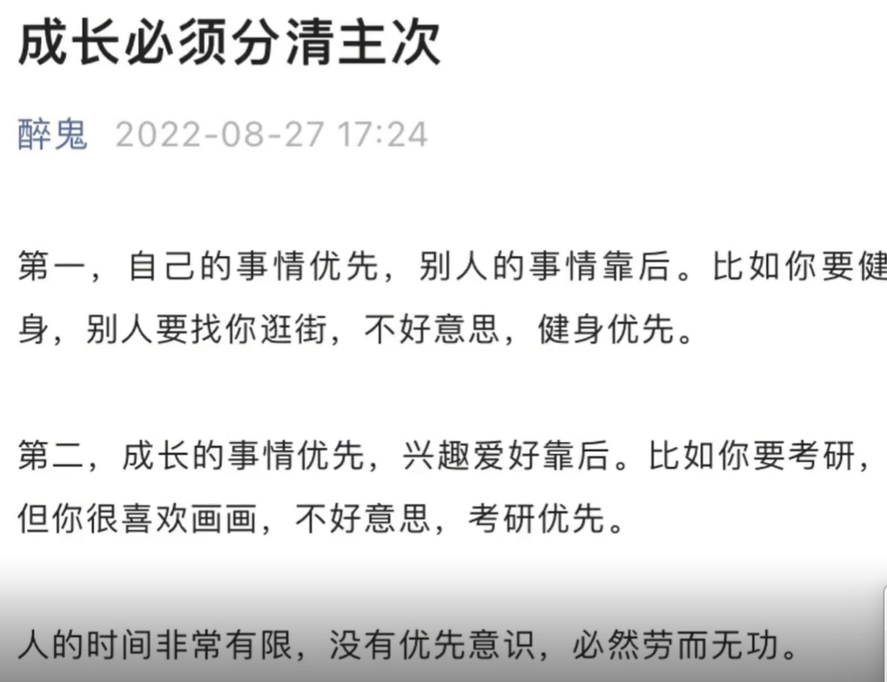
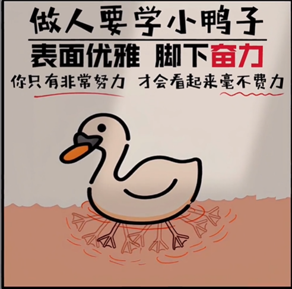
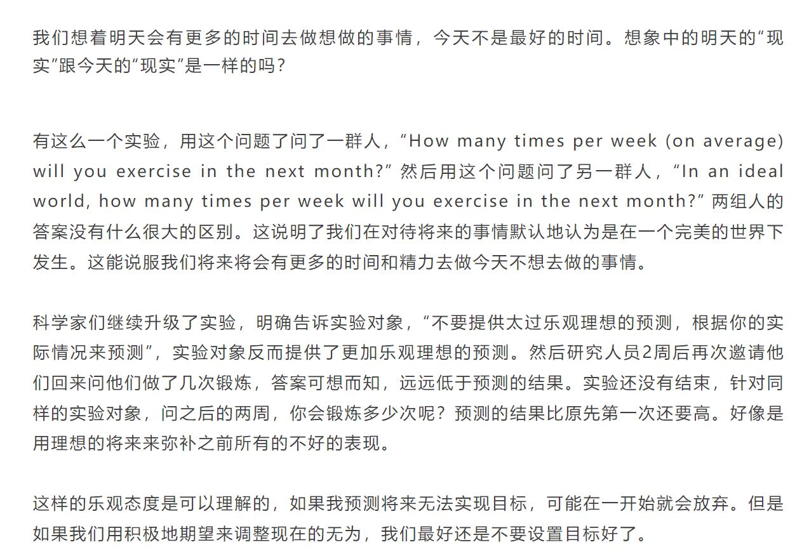

- # Preface
- Motivation：这个部分用于延迟满足个人的一些暂时不重要的欲望
- #mottos
  collapsed:: true
	- Mottos: #克制
		- 人能克己身无患，事不欺心睡自安   #马致远-元代戏剧家
		- 每一次克制自己，就意味着比以前更强大 #高尔基-前苏联作家
		- 在获得胜利之后而能克制自己的人，获得了双重的胜利  #培根-英国文艺复兴时期作家,哲学家
		- 哪怕是自己的一点小小的克制，也会使人变得强而有力 #高尔基-前苏联作家
		- 清晨五点起床，晚上十点之前就寝，这样一种简单而规则的生活宣告开始  #村上春树-日本
		- 我们都得承受二种痛苦中的其中一种：纪律的痛苦或后悔的痛苦、差别在于纪律感觉几盎司重而后悔是几吨重 #吉姆.罗恩
		- 自制是一种秩序，一种对于快乐与欲望的控制  #柏拉图-古希腊
		- 征服自己的一切弱点，正是一个人伟大的起始  #沈从文
		- 不奋发，则心日颓靡；不检束，则心日恣肆 #朱熹-北宋
		- 所谓自律，是以积极而主动的态度，去解决人生痛苦的重要原则，主要包括四个方面：推迟满足感、承担责任、尊重事实、保持平衡 #M·斯科特·派克
		- 要进行严厉的自我克制，因为克制本身就可以作为一种精神寄托 #泰戈尔
		- 准备好有心栽花的失落，也相信无心插柳的分量
		- 汝不可因惰而随心所睡！汝不可移志而半途而废！汝不可因苦而哭天抹泪！汝不可求闲而叫苦喊累！汝不可因难而节节后退！汝不可因败而万念俱灰！坚持到底！
		- 但凡使我们脆弱的，一定会让我们更强大更勇敢
	- English Mottos:
		- Better be unborn than untaught , for ignorance is the root of misfortune .
		- The most terrible enemy is no strong belief.
		- The crown, is temporary or permanent?　王冠，到底是暂时的光辉，还是永久的束缚？
		- If I feel uncertain, I will raise my voice. If I feel ill, I will double my labor. If I feel insignificant, I will remember my goals. If I feel fear, I will plunge ahead. If I feel sad I will laugh. If I feel depressed, I will sing. If I feel poverty, I will think of wealth to come. If I feel inferior, I will wear new garments. If I feel incompetent, I will remember past success. Today I will be master of my own emotions.
		- The tides advance; the tides recede. Winter goes and summer comes. summer wanes and the cold increases. The sun rises; the sun sets. The moon is full; the moon is black. The birds arrive; the birds depart. Flowers bloom; flowers fade. Seeds are sown; harvests are reaped. all nature is a circle of moods and I am a part of nature and so, like the tides, my moods will rise; my moods will fall.
			- 潮起潮落，冬去春来，夏末秋至，日出日落，月圆月缺，雁来雁往，花飞花谢，草长瓜熟，自然界万物都在循环往复的变化中，我也不例外，情绪会时好时坏。
- # 不娱乐你可以做什么
	- FreetimeActivity
	  template:: FreeTime
		- 可以看看todo list上还有什么没有做完
		- 可以想想怎么提高工作中开会、对接任务、弄清障碍时的沟通能力
		- 可以思考怎么用英文表达leetcode题目
		- 可以制作小红书进行写作
		- 听一首轻音乐
		- 可以想想怎么创业、怎么赚钱
		- 可以进行昨日复盘
		- 可以整理周报、月报
		- 可以看学英语
		- 可以想想自己已经学的东西有什么地方没有学完
		- 可以跑步锻炼身体
		- 可以先完成其他的小作业
		- 可以自己朗读英文片段并录音
		- 可以练习口语
		- 可以早点睡觉
		- 可以看10分钟书
		- 可以跟别人进行高效聊天
		- 可以给family打电话
		- 可以护肤、美白牙齿
		- 可以学习自己的爱好
		- 可以出门散步逛街 去新的地方
		- 可以看看别人有没有需要帮忙的地方
- # My Resistance of humanity
  collapsed:: true
	- 即我人格、性格上的弱点：
		- 遇见一个好玩有趣的事，不要着急让各种各样的朋友都知道
		- 已经偷玩了，不能继续偷玩或者摆烂
		- 在一件事情上很用脑，然后就以此为借口在另一件事情上不用脑
		- 遇到不一样的观点，虽然自己有更大的把握，也不应该指责别人的观点完全错误，而是先了解清他的信息源或者是逻辑，再根据对话的反映做出必要提醒
		- 犀利和尖锐的语气不要总是理解成对个人的否定，而应先理解原因，如果没有道理再怼回去，有道理则采纳
		- 只要这个任务无关重要，或者没有人会对你提出问题，你就不会主动提问并展开思考
		- 总是把一个理解起来容易的idea当做真的简单，没有理解这个idea产生的sources是什么
		- 不需要考虑一些毫无难度且毫无意义的小事，对于这种事只需要记得它存在就行
		- 不需要提前预知太多没有发生或者非常希望发生的事情，而只是应该偶尔在没有motivation时拿出来翻阅的
		- 即便是relaxing activity，也可以适当放慢节奏get its flavor
		- 聊天聊不出趣味，只知道认同和点头，不知道反问、质疑、追问、幽默、玩梗、迁移扩散
		- 有人可以倾诉的时候就不愿意一个人埋头做事和思考，还是寄希望于别人提供的反馈价值来启发你思考
		- 因为受到的伤害和冷漠过多所以反过来对于别人没有满足你要求的行为总是表现出极强的复仇或者攻击性心理，因为你觉得只有反驳、反击才能捍卫自己的尊严和立场，才能够保护自己不受到欺负，但是会经常犯两个错误：你会把别人对于你自己的理解投射到你自己身上，因为那些蛛丝马迹的细节一下子会让人血脉喷张，让人在没有任何仔细思考的前提下就得出结论，所以当你被别人激怒的时候，首先要做的事情就是确认，包括确认激怒你的这条原因是否是客观存在的(是主观臆想还是确有其事，是因为自己的什么需求和对方的什么行为发生了mismatch)；二是就是思考要怎么解决，之前的解决方式就是毫不客气地进行回怼，下意识受宫斗剧的影响认为只有这样才能建立起来自己的威严和气势，别人才能服气你，但是我发现这样的结果通常是别人更不服你，也会对你心生厌恶，真正妥善的方式是清楚地以一种温和但有力度的方式告诉别人自己的情绪、感受以及原因，但是不要随意地指责和攻击别人，因为这样会激发别人的恶，你要做的是让彼此的情绪需求都得到释放和解决，解决问题的标准是“彼此都没有怨恨了、能够直接睡觉了”，而不是“陷入一方的妥协”
		- 对于别人的友好援助或者关心，要以友好轻松的方式表示接纳，而不是拒绝
		- 犯错或者向别人道歉并不丢人，反而更应该大大方方，光明磊落，很多时候这才证明你有勇气去面对内心的幽暗，直视自己那些甚至粗鄙的一面
		- 不要跟所有人都自来熟，有些人是不喜欢这样的，跟别人打交道的初期要学会谨慎
		- 在怕麻烦的同时又不懂得简化问题，从而制造了很多麻烦1
		- 存在双标行为：对待自己和对待别人、对待自己的好朋友和对待陌生人、对待家人和对待网友
		- 对于自己犯过的错无限次找借口，对于自己永远宽容却不是狠
		- 对于明知有风险的行为却不谨慎小心
		- 对于概率问题永远心存侥幸
		- 有别人的场合才会克制，在无人的场合反而放纵和肆意
		- 自尊心太强，有些时候根本与你的自尊心毫不相干
		- 做每件事都表现得不够从容和淡定，do not take it easy
		- 表面上追求经济独立，却从不独立
- # My Tankings and Stupidness
  collapsed:: true
	- 在我的学习、生活、认知上有很多的摆烂和愚蠢行为，但是我几乎总是没有意识到或者没有理解这种行为笨在哪里，或者是片刻意识到而后又抛诸脑后，事实上你需要深刻理解这些烂所造成的后果有多么愚蠢，只有这样你才能进步，一味地靠自我克制只会是压抑而非解脱。
	- ## 学习
		- 容易陷入到泛泛之谈中,  没法挖掘更insightful的细节
		- 对于自己知识的空白认知不足
		- 对理解上的错误不够坦诚
		- 注意力不够集中不是因为比较闲，而是因为你压根就没有想把这件事做的足够好，所以本质上是一种思维上的懈怠和懒惰
		- 处理问题不灵活，不懂得切换方向
		- 始终不按照日程安排走，随心所欲 》 按时规划
		- 要把各种事物的零碎观点进行整理合并，使其系统化
	- ## 生活
		- 明明很多事一个人处理起来会更节省时间，但是为了输出自己对于办好这件事的不确定性和担忧，非要找别人一起做
		- 当别人回复“好”、“简单表情包”时就不要再回复
		- 不给出不必要的提醒，不然别人会以为你很闲，就一直想麻烦你。特别好的朋友除外。
		- 灵异、科幻、恐怖剧、悬疑看多了，对它们的热情也会逐渐消散，因为发现里面也处处充满了套路且雷同率很高，精彩的剧要么从内容上推陈出新，要么就是在老套的剧情中挖掘出不一样的情感价值、文学内涵、哲学思绪。因为影视剧的配乐、男女主角、拍摄场景、情节上下文、配音、服化道、故事背景等各种各样的因素都会做出微小的调整，造成的整体感受却是变化很大，这也是为啥很多烂剧重复剧情被人反复观看的东西。因为终究这些东西还是有小的新意的，所以才会有再次观看的欲望，这也是合理的。书籍、影视、娱乐视频在今天是爆炸式的，所以不能凭着自己的随机性子来，被动地接受视频的推送，而是要学会主动地筛选和接受想要的信息，得明白，世界上有很多的内容和知识在视频推送里都是找不到的，互联网信息的复杂度会很容易让你产生这样的错觉“除了这些视频  没有什么好玩的了 剩下的都是无聊的废墟了”。我觉得做到这个需要两点，一是平时对于好的书籍、电影要进行筛选，可以通过简介、高赞评论来做一个基本的筛查，对于筛选后的好东西要记得写下收藏的原因、收藏阅读之后要重新记录评价并重新归档，对好坏事物的鉴别能力本身就是分析能力的一种体现；不要轻易因为一个好玩的、吸引人的post就随便关注一个自媒体账号，只有当其每篇内容都看上去优质，才有意义，不然你就会发现你的内耗完全是由自己主动选择的，因为你主动选择了一个更为嘈杂的网络环境。接受信息之前，一定要问你为啥会看这个信息？是因为好奇、因为娱乐、还是因为知识？先问问自己到底想要知道什么，再去阅读信息！
		- 如果你在意的朋友其实根本不在意你，不要发泄情绪，只需要客观地陈述自己的反对意见就行了，因为这时候的情绪消耗对你是没有意义的。
			- 如果你觉得这个朋友还有继续交往的意义，不需要发小长文，只需要用简练的语言表达清楚看法就行。
			- 你觉得你的朋友在这件事上对你做错了，只需要心平气和得指出来就行，不要指责，指责不会修复彼此的关系，只会破环地更深。如果他不改，渐渐得疏远就行了。
		- 抖音很多东西确实都是垃圾，但提供了情绪价值、好奇心价值、娱乐八卦价值、炫耀价值、交友价值、推广价值、人际交往价值、多样性价值、纵欲式价值，而这些只要是人都是难以克服的，所以用行动规则来约束这个度是最好的办法。
		- 其实个人最大的不自由完全是自己给自己的，几乎每个人都是想要这又想要那，这是一种极其正常且常见的心态，很多人劝说别人不要这样做反倒不是因为自己也做到了，而是自己也做不到、同时知道这样做只会让事情更糟糕的一种劝解和宽慰。最好的办法就是，find key factors as less as possible.
		- 只要自己不刻意进行时间规划，就会陷入巨大的混乱当中
		- 早上出门失忆四件套：忘拿电脑插头、忘拿校园卡、忘记晒衣服、忘记拿手机；出门混乱三件套：把校园卡放在书包或床上，然后四处找；把眼镜放在洗手台、书桌、淋浴间，然后四处找；把手机放在床头收集架上、书桌上、书包里。解决办法：不管晚上多晚睡，都要把书包里的东西整理好，先拔下耳机和充电线单独放一个包里，然后是电脑、电脑支架和USB线放大包，再然后是鼠标和鼠标垫，最后是帽子、卫生纸和口罩；眼镜、校园卡和手机统一放在床头整理箱。
		- 平均出门需要20分钟，走路到校内又需要10分钟，主要是洗衣服过于耗时。解决办法：每晚睡觉前洗完衣服并晾晒。
		- 除非有明确的地址文字描述，不然找不到一个地方。除非有高德地图的定位，不然无法描述清楚自己所在的位置。当对方的位置在变化时，就搞不清了。
		- 总是错误理解题目、别人言论的意思。主要原因反而是思考得太深，构建了很多关联，但是却没有意识到构建的很多关联关系要么不存在，要么根本就是不相干的，你构建起关联的这个链接点其实是有问题的。
		- 不会花钱，总是喜欢买廉价的东西，结果没过多久就又坏了，而买的昂贵的东西要么有需求但是没时间或者没需求而导致最后用不上，要么最后丢了。对于电子产品尽量要买的昂贵一些，不然非常容易坏；对于食物水果也不能乱买，因为很不健康。
		- 集中时间进行购物
	- ## 认知
		- 交流的确可以提高认知，但是必须是一个点一个点的这种深挖式的分析、提问、反驳、质疑、进一步的搜索、联想、下结论、阐述和修正逻辑才有意义，纯粹的内容总结、事实性分享没有特别大的意义。交流中每个人分析的角度是不一样的，而单个人的分析非常容易陷入个人认知的bias上去，如果没有可以讨论的对象，就必须自己试着独立从多角度思考。
		- 习惯性地把网上写的比较好的经验贴当做事实，而不学会找相关的人去进行调研、去问
		- 网上很多的自媒体言论真假难辨，正常人很难花费那么多时间去进行校验，但可以通过标题、文章开头、文章结尾、阅读量、评论信息做一些基本的预判。所有自媒体都是希望获得关注量的，但是通过制造恐惧、威胁、惊悚、八卦而非深度思考的一般都可以归结于烂文了。
	- ## RelationShip
		- 真正的照顾别人的感受，就是得明白别人真正的需求是什么，任何时候都不要强加给别人什么东西。
- # My Unsatisfactory
	- 一个垃圾手续流程的几个特点：
		- 时间线的标志不清晰：一个流程可能包含多项任务，如果只给这个总任务一个截止时间而不对每个子任务截止时间，整个流程线会因为人群不同的拖延程度而发生混乱
		- 流程顺序容易造成差错：虽然大家都清楚地看到了说明书，执行结果还是乱七八糟
		- 不方便统一执行
- # Recognition Essay
	- 
	- 
	- 
	- 之所以同样一个问题反复出现，是内核的系统性问题。总是受挫感的背后是完美主义和自恋，总是期望不切实际的认可。无论是辩论中的胜出、宫斗剧中的反杀时刻、悬疑剧里绝密的暗杀反转，你所期待的一直都不是为了获得逻辑的进步，而是为你曾经被打压、被欺负、被委屈、被轻视、被伤害的那种怨恨找一个看似合理化的出口。之所以需要反复的安慰，是因为始终不敢自己承担起失败的现实，始终把自己当作被照顾对象而非主动照顾者。强者心态不是歇斯底里，也不意味着没有任何脆弱，而是接受自己的脆弱和无能，坚定自己的选择。强大的标志是平静的面对，而不是消耗精神体力，接受一切最不好的结果。
	- 不能多元化过了头，感兴趣的东西很多，不断增强认知也没有错，可是不是你获取的每个认知和多元性都能够发挥作用。人首先要做的就是生存，而生存的关键就是个人价值，所以必须得把兴趣转化成落地的价值才行。我现在的兴趣就是写作，先定下几个想写的书的名称和方向；然后选择一本最想写的内容，通过运营个人公众号为主来不断锻炼自己的输出能力、并有针对性地进行素材整理；后期再进行打磨、以及丰富。目前想到的就是《脑科学知识宫殿及创造性应用》（可以通过自己看书实践归纳，证明书里面的效果，就是把书写成自己运用脑科学知识的一个十分实用的科学实验手册）、《那些年度过的悬疑》（按照悬疑作者进行分类整理：比如柯南悬疑剧情里面的漏洞发现和剧情特色、不同悬疑作家的写作风格；阿加莎老奶奶）、《一天实践一个认知》、《21天改正一个实践错误》、《特色阅读闲笔》、《写作方法阅读和实践》、《不同的作家风格模仿全集》。
	- 实践的作用被我忽视了，关于如何正确展开实践，我很明显既缺乏系统性的知识，也缺少实战经验。实践中出现的问题一个点一个点地去罗列，把这个问题彻底解决掉（至少21天内不会再出现新的问题）才能去系统研究下一个问题。
	- 我总是低估了旁门左道对时间的消耗程度。可以把自己的所处阶段进行分类，不需要用简单的低谷、高潮、平稳、上升、下降等词汇来定性，因为这些词汇充满了对自我的批判，而不是自我接纳、自我肯定和自我求解。我目前的一个周期包括：困惑期、目标实现期、总结期、放松期。这四个周期是一个循环，困惑期主要通过大量阅读、观看视频、找大佬交流，对已经记录在案的问题列表进行逐个分析；目标实现期就专注于进行大量实践，小问题及时解决，一些涉及哲学层面或者抽象层次比较高的先进行记录，尽量要把这个问题描述清楚，但暂时不要求答案，因为有些问题可能本身没有研究的价值，过后再看直接柳暗花明；总结期就是对实践的过程进行复盘，记录一些新发现的good points，并设定一些new goals，与此同时完善之前的problem list；放松期就是放空大脑，出去运动，接触一些新鲜食物，认识一些新朋友、做一些不同的事情。
-
-