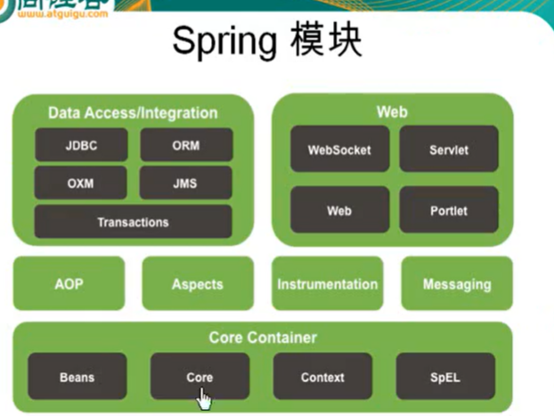
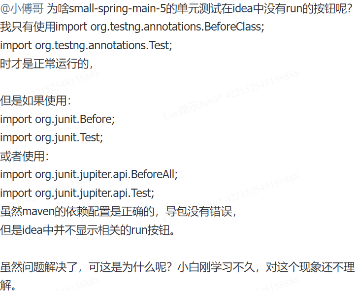
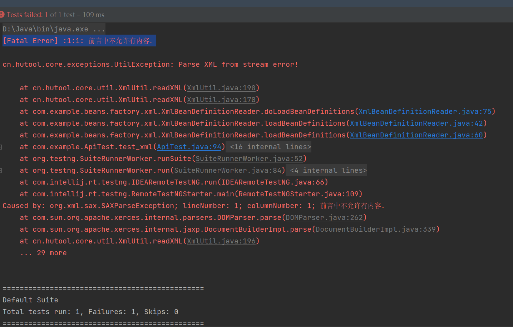

public:: true

- 
- Spring的主要用途和特点是什么呢？
  collapsed:: true
	- spring主要针对简化EJB2的企业级开发而生的。
	- Spring是一个IOC(DI) 反转控制(依赖注入) 和 AOP （面向切面编程，aspect oriented programming）的容器框架
	- 为什么说spring是一个容器？
		- 因为spring包含并管理应用对象的生命周期
	- 为何spring是一个轻量级的框架？
		- 因为spring是非侵入式的，也就是说基于spring开发的应用中的对象可以不基于spring的API
	- spring是一个一站式的框架：其在IOC和AOP的基础上可以整合各种企业应用的开源框架和优秀的第三方类库，实际上spring本身也提供了展现层的Spring MVC和持久化层的Spring JDBC
	-
- Spring的整体结构是什么？
  collapsed:: true
	- 
	- Spring整体包含三层，每层依次有1、4、2个小模块，也就是说一共有7个模块。
	- 最下层是核心模块，包括 Beans、Core核心容器、Context上下文环境、SpEL(Spring Expression Language) Spring表达式语言；
	- 中间层的模块是面向切面编程的AOP、Aspects；整合Instrumentation和Messaging消息
	-
- IDEA如何进行Junit4测试文件的编写？
	- https://www.cnblogs.com/tangg/p/12670753.html
- [[sourcecode]]
  collapsed:: true
	- 思考
		- DefaultListableBeanFactory的几个方法分别是来自哪些接口或者类？
			- registerBeanDefinition方法只实现自BeanDefinitionRegistry接口中定义的一个方法；
			- getBeanDefinition方法来自三个地方: 一是对BeanDefinitionRegistry接口中定义的一个方法的实现，二是对AbstractBeanFactory中的一个抽象方法的实现，三是对ConfigurableListableBeanFactory中的一个方法的实现。三个地方的名字都是一样的；
			- containsBeanDefinition方法也只是：BeanDefinitionRegistry接口中定义的一个方法的实现；
			- getBeanDefinitionNames方法来自两个地方：一是对BeanDefinitionRegistry接口中定义的一个方法的实现，另一个是对ConfigurableListableBeanFactory接口所继承的ListableBeanFactory中的该方法的实现；两个地方的方法名都是一样的
			- 所以：为何要把同一个功能在多个接口或者抽象类中进行定义呢？
				- 拿getBeanDefinition来说：其必须在AbstractBeanFactory中定义成一个抽象方法，是因为其内的getBean方法在使用[[模板模式]]时中定义流程时，getBeanDefinition是一个必须的环节，其是实例化bean的方法createBean的重要参数；而将getBeanDefinition写在BeanDefinitionRegistry接口定义的方法中，是为了使得BeanDefinitionRegistry这个接口的含义更加完整：可以注册某个bean的定义信息，也可以获取某个bean已经注册好的bean定义信息；而ConfigurableListableBeanFactory接口应该是需要getBeanDefinition去实现其他特定的功能，但在第五章的代码里尚未明确
		- 为何Idea的junit test代码附近没有执行run/debug的小按钮？为何无法运行？ [[ProjectIssues]]
		  collapsed:: true
			- 
		- 为何spring.xml的读取一直保错“[Fatal Error] :1:1: 前言中不允许有内容。”？ [[ProjectIssues]]
			- 
			- 是这个“classpath: spring.xml”这个类文件的路径写错了，直接改成绝地路径是没有问题的。
			- 那么如何写正确的类文件下的相对路径呢？
	- 使用[[STAR法则]]进行总结：
	  collapsed:: true
		- 思考：
		  collapsed:: true
			- 一个调用抽象方法的方法是抽象方法吗？
			  collapsed:: true
				- 不是
				- AbstractBeanFactory是一个抽象类，其中的getBean方法只有子类具体实现了才能被真正使用，这使得getBean从含义上看上去是抽象的，但是其并没有被abstract修饰；而且AbstractBeanFactory的子类并不需要去实现getBean方法了，只需要去实现getBean的流程中涉及的两个抽象方法getBeanDefinition和createBean。
			- AbstractBeanFactory在实现BeanFactory中重载的getBean(String beanName, Object ... args)时，其获取bean的流程发生了哪些改变？
			  collapsed:: true
				- 其将getBean(String beanName，Object ...args)和原来的getBean(String beanName)进行了形式上的进一步合并。Object ... args 和 [无args] 可以看作Object[] args的两种特殊情况，前者可以理解成args这个对象数组的长度是动态的，而不像通常数组那样是固定的；而后者可以理解成args这个对象数组是null的。
			- 为什么接口中也要写上throws BeansException？为什么很多方法都要跑出BeansException这个异常？这个异常有什么特殊之处？
			  collapsed:: true
				- 在getBean这个方法中实际可能会跑出多种类型的异常，包括 实例化异常、非法获取异常，在代码中可以看到无论是属于这些类型中的哪一种，都重新抛出BeansException。我觉得就是把异常的类型给归并成一种了，用户只需要知道这些异常都与容器中bean相关的行为是息息相关的就行。
	-
		-
		-
-