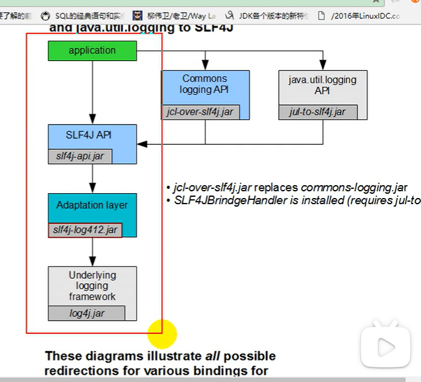
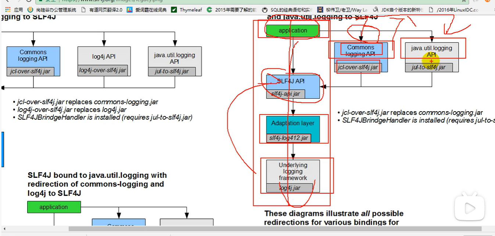

public:: true

- [[MicroService]]
	- https://www.martinfowler.com/microservices/
		- 定义：微服务架构是一种将单个应用按照一套小型服务来开发的方法。
			- 每个服务都运行在自己单独的进程里并通过轻量级机制（比如http的资源API）进行通信。
			- 这些服务围绕着业务功能而构建，并通过全自动部署机制来进行独立部署。
			- 这些服务需要最少量的集中管理，可以分别是用不同的编程语言或者数据存储技术来实现。
- Adaption Layer是怎么在日志服务中发挥作用的？Adaption Layer的设计思想是什么？
	- 
	- SLF4J API定义了抽象的接口，而log4j并不是它的抽象实现；于是Adaption Layer出现了，其是SLF4J API的实现类，但是其实现过程中会使用log4.jar这个具体类中已经写好的方法。简单来说，Adaption Layer实现了SLF4J API, 但是依赖log4.jar, 也就是[[向上实现但向下依赖]]
	-
- 当Application中的部分组件使用了除SLF4J API以外的Commons Logging API(JCL)和java.util.logging API时，怎么才能解决日志服务的不统一问题？[[自己思考的结果，不确定正确]]
	- 
	- 应用的不同组件使用了不同的日志接口，但并不代表必须在应用中同时使用多个不同的实现类。方法是：创建一个新的jar包，这个新jar包中的函数名称和Commons Logging API jar包中的对应函数名保持一致，使用新jar包来进行替代JCL的原始jar包。当其他组件调用Commons Logging API时实际上是在调用这个新jar中定义的接口，而这个新jar中的接口依赖于SLF4J API进行实现，可以说是对SLF4J API的进一步封装。
	-
	-
-
-