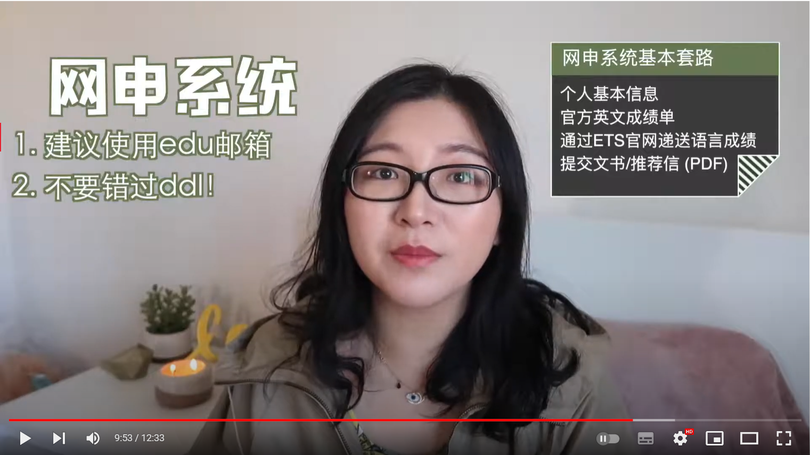

- 
- [[flomo]]
  #+flomo_tag: toffel
	- 2022-05-18 09:16:02
	   #toffel
	  
	  #+memo_url: https://flomoapp.com/mine/?memo_id=MjQ0NTYxNjQ
	  #+flomo_id: MjQ0NTYxNjQ
	  #+created: 2022-05-18 09:16:02
	  #+updated: 2022-05-18 15:47:58
		- 
		  
		  
		  
		  
		  #+isImg: true
	-
	- 2022-05-17 22:57:06
	   #toffel
	  
	  GRE的题目类型就是11种
	  GMAT的题目类型就是8种
	  toffel中有10种题型
	  
	  
	  lexile是做阅读评级的机构，与ETS有合作。可以选择对应分数的辅助阅读资料进行学习。
	  #+memo_url: https://flomoapp.com/mine/?memo_id=MjQ0MzAxMTk
	  #+flomo_id: MjQ0MzAxMTk
	  #+created: 2022-05-17 22:57:06
	  #+updated: 2022-05-18 09:08:46
		- 
		  
		  
		  
		  
		  
		  
		  
		  
		  #+isImg: true
	-
- 182417@Ycdsw
-
- # 申请流程
  id:: 62fdf209-ef88-4975-9d50-8abc3100eaba
  collapsed:: true
	- https://www.youtube.com/watch?v=ez__Lv8tG-A
	- 
	- 
	- 
	- 
		- 北美的申请时间一般是11月份-2月份，所以选学校需要提前3-4个月
		- 申请文书中可能会需要写到你对哪些教授感兴趣、或者有些学校明确要求选择哪个导师
	- 
	- 
	- 
	- 
		- 需要注意上传的ip抵制
		- 中国学生不是由推荐老师上传，而是由推荐老师发链接给你之后再上传
		- 个人陈述把内容限制在两页以内，推荐信在一页以内
	- 
		- 有些学校会有research statement要求
	- 
		- 注意deadline
	- 
	- 
	- 
	-
	-
- # 申请费用
  id:: 62fdf22f-2f55-49d4-abcf-63204ea529c1
  collapsed:: true
	- https://www.youtube.com/watch?v=hPfRsAGqHl0
	- 保险费的大头是被算在了tuition里面
	- 
	- 
	- 
	- 
		- 需要美国绿卡或者公民才能有，但是除非你特别优秀也会提供，入学之后也可能提供一些fellowship
		- 
			- 大部分是不可以叠加，但是纽约大小除外，纽约大学的RA以fellowship名义来发
			- fellowship不上税、RA和TA需要收税
			-
	-
- # 申请上的时间安排
  id:: 62fdfd39-408a-412a-b484-6d9dae655635
  collapsed:: true
	- https://www.youtube.com/watch?v=-Q6uj9XrfDc
	- 
		- GRE变得越来越不重要了
		- 
		- 后期练习听力和口语的同时准确一下GRE的词汇，之后再看托福的阅读和写作就不一样了
	- 
	- 
	- 推荐信也至少要提前一个月
	- 陶瓷非常玄学
	-