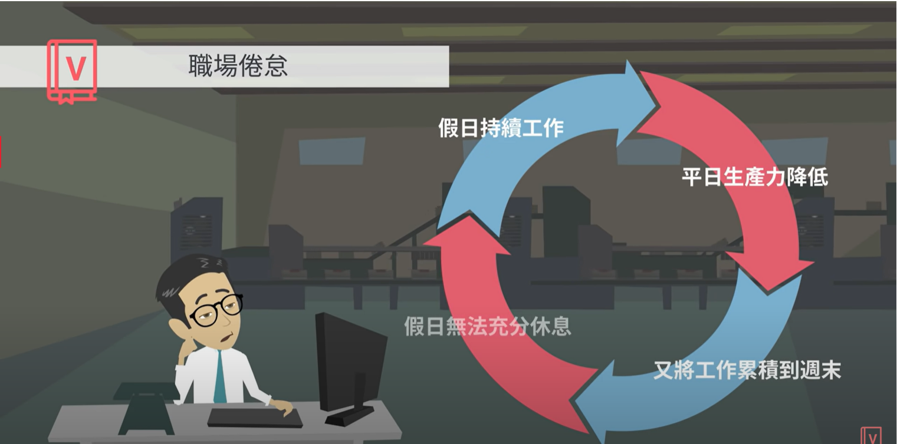
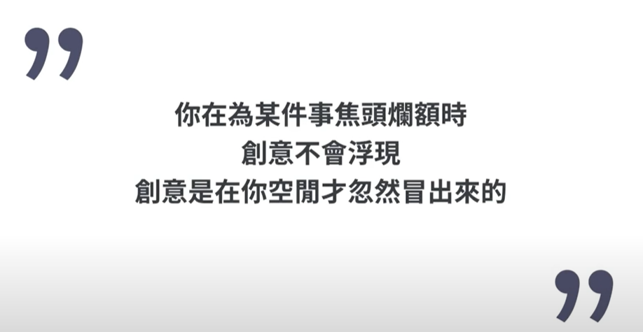
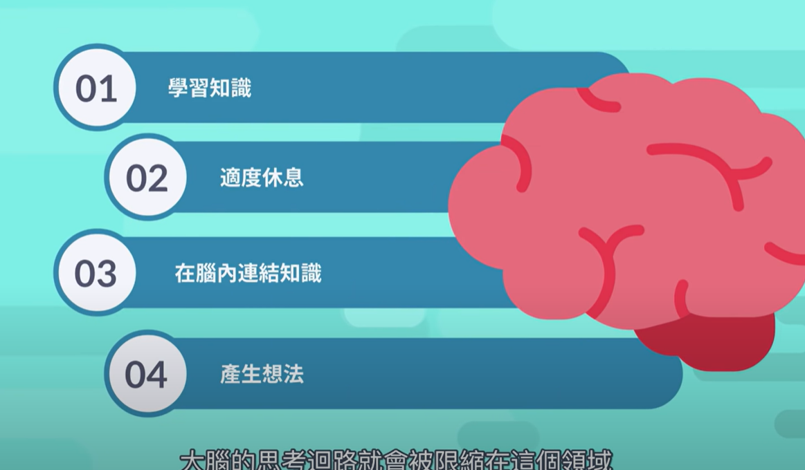
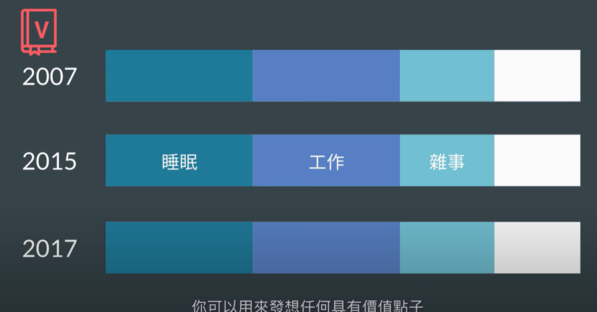
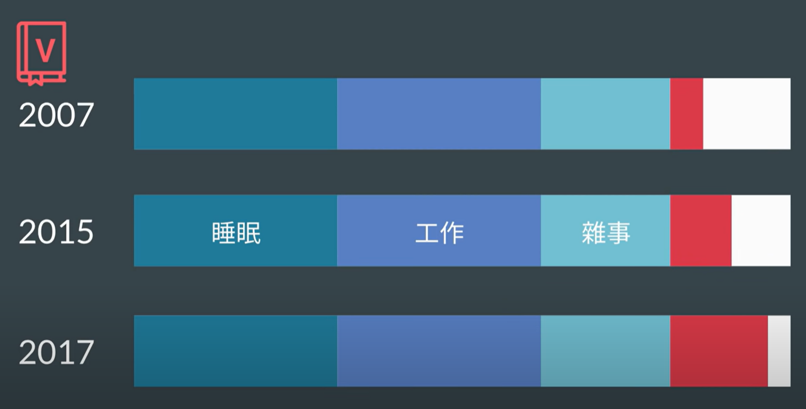

- {{youtube https://www.youtube.com/watch?v=wcBHHyK9ig8}}
	- [[self]] [[LearningTricks]]
		- 为何越努力越会导致[[职场倦怠]]？ [[WorkingHabits]]
		  collapsed:: true
			- 疯狂努力不符合人有限的生理机能.  持续努力不休息，也就是工作时间挤占了休息时间 =》导致生产力降低 =》需要花费更多的时间来工作，休息时间被进一步挤占.
			  collapsed:: true
				- 
		- 如何在工作中产生创意？ [[WorkingHabits]] [[BrainScience]] [[SolutionNotes]] [[Innovation]]
		  collapsed:: true
			- 首先，要了解 [[Innovation]]的来源
				- 大脑使用[[任务执行系统]]来完成日常工作，但是使用[[预设系统]]来整理和连结知识；而 [[Innovation]]只在[[预设系统]]启用时才可能产生
				  collapsed:: true
					- 
					- 
					- 
			- 所以，如何使得大脑进入[[预设系统]]状态呢？
				- 一个人大脑的时间分配：蓝色是琐碎事项的时间，而白色是[[私人时间]]，在这个时间内可以用来发呆发想任何具有价值的点子；随着数字技术的发展，人们的[[私人时间]]开始不断被屏幕侵占
				  collapsed:: true
					- 
					- 
			- 该怎么来实践这一创新背后的原理呢？
				- 增加个人拥有的可以发呆、胡思乱想的 [[私人时间]]
				  collapsed:: true
					- 
				- 将 [[私人时间]]和[[工作时间]]区分开来
				  collapsed:: true
					- 
			-