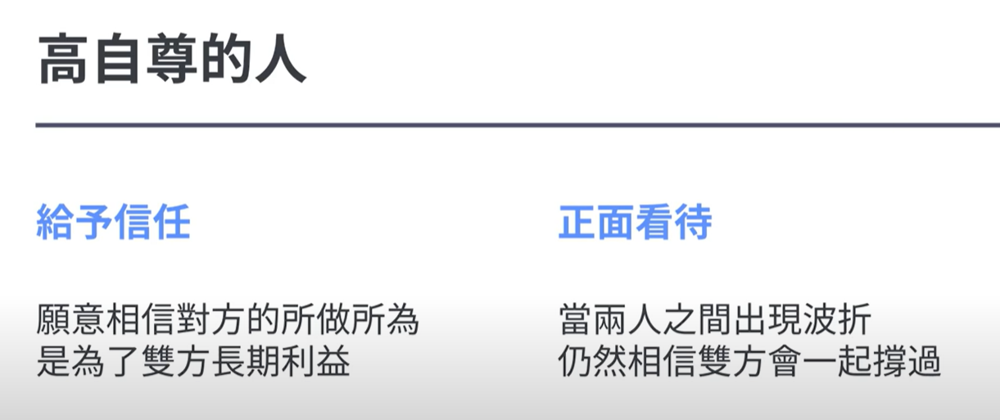
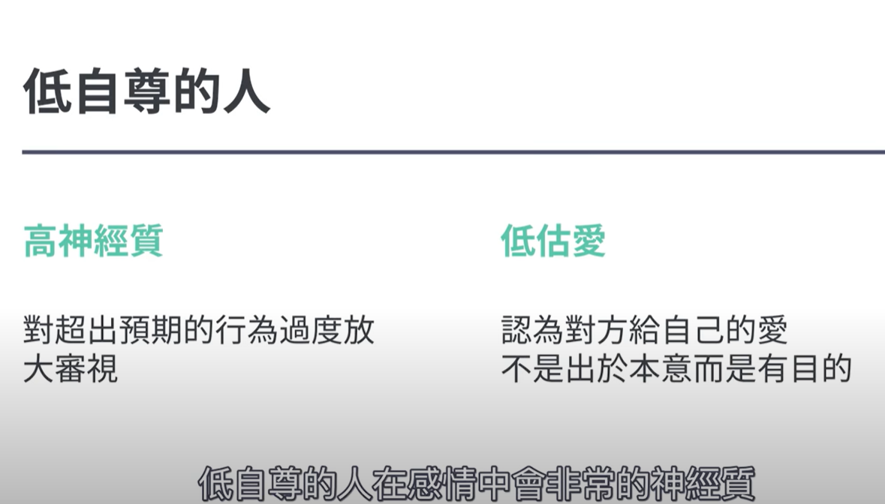
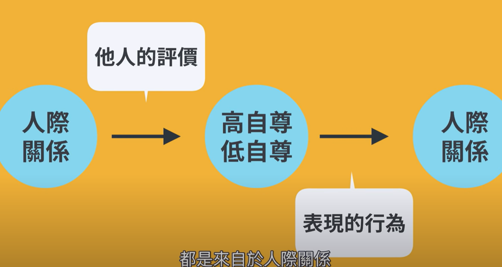

- {{youtube https://www.youtube.com/watch?v=Mc8Ne2_srCc}}
	- [[自尊]]和[[亲密关系(IntimateRelationship)]]
	  collapsed:: true
		- 
		- 
		- [[高自尊]]和[[低自尊]]的来源：
			- 
	- 三要素：
	  collapsed:: true
		- 亲密：闪电结婚中会缺失的
		- 激情：最易消退
		- 承诺：
		-
	- [[第一印象偏误]][[思维偏误]]
		- 会把第一次见面获取的印象强加到后面的每次见面中，以后的每次判断都是为了强化或者证实这一印象
		-