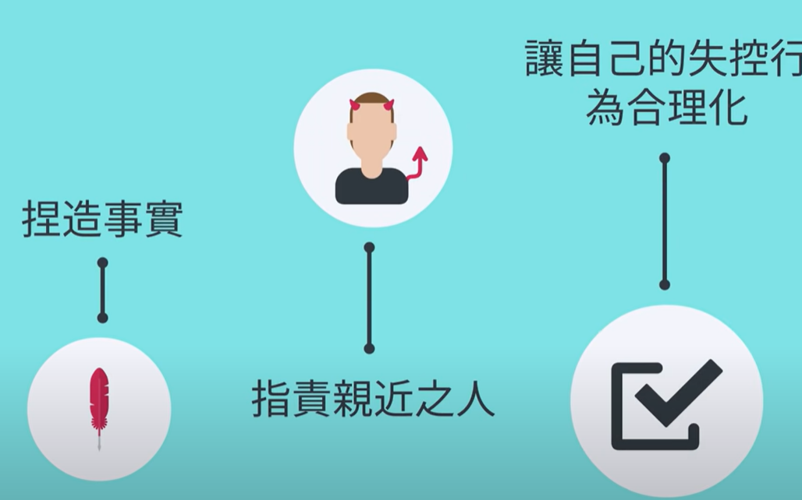
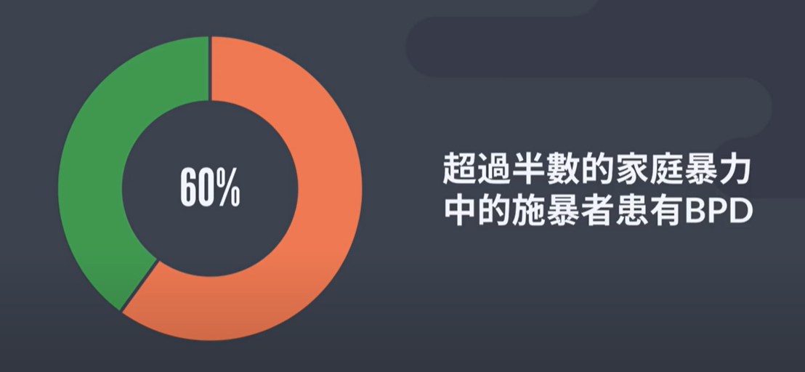
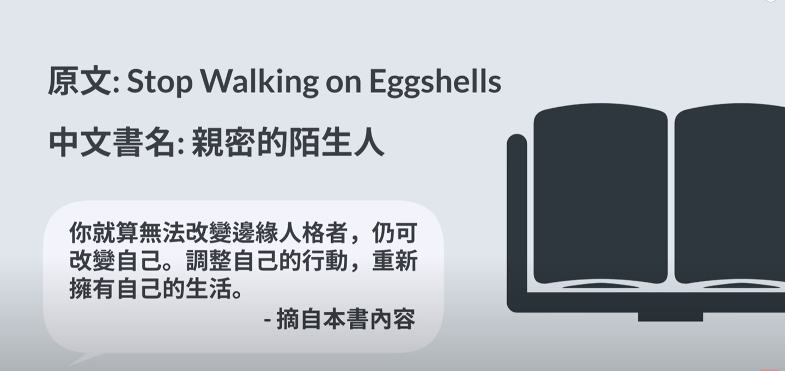

- {{youtube https://www.youtube.com/watch?v=4S6d_vx9G78}}
	- [[BPD(BorderPersonalityDisorder)]][[Personality(人格)]] [[Psychology]]
	  collapsed:: true
		- [[BPD(BorderPersonalityDisorder)]]的医学定义是什么？
		  collapsed:: true
			- 
		- [[BPD(BorderPersonalityDisorder)]]有哪些特质？
		  collapsed:: true
			- [[放大情绪]]
			  collapsed:: true
				- [[情绪(emotion)]]变化程度大且快，并不受控制地尝试对其合理化
				  collapsed:: true
					- 
					- 
				-
			- [[对人与人之间的界限始终模糊]]
			  collapsed:: true
				- 无法判断与陌生人、与家人朋友应该分别保持什么样的界限
				- 渴望爱，却又把爱拒之门外
			- [[害怕遗弃感]]
				- 从别人的行为中更容易感受到冷漠感
			- [[无法统合一个人的优缺点]]
				- 只是从最近一件事来判断一个人，而不是从过去到现在这个整体上来判断
				- 看待事物趋于0和1思维
			- [[无法建立稳定的认知]]
				- 对自我的看法容易收到不同[[周围环境]]的影响
			- [[高情绪敏感度]]
				- 能迅速判断某人行为背后隐藏的[[情绪(emotion)]]
			-
		- 如何与 [[BPD(BorderPersonalityDisorder)]]患者相处？
		  collapsed:: true
			- [[别人的行为和BP患者的感受可能毫无关系]]
				- 如果真的是别人做错了，别人只需为他们的行为道歉，但没有必要为BPD患者的感受道歉
			- [[不能助长别人的失控行为]]
				- 拒绝接受BPD患者的威胁，要严厉地告诉他们，当失控行为发生时将帮他们送给警方或者心理医生
				- 当BPD患者冷静时，与他协调界限:
					- 描述事实：不能使用带有情绪性或者模糊性字眼，以让对方有可以反驳之处
					- 向对方表达自己的感受：[[$red]]==避免使用“你让我感到”这样的字眼==
						- [[$green]]==老实说我感到相当气馁，因为我感觉到我不被信任，难道我在意你这件事，需要我接起每通电话、无时无刻等待你的来电来作为基础吗？同时我也感到相当愤怒，因为这一切都不是我想看见的，==
					- 设立界限：
						- 向对方说明你的界限以及你未来可以怎么做
							- 比如：[[$green]]==在未来你可能因为一时找不到我而生气或是任何让你感觉到被遗弃的感觉出现，但我希望你记得，对我来说，彼此相爱不是我需要为了你放弃我的生活或者个体性，而是我们能够互相扶持共同进步。我无法控制你是否会感到不安或是生气，但我希望你今天这种失控行为别再出现了！==
						-
					- 强调优缺点：
						- 向对方表达为啥我们会想设立这道界限
							- 比如：[[$green]]==我希望这道界限可以让你知道：我希望我们彼此之间该如何相处、如何改善相处方式，这样可以让我们在未来相处时更能够体谅彼此，也不会产生过多摩擦，如果之后你还是要坚持这样子肆意发泄你的情绪，我想我们彼此都不好受==
							- 目的是让BPD患者是唯一为自己情绪负责的人
			- [[]]
				-
		- [[BPD(BorderPersonalityDisorder)]]患者的数据分析有哪些结论？、
		  collapsed:: true
			- BPD患者并不一定会有[[暴力倾向]]
			- {:height 325, :width 686}
		- 对 [[BPD(BorderPersonalityDisorder)]]患者的建议有哪些？
		  collapsed:: true
			- 
			-
-