- {{youtube https://www.youtube.com/watch?v=w92fGRg3T3I}}
	- [[Principles]]
		- [[ChoicesManager]] 人生苦短，别陷入琐碎防范
		  collapsed:: true
			- 
		- [[WorkingHabits]]
		  collapsed:: true
			- 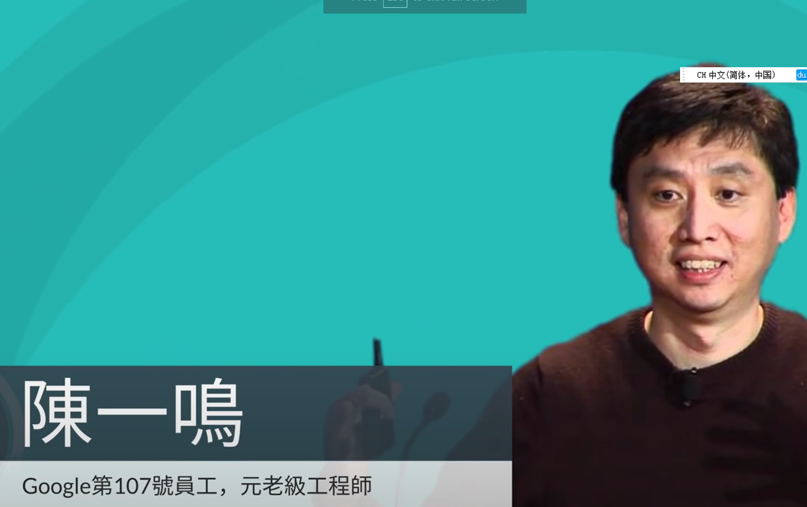
			- 
			- 
		- [[GoalMachine]][[Self]]
		  collapsed:: true
			- 
			- 
			- 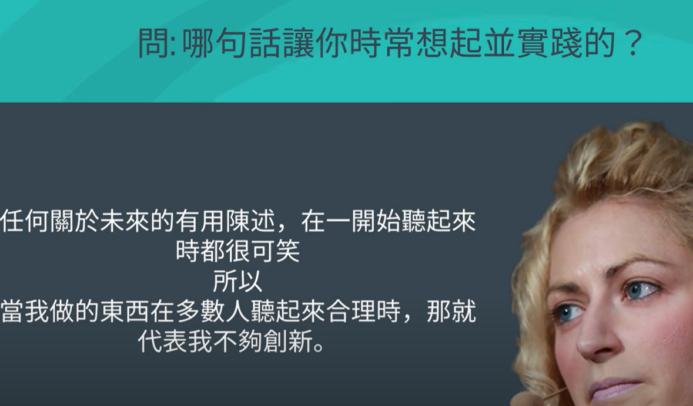
			-
		- [[WorkingHabits]]
		  collapsed:: true
			- 
			- 
			- 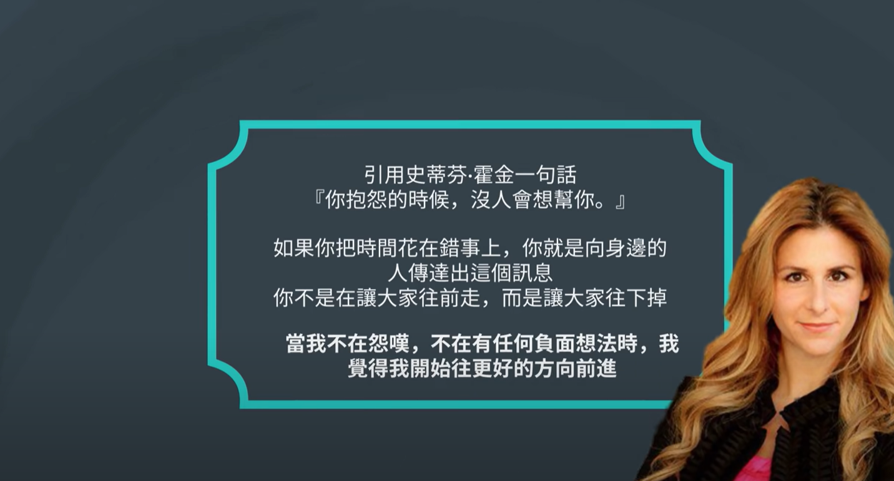
			-
		- [[Innovation]]
		  collapsed:: true
			- 
			- 
			- 
			-
		- [[self]][[BeingExcellent]][[ScottAdams]] [[Celebrities]]
		  collapsed:: true
			- 
			- 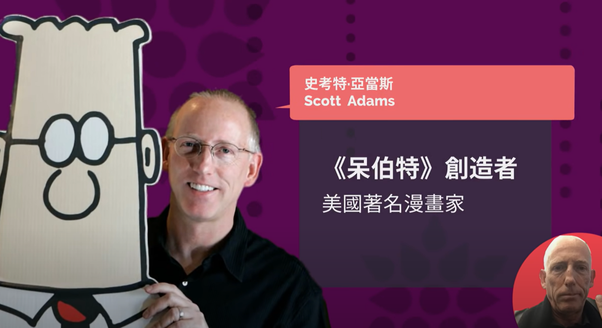
			- 
			-
			-
		- [[self]] [[BrainScience]] [[SolutionNotes]]
		  collapsed:: true
			- 
			- 
			- 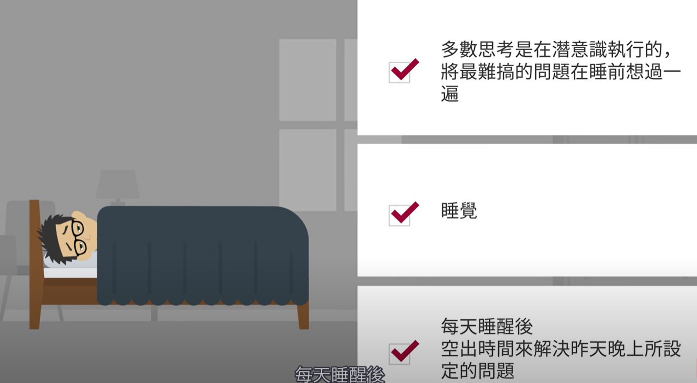
				- 睡醒后空出1h的时间来解决
		- [[self]] [[GoalMachine]]
		  collapsed:: true
			- 
			- 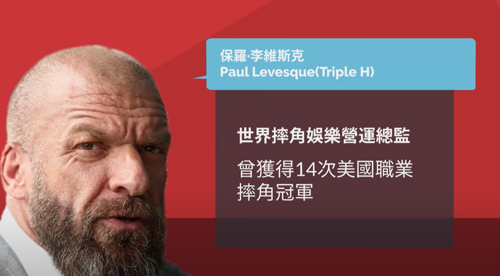
			- 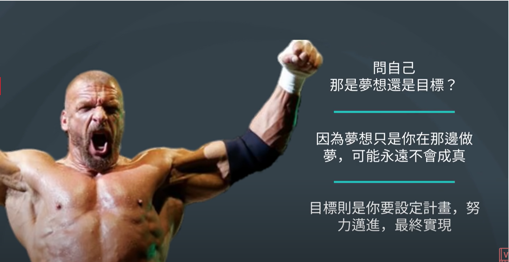
			-
			-
		- [[self]] [[GoalMachine]][[Bravery]]
		  collapsed:: true
			- 
			- 
			-
		- [[self]] [[SelfAnalysis]]
		  collapsed:: true
			- 
			- 
			- 
			- 
			-
		- [[LearningTricks]] [[SolutionNotes]]
		  collapsed:: true
			- 
			- 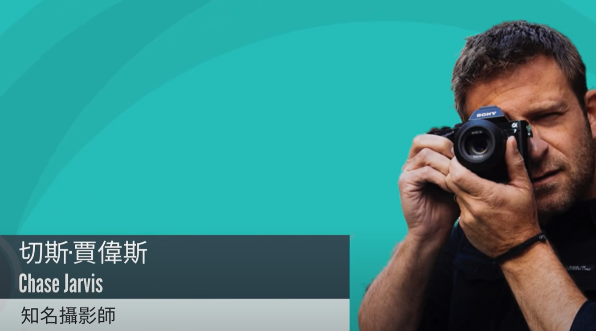
			- 
			-
		- [[LearningTricks]] [[self]]
		  collapsed:: true
			- 
			- 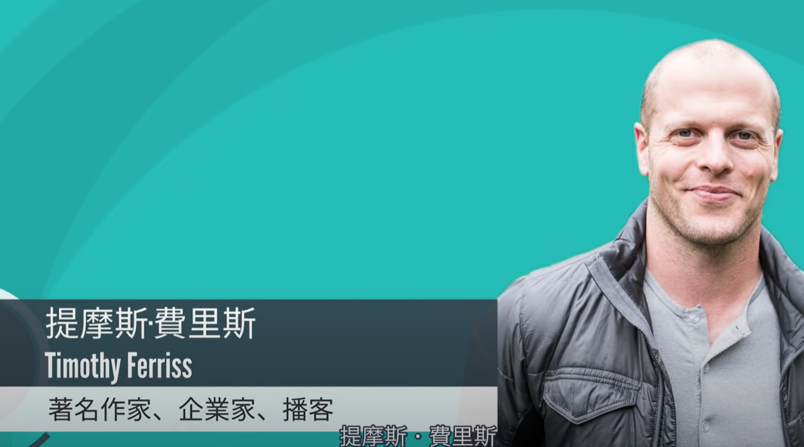
			- 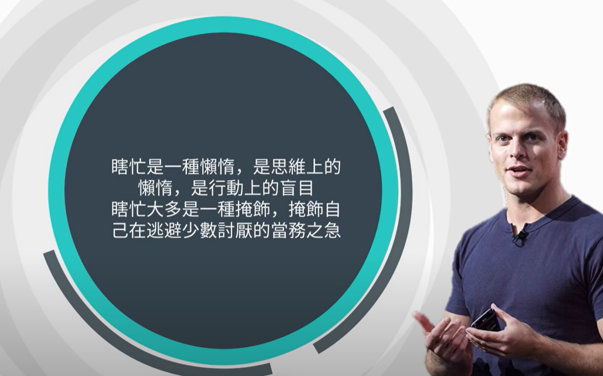
			-
		- [[self]]
		  collapsed:: true
			- 
			- 
			- 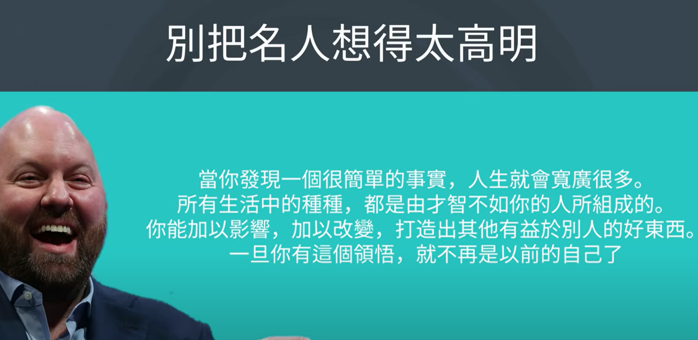
			-
		- [[self]]
		  collapsed:: true
			- 
			- 
			- 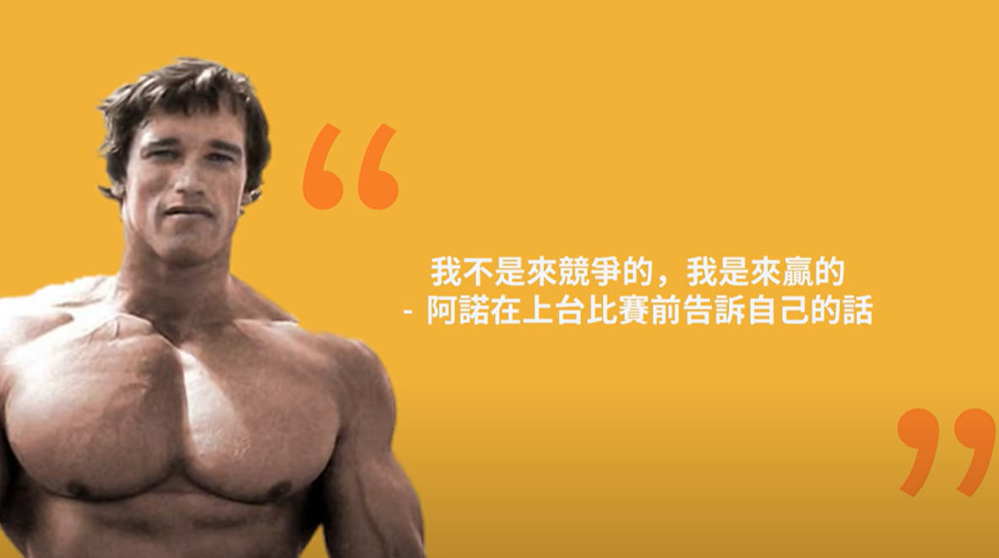
			-
-