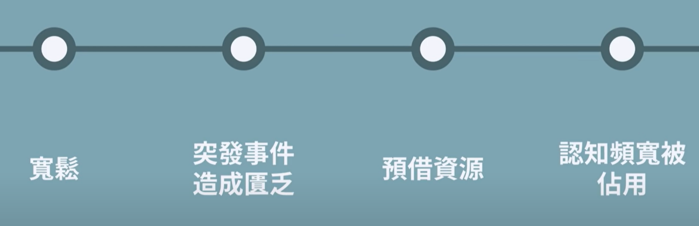

- {{youtube https://www.youtube.com/watch?v=xkEzdWmNFBY}}
	- 如何判断一个人匮乏什么？
		- 研究表明：[[$red]]==当我们对某件事情愈匮乏时，心智就会偏好去寻找那些事物== [[匮乏原理]]。匮乏的外在表现就是需求，这一点说明了人的需求可能并不是主观性的，而是客观性的，因为客观现实导致了某种匮乏。所以，从这点来说，并不能批判任何一个人需求或者说欲望的好坏，因为这往往是他自己无法决定的。
		- 质疑：
			- [[#red]]==乞丐或者流浪汉明明很匮乏money，可是他们中的部分人只是什么都不做，甚至无所谓，不去干活赚钱呢==？
				- 我觉得是因为一个人身上是存在多种匮乏的，[[#green]]==一方面并不是每一种匮乏都会表现出来，有些匮乏甚至自己都意识不到；另一方面这多种匮乏之间是有优先级的==。[[#blue]]==流浪汉有money的匮乏，但更可能有工作能力、社会信任度、内心价值体验、家庭的匮乏，而每个流浪汉最匮乏的东西不一样，需要对症下药==。
					- 对于价值体验的匮乏，如果只提供给流浪汉一笔money，并不能帮助他们解决问题，他们会在挥霍钱财之后再一次陷入money的匮乏；
					- 对于纯粹money的匮乏，比如创业失败而破产，提供money则能够帮助他们东山再起。
			- [[#blue]]==苏格拉底明明精神世界很丰富，可是为什么想要更深入的思考？很多人已经赚够了足够多的钱，为何还要赚更多的钱？==[[#red]]==明明他们需要的东西已经不再匮乏了，但是他们还是表现出一种无限碰撞的欲求呢？==
				- 我觉得匮乏可能是一个相对的概念，[[#green]]==一般的匮乏指的是以现实世界的客观标准比如平均薪水、平均数量来衡量的，但是对于个人来说，匮乏具有主观性==。
	- 为何时间匮乏的人会更匮乏时间？为何忙碌的人会更忙碌？
		- 【1】因为匮乏会让人们走进两类陷阱：
			- [[隧道效应(TunnelEffect)]]
				- 
				- 人们的注意力会被集中到 “当前匮乏”这个狭窄的隧道上，这个隧道属于紧急的任务，会带来立刻即可的利益，但很有可能是[[紧急不重要]]，而不是[[紧急且重要]]，更会让人们忽略[[重要但不紧急]]的Tasks。这会让[[重要但不紧急]]未被解决的负面影响随时间累积而增加。
			- [[认知频宽(BandWidth)变窄]]
				- 一个具有丰富经验和知识的人显然具有全面的认知，但是这样的人为何也会犯错？
					- 因为全面的认知并不能在做一件事时完全被调用。比如，刚打开电脑时，[[认知频宽（BandWith)]]是100%，而打开多个浏览器tab页后则降低为50%。在开一辆车时，看到的视野范围是有限的；同样，在做一件事时，调用的认知系统也是有局限性的。
				- 这会有什么不利影响？
					- [[流动智力(FluidIntelligence)]]
						- 
						- 会降低人的流动智力。比如获取收成之后的果农会比没有收成时纸上更高。 [[Cases]]
					- [[自制力]]
						- 
						-
		- 【2】匮乏的来源是什么？
			- 所有的匮乏都来自[[宽松]]。匮乏会让我们向未来预借资源，这会导致我们忙于处理这些匮乏，而产生 [[隧道效应(TunnelEffect)]]。简单来说，[[匮乏带来更多匮乏]]就是拆东墙补西墙、拆西墙补南墙、拆南墙补北墙，比如花信用卡还另一个信用卡。
				- 
		- 【3】如何解决[[匮乏带来更多匮乏]]？ [[SolutionNotes]]
			- [[刻意宽松]] 为自己留出“工作是什么？”（也就是忘记工作）的时间段，这样能够让我们利用闲暇去想起 [[重要但不紧急]]的[[长期目标]]，也能够帮助我们抵御[[突发状况]]。
				- 
				-
		- 【4】如何从匮乏的角度，来看待别人的错误？
			- 每个人的错误或多或少都是因为 [[认知频宽(BandWidth)变窄]]导致的。所以：
				- {:height 162, :width 470}
			- 匮乏是一种[[环境条件]]：
				- 
			-
-
-