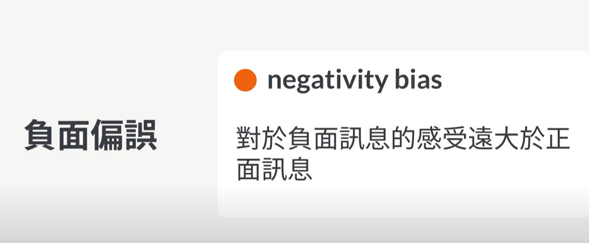

- {{youtube https://www.youtube.com/watch?v=W-2Q2N_ym4k}}
	- [[无意识偏误]][[思维偏误]]
		- 有多种形式：
			- 人们习惯用过去的平均值来预测某个人或者某件事
			- 用生活经验来帮助眼前的人来做分类
		- 这样造成的结果就是[[刻板印象]]：
			- 职业的性别判定、人种等
		- 如何减少[[无意识偏误]]？ [[SolutionNotes]]
			- 刻意散发出那个位置应该有的信号，[[分析需要培养的公众形象]]，能够使得持有刻板印象的人放下偏见
		- 但是在执行目标过程中，还会存在哪些谬误？[[思维谬误]][[SolutionNotes]]
			- [[规划谬误]]：对自己的生产力过于乐观
				- 
				- 将规划时间乘以1.5倍，不断调整倍数；依据状态好、中等、差来及时调整任务量
			- [[负面偏误]]：
				- 
				- 主动搜寻正面事件
			- [[聚光灯效应]]：
				- 
-