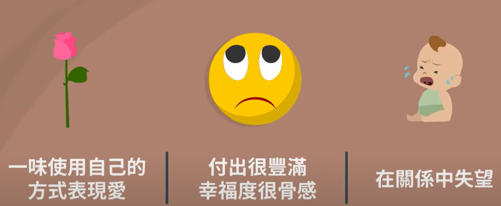

- {{youtube https://www.youtube.com/watch?v=YN8r2JSw1ag}}
	- [[Love]] [[InterpersonalSkills]]
		- 问题如书名，怎么让别人爱上你？
			- 一：记住[[等价交换]]原则 注重外表
			- 二：不是缺少[[开场白]]，而是缺少[[勇气(Courage)]]
				- 开场白的[[注意事项]]：
					- 注重仪态端庄、口气诚恳
					- 避开错误时间点
					- 避免[[油腔滑调]]
				- 开场白要在根据人、时间点进行选择，比如不在人多、下大雨时上前
			- 三：使用身体的部位来说话，使得对方坠入[[苯乙胺]]
				- [[眼睛]]是身体最性感的部位，[[瞳孔]]放大的眼睛会激发男生和女生的正面反应
				- 当对话谈论到断点或者终止式，眼神不要飘走，不要急着对话，而是可以紧盯着对方3-4s，最后才移开
			- 四：增加[[亲密感]]的技巧
				- 「回聲」用对方的[[行话]]来回应对方
				- 「殺手鐧」讚美—把觀察到不起眼的特質用作讚美
				- 了解對方婚戀觀
					- 
					- 
						- [[更换主词提问法]]
					- 
					- 
					-
		- 是相异还是相似的人更容易相爱？
		  collapsed:: true
			- 是相似的人，因为：相似会证明自己的观点看法是正确的 => 带来安全感
			- 
				- [[相异性]]会增加生活的乐趣，但是当巨大的[[相异性]]会影响到彼此的生活方式时，那就会变成[[扣分项]]
				- 
			-
		- 相爱中的状态？
		  collapsed:: true
			- 
			-
-
-