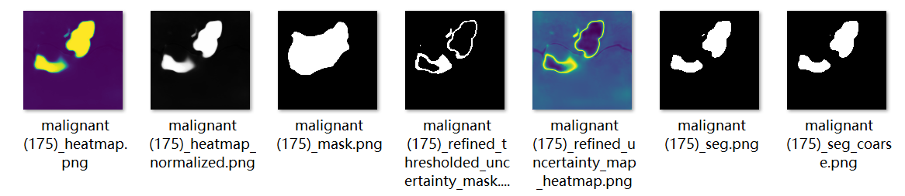

- DONE 完成后三章的研究问题
  :LOGBOOK:
  CLOCK: [2024-02-12 Mon 01:00:07]
  CLOCK: [2024-02-12 Mon 01:00:08]--[2024-03-21 Thu 01:18:47] =>  912:18:39
  :END:
- DONE 完成大论文的提纲
  :LOGBOOK:
  CLOCK: [2024-02-13 Tue 03:04:56]
  CLOCK: [2024-02-13 Tue 03:05:33]--[2024-03-21 Thu 01:18:46] =>  886:13:13
  :END:
- DOING 写完大论文第一章
  :LOGBOOK:
  CLOCK: [2024-02-13 Tue 03:05:40]
  CLOCK: [2024-02-13 Tue 03:05:43]
  :END:
- DOING 完成第三章的实验和论文内容
  :LOGBOOK:
  CLOCK: [2024-02-13 Tue 03:05:55]
  CLOCK: [2024-02-13 Tue 03:05:57]
  :END:
	- DONE 找到seg和seg_coarse差异比较大的图片
	  collapsed:: true
	  :LOGBOOK:
	  CLOCK: [2024-03-21 Thu 01:18:55]
	  CLOCK: [2024-03-21 Thu 01:18:57]
	  CLOCK: [2024-03-21 Thu 01:20:30]--[2024-03-21 Thu 01:50:46] =>  00:30:16
	  :END:
		- DOING 不确定性方法1
		  :LOGBOOK:
		  CLOCK: [2024-03-21 Thu 01:20:46]
		  CLOCK: [2024-03-21 Thu 01:20:50]
		  :END:
			- benign (49)_seg.png
			- benign (132)_seg.png
			- malignant (111)_seg
			- 
			- 
			- 
			- 
			-
		- DOING 不确定性方法2
		  :LOGBOOK:
		  CLOCK: [2024-03-21 Thu 01:21:03]
		  CLOCK: [2024-03-21 Thu 01:21:05]
		  :END:
			- 
			- 
			- 
			-
		- DOING 不确定性方法3
		  :LOGBOOK:
		  CLOCK: [2024-03-21 Thu 01:21:09]
		  CLOCK: [2024-03-21 Thu 01:21:11]
		  :END:
			- 
	- DOING 对比三种方式下的不确定性MASK的区别以辨别出模型自身的特点
	  collapsed:: true
	  :LOGBOOK:
	  CLOCK: [2024-03-21 Thu 01:50:50]
	  CLOCK: [2024-03-21 Thu 01:50:51]
	  :END:
		- 
		-
	- DOING 三种方式都可能失效的图片
	  :LOGBOOK:
	  CLOCK: [2024-03-21 Thu 02:37:30]
	  CLOCK: [2024-03-21 Thu 02:37:31]
	  :END:
		- 
		- 
		- 
		- 初始轮廓提取的就有问题
		- 
		- 
		-
	-
-
- DONE 只用refined features来分割
  :LOGBOOK:
  CLOCK: [2024-03-21 Thu 18:00:48]--[2024-03-21 Thu 19:08:58] =>  01:08:10
  :END:
	- train
	  collapsed:: true
		- 
		- 
		-
	- test
	  collapsed:: true
		- 
- DONE 多尺度的方式2的叠加
  :LOGBOOK:
  CLOCK: [2024-03-21 Thu 20:19:57]--[2024-03-21 Thu 20:21:24] =>  00:01:27
  :END:
	- test
		- 
	- train
	  collapsed:: true
		- 
- DONE 方式2最好的可视化版本
  collapsed:: true
  :LOGBOOK:
  CLOCK: [2024-03-21 Thu 20:22:40]
  CLOCK: [2024-03-21 Thu 20:22:48]--[2024-03-21 Thu 20:24:16] =>  00:01:28
  :END:
	- test
	  collapsed:: true
		- 
		-
	- train + val
	  collapsed:: true
		- 
- 方式3最好的参数的可视化版本
	- train
	  collapsed:: true
		- 
		- 
		-
		-
	- test
		-
-
- DONE 更改公式后的实验结果
  :LOGBOOK:
  CLOCK: [2024-03-21 Thu 22:14:13]
  CLOCK: [2024-03-21 Thu 22:14:20]--[2024-03-21 Thu 22:14:59] =>  00:00:39
  :END:
	- train + val
	  collapsed:: true
		- 
	- test
		- 
		-
-
-
-