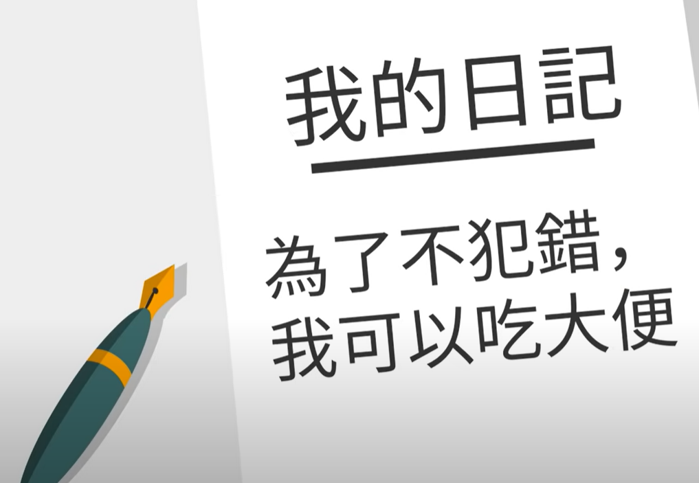

- {{youtube https://www.youtube.com/watch?v=Kzl1m_SJl0w}}
	- [[Mistakes]][[后悔(Regret)]]
		- 后悔产生的两个要素是什么？
		  collapsed:: true
			- 一是做出了某个决定，另一个是具有丰富的[[想象力]]
		- 为何我们对犯错总是非常敏感？
		  collapsed:: true
			- 人们容易把[[正向结果]]与[[好的成因]]关联，并把[[负向结果]]与[[坏的成因]]进行关联
			- 因为不想让自己出现[[负向结果]]，而被别人judge具有 [[坏的成因]]，通俗说，就是害怕犯错之后有点糗，从而逼迫自己成为[[错误管理大师]]，但是这是有一些代价的：
				- 犯错让我们不舒服的原因是，我们一直在注意自己是否犯错了。比如在家玩电竞和在学校参加比赛、和朋友打球与在学校运动会赛场打球，后者的出错率是惊人的：
				  collapsed:: true
					- 
				- 让我们[[高估]]了犯错的影响
				- 担心失误而失常 => 高估犯错的影响 => 啥都不敢做
				-
		- 后悔非常常见，虽然是用后面的立场和观点来看待前面做出的选择，但还是让人懊恼，所以有没有抗后悔药呢？
			- [[普遍性]] 可以谷歌搜索同一件事后悔的网络数据，发现数据量很高，比如"结婚后悔”，所以大家都有的问题，会给人以安慰
			- [[交给时间]] 时间可以淡化某些后悔
			- [[只有你在意]]
				- [[聚光灯效应]]的实验中大多数人约为80%的人不会关注到某个人多穿的出糗的衣物
		- 面对后悔，我们应该保持怎么样的心态？ [[MindsetManager]]
			- [[如果都没犯错，代表你处理的问题不够困难，这便是最大的错误]][[犯错是必然的]]
			- [[要是我们不肯高估自己，我们所完成的事项中，有一半根本不会开始]]
			- [[要么从后悔中学会我还是有学习空间的，要么爱其所选]]
			- [[在用钱上的后悔根本排不了前几名]]
			- [[人际关系破裂给人带来的后悔通常是比较巨大的]]
			-
		-