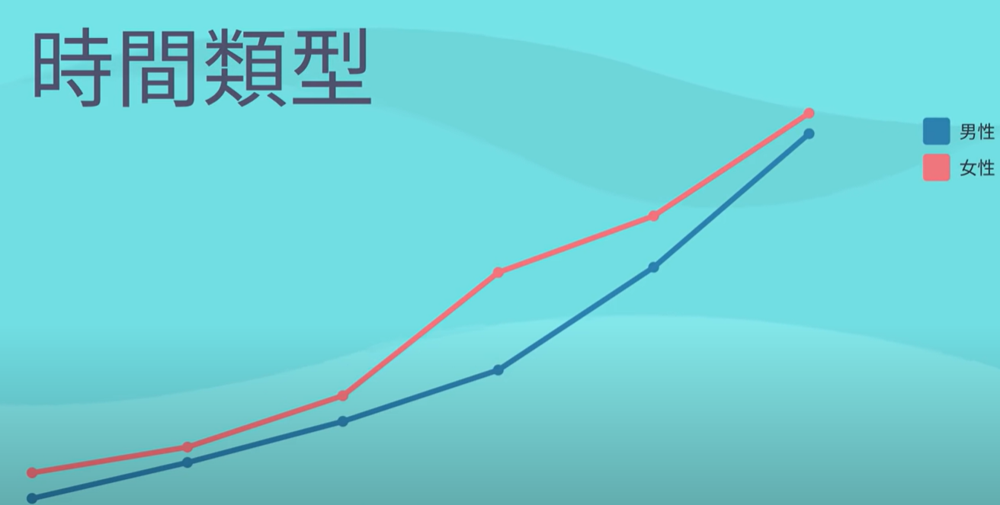
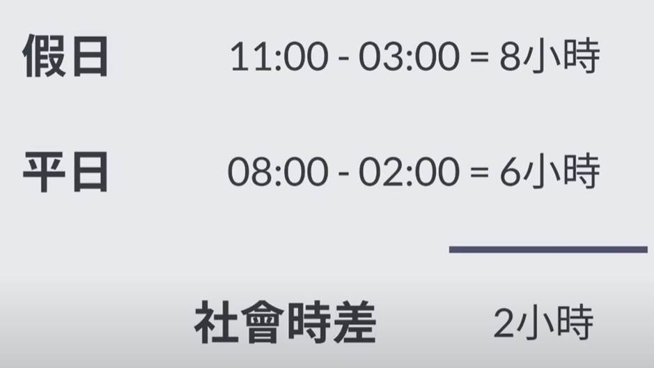

- {{youtube https://www.youtube.com/watch?v=tmOb4iuuNAA&list=PL6WivEmOIOxQToIq0sEZGhvV13ANvCe3P}}
	- [[休息(RestingOrSleeping)]][[思维偏误]]
		- 为什么人们会普遍认为早起的人更勤奋，而晚起的人更懒惰呢？这种看法到底是不是一个真相呢？
		  collapsed:: true
			- 这种判断背后主要有两个因素：
			  collapsed:: true
				- [[#red]]==早起文化的价值观宣传(早起的鸟儿有虫吃、一日之计在于晨等) 使得 人们对于早起赋予了更多的 正面意义==
				- 早起的人常在公共场合工作，[[#green]]==能够被他人更多地看到==；而晚起的人可能在家熬了一宿来准备方案，也可能在家玩了一晚上的电子游戏，[[#green]]==因为很难被人们所观察到所以在家努力工作的可靠性和信任度也大大降低，即便是在办公室加班工作到很晚，能够观察到的人也是极其有限的==
			- 这种观点产生自[[#blue]]==尚不成熟的工业时代==：
				- 那时候[[#green]]==人造照明还不够普及，早起时来工厂干活的工人会有更长的工作时间==，因为他们利用了清晨时分的微弱光照
			- 但是，当夜间照明大量使用时，[[$green]]==这一结论显然就不成立了，这时候分化出了两大类的[[睡眠模式]]。一种被称作 [[云雀型]]，睡的早，起的也早，工作的也早；另一种被称为[[猫头鹰型]]，晚睡晚起，晚上灵感很好。==
		- 人们的[[睡眠模式]]会随着年龄发生什么样的变化呢？
		  collapsed:: true
			- 可以通过[[迪斯可效应(DiscoEffect)]]来 观察或者说推测 睡眠模式与年龄的关系：
				- 其说的是 [[舞厅]]或者[[酒吧]]等夜间场所的出现让青少年的寻衅滋事率提高了
			- 这里我们不在[[社会学]]层面对此展开 舞厅或者酒吧 的负面影响研究，而是从睡眠科学的角度 来 看待其隐藏的积极的一面。所以，是不是，青少年 更可能是 [[猫头鹰型]]，而中老年人 更可能是 [[云雀型]]？
				- 答案是：的确如此
					- 首先需要了解[[时间类型]]这个概念，其指的是从开始感到入睡到睡醒这样一个时间片段，只要开始感到入睡的时间点不同，那么[[时间类型]]就是不同的。据科学研究表明，婴儿时期的[[入睡时间点]]是最低的，随着年龄不断增加，男性在21岁、女性在19.5岁时的 [[入睡时间点]]达到最高，而后又不断下降。
					  collapsed:: true
						- 
					- [[$red]]==这也就是说男女生在这个年龄阶段本来晚上就会更有活力，所以这些夜间场所为他们提供了一个释放活力的场合；这也同样解释了为什么了老人睡觉会睡得很早的原因==。
					- 我的质疑是：舞厅或者酒吧的蓝光很明显会使得青少年的 [[入睡时间点]]变得更晚，所以应该改用更柔和的灯光？
		- 为啥各种名人普遍都是早睡早起的[[云雀型]]的睡眠模式？[[案例解释]]
		  collapsed:: true
			- 质疑点为：
				- 到底是：\lceil因为早睡早起，所以更容易却得成功\rceil 还是 \lceil 因为成功者的职业属性，所以更倾向于早起早睡呢？\rceil
			- 质疑的结果是：
				- 网络上或者被大家所知晓的各种名人通常的职业都是[[领导类型(leader)]]的工作，很大概率上是因为 [[云雀型]]人更擅长处理决策问题，或者说清晨非常适合管理事务；而 [[猫头鹰型]]人可能更擅长其他的思考类的职业，但这些职业的知名度不大和受众范围不广，所以这种类型下的名人不为人们所知。
				- 该问题[[归因]]过程中的关键在于：
					- 是 具有某种特征 => 产生某种特定行为  还是说  经常做某种特定行为 => 产生了某种特质
					- 我个人理解的是：某种个人特质A => 经常做某种特征行为B => 产生另外一种个人特征C，在这里就是： [[云雀型]]睡眠模式 => 经常在早晨做决策，决策效果出乎意料得好 => 这个人积累了优秀的管理能力，晋升为优秀的leader。
		- 为啥在工作日和周末不使用同一套作息方式反而会让人更累呢？ [[案例解释]]
		  collapsed:: true
			- 因为这样会导致[[社会时差]]的出现：下图中节假日的作息切换带来的实际效果相当于是，在假日时区的所在地起床后（假设时刻是m），然后到时区早两个小时的地方工作t小时，工作结束后再返回原休息地，此时的时刻应该是(m + t + 2), 这里的两小时就是社会时差
			  collapsed:: true
				- 
			- 如何缓解[[社会时差]]对睡眠的干扰？
				- 增加在[[室外]]的时间：出门散步  或者  骑自行车上班，因为这会增加光照，促进[[褪黑素]]的释放，且实验证实：[[$red]]==在户外两小时可以调整社会时差一小时==
		- 如何解释在乡村地区生活的人比在城市生活的人更喜欢早睡早起？ [[案例解释]]
		  collapsed:: true
			- 原因不是乡村比城市的夜生活单调，而是乡村的人通常会在室外进行工作，比如锄草、种树，白天和晚上接触到的[[光照量]]是不同的，城市的人在室内工作，由于照明灯的辅助，白天和晚上的 [[光照量]]差不多相同
			- 实验表明[[温度]]和[[光照]]对人的睡眠影响非常大
		- 如何理解人睡眠的规律？[[规律]]
		  collapsed:: true
			- 人睡眠包含两种类型的[[自然规律]]：
			  collapsed:: true
				- [[行为节律]] 代表着我们会[[#green]]==在什么时间点感到有精神、什么时间点想休息、甚至什么时候要进行排泄==
				- [[生理节律]] 代表着我们体内的内分泌，[[#red]]==不是我们所能控制的==
					- 大部分人都是在凌晨四点半达到体温的最低点，在晚上六点半时的血压来到一天中的最高点，在19:00的时候开始分泌褪黑素
					-
					-
				-
-
-