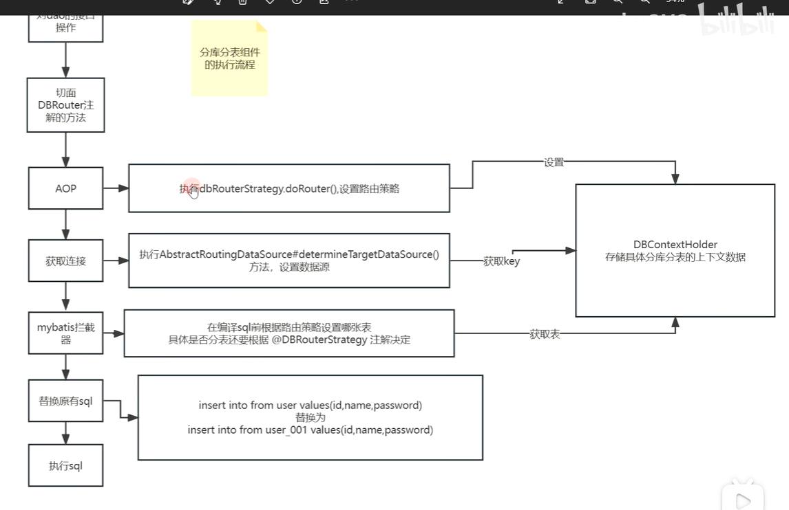
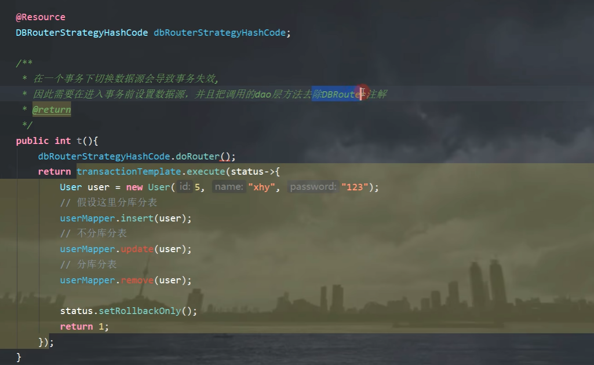
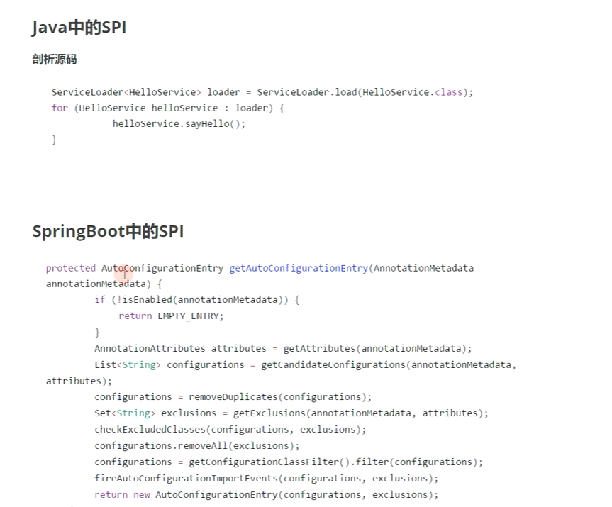
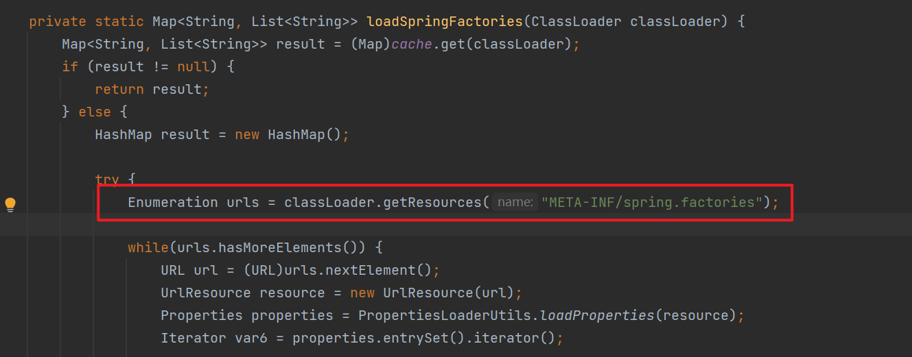
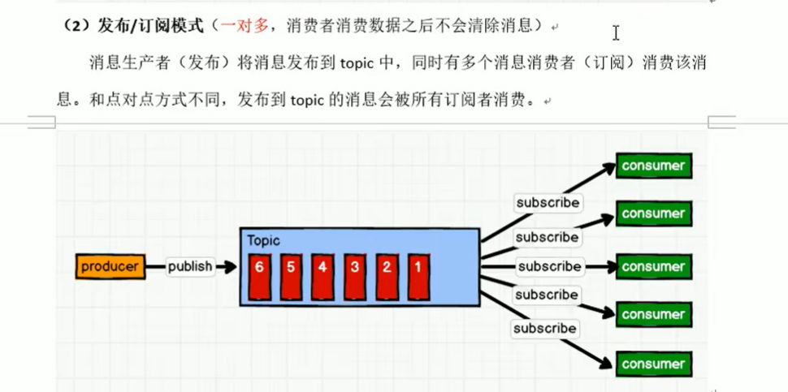
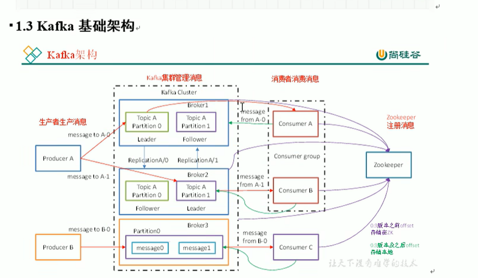

- 项目链接：
  id:: 64351413-3ead-4b40-9a8c-2b223b100323
  collapsed:: true
	- https://gitcode.net/KnowledgePlanet/Lottery/-/wikis/home
	- https://bugstack.cn/md/project/lottery/Part-2/%E7%AC%AC05%E8%8A%82%EF%BC%9A%E6%8A%BD%E5%A5%96%E7%AD%96%E7%95%A5%E9%A2%86%E5%9F%9F%E6%A8%A1%E5%9D%97%E5%BC%80%E5%8F%91.html
	- [CreativeAlliance / lottery-5215-Tankard · GitCode](https://gitcode.net/CreativeAlliance/lottery-5215-tankard)
	- 提交规范：
		- [文件 · 210814_xfg_strategy · KnowledgePlanet / Lottery · GitCode](https://gitcode.net/KnowledgePlanet/Lottery/-/tree/210814_xfg_strategy)
		- [Lottery/sqls · master · CreativeAlliance / lottery-5215-Tankard · GitCode](https://gitcode.net/CreativeAlliance/lottery-5215-tankard/-/tree/master/Lottery/sqls)
	- 改进：
	  collapsed:: true
		- [关于使用扫描方式注册抽奖策略方案 (#54) · Issue · KnowledgePlanet / Lottery · GitCode](https://gitcode.net/KnowledgePlanet/Lottery/-/issues/54)
- [[ProjectIssues]
  id:: 64351412-2165-45f5-83a0-bea12361f875
  collapsed:: true
	- DONE 一直报错xml和mapper对应的接口没有匹配起来：
	  collapsed:: true
	  :LOGBOOK:
	  CLOCK: [2023-02-26 Sun 07:31:42]--[2023-02-26 Sun 08:45:23] =>  01:13:41
	  :END:
		- 
		- 
		- 问题分析和解决办法：
			- 错误的原因在XML文件，第一个错误是我建的并不是xxx.xml文件，而是xxx文件；二是直接新建的xml文件名与Mapper对应的接口名并不一致（参考[(87条消息) 解决org.apache.ibatis.binding.BindingException: Invalid bound statement (not found)问题_孙大诚_SunRobin的博客-CSDN博客_org.apache.ibatis.binding](https://blog.csdn.net/sundacheng1989/article/details/81630370)）。在我把Activity_Mapper重命名为IActivityDao.xml之后，运行该测试类依旧报了相同的错误，检查后发现此时target目录下里面的Activity_Mapper并没有进行对应的更新，于是按照[(87条消息) IDEA 错误 找不到或无法加载主类（完美解决）_Adam`南帝·梁的博客-CSDN博客_找不到或无法加载主类](https://blog.csdn.net/l_mloveforever/article/details/112725753)将该target目录删除，重新build了整个项目。
			- 这是发现依据会报错“No runnable Method”，这才发现这个error和下面一张图片的报错“Invalid bound statement ”并不是同一个错误原因导致的，这个错误是junit的导包错误导致的：[(87条消息) java.lang.Exception: No runnable methods_孤鸿踏雪的博客-CSDN博客](https://blog.csdn.net/single_wolf_wolf/article/details/106745959)。我导的包是
			  import org.junit.jupiter.api.Test。
			- 还有的一些其他小问题：junit的测试方法必须是以public来修饰的；最好使用MapperScan(basePackages={})的方式来扫描Mapper，同时注意MapperScan里面的参数是目录而不是具体的文件地址
			-
	- DONE 打包整个项目的时候报错：
	  collapsed:: true
	  :LOGBOOK:
	  CLOCK: [2023-02-26 Sun 09:03:51]
	  CLOCK: [2023-02-26 Sun 09:03:54]--[2023-02-26 Sun 14:16:04] =>  05:12:10
	  :END:
		- 
		- 分析原因和解决办法：
			- 出现了多种类型的错误：
				- 一是在父的pom中已经定义了<groupId>org.example</groupId>和<version>1.0-SNAPSHOT</version>, 那么在所有的子模块中就无需再次定义这两个标签了，因为子模块可以继承这两个，而我在实际的代码中把有些子模块的版本写成了0.0.1-SNAPSHOT, 这样不仅会让整个项目的版本看起来混乱，更容易引发依赖管理的错误；同样在父pom中定义的properties通常也是可以直接在子POM中复用的
				- 二是当前报错的核心原因，就是我的lottery-common的packing方式不是jar而是写成了pom，所以就会出现找不到jar包的这种错误提示了；只有根目录下使用pom的方式进行打包，而其他子模块除了interfaces使用war方式打包以外，都使用jar的打包方式，如果对根目录也就是当前工程使用jar方式打包，则会报错如下：
					- 
				- 三就是得先运行父POM的clean和install，再来运行子POM中的clean和install，如果先直接运行子POM，也会出现上面的这种错误
	- DONE 无法进行rpc通信，报错如下：
	  collapsed:: true
	  :LOGBOOK:
	  CLOCK: [2023-02-26 Sun 15:37:37]
	  CLOCK: [2023-02-26 Sun 15:37:39]--[2023-02-26 Sun 17:58:22] =>  02:20:43
	  :END:
		- 
		- 
		- Injection of @org.apache.dubbo.config.annotation.Reference dependencies is failed; nested exception is java.lang.IllegalStateException: No such any registry to reference com.example.rpc.IActivityBooth on the consumer 10.192.24.196 use dubbo version 2.7.1, please config <dubbo:registry address="..." /> to your spring config.
		- 解决方法：
			- 必须开启interfaces的启动类运行，同时要在服务方和客户端配置dubbo。
			- 如果使用直连模式：
			  collapsed:: true
				- 
			- 如果使用广播模式：
			  collapsed:: true
				- 无论使用本地ip地址还是localhost，都报错如下，暂时不解决，等学完dubbo再说：
					- 
	- DONE interfaces子模块报错java.lang.IllegalArgumentException:Property ‘sqlSessionFactory‘ or ‘sqlSessionTemplate‘ are required
	  collapsed:: true
	  :LOGBOOK:
	  CLOCK: [2023-02-26 Sun 17:45:02]--[2023-02-26 Sun 17:45:40] =>  00:00:38
	  :END:
		- 解决方法：将mybatis-spring-boot-starter的版本从3.0.0切换到2.1.4
	- DONE 报出如下警告，与junit有关
	  collapsed:: true
	  :LOGBOOK:
	  CLOCK: [2023-02-26 Sun 17:55:36]--[2023-02-26 Sun 17:57:00] =>  00:01:24
	  :END:
		- 
		- 解决办法：
			- 还是junit导包的问题，参考
				- https://blog.csdn.net/One_L_Star/article/details/103293616
				-
			-
	- StrategyDetail的默认id是String类型的，而不是平常的Long类型；strategyId和activityId的类型是Long, 而不是像awardId是String类型的
	- DONE 注意org和com开头的groupId，不要把两者混淆，造成一下写org一下写com的错误，会引起很多依赖的问题
	  :LOGBOOK:
	  CLOCK: [2023-02-27 Mon 23:17:21]
	  CLOCK: [2023-02-27 Mon 23:17:23]--[2023-02-27 Mon 23:17:54] =>  00:00:31
	  :END:
	- DONE 一直报告使用@Component标记的这个类的Bean找不到
	  collapsed:: true
	  :LOGBOOK:
	  CLOCK: [2023-02-27 Mon 23:22:45]
	  CLOCK: [2023-02-27 Mon 23:22:46]--[2023-02-28 Tue 11:02:30] =>  11:39:44
	  :END:
		- 
		- 问题分析和解决方法：
			- 最先开始是只有这个错误，后来为了改正这个错误，不小心将MapperScan里面的org.example又写成了com.example，导致一直无法找到IActivityDao这个Bean；这里是在SpringBoot的启动类必须写上MapperScan，如果只在对应的接口写上了Mapper也是无效的，报错会如图。原因是这里Mapper对应的那些接口类和springboot的启动类并不在一个同一个目录下，也不再启动类的子目录下，所以直接使用Mapper是没办法获取到正确的Mapper文件的路径的。我这里的错误本质上也是路径错误，只不过是把路径的名称也写错了。
			  collapsed:: true
				- 
			- 查阅了[(88条消息) [Spring]在使用@Resource进行属性注入时,IDEA编译器报红线错误[非Maven项目]_臧初之的博客-CSDN博客_idea @resource 报错](https://blog.csdn.net/mmmm0584/article/details/114646721)资料后添加了javax.annotation的依赖，但是发现并不管用
			- 最终解决办法是：在interfaces这个module下的启动类里面写上了ComponentScan注解，之前在测试类上写了这个注解并没有效果，所以需要注意注解所写的位置。这里问题的本质和“无法找到IActivityDao这个Bean”是一样的，都是因为要引用的对象在另一个module中，直接在对应的单独文件上标注@Componet也是无效的，必须显示在当前的启动类中加入扫描的目录
				- 
	- DONE sql语句执行报错
	  collapsed:: true
	  :LOGBOOK:
	  CLOCK: [2023-02-28 Tue 10:19:18]
	  CLOCK: [2023-02-28 Tue 10:19:20]--[2023-02-28 Tue 10:40:01] =>  00:20:41
	  :END:
		- 
		- 
		- 在application.yml文件中不能同时写上这两个属性配置，去掉configuration即可
	- DONE 不运行rpc-test时报出了与dubbo相关的错误：
	  collapsed:: true
	  :LOGBOOK:
	  CLOCK: [2023-02-28 Tue 11:04:12]
	  CLOCK: [2023-02-28 Tue 11:04:14]--[2023-02-28 Tue 11:36:22] =>  00:32:08
	  :END:
		- 
		- 
		- 20880这个端口被占用了：
			- 换用20881，即可解决
			- [(88条消息) 解决com.alibaba.dubbo.rpc.RpcException: Fail to start server(url: dubbo://192.168.194.1:20880/...报错方案_林深见喵的博客-CSDN博客_fail to start server](https://blog.csdn.net/HelloWorld998/article/details/94852083)
			-
	- DONE 无法读取service下的抽奖算法接口
	  collapsed:: true
	  :LOGBOOK:
	  CLOCK: [2023-02-28 Tue 11:50:08]
	  CLOCK: [2023-02-28 Tue 11:50:14]
	  CLOCK: [2023-02-28 Tue 11:50:22]--[2023-02-28 Tue 13:23:21] =>  01:32:59
	  :END:
		- 
		- 给IDrawExec的实现类而不是接口本身添加了@Service(name="")的注解
	- DONE sql语句的异常
	  collapsed:: true
	  :LOGBOOK:
	  CLOCK: [2023-02-28 Tue 13:23:31]
	  CLOCK: [2023-02-28 Tue 15:35:44]
	  CLOCK: [2023-02-28 Tue 15:35:45]--[2023-02-28 Tue 16:10:19] =>  00:34:34
	  :END:
		- 
		- 当没有获奖时，两个算法里面应该返回null值，而不是返回一个字符串，因为这与后面的数据集相关的Dao操作会产生不一致问题，后面的Dao操作都是判断为null，来判断是否获奖。需要保持前后一致：
			- 
				- 改正为return null
			- 
			-
	- DONE @Service到底是什么用途
	  :LOGBOOK:
	  CLOCK: [2023-02-28 Tue 23:56:48]
	  CLOCK: [2023-02-28 Tue 23:56:49]--[2023-03-01 Wed 10:14:06] =>  10:17:17
	  :END:
	- DONE 当没有中奖时，返回的awardId为null，就会报错配送服务的工厂类有空指针异常：
	  collapsed:: true
	  :LOGBOOK:
	  CLOCK: [2023-03-01 Wed 09:23:45]
	  CLOCK: [2023-03-01 Wed 09:23:46]--[2023-03-01 Wed 10:13:58] =>  00:50:12
	  :END:
		- 
		- 解决方案：
			- 如果awardType为null，就不执行配送服务了
	- DONE docker 报错，一致无法启动
	  collapsed:: true
	  :LOGBOOK:
	  CLOCK: [2023-03-01 Wed 22:38:36]
	  CLOCK: [2023-03-01 Wed 22:38:37]--[2023-03-01 Wed 22:39:09] =>  00:00:32
	  :END:
		- 重启电脑就就好了，并没有采用网上的命令法
	- DONE 测试活动分支时的模块之间报错
	  collapsed:: true
	  :LOGBOOK:
	  CLOCK: [2023-03-01 Wed 22:39:19]
	  CLOCK: [2023-03-01 Wed 22:40:32]
	  CLOCK: [2023-03-01 Wed 22:40:42]--[2023-03-01 Wed 23:22:58] =>  00:42:16
	  :END:
		- 
		- 产生了循环依赖，在domain中删除对基础层的依赖
	- DONE 当将domain依赖infrastructure转换成infrastructure依赖domain时，出现了很多的相关问题：[[$red]]==一是必须将domain模块中pom对infrastructure的依赖去除，否则会形成循环依赖；二是将domain领域中不同domain下的repository的接口实现类从domain模块移动到了infrastructure中与dao、po同级的子目录repository中，但是接口的定义仍然保存在domain中，这样在interfaces模块的程序启动类中就必须在ComponentScan注解中加上infrastructure/repository的文件夹地址；==三是本次如下的报错了：
	  collapsed:: true
	  :LOGBOOK:
	  CLOCK: [2023-03-01 Wed 23:51:39]
	  CLOCK: [2023-03-01 Wed 23:51:57]
	  CLOCK: [2023-03-01 Wed 23:52:06]
	  CLOCK: [2023-03-01 Wed 23:52:13]
	  CLOCK: [2023-03-01 Wed 23:53:12]--[2023-03-02 Thu 00:54:52] =>  01:01:40
	  :END:
		- org.springframework.beans.factory.BeanCreationException: [[$red]]==Error creating bean with name 'drawExec': Injection of resource dependencies failed;== nested exception is org.springframework.beans.factory.BeanCreationException: [[$red]]==Error creating bean with name 'strategyRepository':== Injection of resource dependencies failed; nested exception is org.springframework.beans.factory.UnsatisfiedDependencyException: [[$red]]==Error creating bean with name 'IAwardDao' defined in file== [D:\GraduateProject\java_jobs_preparations\lottery_project\lottery-5215-tankard\Lottery\lottery-infrastructure\target\classes\org\example\infrastructure\dao\IAwardDao.class]: Unsatisfied dependency expressed through bean property 'sqlSessionFactory'; nested exception is org.springframework.beans.factory.BeanCreationException: Error creating bean with name 'sqlSessionFactory' defined in class path resource [org/mybatis/spring/boot/autoconfigure/MybatisAutoConfiguration.class]: Bean instantiation via factory method failed; nested exception is org.springframework.beans.BeanInstantiationException: Failed to instantiate [org.apache.ibatis.session.SqlSessionFactory]: Factory method 'sqlSessionFactory' threw exception; nested exception is org.springframework.core.NestedIOException: Failed to parse mapping resource: 'file [D:\GraduateProject\java_jobs_preparations\lottery_project\lottery-5215-tankard\Lottery\lottery-interfaces\target\classes\mybatis\mapper\IActivityDao.xml]'; nested exception is org.apache.ibatis.builder.BuilderException: Error parsing Mapper XML. The XML location is 'file [D:\GraduateProject\java_jobs_preparations\lottery_project\lottery-5215-tankard\Lottery\lottery-interfaces\target\classes\mybatis\mapper\IActivityDao.xml]'. Cause: org.apache.ibatis.builder.BuilderException: Error resolving class. Cause: org.apache.ibatis.type.TypeException: Could not resolve type alias 'org.example.domain.activity.model.vo.AlterStateVO'.  Cause: java.lang.ClassNotFoundException: [[$red]]==Cannot find class:org.example.domain.activity.model.vo.AlterStateVO==
		- [[$green]]==原因分析与解决办法：==
			- 不小心把domain下AlterStateVO写成了AlertStateVO, 所以提示找不到
			- No qualifying bean of type 'org.example.domain.activity.service.deploy.IActivityDeploy' available:
			  collapsed:: true
				- 忘记把domain中的IActivityDeploy的实现类加上@Service注解了，并且需要在interfaces模块的启动类里加上domain下activity的目录文件夹：
					- 
					-
			- 问题来了，为什么会在第一行说名为drawExec的Bean创建失败呢？
				- 这里其实有多个注入的问题，并不是说全部都是因为一个注入失败导致的：
				- 与drawExec无关的注入失败的逻辑是：
					- 原因是这样，nested exception的含义就是更深一层的异常，也就是说程序执行到当前位置出现exception了，如果当前位置的代码是一个方法执行，那么更深一层的异常说的就是方法内部的异常导致的。也就是说，当前位置只是异常暴露出来的最直接最外面的位置，但是真正导致异常的原因，是由于java中的继承、接口实现等机制导致的，更上层的异常。
					- 这里因为IActivityDao.xml这个mapper的parameterType的全限定路径写错了，导致IActivityDao activityDao的资源注入会失败，而org.example.interfaces.test.APiTest中恰恰对该资源进行了注入，所以该测试函数必然报错；
				- 与drawExec有关的注入失败的逻辑是：
					- "drawExec"对应的是IDrawExec接口的实现类DrawExecImpl，而该实现类继承了AbstractDrawBase这个抽象类，继续向上也继承了DrawStrategySupport这个类，而该类中显示用到了对IStrategyRepository资源的注入，而IStrategyRepository的实现类StrategyRepository被放在了infrastructure下的repository类中了，所以必须要显示将该repository的文件夹路径加入启动类的ComponentScan的扫描范围内才行：
						- 
						- 
		-
			-
	- DONE 出现了jdbc的未被分类的SQL异常：
	  collapsed:: true
	  :LOGBOOK:
	  CLOCK: [2023-03-02 Thu 09:33:38]--[2023-03-02 Thu 10:29:33] =>  00:55:55
	  :END:
		- {:height 368, :width 716}
		- 
		- 发现原因在数据组表的字符编码问题，没有注意到sql里面的字符串字段写的编码是：CHARACTER SET latin1, 而latin1是mysql的默认字符集ISO-8859-1，而ISO-8859-1编码是单字节编码，向下兼容ASCII。不支持中文编码，如果你在创建数据库或建表时没有明确指定编码的方式，那么数据库将采用默认的编码方式，而后你在插入中文的数据时将会出现乱码
	- DONE There is no getter for property named 'strategyDesc' in 'class org.example.infrastructure.po.Strategy'
	  collapsed:: true
	  :LOGBOOK:
	  CLOCK: [2023-03-02 Thu 10:29:41]
	  CLOCK: [2023-03-02 Thu 10:29:58]--[2023-03-02 Thu 10:37:14] =>  00:07:16
	  :END:
		- 
		- 对应的类中忘记添加该属性以及对应的setter和getter了，在mapper的xml文件里如果缺乏getter的话，应该就没办法获取#{VaribleName}的值了
	- DONE IdContext里报告Snowflake等都无法被自动装配
	  collapsed:: true
	  :LOGBOOK:
	  CLOCK: [2023-03-02 Thu 15:10:19]--[2023-03-02 Thu 15:11:38] =>  00:01:19
	  :END:
		- 在interfaces启动类的componentscan里加上support这个domain的路径
	- DONE  遇到mybatis自动配置的错误，
	  collapsed:: true
	  :LOGBOOK:
	  CLOCK: [2023-03-03 Fri 19:59:25]
	  CLOCK: [2023-03-03 Fri 19:59:29]--[2023-03-03 Fri 22:07:37] =>  02:08:08
	  :END:
		- Error creating bean with name 'org.mybatis.spring.boot.autoconfigure.MybatisAutoConfiguration': Bean instantiation via constructor failed; nested exception is org.springframework.beans.BeanInstantiationException: Failed to instantiate [org.mybatis.spring.boot.autoconfigure.MybatisAutoConfiguration$$EnhancerBySpringCGLIB$$87d17034]: Constructor threw exception; nested exception is org.springframework.beans.factory.BeanCreationException: Error creating bean with name 'cn.bugstack.middleware.db.router.config.DataSourceAutoConfig': Initialization of bean failed; nested exception is java.lang.NumberFormatException: null
		- 问题分析与解决方案：
			- 在interfaces下的application.yml中配置了多路数据源的路由配制后自动消失
	- DONE 报错多路数据源的路由配置存在问题
	  collapsed:: true
	  :LOGBOOK:
	  CLOCK: [2023-03-03 Fri 21:56:34]
	  CLOCK: [2023-03-03 Fri 21:56:36]--[2023-03-03 Fri 22:01:06] =>  00:04:30
	  :END:
		- 
		- 重新复制了参考代码中的yml配置，该错误就消失了，不清楚原来的yml哪里写错了
	- DONE 报告uuid不存在对应的getter
	  collapsed:: true
	  :LOGBOOK:
	  CLOCK: [2023-03-03 Fri 22:07:45]
	  CLOCK: [2023-03-03 Fri 22:07:47]--[2023-03-03 Fri 22:09:10] =>  00:01:23
	  :END:
		- xml文件中sql语句中将uuid改成uuId即可，因为我写的代码里面防重复的成员变量是uuId, 不是参考代码里的uuid, 但是我的代码里的xml是直接从参考代码里拷贝过来的，所以忘记修改了
	- DONE 用户策略导出的测试类报错sql执行的问题：
	  collapsed:: true
	  :LOGBOOK:
	  CLOCK: [2023-03-03 Fri 22:10:35]
	  CLOCK: [2023-03-03 Fri 22:10:38]--[2023-03-03 Fri 22:14:33] =>  00:03:55
	  :END:
		- org.apache.ibatis.binding.BindingException: Invalid bound statement (not found): org.example.infrastructure.dao.IUserStrategyExportDao.queryUserStrategyExportByUId
		- 问题分析和解决方案：
			- 
				- 参考[(91条消息) Invalid bound statement (not found)出现原因和解决方法_陈大豆的博客-CSDN博客](https://blog.csdn.net/weixin_44695793/article/details/107752054)可知，namespace写错了
				-
	- DONE 插入用户策略数据时报了一个空指针的错误
	  collapsed:: true
	  :LOGBOOK:
	  CLOCK: [2023-03-03 Fri 22:17:19]
	  CLOCK: [2023-03-03 Fri 22:17:20]--[2023-03-03 Fri 22:30:26] =>  00:13:06
	  :END:
		- 
		- 找出来空指针的位置如下：
			- 
			- 原因是我在Constants写了Snowflake和SnowFlake两个枚举量，但是map中只注册了Snowflake
	- DONE 为啥有些数据库操作是判断是否等于1来决定sql语句是否成功
	  collapsed:: true
	  :LOGBOOK:
	  CLOCK: [2023-03-04 Sat 16:45:37]
	  CLOCK: [2023-03-04 Sat 16:45:39]--[2023-03-04 Sat 16:46:38] =>  00:00:59
	  :END:
		- 应该是成功插入或者删除一行，就会返回1；如果成功插入或者删除n行，就会返回n
	- DONE 比较的时候可能为null的值应该要进行处理
	  collapsed:: true
	  :LOGBOOK:
	  CLOCK: [2023-03-05 Sun 00:06:53]
	  CLOCK: [2023-03-05 Sun 00:06:55]
	  CLOCK: [2023-03-05 Sun 00:06:59]--[2023-03-05 Sun 00:14:59] =>  00:08:00
	  :END:
		- 报错的代码：req获取到日期为null，于是下面的代码变成了 null.before(x)
		  collapsed:: true
			- 
		- 解决方案：
			- 除了可以先进行null值判断，再来进行时间比较，也可以在初始化时就保证Partake的日期不回会null：
				- 
				- 
				-
	- DONE 报告mybatis绑定xml相关的错误，但是检查了很久都觉得绑定的没有错误
	  collapsed:: true
	  :LOGBOOK:
	  CLOCK: [2023-03-06 Mon 23:39:24]
	  CLOCK: [2023-03-06 Mon 23:39:26]--[2023-03-06 Mon 23:45:22] =>  00:05:56
	  :END:
		- org.apache.ibatis.binding.BindingException: Invalid bound statement (not found): org.example.infrastructure.dao.IRuleTreeDao.queryRuleTreeByTreeId
			- xml中namespace写错了，因为IRuleTreeDao和IRuleTreeNodeDao名字很像，所以误以为写对了
	- DONE 数据库中的关键字和基础层里po文件夹下的实体类的属性不一致，导致mybatis报告反射相关的错误
	  collapsed:: true
	  :LOGBOOK:
	  CLOCK: [2023-03-06 Mon 23:47:44]
	  CLOCK: [2023-03-06 Mon 23:47:45]--[2023-03-06 Mon 23:49:24] =>  00:01:39
	  :END:
		- 
		- 我原先写的属性是createDate, 而数据库里面是createTime，更改实体类要更快速一点
	- DONE 给整个项目package出现错误：org.example.rpc.dto.AwardDTO does not have an accessible parameterless constructor.
	  collapsed:: true
	  :LOGBOOK:
	  CLOCK: [2023-03-07 Tue 14:33:00]
	  CLOCK: [2023-03-07 Tue 14:33:01]--[2023-03-07 Tue 14:53:42] =>  00:20:41
	  :END:
		- 更换mapstruct的版本为1.4.1.Final就没有出现该错误了
	- DONE mapstruct使用之后测试代码报了一个超长的错误：
	  collapsed:: true
	  :LOGBOOK:
	  CLOCK: [2023-03-07 Tue 14:41:10]
	  CLOCK: [2023-03-07 Tue 14:41:12]--[2023-03-07 Tue 14:53:10] =>  00:11:58
	  :END:
		- java: Internal error in the mapping processor: java.lang.NullPointerException  	at org.mapstruct.ap.internal.processor.DefaultVersionInformation.createManifestUrl(DefaultVersionInformation.java:182)  	at org.mapstruct.ap.internal.processor.DefaultVersionInformation.openManifest(DefaultVersionInformation.java:153)  	at org.mapstruct.ap.internal.processor.DefaultVersionInformation.getLibraryName(DefaultVersionInformation.java:129)  	at org.mapstruct.ap.internal.processor.DefaultVersionInformation.getCompiler(DefaultVersionInformation.java:122)  	at org.mapstruct.ap.internal.processor.DefaultVersionInformation.fromProcessingEnvironment(DefaultVersionInformation.java:95)  	at org.mapstruct.ap.internal.processor.DefaultModelElementProcessorContext.<init>
		- [(91条消息) mapstruct坑：Internal error in the mapping processor: java.lang.NullPointerException at org.mapstruct._mapstruct的坑_Gangbb的博客-CSDN博客](https://blog.csdn.net/qq_37132495/article/details/122010257)
	- DONE IMAPPING 无法被找到
	  collapsed:: true
	  :LOGBOOK:
	  CLOCK: [2023-03-07 Tue 14:53:47]
	  CLOCK: [2023-03-07 Tue 14:59:38]--[2023-03-07 Tue 15:01:23] =>  00:01:45
	  :END:
		- 
		- 
		- 不要只用facade这个子目录就行
	- DONE 测试数据是正确的，但是整个领奖活动在规则引擎处就报失败了
	  collapsed:: true
	  :LOGBOOK:
	  CLOCK: [2023-03-07 Tue 16:18:00]
	  CLOCK: [2023-03-07 Tue 16:18:02]
	  CLOCK: [2023-03-07 Tue 16:18:04]--[2023-03-07 Tue 16:22:32] =>  00:04:28
	  :END:
		- 经过核查之后发现，规则引擎的执行过程并没有任何问题，其成功地执行了并返回了过滤后的活动号100001L。真正错误的原因是EngineResult里的isSuccess我们没有在构造函数里面显示赋值为true，导致虽然执行成功了，isSuccesss还是false，导致后面的if判断逻辑认为规则引擎执行失败了。对构造函数进行修改，问题得到解决。
			- 
			-
	- DONE 数据库里的10000L活动明明是有对应的策略编号的，但是我们的dao接口却并没有查询出来
	  collapsed:: true
	  :LOGBOOK:
	  CLOCK: [2023-03-07 Tue 16:22:41]
	  CLOCK: [2023-03-07 Tue 16:22:43]--[2023-03-07 Tue 16:39:40] =>  00:16:57
	  :END:
		- 
		- 
		- 这导致了我们使用到活动查询功能的其他地方也会连带出现错误，比如查询活动账单这个地方：
		  collapsed:: true
			- 
			-
		- 问题分析：
			- 查看了xml文件发现其返回类型少了策略ID的字段，尽管其select语句里面是有的
			  collapsed:: true
				- 
				- 
				-
		- 解决办法：
			- 增加上对应的字段即可
			- 可以发现除了strategyId, stock_surplus_count字段也忘记添加上了
				- 
	- DONE Partake默认创建时间为现在，导致和数据库中的日期比较时，始终是当前时间不在活动举办范围内
	  collapsed:: true
	  :LOGBOOK:
	  CLOCK: [2023-03-07 Tue 16:49:24]
	  CLOCK: [2023-03-07 Tue 16:49:25]--[2023-03-07 Tue 16:51:15] =>  00:01:50
	  :END:
		- 报错原因：
		  collapsed:: true
			- 
		- 解决办法：
		  collapsed:: true
			- 直接把领取活动函数中检验活动日期的部分给注释掉即可
		-
		-
	- DONE 从库存中扣减活动失败，mybatis报相关错误
	  collapsed:: true
	  :LOGBOOK:
	  CLOCK: [2023-03-07 Tue 16:56:34]
	  CLOCK: [2023-03-07 Tue 16:56:35]--[2023-03-07 Tue 17:07:23] =>  00:10:48
	  :END:
		- 
		- 问题分析：
			- partakeResult里面的策略编号为null，而该策略编号写得是：partakeResult.getStrategyId()。这是一个非常愚蠢的错误，给自己设置从自己身上获取的值
		- 解决方案：
			- 
		- DONE 抽奖的initRateTuple和AbstractDrawBase里面的checkAndInitRateData的方法逻辑写错了
		  :LOGBOOK:
		  CLOCK: [2023-03-07 Tue 17:53:00]
		  CLOCK: [2023-03-07 Tue 17:53:01]--[2023-03-07 Tue 17:55:53] =>  00:02:52
		  :END:
			- 
				- 特别是上面这段顺序，我把上面的1和2的先后写反了，导致抽奖模式是总体概率是，awardRateInfoMap根本就是null
	- DONE Send failed; nested exception is org.apache.kafka.common.errors.TimeoutException: Topic Kafka-World not present in metadata after 60000 ms
	  collapsed:: true
	  :LOGBOOK:
	  CLOCK: [2023-03-07 Tue 22:32:12]--[2023-03-07 Tue 23:15:25] =>  00:43:13
	  :END:
		- 必须要在本地通过命令行启动zookeeper、kafka、create topic才行，然后再运行测试程序，测试程序只是起到生产者的目的
			- [(91条消息) Win10下kafka简单安装及使用_github_38482082的博客-CSDN博客](https://blog.csdn.net/github_38482082/article/details/82112641)
		- 后面还报了其他错，是因为application.yml中的kafka配置信息的问题 我每回都照着手敲一遍 结果都运行不出来，但是一复制yml文件就好了
	- DONE xxl-job的执行器一直报告执行失败，原因是执行器的地址为空，但是在xxl-job的源码里面报告的是email相关的配置有问题
	  collapsed:: true
	  :LOGBOOK:
	  CLOCK: [2023-04-08 Sat 00:23:49]
	  CLOCK: [2023-04-08 Sat 00:25:07]--[2023-04-08 Sat 15:20:49] =>  14:55:42
	  :END:
		- {:height 349, :width 716}
		- 我自己的手机号有问题，找别人的手机号一发短信配置qq邮箱立马解决了
	- DONE xxl-job报错JDBC connection
	  :LOGBOOK:
	  CLOCK: [2023-04-08 Sat 15:21:58]--[2023-04-08 Sat 15:21:59] =>  00:00:01
	  :END:
		- 没有启动对应的docker中的mysql实例
	- DONE 我的应用程序报错
	  collapsed:: true
	  :LOGBOOK:
	  CLOCK: [2023-04-08 Sat 15:24:15]--[2023-04-09 Sun 14:41:09] =>  23:16:54
	  :END:
		- Failed to load project configuration: cannot parse file D:\GraduateProject\java_jobs_preparations\lottery_project\lottery-5215-tankard\Lottery\.idea\artifacts\interfaces_war_exploded.xml: Unexpected character '<' (code 60); expected a name start character
		   at [row,col {unknown-source}]: [93,3]
		- git merge失败导致的，需要使用git reset --hard回退版本
	- DONE dubbo配置错误，并不清楚在application.properties里面配置xxl-job的执行器时是否需要配置dubbo，因为我感觉xxl-job是属于RPC服务的一种？感觉这一块根本没有学会
	  collapsed:: true
	  :LOGBOOK:
	  CLOCK: [2023-04-09 Sun 14:41:16]
	  CLOCK: [2023-04-09 Sun 14:41:20]--[2023-04-09 Sun 16:49:21] =>  02:08:01
	  :END:
		- java.lang.IllegalArgumentException: Invalid multicast address /10.192.39.194, ipv6 multicast address must start with ff, for example: ff01::1
		- 先尝试下不配置看看是否能够成功允许吧：因为在xxl-springboot-samples中发现其执行器的配置中并没有包含dubbo的配置，但是能在执行器创建时自动注册，且能够运行对应的task，所以并不需要配置dubbo
	- DONE 小付哥的微服务项目中适中无法让执行器自动注册而获取对应的Online地址，且运行的job一直失败报错：执行器地址为null
	  collapsed:: true
	  :LOGBOOK:
	  CLOCK: [2023-04-09 Sun 16:49:29]
	  CLOCK: [2023-04-09 Sun 16:49:32]--[2023-04-09 Sun 16:55:11] =>  00:05:39
	  :END:
		- 后来找到原因：
			- 一是在interfaces目录下的application.yml文件中的xxl.job.admin.adresses的值中写错了端口号
			- 二是在interfaces的启动类里面并没有把application.woker这个文件夹包含在ComponentScan中，导致对应的Job没有办法被扫描到
		-
	- DONE job的执行结果一直失败
	  collapsed:: true
	  :LOGBOOK:
	  CLOCK: [2023-04-09 Sun 17:10:10]
	  CLOCK: [2023-04-09 Sun 17:10:15]--[2023-04-09 Sun 17:36:52] =>  00:26:37
	  :END:
		- 
		- 活动mapper中扫描待处理活动的返回值类型应该是ActivityVO而不是Activity
			- 
			-
	- DONE 执行lotteryInvoiceMqStateJobHandler时返回结果报错
	  collapsed:: true
	  :LOGBOOK:
	  CLOCK: [2023-04-10 Mon 15:48:34]
	  CLOCK: [2023-04-10 Mon 15:48:44]--[2023-04-10 Mon 19:33:09] =>  03:44:25
	  :END:
		- 报错内容：
		  collapsed:: true
			- 
		- 原因所在：
		  collapsed:: true
			- 
		- 解决办法：
			- 下面这个函数是不需要加上@DBRouter注解的。如果加上了之后得到的dbTouter的key将会是空的，但是会自动使用默认的路由配置（也就是用户ID），所以也不会报错；真正的问题是jp.getArgs()此时获取的将是null，jp是ProceedingJointPoint，也就是说从这个连接点的方法处获得方法的参数，但是很明显这个方法的参数为空；而当不使用这个@DBRouter注解时，并不会使用到db-router-spring-boot-starter里面对注解的解析方法，所以程序根本运行不到此时报错的地方里来，自然也不回报错。那么此时的分库分表是怎么实现的呢？实际上是获取了IDBRouterStrategy接口的实现类DBRouterStrategyHashCode的单例Bean对象，通过其来设置数据库路由缓存里面的数据库序号和数据库表的序号，而数据库编号和数据库表的编号是通过外层的循环来设定的。
			- 
			- 
	- DONE kafka报错
	  collapsed:: true
	  :LOGBOOK:
	  CLOCK: [2023-04-10 Mon 16:27:11]
	  CLOCK: [2023-04-10 Mon 16:27:14]--[2023-04-10 Mon 21:04:19] =>  04:37:05
	  :END:
		- 16:26:46.516 logback [xxl-job, JobThread-11-1681114965088] ERROR o.s.k.s.LoggingProducerListener - Exception thrown when sending a message with key='null' and payload='{"awardContent":"Code","awardId":"3","awardName":"ipad","awardType":1,"orderId":1454347265400504320,...' to topic lottery_invoice:
		  org.apache.kafka.common.errors.TimeoutException: Topic lottery_invoice not present in metadata after 60000 ms.
		- 17:59:07.203 logback [xxl-job, JobThread-11-1681120585073] ERROR o.s.k.s.LoggingProducerListener - Exception thrown when sending a message with key='null' and payload='{"awardContent":"Code","awardId":"3","awardName":"ipad","awardType":1,"orderId":1454347265400504320,...' to topic lottery_invoice:
		  org.apache.kafka.common.errors.TimeoutException: Topic lottery_invoice not present in metadata after 60000 ms.
		- 启动kafka的cmd命令错误，必须要以下面这个链接中的点开头的方式才行，不然cmd运行命令后不久就自动关闭了（即使设置-daemon也一样），而以点开头，即使不设置-daemon也是一样的
			- https://blog.csdn.net/qq_39654841/article/details/122921485
	- DONE IUserExportDao接口获取的数据
	  collapsed:: true
	  :LOGBOOK:
	  CLOCK: [2023-04-10 Mon 21:07:04]--[2023-04-10 Mon 22:32:02] =>  01:24:58
	  :END:
		- 
		- mapper中sql语句漏掉了很多关键字段，导致获取的java对象中对应字段为null
- [[Summary]]
  collapsed:: true
  :LOGBOOK:
  CLOCK: [2023-03-01 Wed 10:14:10]
  CLOCK: [2023-03-01 Wed 10:14:12]
  :END:
	- DOING 总结一下项目中ID设置的类型和数量的原因
	  :LOGBOOK:
	  CLOCK: [2023-03-01 Wed 10:14:26]
	  CLOCK: [2023-03-01 Wed 10:14:28]
	  :END:
	- DOING 总结一下所用到的设计模式
	  :LOGBOOK:
	  CLOCK: [2023-03-01 Wed 10:16:02]
	  CLOCK: [2023-03-01 Wed 10:16:04]
	  :END:
	- DOING 思考清楚这里的外键是怎么发挥作用的
	  :LOGBOOK:
	  CLOCK: [2023-03-02 Thu 09:44:38]
	  CLOCK: [2023-03-02 Thu 09:44:39]
	  :END:
	- DONE 总结一下中间件的开发过程和mysql拦截器
	  collapsed:: true
	  :LOGBOOK:
	  CLOCK: [2023-03-03 Fri 22:19:07]
	  CLOCK: [2023-03-03 Fri 22:19:09]--[2023-03-04 Sat 16:45:29] =>  18:26:20
	  :END:
		- 注意一下DBRouterJointPoint这个方法
		  :LOGBOOK:
		  CLOCK: [2023-03-07 Tue 18:08:04]
		  :END:
		- [数据库路由选择中间件搭建 | BanTanger's Blog](https://www.bantanger.tk/pages/1164c2/#%E6%B5%81%E7%A8%8B%E5%88%86%E6%9E%90)
		- 
		- 
		-
		-
	- DOING 区分清楚到底是用数据库的自增id还是使用生成器生成的id
	  :LOGBOOK:
	  CLOCK: [2023-03-06 Mon 23:57:15]
	  CLOCK: [2023-03-06 Mon 23:57:16]
	  :END:
	- :LOGBOOK:
	  CLOCK: [2023-03-07 Tue 18:07:44]
	  CLOCK: [2023-03-07 Tue 18:07:45]
	  :END:
- [[面试]]
	- https://bugstack.cn/md/zsxq/material/interview.html
	- DDD架构中domain层中的VO和infrastructure层中的PO有什么区别？
		- 含义不同：
			- PO 是 Persistent Object 持久化对象，是直接跟数据库打交道的Java Bean或者说model/entity，除了私有的成员变量以外，就只有对应的get和set方法，其成员变量的名称一般和数据库的列保持一致；
			- VO 是 Value Object 值对象，除了跟PO一样的变量、get和set方法以外还可以有其他的变量，但是不用跟数据库打交道，可以把VO理解为是一种无状态的对象。
		- 生命周期不同：
			- VO的生命周期较短，一般只在业务逻辑的处理流程中使用，不会在跨操作中进行数据共享；PO的生命周期较长，会在多次请求和响应之间保持一致的状态，方便检索和存储
		- 可变性不同：
			- VO一旦创建通常就是不可变的，这使得VO的稳定性较强，保持了系统的正确性和稳定性；
			- PO是可变的，其属性和方法会随着数据库结构的改变而进行动态的相应调整，以便数据的存储和检索
	- DDD架构和MVC架构的区别，简单地来说一下？从项目结构的角度来具体说说它们的区别有哪些呢?
		- MVC更偏向于数据建模，由数据调用驱动，所以其引申出的DAO、PO、VO类都会随着业务开发而不断膨胀，不利于迭代和拓展；
		- DDD架构 将业务流程建模为领域服务，每个领域包括model、仓储服务、服务实现，同时也更加注重运用设计模式
		- https://t.zsxq.com/0dagxEHEP
			- 按照DDD架构各个层次之间的调用层次来说明一下两种架构的区别。这个调用链就是：interfaces接口层 -》application应用层 =》domain层 =》infrastructure基础服务层。
				- 接口层的功能与MVC中的Controller功能部分类似，都是接受来自用户的请求比如restful请求，然后处理用户请求并将处理结果返回给用户。但是DDD中的接口层只接受请求的参数，然后将参数传递给应用层，应用层处理得到结果后再根据用户的需求进行组装，所以这样的接口相对来说更加隐蔽
				- 应用层负责服务的组装、编排和转发，用于确定业务用例的执行顺序和接口的组装。应用层类似于Controller和Service之间的某层，在抽奖系统中应用层负责组装一个服务模块中各个小服务的执行顺序，比如活动领取、执行抽奖、抽奖结果落库、发送MQ消息触发发奖过程等各个步骤。应用层中同时也可以放置一些权限判断。
				- 领域层是DDD架构的核心。
					- 领域是指有明确边界的范围，定义了要解决的问题的范围，也就是说哪些问题要在该范围内解决，哪些问题不在该范围内解决；领域描述了与其他业务域的关系和协作方式，从而可以解决更系统更复杂的问题。抽奖系统中包含抽奖策略领域、活动领域、奖品领域、规则领域等
					- 领域模块的设计：
						- 要求各个领域之间的依赖关系尽可能少
						- 每个领域模块下都包含model、repository、service三个子模块， 分别负责领域模型、持久化和业务逻辑：
							- model主要封装领域模型中的实体、值对象和聚合根等概念并实现相应的逻辑: 实体Entity具有唯一的标识符，具有一些属性和行为；而值对象没有标识符，同样具有一些属性和行为; 聚合根(Aggregate Root) 是一组相关实体和值对象的集合，同时具有唯一的根实体来保证聚合根内部的一致性和完整性；Domain Event指的是处理领域对象之间交互和协作的事件；服务是与领域对象相关的操作
							- repository负责将领域中的实体和值对象持久化到数据库中，方便后续的检索，包含接口和实现类，主要是一些CRUD的定义
							- service中也定义了业务逻辑的接口和实现类，主要是对领域对象的操作规则
						- 领域层的repository和dao层的区别：repository只关心请求值和返回值，不关心操作数据库的细节，真正实现了只关注业务逻辑
					- 基础层：基础服务主要为仓储服务，通过依赖反转的方式为各层提供基础服务。相比于MVC中的dao层，其多了很多操作，需要承接来自领域层的参数，又要依据需要返回的结构进行相应组装
	- DDD架构的infrastructure的各个子目录是什么样的？
		- 基础层的子目录可以分别对应不同的基础设施，
			- data子目录对于数据访问相关的代码，如数据访问、数据迁移等
			- logging子目录对应日志记录相关的代码，如日志格式化、日志的重定向等
			- messaging子目录对应消息队列相关的代码，比如消息生产者、消息消费者等
			- security存放安全相关的代码，如用户认证、权限控制等
			- caching是缓存相关的代码，如分布式缓存、内存缓存等
			- utilities中存放通用的工具类相关的代码，如日期格式化、加密和解密等
		- 在抽奖系统，基础层只有数据库和redis缓存这两类基础设施:
			- 数据库包括dao、po和repository层，dao层中定义了与po中实体相关的操作，repository中的功能是对dao层功能的一些组合以及需要一些预处理和后处理
	- infrastructure和domain层的依赖反转要怎么去理解（是什么以及如何实现的）？这种依赖反转对于系统开发有什么好处？谈谈你是如何理解依赖注入的？
		- 一般来说是domain层会依赖于infrastructure层的基础服务，包括数据库、缓存等，依赖反转就是infrastructure层反过来依赖domain层；具体来说，domain中repository子模块的接口仍然保留，但是把接口的实现放到基础层当中，这样一来基础层只向领域层提供了基本的抽象接口，而屏蔽了自身的实现细节，从而实现了解耦。
		- 基础层和领域层之间的依赖反转是通过依赖注入来实现的，领域层中的service会需要调用repository接口中定义的方法，通过依赖注入获得了基础层中repository接口的实现类；而respository接口的实现类中对功能的实现，其实依赖于dao接口中定义的数据查询和更新操作，dao接口是通过接口层中的mybatis mapper文件来具体执行的。
		- 这种依赖反转使得同一个接口可以动态替换不同的实现类，使得系统具有更多的灵活性和可拓展性。
		- 依赖注入依赖于容器，容器会自动化创建和初始化对象，然后把这些对象注入到需要到它们的地方，从而实现依赖注入的过程。
	- MVC中的M、V、C在代码层面分别对应什么？如何理解Service层？如何理解Servlet层？
		- Model指的是表示数据和处理数据的部分，通常包括实体类、数据访问对象(Data Access Object)和业务逻辑层（Service层);  View指的是展示数据且与用户交互的部分，包括前端的html、css、javascript等；Controller层指的是应用程序中用于处理用户请求、调用业务逻辑和选择合适的视图显示数据的部分，对应后端的Servlet、Struts和SpringMVC代码；
		- service层是业务逻辑的抽象层，其可以通过调用Dao层的相关方法来实现较为复杂的业务逻辑，同时其向控制层提供服务，将业务的处理结果返回给控制层，然后控制层将数据渲染到视图上。service层是对业务层的进一步分层，实现了业务逻辑和控制层的解耦
	- 用一段话来描述一下你的项目？
		- 抽奖系统是一个与后台管理系统类似的具有一定通用性的功能系统，可以应用于电商、外卖、出行等多种场景，可以促活、留存和拉新。本系统使用DDD模式作为系统架构进行开发，主要包含应用层、通用层、领域层、基础设施层、接口层和RPC层共六层。基础设施层主要是与数据库层打交道，包括Dao层、PO可持久化对象等；领域层主要是包含规则引擎、抽奖策略、奖品发放等领域服务；通用层定义一些共同的常量和方法；应用层是对领域服务进行组合和编排，构建相应的业务流程；接口层是系统启动类所在的模块，主要是处理用户请求，并将信息传递到应用层；rpc层定义一些远程服务的接口，通过对应用层的调用来进行实现。核心工作是分库分表中间件的开发、领域服务的业务功能实现、规则过滤组件的使用。
		- 分库分表中间件的实现：首先是自定义了两个注解，一个是分库注解，需要指定路由键，另外一个是分表注解，需要指定是否需要分表；分库分表的逻辑在切面类进行实现，首先获取到路由字段的值，然后利用 扰动函数 + 哈希桶数组 的方式 来计算对应的数据库id和表Id，并将 库的ID和表的ID 存放在ThreadLocal类型的缓存当中，这个缓存也被称作数据库上下文；分库逻辑在动态数据源类中进行实现，这个类实现了Spring内置的AbstractRoutingDataSource接口，其使用数据库上下文中的库ID来切换数据源；而分表逻辑主要利用了实现Interceptor接口的拦截器，先是通过反射机制获取到sql语句，然后通过模式匹配来找到表名，然后用数据库上下文中的表Id来修改表名。
	- 规则过滤器是如何实现的？
		- 规则过滤器的实现：核心是三个类，第一个类是树，包含树的ID、树的名称和树根节点，第二个类是树上的普通节点，包括对应的树的ID、节点本身的ID、节点的类型和值（如果节点是茎结点，就没有值，如果是结果节点，那么就有决策者）、节点对应的规则类型和规则描述（规则类型就是这个决策树某次决策的关键字），第三个类就是节点线类，可以理解为决策树中父子节点所组成的一个决策关系，包含起始节点、目标结点、对应的限定符号（大于小于和等于）、对应的限定值 （条件右端的数值）。本系统中是按照用户的信息来决策使用何种抽奖活动，决策的过程是依据用户的个人属性信息不断从根节点找到下一个结点，直到这个节点是结果节点，就返回对应的决策值。
		-
	- 为什么需要使用分库分表？分库分表的垂直拆分和水平拆分分别是什么？
		- 当业务体量大，数据增长很快时，必须把数据分散到不同的数据库不同的表格当中去，以减轻数据库的压力
		- 分库分表的垂直拆分指的是按照业务将不同的表进行分类，放到不同的数据库中去，最终一个数据库对应着很多表，每个表对应一个业务，也就是所谓的专库专用；水平拆分是指当垂直拆分后遇到单机瓶颈时，将同一张表分散到不同的数据库中去，比如user_001, user_002
	- 什么时候分库？什么时候分表？
		- 当数据库的读写访问量过高，需要更多的数据连接时，需要增加数据库实例来获取更多的数据库连接，提升并发量，这时候需要进行分库；
		- 当单表的数据存储量过大，比如达到千万级别，这时候B+树通常就需要四层了，数据查询速度明显变慢，如果此时并发量不高且数据库连接够用，那么这时候只用进行分表不分库，目的是将单张的数据分散开，提升读写效率；
	- 分库分表中间件的原理和实现过程讲一下？
		- https://t.zsxq.com/0duaX6mkE
			- 自定义了两个注解：DBRouter用于进行分库操作，key表示进行哈希计算的字段，DBRouterStrategy用于进行分表操作，splitTable表示是否需要进行分表；DBRouter注解和DBRouterStratey注解都是作用在基础层的dao层中，DBrouter写在方法上，而DBRouterStrategy写在接口名称上
			  collapsed:: true
				- ```
				  @Documented
				  @Retention(RetentionPolicy.RUNTIME)
				  @Target({ElementType.TYPE, ElementType.METHOD})
				  public @interface DBRouter {
				  
				      /** 分库字段 */
				      String key() default "";
				  
				  }
				  
				  @Documented
				  @Retention(RetentionPolicy.RUNTIME)
				  @Target({ElementType.TYPE, ElementType.METHOD})
				  public @interface DBRouterStrategy {
				  
				      boolean splitTable() default false;
				  
				  }
				  
				  
				  @Mapper
				  @DBRouterStrategy(splitTable = true)
				  public interface IUserStrategyExportDao {
				  
				      /**
				       * 新增数据
				       * @param userStrategyExport 用户策略
				       */
				      @DBRouter(key = "uId")
				      void insert(UserStrategyExport userStrategyExport);
				  
				      /**
				       * 查询数据
				       * @param uId 用户ID
				       * @return 用户策略
				       */
				      @DBRouter
				      UserStrategyExport queryUserStrategyExportByUId(String uId);
				  
				      /**
				       * 更新发奖状态
				       * @param userStrategyExport 发奖信息
				       */
				      @DBRouter
				      void updateUserAwardState(UserStrategyExport userStrategyExport);
				  
				      /**
				       * 更新发送MQ状态
				       * @param userStrategyExport 发送消息
				       */
				      @DBRouter
				      void updateInvoiceMqState(UserStrategyExport userStrategyExport);
				  
				      /**
				       * 扫描发货单 MQ 状态，把未发送 MQ 的单子扫描出来，做补偿
				       *
				       * @return 发货单
				       */
				      List<UserStrategyExport> scanInvoiceMqState();
				  
				  }
				  ```
			- DataSourceAutoConfig是用来自动注入相关信息的：
			  collapsed:: true
				- 其实现了EnvironmentAware接口, 而EnvironmentAware包含一个设置环境的方法需要被实现类实现，在具体实现中其是用来读取接口层中resources下的application.yml中路由配置的相关字段的（包括数据库数目、表的数目、路由关键字（如果没有显示配置，则会使用application.yml中默认的uId）、同时结合工具类PropertyUtil来读取不同数据库的信息, 每个数据库的信息由一个包含driver-class-name、url、urlname、password这四个key的哈希Map来表示）；
					- ```
					  public interface EnvironmentAware extends Aware {
					      void setEnvironment(Environment var	1);
					  }
					  ```
					- ```
					   @Configuration
					  public class DataSourceAutoConfig implements EnvironmentAware {
					  
					    @Override
					      public void setEnvironment(Environment environment) {
					          String prefix = "mini-db-router.jdbc.datasource.";
					  
					          dbCount = Integer.valueOf(environment.getProperty(prefix + "dbCount"));
					          tbCount = Integer.valueOf(environment.getProperty(prefix + "tbCount"));
					          routerKey = environment.getProperty(prefix + "routerKey");
					  
					          // 分库分表数据源
					          String dataSources = environment.getProperty(prefix + "list");
					          assert dataSources != null;
					          for (String dbInfo : dataSources.split(",")) {
					              Map<String, Object> dataSourceProps = PropertyUtil.handle(environment, prefix + dbInfo, Map.class);
					              dataSourceMap.put(dbInfo, dataSourceProps);
					          }
					  
					          // 默认数据源
					          String defaultData = environment.getProperty(prefix + "default");
					          defaultDataSourceConfig = PropertyUtil.handle(environment, prefix + defaultData, Map.class);
					  
					      }
					  }
					  ```
						-
					- 这段代码实现了在Spring Boot应用程序中读取属性并绑定到指定类的功能。具体来说，它使用了Spring Boot提供的Binder类来将属性从给定的环境中绑定到指定的目标类。该方法接受三个参数：环境（Environment），属性前缀（prefix），以及目标类（targetClass）。它首先加载Binder类，然后使用get方法从环境中获取Binder对象，接着使用bind方法将属性绑定到指定类，并返回绑定结果对象。最后，从绑定结果对象中获取值并返回。如果在执行该过程中出现异常，它会将异常封装到RuntimeException中并抛出。
						- ```
						  public class PropertyUtil {
						  
						      private static int springBootVersion = 1;
						  
						      static {
						          try {
						              Class.forName("org.springframework.boot.bind.RelaxedPropertyResolver");
						          } catch (ClassNotFoundException e) {
						              springBootVersion = 2;
						          }
						      }
						  
						      /**
						       * Spring Boot 1.x is compatible with Spring Boot 2.x by Using Java Reflect.
						       * @param environment : the environment context
						       * @param prefix : the prefix part of property key
						       * @param targetClass : the target class type of result
						       * @param <T> : refer to @param targetClass
						       * @return T
						       */
						      @SuppressWarnings("unchecked")
						      public static <T> T handle(final Environment environment, final String prefix, final Class<T> targetClass) {
						          switch (springBootVersion) {
						              case 1:
						                  return (T) v1(environment, prefix);
						              default:
						                  return (T) v2(environment, prefix, targetClass);
						          }
						      }
						  
						      private static Object v1(final Environment environment, final String prefix) {
						          try {
						              Class<?> resolverClass = Class.forName("org.springframework.boot.bind.RelaxedPropertyResolver");
						              Constructor<?> resolverConstructor = resolverClass.getDeclaredConstructor(PropertyResolver.class);
						              Method getSubPropertiesMethod = resolverClass.getDeclaredMethod("getSubProperties", String.class);
						              Object resolverObject = resolverConstructor.newInstance(environment);
						              String prefixParam = prefix.endsWith(".") ? prefix : prefix + ".";
						              return getSubPropertiesMethod.invoke(resolverObject, prefixParam);
						          } catch (final ClassNotFoundException | NoSuchMethodException | SecurityException | InstantiationException
						                  | IllegalAccessException | IllegalArgumentException | InvocationTargetException ex) {
						              throw new RuntimeException(ex.getMessage(), ex);
						          }
						      }
						  
						      private static Object v2(final Environment environment, final String prefix, final Class<?> targetClass) {
						          try {
						              Class<?> binderClass = Class.forName("org.springframework.boot.context.properties.bind.Binder");
						              Method getMethod = binderClass.getDeclaredMethod("get", Environment.class);
						              Method bindMethod = binderClass.getDeclaredMethod("bind", String.class, Class.class);
						              Object binderObject = getMethod.invoke(null, environment);
						              String prefixParam = prefix.endsWith(".") ? prefix.substring(0, prefix.length() - 1) : prefix;
						              Object bindResultObject = bindMethod.invoke(binderObject, prefixParam, targetClass);
						              Method resultGetMethod = bindResultObject.getClass().getDeclaredMethod("get");
						              return resultGetMethod.invoke(bindResultObject);
						          } catch (final ClassNotFoundException | NoSuchMethodException | SecurityException | IllegalAccessException
						                  | IllegalArgumentException | InvocationTargetException ex) {
						              throw new RuntimeException(ex.getMessage(), ex);
						          }
						      }
						  
						  }
						  ```
				- 其注入了一个DynamicDataSource的Bean对象：其实就是利用表示每个数据库元信息的哈希map来构造一个DriverManagerDataSource对象，对原有的datasourceMap进行了一下内容的重构。然后这里创建了一个DynamicDataSource对象，给这个对象初始化了两个信息：代表所有数据源信息的Map（键是数据源的名称、值是对应的DriverManagerDataSource对象）、默认的DriverManageerDataSource对象，这个对象被返回。因为这个类带有@configuration配置，所以这个对象是作为Bean被注入到了Spring容器中。
					- ```
					  @Bean
					      public DataSource dataSource() {
					          // 创建数据源
					          Map<Object, Object> targetDataSources = new HashMap<>();
					          for (String dbInfo : dataSourceMap.keySet()) {
					              Map<String, Object> objMap = dataSourceMap.get(dbInfo);
					              targetDataSources.put(dbInfo, new DriverManagerDataSource(objMap.get("url").toString(),
					                      objMap.get("username").toString(), objMap.get("password").toString()));
					          }
					  
					          // 设置数据源
					          DynamicDataSource dynamicDataSource = new DynamicDataSource();
					          // 下面的两个方法都是抽象路由数据源这个抽象类中定义的
					          dynamicDataSource.setTargetDataSources(targetDataSources);
					          dynamicDataSource.setDefaultTargetDataSource(new DriverManagerDataSource(defaultDataSourceConfig.get("url").toString(),
					                  defaultDataSourceConfig.get("username").toString(), defaultDataSourceConfig.get("password").toString()));
					  
					          return dynamicDataSource;
					      }
					  ```
					- ```
					  public class DriverManagerDataSource extends AbstractDriverBasedDataSource {
					      public DriverManagerDataSource() {
					      }
					  
					      public DriverManagerDataSource(String url) {
					          this.setUrl(url);
					      }
					  
					      public DriverManagerDataSource(String url, String username, String password) {
					          this.setUrl(url);
					          this.setUsername(username);
					          this.setPassword(password);
					      }
					  
					      public DriverManagerDataSource(String url, Properties conProps) {
					          this.setUrl(url);
					          this.setConnectionProperties(conProps);
					      }
					  
					      public void setDriverClassName(String driverClassName) {
					          Assert.hasText(driverClassName, "Property 'driverClassName' must not be empty");
					          String driverClassNameToUse = driverClassName.trim();
					  
					          try {
					              Class.forName(driverClassNameToUse, true, ClassUtils.getDefaultClassLoader());
					          } catch (ClassNotFoundException var4) {
					              throw new IllegalStateException("Could not load JDBC driver class [" + driverClassNameToUse + "]", var4);
					          }
					  
					          if (this.logger.isDebugEnabled()) {
					              this.logger.debug("Loaded JDBC driver: " + driverClassNameToUse);
					          }
					  
					      }
					  
					      protected Connection getConnectionFromDriver(Properties props) throws SQLException {
					          String url = this.getUrl();
					          Assert.state(url != null, "'url' not set");
					          if (this.logger.isDebugEnabled()) {
					              this.logger.debug("Creating new JDBC DriverManager Connection to [" + url + "]");
					          }
					  
					          return this.getConnectionFromDriverManager(url, props);
					      }
					  
					      protected Connection getConnectionFromDriverManager(String url, Properties props) throws SQLException {
					          return DriverManager.getConnection(url, props);
					      }
					  }
					  ```
				- 其注入了数据库路由策略接口的实现类DBRouterStrategyHashCode这个Bean对象
					- ```
					  @Bean
					  public IDBRouterStrategy dbRouterStrategy(DBRouterConfig dbRouterConfig) {
					      return new DBRouterStrategyHashCode(dbRouterConfig);
					  }
					  ```
					- 
					-
					-
				- 其注入了事务模板这个Bean对象，这个Bean对象进行了两项初始化操作：一是设置数据源的事务管理器对象，二是设置事务的传播行为。事务模板是spring提供的一种编程式事务处理方式，在代码中控制事务的处理、提交、回滚等操作，可以将事务的处理过程和业务逻辑的实现分离开来；事务的传播行为是指当一个方法调用另外一个方法时，如何处理两个方法的事务边界，PROPAGATION_REQUIRED说的是如果存在事务就加入当前事务，否则创建一个新的事务。
					- ```
					   @Bean
					      public TransactionTemplate transactionTemplate(DataSource dataSource) {
					          DataSourceTransactionManager dataSourceTransactionManager = new DataSourceTransactionManager();
					          dataSourceTransactionManager.setDataSource(dataSource);
					  
					          TransactionTemplate transactionTemplate = new TransactionTemplate();
					          transactionTemplate.setTransactionManager(dataSourceTransactionManager);
					          transactionTemplate.setPropagationBehaviorName("PROPAGATION_REQUIRED");
					          return transactionTemplate;
					      }
					  ```
				- 其注入了DBRouterConfig这个Bean，获取路由的配置信息：
					- 数据库的个数、表的个数、路由key
			- DynamicDataSource继承AbstractRoutingDataSource抽象类：这个抽象类中定义了一个获取数据源的抽象方法determineCurrentLookUpKey，意思是决定当前的查询键是什么，而这个抽象方法是被这个抽象类中的determineTargetDataSource决定目标数据源的方法调用的，在这个方法中：首先会获取当前的查询键，然后解析这个查询键对应的数据源；若这个查询键本身为null那么得到的数据源也为null，此时将返回默认的数据源，若查询键不为null但是获取的数据源为null，那么抛出异常；如果数据源和查询键都不为null，那么将返回数据源对象。
			  collapsed:: true
				- ```
				  public abstract class AbstractRoutingDataSource extends AbstractDataSource implements InitializingBean {
				  	
				      ...
				      
				      protected DataSource determineTargetDataSource() {
				          Assert.notNull(this.resolvedDataSources, "DataSource router not initialized");
				          Object lookupKey = this.determineCurrentLookupKey();
				          DataSource dataSource = (DataSource)this.resolvedDataSources.get(lookupKey);
				          if (dataSource == null && (this.lenientFallback || lookupKey == null)) {
				              dataSource = this.resolvedDefaultDataSource;
				          }
				  
				          if (dataSource == null) {
				              throw new IllegalStateException("Cannot determine target DataSource for lookup key [" + lookupKey + "]");
				          } else {
				              return dataSource;
				          }
				      }
				      
				      @Nullable
				      protected abstract Object determineCurrentLookupKey();
				  }
				  
				  ```
				- 
					- 当size本身不为2的整除次幂时，
						- size - 1为偶数时，key & （size - 1）必然也为偶数，导致有一般的索引空间都未被使用而浪费了
						- size - 1 为奇数时，（size - 1）的二进制表示中地位也可能包含若干个0，key & (size - 1)的结果中对应的若干位也必然是0，这就导致有一部分空间被浪费了
						- 无论是奇数还是偶数，那么都会存在空间浪费
						- 如果size本身为2的整数次幂，那么（size-1）中除了高位从1变成0，所有后续位置都从0变成1，这样（size - 1）& key的结果完全取决于key对应位置本身，同时也保证了按位与的取值范围是[0，size - 1]
			- DynamicMybatisPlugin继承了Interceptor接口，实现了这个接口中的intercept方法，该类的类名上方添加上了@Intercepts注解，这个注解的参数代表要拦截的签名：要拦截的类、要拦截的方法名称以及方法的参数。在这里拦截的是StatementHandler的prepare方法，也就是在预编译sql之前进行。intercept方法内部的过程是：首先是获取Mybatis中的StatementHandler对象，这个接口是用来处理JDBC的Statement的；第二步是从这个StatementHandler对象中获取MappedStatement，然后判断是否有DBRouterStrategy这个分表注解，如果不存在或者注解的分表参数设置为false则不进行分表操作；如果存在分表要求，则接下来从StatementHandler对象中获取BoundSql对象，这个BoundSql对象就是将sql语句和参数映射对象进行了封装，从这个对象中获取sql语句，通过字符串正则匹配获取表名并将表名替换成包含有分表序号的新表名，也就是tb01、tb02这种，这个过程中BoundSql对象修改field的权限需要显示打开，等修改完成后再关闭这个权限。
			  collapsed:: true
				- ```
				  @Intercepts({@Signature(type = StatementHandler.class, method = "prepare", args = {Connection.class, Integer.class})})
				  public class DynamicMybatisPlugin implements Interceptor {
				  }
				  ```
	- 分库分表中间件的整个工作流程是什么？
		- 
		- https://gitee.com/XhyQAQ/xhy-db-router-springboot-starter#%E8%BD%AF%E4%BB%B6%E6%9E%B6%E6%9E%84
	- 为啥分库分表中不使用默认的斐波那契散列？
		-
	- 在一个事务里面切换数据源，为什么会导致数据源失效的？你的项目中是怎么解决的？
		- 
		- 如果一个事务执行多种不同的数据操作，比如有些操作需要进行分库分表、另外一些不需要进行分库分表，那么在一个事务内就需要切换数据源，但是每切换一次数据源，就会导致数据库连接断开一次，需要重新建立一次数据库的连接，而一次事务只能在一个数据库连接中有效；
		- 解决办法就是：在进入这个事务之前，把路由计算出来然后配置下数据源，然后把dao层中的@DBRouter注解给去掉，这样在进入一个事务之后再切换数据源就不会出问题了。因为dao层中的@DBRouter注解是导致切换数据源的原因
		- 切换动态数据源还有其他的方法：
			- https://blog.csdn.net/qq_35599414/article/details/109384550
	- SPI是什么？中间件中SPI起到了什么样的作用?
		- SPI是服务提供接口。在SPI机制中，服务提供者提供了实现了接口的实现类，并在resources/META-INF/services下创建一个名称为全限定接口名的文件，在这个文件写上实现类的全限定类名。当服务使用者通过标准API来使用接口服务时，会从SPI配置文件中读取信息，然后加载和初始化接口的实现类。
		- 
			- 将中间件整合进SpringBoot，也通常使用SPI来进行自动装配。做法是：在resources/META-INF/spring.factories文件中写入org.springframework.boot.autoconfigure.EnableAutoConfiguration=DataSourceAutoConfig即可。
			- 
				- SpringBootApplication 注解 -> EnableAutoConfiguration 注解 -> import进了一个AutoConfigurationImportSelector类 -> loadSpringFactories方法中会用类加载器去加载META-INF/spring.factories文件
	- 为什么需要使用分布式的ID？
		- 因为数据库被拆分后，比如说分表，不能再依赖于数据库自身的自增主键了，不然不同数据库中的用一张表的ID不能保持连续，甚至有可能重复，所以可以使用雪花算法来生成分布式的ID
	- 什么是编程式事务？什么是声明式事务？与声明式事务有什么区别？在你的项目中为啥使用编程式事务？
		- 声明式事务说的是通过XML文件或者注解来声明事务的行为，而不需要在代码中显示去写事务执行的逻辑；好处就是将业务逻辑和事务管理分开，使得代码更容易阅读，也更容易维护；spring中使用AOP来实现声明式事务，拦截目标方法，在方法的执行前后开启和提交事务。
		- 编程式事务说的是用代码中显示地开启和关闭一个事务，而不是使用声明式事务来自动管理事务。
		- 编程式事务能够适应特殊场景下的事务控制，这也意味着会增加代码的复杂性和维护难度。
	- 扰动函数的作用？
		- HashCode是32位，而HashMap的容量是16，将hashcode的高位向右移位16位，再与低位进行异或运算，这样是为了尽可能减少碰撞。
	- 除了分库分表中间件，是否了解其他的各种中间件？
	- Kafka你是怎么使用的？对于Kafka你有哪些了解？
	- utf8mb4是什么数据类型，和utf8有什么区别？
	  id:: 64351412-bb64-45b2-8695-5faf7d34e420
		- iridescentlevin@foxmail.com
	- 描述一下你整个项目的业务流程？
	- 什么是Restful接口？
	- 了解RabbitMQ吗？RabbitMQ和Kafka有什么区别？
	- Mybatis中的mapper文件你是怎么理解的？有什么作用?
	- spring中的容器在源码级别是怎么实现的？
	- 你对其他的中间件有什么了解吗？
	- Spring中的@ConditionalOnMissingBean注解是什么含义？有什么作用？
		- 是spring中的一种条件注解，只有spring容器中不存在对应的Bean时才会创建一个新的Bean。这个注解可以进行有条件限制的创建和注入Bean。
	- Redis集群是做什么的？
		-
	- [[MySql]]
		- 项目里用到了MySQL，它的底层结构是什么？
			- 数据库存储引擎和数据库服务器组成, 存储引擎负责数据的存储和检索，数据库服务器处理用户请求、管理数据库存储引擎、执行sql语句、维护系统安全。
			- https://xiaolincoding.com/mysql/base/how_select.html#%E7%AC%AC%E4%B8%80%E6%AD%A5-%E8%BF%9E%E6%8E%A5%E5%99%A8
			- 可以通过一条sql语句的执行过程来理解mysql的底层结构：
				- 首先是与mysql服务建立连接：需要用户名和密码进行认证，mysql服务会读取用户权限并在建立的连接中一直保持该权限
				- 然后是尝试读取缓存：判断缓存中是否存在key为当前sql语句的，有则直接取回value，得到执行结果；但是因为数据库更新通常比较频繁，缓存的命中率普遍较低，所以mysql8.0中已经取消了缓存机制
				- 接下来是解析sql，主要通过词法分析器构建语法树、通过语法分析器检查是否有语法错误；
				- 最后是执行SQL，执行SQL有三个阶段：
					- 预处理阶段是判断表名和字段是否存在，以及把select * 中的*替换成表中的所有列
					- 优化阶段是通过优化器来确定一条执行成本最低的sql执行计划；
					- 执行阶段是依据执行计划来执行sql查询语句，从存储引擎读取结果，然后返回给客户端
		- 重复读和幻读的区别是什么？
		- B+树的查询只访问一次磁盘吗？
		- 你的数据库表为啥不使用外键？
			- 因为当业务量比较大时，使用外键会使得关联查询时需要额外的连接操作，这会影响查询的性能；同时复杂的外键不利于团队在数据库设计时保持一致性；会增加数据库的复杂性，使得维护和管理变得困难。
		- 说一下什么是索引下推？（Index Condition Pushdown）
			- 索引下推是mysql中一项用于优化的技术：一般来说sql中where子句中的条件存在能使用索引检索的字段，也可能存在不能用索引检索的字段，比如select * from table student where age > 20 and salary = 100, 如果对age和salary建立联合索引的话，那么因为有>这个范围查询（联合索引遇到范围查询会停止匹配），所以只有age字段能使用索引，而salary并不能利用到索引，那么正常情况下存储引擎会返回对age使用二级索引判断，获取主键值后回表一次，将对应的完整数据记录取出，然后交给Mysql Server层对salary字段进行判断，最后才能返回给客户端最终数据；但是如果使用索引下推的话，在利用二级索引得到age > 20 的主键时，先不直接回表，会判断联合索引中的salary列是否满足等于100的条件，如果不满足，则直接跳过二级索引，满足才进行回表将完整的数据记录交给Mysql Server层进行判断。
			- 简单来说，就是把where子句中的条件推到存储引擎层，在存储引擎层利用索引进行判断，从而减少了MySql Server层需要进行判断的数据量，提高了查询性能。
		- 为什么联合索引遇到范围查询会停止匹配？
			- 联合索引中，索引的顺序是由定义索引时的顺序确定的，比如联合索引（a,b）, 那么数据会先按照a进行排序，再按照b进行排序。进行范围查询时，比如where a between 1 and 10,  那么可以从B+索引树中找到满足条件的第一个节点，但是对于b列来说，其查找的范围不能确定，所以需要进行全表查询。
		- 什么是最左前缀匹配原则？
			- 最左前缀匹配原则说的是在多列联合索引中，如果查询条件中包含前缀列则可以使用该索引。比如联合索引（A，B, C）如果查询条件是A 或者 A，B，那么可以使用索引；但是如果是B或者B,C等不包含A列的查询条件都无法使用索引。这是因为联合索引是按照索引的顺序来进行排列的, 索引B+树首先是按照A列来建树的，所以即便查询条件中包含了其他列，但是只要没有A，就无法按照索引树进行查询。
			- 使用最左前缀匹配原则可以提高查询效率，因为会要求尽可能地使用联合索引，而不是使用全表扫描或者其他索引。
		- 什么是聚簇索引和非聚簇索引？
			- 聚簇索引就是主键索引，其索引B+树的叶子节点直接存放的就是原始数据，所有数据记录全部存储在B+数的叶子节点中；而非聚餐索引也就是辅助索引或者说二级索引，它的B+树的叶子节点中存储的是主键值。
			- 当通过二级索引树能够查找到所需的字段时，就不需要回表，这种情况叫做覆盖索引；而一般情况下，是先通过二级索引树查找到主键值，然后再依据主键值回表到聚簇索引或者说主键索引树中查找。
		- sql语句中的内连接、外连接、左内连接、左外连接分别是什么？
		- mysql为啥要有二次提交？
		-
		- 有哪些优化索引的方法？
			- 使用前缀索引优化
				- 使用某个为字符串类型的字段的前几个字符来建立索引，这样可以节省索引空间
			- 使用覆盖索引优化
				- 比如我们需要查询商品的名称和价格，那么可以把名称、价格和ID这三者共同建立一个联合索引，那么只需要进行一次二级索引，不需要回表，也能查询到其他需要的字段
			- 主键索引最好是自增的
				- B+树的每一个节点都对应于一个数据页，每个叶子节点都存储了多条数据记录，如果主键索引是自增的，那么往叶子节点里面插入数据记录时就不会产生内存碎片
			- 索引设置为NOT NULL
				- 会造成索引统计不方便
		- 什么时候需要建立索引？什么时候不需要建立索引？
			- 有唯一性限制的、经常出现在where条件里的、经常用于group by或者order by的字段，适合建立索引；
			- 不出现在where、group by或者order by里的字段、更新频繁的字段、有大量数据重复的字段（比如性别）、表数据很少的。
		-
		-
	-
	- Java项目里怎么用的Redis？为什么要用Redis？你的redis分布式锁是如何设计的？又是怎么实现的？你的锁里面的value是什么含义? redis分布式锁的实现原理是什么（加锁和解锁的过程）？为什么不加上超时限制会造成死锁？为什么要用分布式锁而不是普通的锁？解决超卖问题是否还有其他的方法？
		- 当有大量的用户领取抽奖活动单时，就属于秒杀场景了，此时的TPS会很高，如果达到1k-2k时，就会把数据库给拖垮。使用redis就是为了优化活动领取这个流程，具体来说：首先使用redis分布式锁来集中扣减抽奖活动的库存，然后发送kafka MQ消息来异步更新数据库中的库存，也就是执行最终一致性处理。
		- 这里使用分布式锁而不是用JVM锁，是因为JVM锁只能用于单个JVM或者说单台服务器，而不能用于多台服务器。
		- 这里设计的重点是分布式锁的粒度，如果是对活动编号来加锁的话，那么会有两个问题：一个问题是只要有一个用户领取该活动就会抢占该锁，导致其他想要领取该锁的互动都必须等待，这会大大增加用户的等待时间，降低系统性能；另一个问题是当一个用户进程对活动加锁后，如果进程中奖的领取活动失败，那么会使得该锁无法被释放，其他用户进程迟迟无法获得该锁，会导致该抽奖活动最终无法被领取，也就是货物少卖的问题。所以把锁的粒度细化为 活动编号 和 当前库存数量 的字符串连接时，就能够避免这两个问题。但是这样，又会出现一个活动超卖的问题，也就是当前库存数量 可能会被减小为0，所以需要进一步的优化：这里把锁 改成 活动编号 + 当前已经使用的库存数量，那么当 已使用的库存数量大于库存总数时，把 这个已使用的库存量 重置为库存总数，并返回给用户“已经销售完”的提示，这个做法主要是基于redis自增操作的原子性。redis分布式锁中，加锁是通过redis的set key value NX命令或者setNX key value, 都是表示当键不存在时才加上锁，否则加锁失败，但是还需要加上超时命令修饰PX milliseconds以避免死锁，而在Java当中是通过spring-data-redis里的redisTemplate来实现的，此时的value是缓存要开始过期的那个时刻 = 当前时间点 + 过期时长 + 1；解锁是通过直接删除key实现的。
		- 比如现在有一个进程A，它对活动m进行了加锁，然后执行时间很长，那么这个锁经过了过期时长后，就会被自动释放，释放的时间点假如有另外一个进程B来对活动m加锁，那么等到进程A准备主动释放锁时，就会发现这个锁不是自己的了，如果它还是把这个锁释放了，那么这时候又来一个进程C获取该锁，那么等到进程B主动释放锁时，就会发现当前的锁同样不是自己加的。也就是说，每个进程会发现自己主动释放的锁不是被自己锁上的那把了，这样的循环可以不断继续下去。
		- 可以把商品的库存预热到redis缓存中，然后每回减1后判断是否大于0，如果等于0则说明已经卖完，预热的意思就是提前从数据库中读取数据到redis当中
	- Java 项目里怎么用的 MQ ？ 为什么要用消息队列？Kafka Broker这个概念是什么？
		- 抽象系统的核心业务流程分为四步：第一步是领取抽奖活动单，第二步是按照活动单的抽奖策略执行抽奖，第三步是抽奖结果落库，也就是把抽奖奖品的ID写入数据库中，最后一步是执行发奖流程。当抽到的奖品是虚拟的优惠券或者电子奖品，发奖流程很快；当奖品是实物时，需要等待物流配送，所以流程较慢；为了避免程序逻辑让用户在奖品界面等待过久的时间，有必要把奖品落库和执行发奖进行流程解耦，解耦的方法是使用消息队列。当奖品落库后，向Kafka消息队列发送奖品单信息，如果MQ消息发送成功，则在数据库表中进行更新mq_state为2，如果MQ消息发送失败，则更新数据库表的mq_state为1，后续使用xxl-job定时发送MQ消息进行补偿；监听器或者说消费者接受到MQ消息之后，依据奖品类型从奖品发货工厂中获取对应的发奖服务，然后执行发奖，若发奖成功，则更新库表中的发奖状态，否则进行MQ消息重试，也就是重新消费一遍该消息。
		- 一个kafka服务器或者一个kafka实例
		- kafka是分布式的基于发布/订阅模式的消息队列，其以一种异步的、解耦的方式将消息从一个应用程序发送到另外一个应用程序，同时还可以保证数据的可靠性和有序性。
		- 消息队列能实现四种常规的好处：异步处理、解耦、削峰填谷、和数据同步，本项目中主要用到了解耦这一点，因为发送者只关心发送消息这个动作，而不管接受者的具体实现，而接受者只需要接收消息，而不需要知道消息的来源，所以才能解耦。
			- 异步处理是指消费者不必等待接受者完成接受，可以提高系统的吞吐量和响应速度
			- 消峰填谷说的是消息队列能够实现流量控制，当系统流量增加时可以把消息放入队列中，后面慢慢处理，避免系统瘫痪，而当系统流量减少时，可以从消息队列中及时读取消息进行快速响应，提高了系统的利用率
			- 数据同步：消息队列可以把消息从一个系统传递到另外一个系统，通过消息的同步保证了数据的一致性
	- 说一下你对Kafka的理解？说一下Kafka的基础架构？
		- Kafka是一个分布式的基于发布/订阅模式的消息队列
			- 这句话隐藏的点是消息队列有多种模式，实际上有两种：第一种点对点的模式很好理解，生产者发送一条消息，然后被消费者消费后再直接清除，所以一个消息只能被一个消费者清楚，其带来的问题就是消息不能复用；第二种点对多的模式，就是说一个生产者生产的一个消息可以被多个消费者同时消费，消费的方式又可以再划分为两种：一是生产者主动向所有消费者推送这个消息，但是缺点是消费者会接受到自己不想要的消息，当消息队列的消息推送速度大于消费者本身的接受速度时，消费者就会崩，当消息对立的消息推送速度小于消费者本身时，消费者就会处于空闲状态；二是所有消费者主动订阅或者拉取自己所需的消息，好处就是消费者能够自己决定接受到什么类型的消息，缺点就是消费者需要定时地到轮询判断消息队列中有没有需要的消息，这样比较消耗资源。
				- 
				- 
		- 基础架构：
			- 
		- 理解误区：
			- kafka的消息队列只能暂存消息，因为其并不是文件存储，所以可以说其具有有限的存储功能
			- kafka设置分区的目的一是为了负载均衡，就是把同一个主题的消息分给不同的kafka broker，而不是在一个kafka broker上，二是提高了并发量，因为此时生产者将与多个kafka broker建立连接
			- leader和follower的概念是针对分区的，而不是针对broker的；只要leader没挂，都是从leader对应的那个broker中消费数据，如果leader挂了，则从剩余的broker中选择一个升级为leader
			- 一个topic未必需要多个分区，可以只有一个分区，分区的数目等于生产者所要连接的broker的数目
			- 一个topic的某一个分区只能被消费者组里的某一个消费者所消费，但是此时这个分区可以被另外一个消费者组中的一个消费者再次消费；消费者组里的一个消费者可以同时消费一个topic的两个分区，也就说 分区和消费者组内的消费者是 n：1的关系；消费者组的作用是提高消费能力；如果同一个消费者组内消费者的数目多于某个主题，那么这个消费者组多余的消费者没有意义，只是单纯地浪费了资源，因为并发度最好时应该满足消费者组中的消费者的数目等于topic的分区数
			- 消费者的消费进度不是保存在消费者的进程内存里，而是保存在zookeeper里面（kafka版本0.9之前是这样，但是kafka0.9版本及其之后offset存储在了kafka本地）
	- 平常刷算法题，刷了哪一类算法题？
	- Zookeeper是什么？Zookeeper提供了什么？你了解Zookeeper中选举的概念吗? Zookeeper当中是如何实现选举的？你的项目中哪些地方用到了Zookeeper?
		- Zookeeper是一种服务注册中心，更准确地来说是一种分布式的任务调度服务，可以维持分布式应用程序的一致性，分布式应用程序可以通过Zookeeper来完成数据发布和数据订阅、负载均衡、命名服务、分布式协调和通知、集群管理、分布式锁、分布式队列等；其可以实现的分布式一致性特性包括：顺序一致性（更新请求的处理顺序和返回结果的顺序会与请求的顺序保持一致，每个更新请求会带有一个Zookeeper的事务ID（zxid）, 而读请求相对于更新有序，返回的读取结果带有最新的zxid）、原子性（每个更新操作要么全部执行，要么不执行）、可靠性（每个更新操作都会在集群上的所有服务器上执行，且会保存到日志记录中）、实时性（zookeeper可以通过心跳机制来确认服务器的状态，确保每个请求都能在一定时间内得到响应）。
		- zookeeper提供了文件系统和通知机制
		- 选举就是选出Zookeeper中的一台机器来作为leader，负责处理所有的写请求。在zookeeper集群中，有多台服务器作为follower，只有一台服务器作为leader，follower只需要处理读请求，而leader既需要处理读请求也要处理写请求
		- zookeeper使用内部算法来实现选举，该算法核心有两步：第一步是确定哪些服务器是候选的leader，具体做法是在一定时间内由服务器向其他服务器发送心跳，若其他服务器都能及时接受到心跳，则该服务器具有候选资格；第二步通过投票算法来选举唯一的leader，每台服务器都是用服务器编号 + 事务ID来标识的。选举得到的leader，负责统一接受和处理用户请求
		- 我的项目中两处用到了zookeeper：
			- 第一处就是Kafka自带的zookeeper，kafka需要连接zookeeper来实现各种操作，所以kafka自带zookeeper是为了方便一键部署kafka。具体来说，kafka需要用内置的zookeeper完成三件事：
				- 统一管理kafka broker的信息：kafka集群中的所有broker都可以通过zookeeper进行注册和注销，其他broker可以通过zookeeper来查找和发现不同broker的信息
				- 控制分区和副本的分配：kafka中分区和副本的分配是通过一个Controller组件来实现的，而Controller的选举也是通过zookeeper来完成的
				- 管理消费者组：消费者组的元数据、消费者的进度都是存储在zookeeper上
			- 第二处就是使用xxl-job这个分布式任务调度的框架中：xxl-job集群中包含两类节点，管理员节点和执行器节点，管理员节点是用来管理和监控任务的执行情况的，而执行前节点是来执行具体的任务的；zookeeper作为注册中心，用来存储这两类节点的元信息，并协调任务的分发和执行，同时还具备分布式协调的功能，能够使得各个节点之间的配置和状态保证一致。
	- 注册中心是什么？注册中心有什么作用？
		- 注册中心是服务发现模式的一种实现，为服务提供者和服务消费者之间的通信提供协调和管理。服务提供者在启动时向注册中心注册自己的服务，并定时向注册中心发送心跳来表明当前服务的可用性；服务消费者会从注册中心中查找自己所需的服务，根据负载均衡的要求选择其中一台机器来提供服务。注册中心可以动态地增加或者减少服务提供者，而服务消费者无需知道服务提供者的具体地址，只需要在注册中心中查询即可。
		- 注册中心提供了一种简单的方式来实现服务发现、负载均衡和故障转移等，并且还提供了日志、统计和服务监控等功能，增加了分布式系统的可用性和稳定性。
	- 什么是幂等性？你的项目中是如何保证幂等性的？
	- 你了解TPS和QPS吗？简要地说下你对它们的理解？
		- TPS是每秒事务处理量（Transaction Per Second），含义是一个系统或者服务中每秒能够独立处理的事务或者请求的数量；QPS是每秒查询率（Queries Per Second），指的是一个系统或者服务中每秒能够处理的查询请求的数量。TPS通常用来衡量银行交易系统等事务型系统，而QPS则通常用来衡量搜索引擎等查询系统。
- [[Hr面]]
	- [[$red]]==自我介绍==
		- 您好，我叫邹刘文! 我认为我有四个特质，接下来将与自己的经历结合起来讲，方便您更加了解我!
		- 第一个是积极乐观，不怕困难: 我的求学经历比较特殊，我本科毕业于西北大学，大一学习的其实是化学专业，但是通过一门通用c程序语言设计课我对计算机产生了更强烈的兴趣，于是我成功地转专业到了软件工程专业，虽然要补充学习的专业理论知识和代码训练都很多，但我还是克服了困难，最终以西北大学2021届优秀毕业生的荣誉称号毕业
		- 第二个就是目标明确，脚踏实地: 我第一个目标就是获取转专业申请资格，我当时非常努力，在原化学专业年级综排第二; 第二个目标就是获取保研资格，很幸运学院给我们当时转专业的同学开设了小班，我努力学习获得了多次一等奖学金，并且参加了全国大学生数学建模、英语竞赛等，最终我成功保研至东南大学计软智学院; 第三个目标是发表一篇论文，目前我发明了一种多组相似性解码的深度模型集成方法，论文还在投稿中
		- 第三个就是热爱技术，喜欢钻研，注重多维度的学习方法: 我目前在csdn上发表了80篇原创博客，其中有两篇都获得了大量收藏和评论，一篇是关于图像分割模型deep snake的源码解读，另一篇是一个函数库的功能优化; 我通过书籍、视频、博客来进行输入，通过写作、交流、动手实践来进行输出
		- 第四个就是视野开阔，心态开放:  这主要得益于我平时比较喜欢跟别人交流，也喜欢阅读一些开阔视野的书籍📚
		- 我的自我介绍就到这里!
	- [[$red]]==问了职业规划==
		- 围绕着技术来进行规划，比如一年内达到什么样的技术水平、两年能够把某块掌握好，五年要在XXX上领域上达到什么样的造诣
			- 一年以内熟练掌握以Spring、springboot、kafkq为核心的框架原理，熟悉springboot中间件的设计和原理，把业务代码的编写过程提高到一定的熟练度，不断降低代码中bug的出现频率，同时不断增进对于京东相关业务的理解
			- 两年内熟练掌握rpc的原理、dubbo、xxl-job等分布式技术，能够构建完整一致的分布式应用程序，能够独立解决一些高并发高可用的业务场景;
			- 五年内能够具有一定的架构能力，能够根据不同的应用场景进行技术框架的设计和优化，同时能够对公司中的重要基础设施做出改进
	- [[$red]]==是否能够接受加班？==
		- 可以接受加班，因为从长远来看，这对于我的价值和公司价值的提升都是有好处的，我为公司加班，公司会发展得更好，反过来也有能力为我提供更好的薪酬水平和技术发展的机会
	- [[$red]]==说说你最近读过的书吧？==
		- 我一般吃午饭时会用微信听书挺一些书，最近听完了《如何想到又做到》和《力量从哪里来》，这两本书的类型都是关于个人成长的，都不是鸡汤类型的。《如何想到又做到》一书中就是说要综合运用七种武器来使得想法能够更快地落地，包括阶梯模型、社交磁力、要事为先、极度容易、行为在前、致命吸引、反复铭刻，我选其中的三个重点讲一下，阶梯模型就是把目标按照阶梯一样划分成短期目标、长期目标和梦想，超过三个月才能实现的就叫做梦想，一个月才能实现的叫做长期目标，一周才能实现的叫做短期目标，几个小时或者几天内实现的叫做步骤；极度容易说的是越简单越能坚持；行为在前，就是说要想自己发生持久化的改变，不是通常意义上的先从认知上改变再去做，而是先去行动才能改变认知。后面一本书《力量从哪里来》是清华生物毕业、前麦肯锡全球合伙人李一诺对于她求学、在麦肯锡工作、回国创业一土教育这一段经历的讲述，我从她身上学到的就是：要敢于面对每一个不敢，要偶尔去做一些没有计划的改变，要学会向外界敞开自己。
	- [[$red]]==对京东的了解有多少？==
		- 京东是04年开始有网络店铺的雏形的，然后到了14年在纳斯达克上市。京东的核心业务是京东电商平台，产品的定位一直是高品质、高可靠的商品，并且为了提高用户体验，京东自建了物流体系能够提供快速准确的商品配送服务，一个商品可以在一天内或是几小时内就能送达，我知道目前京东已经和大疆联合研发出了世界上最大的无人机物流系统。京东还有一些金融相关的保险、支付、理财、贷款等业务。我最感兴趣的也是了解最多的就是京东的互联网科技平台了，京东在人工智能大会上演示过自动化仓库的机器人操作，还开发了一款基于区块链的防伪溯源平台来追踪食品商品的来源，京东旗下有京东云这个云计算服务提供商，还与中国电信在智能家居方面展开合作，与无人驾驶公司合作将技术应用于最后一公里的配送。
	- [[$red]]==如果和同时在工作内容上出现了分歧和纠纷，要怎么处理？==
		- 我自己之前分析过这个问题，做技术研发的话，可能产生的纠纷无非是由两种类型：一种是技术相关的，包括系统的技术选型、对于同一业务逻辑的不同实现方案、对于代码质量的标准不同，我觉得就是首先要确保双方能够彼此地聆听清楚对方的观点，明确矛盾点，然后进行深入讨论，确保能够达成最终方案，如果实在是无法达成共识，可以向领导或者其他组员求助，反正重要的就是不要在纠纷本身纠结太久，把事情高质量地快速交付好才是核心；第二种是跟工作任务分配相关的，有些人分的多或是分的少，这一点是要积极地和leader进行沟通。
	- 你坚持的最长的一件事是什么？
		- 考虑职业候选人是否有韧劲，能不能解决困难
	- 以及自己现在离目标哪些做到了，哪些还有差距
	- 问实习项目（出现了压力面，反复追问一个问题）
	- 问这个项目有什么需要改进的地方，说了自己的思考
	- 当前晋升机制哪里不足
	- 实习项目问得非常细，具体到为什么说效果好，是如何评估的，评估公式是什么？
	- 跨团队之间如何沟通呢？
	- 你的项目都没有上线，如果要上线的话你会考虑哪些点呢？
	- 自己的缺点是什么
	- 有没有比较低潮的时期（有的话是如何度过的）
	- 对福报的理解
		- 第一步强调如果工作需要可以加班，表达意愿；第二步强调自己工作效率较高，留有余地。想要更进一步，细问HR原因
	- 为什么想到工业界？导师对你的优缺点评价？
	- 为什么选择京东？
		- 从下面三个方面来谈你如何看好这家公司，想要加入这家公司，和这家公司一起成长：
			- 技术氛围
			- 职业发展
			- 公司潜力
		-
		-
-
-