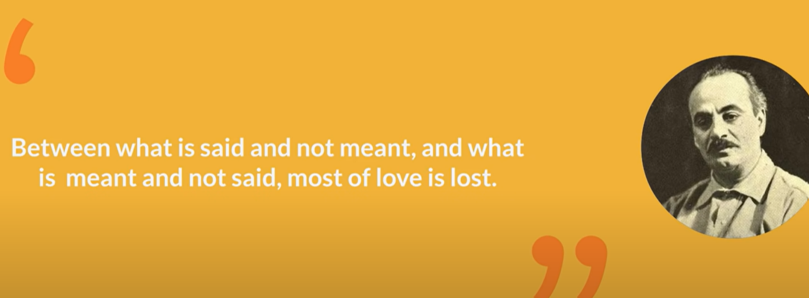

- {{youtube https://www.youtube.com/watch?v=MP1eSj3PEiM}}
	- [[InterpersonalSkills]] 
		- 为什么爱会消失？
		  collapsed:: true
			- 因为人与人之间的不同经历导致彼此对于同一件事有不同的[[沉默的契约]]，也就是说大家都认为别人理所应当知道自己秉承的观点，所以保持沉默并没有直接说出口，而这种差异导致了双方始终以错误的方式爱着对方。
			  collapsed:: true
				- 
			- [[沉默的契约]]会出现在多种不同类型的人际关系中：
				- 父母和孩子当中：担心和关心并不是一回事，孩子更需要的是别人以成年人的方式来看待他，而父母以为需要给出更多的爱
				- 家庭经营中关于金钱的沉默契约：一方认为需要节俭，保持经济独立，另一方则认为只有创业才能拥有足够多的财富，这是两种不同的金钱观，双方需要做出调整：比如当亏本超过多少时就停止创业
				- 恋爱中的关于自由的沉默契约：一方认为自己之前不够负责，所以会付出更多关心，另一方则喜欢个人空间的自由感但又不想说出来被猜疑
		- 如何不让 [[沉默的契约]]破坏关系?
		  collapsed:: true
			- 对于自己身上存在的 [[沉默的契约]]进行自我观察，[[向内观]]
			- 重视与别人的沟通，提升沟通力，做到不带批判、简洁准确的表达
			- 双方不断地去修改和完善存在的 [[沉默的契约]]
			-
-
-
-