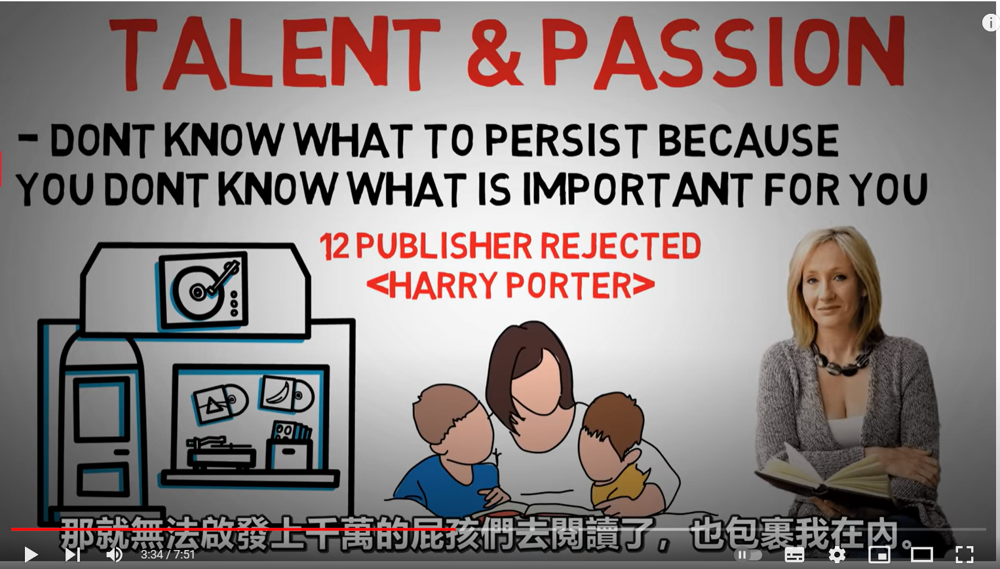

- {{youtube https://www.youtube.com/watch?v=QdpDggn__zA}}
	- [[狐狸]]和[[刺猬]]刺猬的[[生存策略]]有什么重大的差别？
	  collapsed:: true
		- 
	- [[狐狸]]和[[刺猬]]类型的人举出一些例子？
	  collapsed:: true
		- 
		  id:: 63be723a-fc08-4de6-a231-8e05988a0c1d
		- [[巴菲特]]和[[科比]]都属于刺猬类型，[[巴菲特]]不把目光投向短期内的新兴市场，而是更专注于投资策略
		-
	- 为什么[[刺猬]]策略为几乎所有的公司或者人采纳，为何这种策略会胜出呢？
	  collapsed:: true
		- 因为这种策略实现了[[价值(Value)]]、[[才能(Talent)]]、[[热情(Passion)]]三者的统一。
		  collapsed:: true
			- 
		- 这三者的作用是：
			- [[才能(Talent)]]  [[#green]]==解答了[[WhatToDo]]的问题==，是实现目标最重要最直接的能力，[[#red]]==不要因为生存而放弃自己的天赋；天赋也是需要积累的，不断积累才能最大限度地激发==。
			  collapsed:: true
				- 
				- 
			- [[热情(PASSION)]] [[#green]]==解答了[[HowToDo]]的问题==，能够帮助我们抵御[[反对意见]]和[[坚持(Persist)]]过程中的[[困难(Difficulty)]]
			  collapsed:: true
				- 
			- [[价值(Value)]] [[#green]]==解答了[[WhyToDo]]的问题==，这是做这件事[[坚持(Persist)]]的[[源动力]]
			  collapsed:: true
				- 
	- 每个人应该如何制定自己的[[刺猬]]类型的[[生存策略]] ？
	  collapsed:: true
		- 
		- 
		- 
		- 
		- 当一个好的[[自媒体博主]]的[[刺猬]] [[生存策略]] ？
			- 
			- 
		-
-