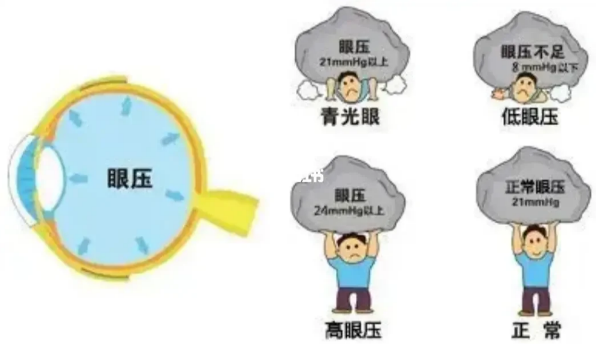

以下材料整理自网络，具有一定的可信度，使用者可以按需参考。

- ### 0 眼压高是什么？ 怎么测量眼压？
  
  眼压就是眼球内部的压力，它是眼内容物对眼球壁施加的均衡压力。
  
  **正常人的眼压的正常值为10~21mmHo**
  **眼压>24mmHq为高眼压，而眼压<8mmHq为低眼压。**
  
  
- **眼压计**是一种测量眼压的仪器,可以通过接触或非接触式来完成。
- ### 1 生理来源是什么？
  
  
- ### 2 眼压高的潜在原因有哪些？
  
  鼻炎引发的眼压高
  
  青光眼附带的高眼压症
  
  **工作压力大**
  
  还包括：**（过量引用咖啡因）**
  
  
- ### 3 眼压高有哪些容易被忽略的危害？
  
  **对视神经的损害导致青光眼：** 患眼压高的危害是很大的，**对视神经的损害最为显着，主要表现为视力下降**。 一般发生在急性高眼压时，视力下降初期是由于高眼压使角膜内皮不能将角膜内的水分正常排出，结果发生角膜上皮水肿。急性持续高眼压，可使视力降至光感，这是因为很高的眼压严重影响了视细胞的代谢。
  
  **视野缺损导致视神经萎缩：** 青光眼性视神经萎缩是多因素的，但最主要的原因是机械压迫和视盘缺血。
- ### 4 从饮食方面怎么缓解眼压高的现象？
  
  多吃蔬菜，**宜食蜂蜜，蜂蜜不但可以降眼压，而且可以通便**，避免眼内房水分泌增加而引起眼压增高，
  
  **控制饮水量**，因血液稀释，渗透压降低，房水形成也会增加。对预防眼压高的症状很有帮助
- ### 5 从药物方面怎么有效缓解工作压力大导致的眼压高红血丝？
- #### 5.1 使用冷敷而不是热敷：因为红血丝是血管扩张充血，热敷的话，热胀冷缩，会血管充血更厉害
  
  
  
  
- ### 5.2 叶黄素
  
  这个是给眼睛补充营养的，我现在就每天吃两粒同事给我推荐的**康维特**。
  这个是小分子叶黄素酯的，（**小分子的叶黄素**是更容易被吸收，**吃下来身体也没有负担**）
  
  
  
  
  
  
- #### 5.3 防蓝光：看窗外6米以外的地方， 持续20秒，可以缓解眼疲劳
- #### 5.4 眼部按摩操
- ### 6 其他网友的案例
  
  眼压持续高可能是 **结膜炎 或者 泪道疾病**：
  
  
  
  
  
  需要判断除了红血丝以外，是否存在**异物感分泌增多、怕光流泪、视力下降、有疼痛感**等，就需要引起注意。
  
  **如果是单纯的眼红，或者伴有干涩或者伴有轻度的眼痒，可以使用冷敷、人工泪滴滴眼液，也可以使用常规的抗生素滴眼液（左氧氟沙星滴眼液、红霉素滴眼膏），****使用过程中要随时关注眼部的变化**。
  
  可能**肝脏有问题**。