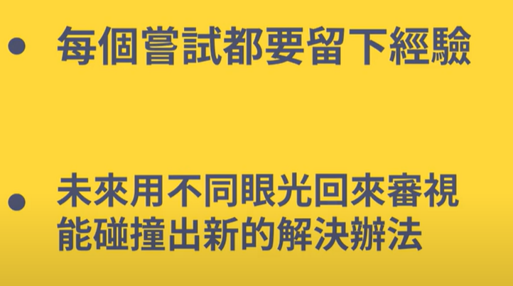
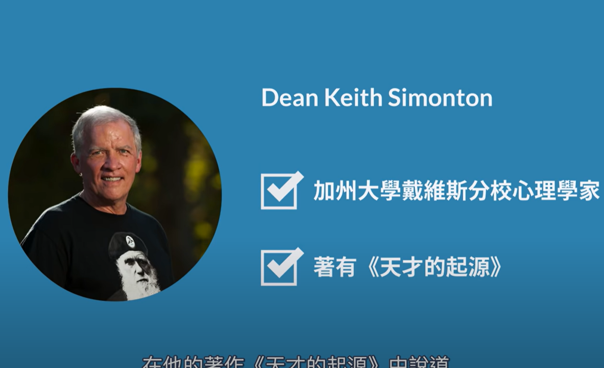

- [[点子笔记]]：
  collapsed:: true
	- 将每次遇到的问题和当时的想法都记录下来，日后可以重新回看
	- 
	- 
- [[多产的价值]]：
  collapsed:: true
	- 
	- 
	-
- [[最短测试时间]]：
  collapsed:: true
	- 为了避免自己只是一时的兴趣疲乏，要为自己设定一个最短的测试期限。避免在一个事情上纠缠不休。
	- 
	-
	-
	-
- [[顶尖人才]]：
  collapsed:: true
	- 
	- 
	- 时刻记得把一只脚留在领域之外