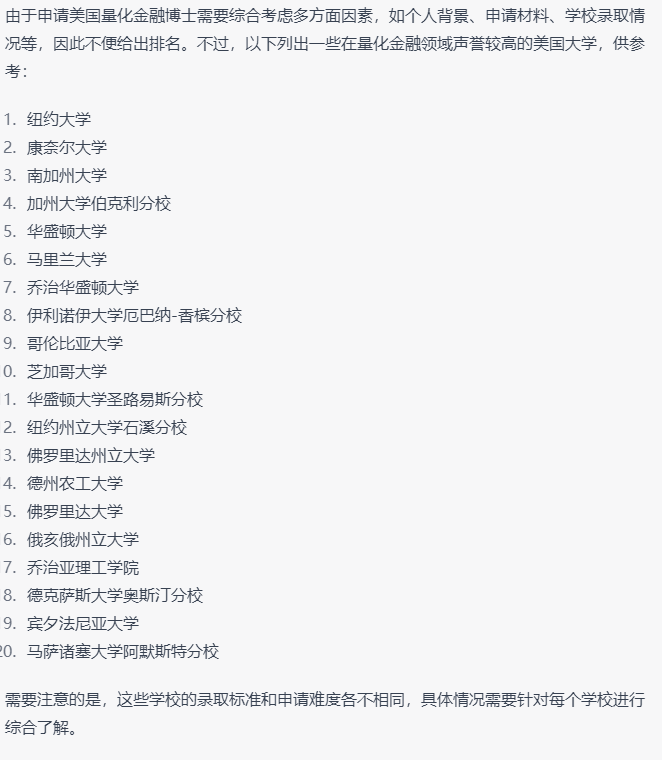

- 从个人、行业这两个角度来分析和挖掘什么才是真正具有[[长期价值]]的事情？这些[[长期价值]]体现在哪些方面？
- [[对于个人，具有长期价值的事情]]
	- 对于个人而言，具有长期价值的事情可能包括以下几点：
	- [[健康(Health)]] ：
		- 保持良好的健康状况，包括饮食习惯、锻炼、睡眠和心理健康等方面的注意，这将有助于个人更好地享受生活、工作和社交活动，也能为未来的长期发展打下基础。
	- [[教育(Education)]：
		- 终身学习是个人成长和发展的关键，通过学习新技能、知识和经验，个人能够拓宽自己的视野，提高职业竞争力，不断实现自我价值。
	- [[人际关系]]：
		- 建立良好的人际关系能够提高个人的社交技能、增强社交圈子和获得更多的支持和帮助，同时也有助于提高自我认知和情商。
	- [[财务健康]]：
		- 通过理性的消费和理财，积累财富并管理好自己的财务状况，能够为个人的未来提供更多的选择和自由。
	- [[自我价值实现]]：
		- 不断探索自己的兴趣、天赋和潜力，通过不断挑战自己并克服困难，实现自我价值和自我成长。
- [[关于行业，具有长期发展价值的方向]]
	- 到底哪些行业在未来会具有长期发展价值呢？
	- 目前计算机方向里的蓝海有哪些？
	  collapsed:: true
		- 
	- 对于程序员，应该做哪些具有长期价值的事？
	  collapsed:: true
		- 
		  id:: 63f18b9d-3245-406b-9eae-7ff95cc868cd
		-
	- 海外华人的职业选择有什么特点？
	  collapsed:: true
		- 
		-
	- 如何看待finance technology的发展潜力？
	  collapsed:: true
		- 
		-
	- 金融和计算机科学结合的方向有哪些？
	  collapsed:: true
		- 
	- 金融和计算机科学结合的phd方向有哪些？
	  collapsed:: true
		- 
		-
	- 量化金融的美国博士申请难度？
	  collapsed:: true
		- 
	- 211本科软件工程专业能申请上美国的量化金融博士吗
	  collapsed:: true
		- 
	- 区块链的博士研究方向有哪些？
	  collapsed:: true
		- 
		-
	- 加拿大的计算机博士一般需要几年毕业？
	  collapsed:: true
		- 
		-
	- 加拿大毕业的计算机博士中中国人有多少?
	  collapsed:: true
		- 
	- 加拿大金融和计算机方面结合的博士学位，哪些学校有提供？
	  collapsed:: true
		- 
		-
	- 加拿大量化金融博士的毕业出路有哪些?
	  collapsed:: true
		- 
		-
	- 美国量化金融博士相对好申请的100个学校?
	  collapsed:: true
		- 
		-
	- 美国量化金融博士的毕业出路有哪些?
	  collapsed:: true
		- 
		-
	- 加拿大量化金融博士的就业城市和就业公司？
	  collapsed:: true
		- 
	- 量化金融属于越老越吃香的行业吗？
	  collapsed:: true
		- 
		-
	- 如何从软件工程专业转行量化金融？
	  collapsed:: true
		- 
		-
	- 没有很好的学历，能够进入量化金融公司工作吗？
	  collapsed:: true
		- 
		-
	- 美国量化金融博士主要去哪些城市和岗位就业？
	  collapsed:: true
		- 
		-
	- [[西安大略大学（Western University）]]的量化金融博士申请难度？
	  collapsed:: true
		- 
		-
		- 
		- 
		-