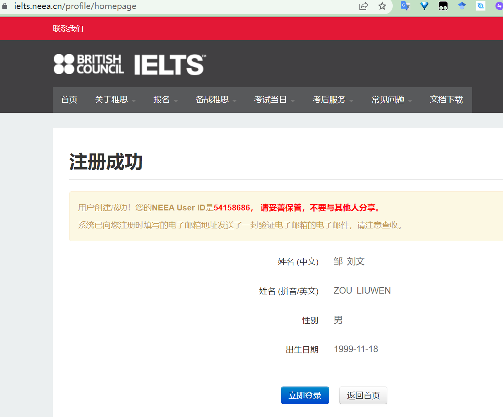
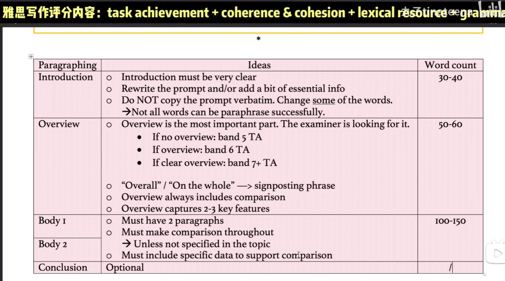
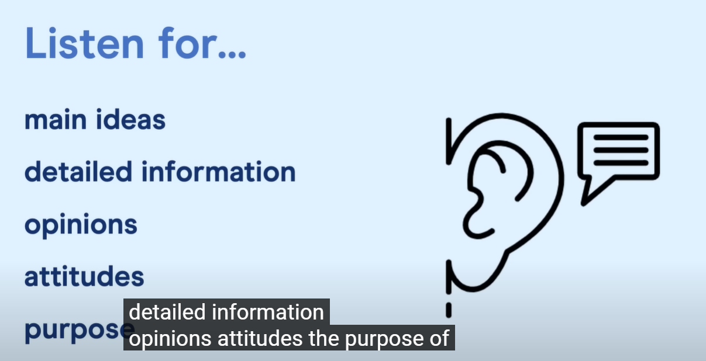

- 
- 182417@Ycdsw
-
-
- [[Listening]]
	- Rare Breeds Zone
		- 稀有物种区
	- Grazing Zone
		- 放牧区
		- This is one of the richest grazing lands in China.
	- Marsh
		- 沼泽
	- A is on the bend just to the north of the school
	- A is on the bend just before you go to school
	- When you take this path to the right,  当你沿着这条路走到右边
	- on the intersection of A and B 在A和B的交叉处
	- on the corner/junction of A and B 在A和B的交角处
	- on the higher right-hand corner 在右上角
	- on the higher left-hand corner 在左上角
	- on the lower right-hand corner 在右下角
	- on the lower left-hand corner 在左下角
	- the second corner/bend
	- follow around this sharp corner
	- Make a right / Turn right
	- Make a left / Turn left
	- make the first/second/third turn
		- make the first turn on the left = take the first left
		- make the second turn on the right = take the second right
	- The Market Garden is the first from the left, and the school is the second from the left.
	- Go straight / Go ahead / Go along 都表示直走的意思
	- Go straight on, past the school
	- bridge
		- Go towards the bridge 仅仅是朝着桥的方向走，但没有过桥
		- Go past the bridge 仅仅是路过了桥，但没有过桥
		- Go cross the bridge = cross the bridge 已经过桥
	- 在对面:
		- A is opposite the New Barn, beside the side path. A就在side path这条街上的New Barn的对面
		- B is across Hill Road from the bank. B在Hill Road上银行的对面
		- C is on the other side of City Road from the public gardens.
	- cheddar cheese roll
		- 切达奶酪卷
	- ａ packet of crisps and chocolate bars
		- crisps是油炸土豆片、炸薯条这种的，通常可以说potato crisps
		- crisp还可以作为动词，表示：使得XXX变脆的意思
	- plastic sack
		- 购物塑料袋的意思
		- sack作为n还有解雇的意思：I face the risk of sack by scholl
			- 作为解雇时也可以作为动词
	- woodshed
		- 指代的柴房、柴棚
			- The woodshed burned down in half an hour.
			-
	- brass lamps
		- 黄铜灯
	- I will never live in such circumstances.
		- 我永远也不会居住在这样的环境下
	- The prison convicts are not well treated.
		- 监狱的罪犯不会被友善对待
	- inquisitive
		- 好奇的、过分打听别人私事的、好学的、兴趣广泛的
		- We should keep an inquisitive mind at any age.  我们在任何年纪都应该保持一个勤学好问的头脑。
		- Don't be so inquisitive about others' marriage.
	- ride the wave
		- 赶上浪潮
		- I hope to ride the wave of distributed training of AI models
		- We fail to ride the wave of Net culture
			- 我们未能赶上这波网络潮流
	- take the kayak
		- 乘坐皮划艇
		- I have taken the kayak to the Seattle from Vancouver.
	- I am lost for words when I approach this great land of freedom.
	- Before we head off, we have to mention the caves.
	- work placement 课程实习
	- It wasn't a straightforward interview/journey
		- 这并不是一场顺利的面试/旅程
	- This baby starts feeding fruits at the age of 2.
		- 这个婴儿在两岁的时候就开始进食水果了
	- Although I have drunk, I stagger to my feet after I fell on the street accidently.
		- 在我不小心在街上摔倒，我摇摇晃晃地站起来了
	- The wool of this sheep is really sought after.
		- 羊毛很受欢迎
	- The target has a hard wearing.
		- 地毯非常耐磨
	- 注意题目中含义main points这种单词时，就表明听力材料中会包含所有选项，需要分清楚这些不同选项的程度
	- 审题的准确性比审题的速度更重要，因为一旦不准确，必然会做错这道题，而如果题目没有审完，可以在后面听的过程中边听边审；同时，如果审题过快，会导致对选项的瞬时记忆非常不牢靠；
	- 听力能力  = 题干阅读理解能力 + 瞬时记忆能力 + 听音能力
	-
	-
- [[Speaking]]
	- colloquial terms
		- 口语术语
	- phrasal verbs
		- 地道的动词
	- Often of course they don't have a clue
	- well like I said before, I have tried to get people to interpret my dream. You know I've heard a lot of crazy things, like flying means you're going to go up in the world or music that means you are looking for romance. I don't think anyone really knows for sure.
	- For sure, I think everybody wants their plan and their project to come off.  I think it's important to have a clear dream, because if you don't,  you tend to drift and you will never make a go of it.
	- I will go for a run or I go for a walk to freshen up my mind.
	- We catch up with everything that has happened to each of us that day.
	- We also unwind from our studies.
-
- [[Reading]]
	- 阅读题型中就是依据观点找教授或者说话的人这种题型非常难，虽然表面上教授的数目比较少，但是难点是：每个教授发表的观点都是长篇大论，所以一是很多时候通过答案的关键字也不好定位到原文，二是原文本身的观点也比较难以理解。
	- figure = outline = shape三者都可以用来描述山的形状；alter和change可以互用
	- unit除了表示度量的“单位”，还可以表示“机构”的意思，和institution、foundation（除了基础也可以表示非营利性的机构，主要以捐赠资金为目的，也可以指代特定的某种组织类型）、Agency、Establishment、Entity（具有法律地位的公司、组织或者政府部门）
	- surrounding除了可以用来描述人所处的环境以外，还可以表示自然环境，比如某棵树周围的其他自然事物、土壤等组成的环境
	- figure的双重含义
		- "figure" 这个词既可以表示 "图案"，也可以表示 "形状"，作为图案是可以理解多个形状组合而成的镂空的pattern
		- 在描述图像或绘画时，"figure" 通常指人物、动物或其他物体的描绘或轮廓。例如，"The painting features several figures dancing in the moonlight."（这幅画描绘了几个在月光下跳舞的人物。）
		- 而在数学和几何学中，"figure" 则指一个二维或三维空间中的形状，例如正方形、圆柱体或球体等。这些形状通常由线条、边界或面积定义。例如，"The area of the figure is calculated by multiplying its length and width."（该形状的面积通过将它的长度和宽度相乘来计算。）
	- regimental
		- You have to obey the code of regimental conduct.
			- 你不得不遵守军规
		- Zxf ceased to hold the position of regimental commander.
			- 不再担任军队长官
	- 前罗马是：pre-Roman，一个hyphened word;  后罗马则是post-Roman
	- More controversial is that ... 更有争议的是
		- More controversial is that the date of my birth
	- Western tales tend to be enigmatic at the first reading of it
		- 神秘的
	- What makes him enigmatic is that he never showed himself up in the public occasion / event.
	- When I reach the age of 60, I hope I could be an artistic monk in the Japanese priory.
		- 成为修道院的一名艺术僧侣或者说艺术修道士
	- 表示“下面的XXX”有两种表达方式：
		- XXX below
			- Do you see the stones below (the river) ?
		- XXX underneath
			- Standing on the bridge, we could not see the sailing boat underneath
	- The overlying ice on the river in winter is strong enough to ski on.
	- In the garden,  tender grass overlies the once barren and rugged grassland.
	- With the refreshments provided,  our spirit seemed to be lifted again.
	- She has such a gleaming smile
		- 明亮和闪耀的微笑
	- Eyes are the gleaming windows of the heart
	- He rolled up his sleeves to reveal the scars.
		- 他挽起柚子，露出伤疤
	- You should scour out the old car.
		- 擦洗旧车
	- I leave a will and testament before I commit suicide.
		- 留下遗嘱
	- A paper with high citations is a strong testament to his academic performance.
		- is proof of
	- "stretch back over millennia" 表示某个事物、事件或者现象已经存在了几千年之久。其中，“stretch back” 表示“延伸、伸展”的意思，常用于时间和空间上的描述。而 "millennia" 则是 "millennium" 的复数形式，表示“千年”。
		- 因此，"stretch back over millennia" 可以被翻译为“延伸至几千年之前”，通常用于描述一些非常古老的事物，例如文化、历史、传统等等。它可以强调过去的长久性，并且暗示着对这些古老事物的尊重和重视。
		- My dream about AI will stretch back years.
	- She likes to sleek/comb back the dog's hair to make it neat
	- cult
		- I am not into the cult of the Buddhism
			- 佛教的狂热
		- 带有极端或者奇怪的信仰的宗教群体
			- He just joined a religious cult.
	- We cannot overuse the antibiotics for it can be disrupting as to the bacterial balance. What we can try instead is to pay more attention to our personal hygiene and wash ourselves constantly. As for diets, people nowadays are obsessed with low-fire food which might cause soaring rates of allergies and immune problems. Bacteria is just one  sort of microbes that populate the planet. Although they are ubiquitous,  inhabiting in air, water and rocks, we can not have a direct sense of them with our naked eyes. Yong has written a utterly absorbing book about the potential perils if we try to mess with them. The result would be an outright disaster if you are deaf to our advice. The microbes are present commonly in the form called colony, meaning a group of microbes are gathering at certain areas of each organism（生物体）.  If microbes are in the right context, harm would never have on us.
	- I sit contentedly in the library  hall and feel something glamorous is rising in my gut. I talked at large with a teacher about his career.  After the talk,  my heart was not fraught with worries and anxieties anymore. It was teeming out the windows, but the text on my computer teemed with sunlight.
	- I and my parents are not in a symbiotic relationship cause I can rely on myself now.
	- One could swipe out their lives easily, but they could not swipe out their impression on others.
	- The fungus could swipe out the whole population of frogs.
	- 阅读一定不要全部阅读完，因为通常时间肯定不够，如果出现类比或者并列的内容，就直接看前面几个就行了，或者抓住后面类别的核心主语或者核心谓语；对于出现大量生词的句子，要对一些生词的样子熟悉，但是不需要知道它的含义；对于填空，通常是只需要定位到原文的段落，然后在那一段查找就行，根本不用把那一段全部读懂读透；对于阅读中出现的段落填空，通常也只是原文中的某一段或者某两段内容，通过关键字准确定位就可以
	-
-
- [[Writing]]
	- 
		- 雅思写作的Task 1的写作步骤：
		  collapsed:: true
			- 步骤1：分析写作任务和数据
				- 是静态数据还是动态数据，如果是动态对应的时间轴有几种类型的时间尺度
				- 图标有几个坐标轴（含义和单位是什么）
			- 步骤2：对数据进行分组
				- 将具有相似性的数据归纳为同一组：
					- 比如随时间尺度变化的趋势相似
				- 分析组间的趋势和异常
					- 同一组内的数据具有什么相同的趋势
					- 某个特点只有单个组所有，那么这个组的数据就是异常
				- 通过数字来选择主要特征
					- 饼状图中的最高比例和最低比例
					- 折线图中的全局最低点和全局最高点
					- 折线图中的局部最低点和局部最高点
					- 起始点和结束点
					- 数据发生突变的点
			- 步骤3：花15min写剩下的论文
				- 重写论文的写作要求，作为介绍：替换关键词汇、压缩句子表达、不要包含具体的数据（少于1min）
				- 写论文的主体部分：解释每组的组内数据、比较不同组的数据并给出异常
				- 最后的总结：一般一句话，最多不超过三句，总结主要趋势和异常
			- 词汇和表达的积累：
			  collapsed:: true
				- rise to
				- a total of
				- drop a little
				- illustrate sth in two years
				- the majority of sth come from
				- the source that contribute the most to the A was B
				- A account for 75% of the B
				- most of the A go to B
				- give information regarding ...
				- in summary
				- a peak of roughly 4.2 tonnes
				- decline to around the initial 3 kilometers mark
				- looking at ...
				- A was utilized in April, followed by a marked decline to 10 in March
				- rising to XX before dipping to YY  在跌到YY之前先上升到XX
				- increase steadily to reach XX  缓慢上升到XX
				- this appears to reflect A
				- be around its lowest
				- be around its highest
				- just over XXX
				- just below YYY
				- Regarding sth, we see that ..
				- climb dramatically from 0 to 100 towards the weekend
				- actually decline by almost half
				- there is a similar pattern in A
				- with the figure showing the similar growth to
				- there is a marked rise from A's 100 to 1000 in B
				- be generally stable during the year in all countries except A,  where ...
				- gives data about
				- a low of 50 at 4 pm
				- a high of 100 at 12 am
				- a fall of 50
				- a decrease to 35
				- A increase broadly in line with B
					- A和B同步增长
				- the spike is accompanied by ...
				- the amount of budget reach to 3 million before tailing off
					- 预算在缓慢衰减之前达到了3百万
				-
				-
			-
	- 其他各种写作语句的积累：
		- create an ever greater demand for sth
		- A is a major point of attraction that draw people to engage in self-employed jobs
		- it would mean that ..
		- Doing sth usually means that ...
		- Despite what A seemed to offer, it has some obvious disadvantages which ..
		- The things that we could do include but not limited to ...
		- ..., and thus make it unnecessary for individuals to do sth
		- become famous from the grassroots
		- Nevertheless, there are some disadvantages to doing sth
		- the trend of A is a result of B as well as C
		- This is a result of xxx as well as yyy
		- Despite A that ...,  there are some disadvantages with this mode of B, which
		- Doing A does not only mean that ...,  it also allows for
		-
		-
		-
- [[Money]]
	- 
	-
-
-
- [[考试技巧]]
	- 
		- 还少了一个观点的发展和演变：这一点特别需要注意，因为你可能在原文中看到了一个观点，但是这个观点对应的时间点可能与题干中的时间点并不一致
		-
-