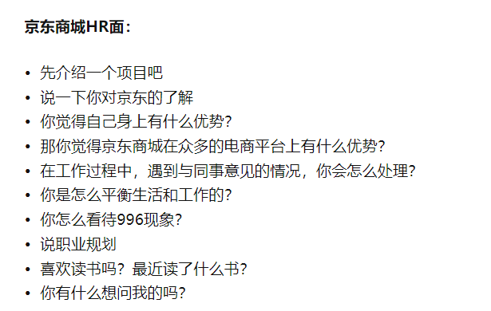

- volatile关键字相关？
- java的线程在操作系统层面是怎么执行的？
- [[$red]]==抽象类和接口的区别？==
	- 抽象类是单继承，而接口是多实现
	- 抽象类可以有成员变量，而接口没有成员变量，只能有常量（static final）
	- 抽象类可以有构造方法，而接口没有构造方法
	- 抽象类中可以有非抽象方法，而接口中JDK 7之前的方法都是抽象的，JDK 8之后才可以允许有default、静态方法等非抽象方法
	- 抽象类中的抽象方法可以是任意类型，而接口中JDK 8之前都是public，JDK 9才允许可以为private
	- 抽象类的设计思想是由下到上，也就是归纳出一些类的共性；而接口的设计思想是由上到下，也就是定义一些行为的接口，具体怎么执行这个行为由实现类规定
- 说一下JAVA的异常体系？
-
- 静态代码块是什么，加载顺序是？
- spring是怎么解决循环依赖的？
- 数据库mysql，innodb引擎的索引结构是什么，为什么不用二叉树、B树、hash索引？什么是哈希索引？
- 在你项目或者实习中，有用到优化索引吗？
- sql注入是什么？
- NIO BIO AIO区别？
- 说一下springmvc和spring-boot区别？
- 说一说Bean的默认作用范围是什么？说详细一点
- 说一下哈希的冲突都是怎么解决的？用什么方法？
- 怎么实现动态代理？
- 说一下Spring的工作原理，怎么实现控制反转？
- 说一下action是单实例还是多实例？
- 知道integer缓冲机制么？说一下吧
- MyBatis怎么防止 sql 注入？
- 什么是 Java 程序的主类？应用程序和小程序的主类有什么不同？那Java 应用程序与小程序之间有那些差别？
- Spring 有几种配置方式？具体说一下
- [[$red]]==解释一下Spring Bean 的生命周期？==
	- Bean的生命周期可以分为核心的五个阶段：
		- Bean实例化：Spring容器 依据配置中的bean定义，通过构造函数或者工厂方法来创建Bean的实例；
		- Bean的属性注入：将配置的属性值和其他Bean的引用传递给Bean的实例
		- Bean的初始化，这个阶段又可以分为四个子阶段：
			- 判断Bean是否实现了BeanNameAware、BeanFactoryAware、BeanClassLoaderAware等接口，然后设置相关的依赖，比如如果实现了BeanNameAware接口，则工厂传递Bean的Id来调用setBeanName（）方法，如果实现了BeanFactoryAware接口，则工厂传递自身实例来调用setBeanFactory()；
			- 如果存在任何与Bean关联的BeanPostProcessors, 则调用preProcessBeforeInitialisation()；
			- 如果Bean实现了InitializingBean接口或者在xml中指定了init-method方法，则调用afterPropertiesSet或者init方法对Bean进行初始化
			- 如果存在任何与Bean关联的BeanPostProcessors，则调用postProcessAfterInitialization()方法
		- Bean实例在spring应用中被正常使用
		- 如果Bean实现了DisposableBean接口或者在xml文件中配置了destroy-method, 那么在spring容器关闭时，就会调用destroy方法销毁Bean实例
- [[$red]]==介绍一下Spring Bean都有哪些作用域？==
	- 有6个作用域：
		- 单例 singleton：一个Bean在Spring IOC容器中只有一个实例
		- 原型： 一个Bean的定义可以有多个实例
		- 请求：每次http请求都会创建一个Bean
		- session：在一次http session里，一个Bean的定义对应一个实例
		- globalsession
		- application
- [[$red]]==说一下SpringBoot自动配置的原理？==
	- 注解@EnableAutoConfiguration, @Configuration, @ConditionalOnClass是自动配置的核心，其中@EnableAutoConfiguration给Spring容器中导入META-INF/spring.factories下的所有自动配置类，然后筛选出有效的自动配置类，每个自动配置类依据xxxProperties.java的配置文件来进行自动配置。
	- @ConditionalOnClass的含义是只有当类路径中存在指定的类时，才会去创建Bean
- [[$red]]==说一下SpringBoot中的常用注解？==
	- @Repository注解是@Component注解的特化，它为DAO提供了额外的好处，其将DAO注入到Spring IOC容器中，并且能够使得未经检查的异常转化为Spring DataAccessException
	- @Controller将这个类标记为Spring Web MVC的控制器
	- @Service也是@Component注解的特化
	- @Required表示bean的该属性必须在配置时进行设置，否则抛出BeanInitialization异常
	- @Qualifier 就是当有多个实现相同接口的Bean时，指定具体使用哪一个Bean来进行属性注入
	- @RequestMapping是将http请求映射到控制器的处理方法上
- [[$red]]==说一下SpringBoot中有哪几种属性装配方式？==
- [[$red]]==什么是Spring IOC？==
- [[$red]]==Spring IOC容器的核心构建流程是什么？==
- [[$red]]==BeanFactoryPostProcessor和BeanPostProceesor的区别：==
	- 两者都是用于扩展Bean生命周期的接口，但是BeanFactoryPostProcessor是在spring容器实例化Bean之前的后处理器，可以对BeanDefinition进行修改、添加或者删除BeanDefinition，对BeanDefinition的修改将会影响到后面Bean的实例化过程；而BeanPostProcessor是在spring容器实例化Bean之后的后处理器，在Bean实例化前后做一些额外的处理，也就是分别会调用preProceessBeforeInitialization和postProcessBeforeInitialization。
- [[$red]]==说一下SpringBoot和Spring的区别？==
	- springboot主要用来快速开发应用程序，相比于spring，其有五点改进：
		- 能够开发独立的应用程序
		- 内置了tomcat，jetty等，可以直接运行程序，而无需部署
		- 整合了常用的依赖，通过pom文件来简化maven依赖的配置，因为springboot引用其他依赖时，会把相关的依赖都导入进来
		- 自动配置spring：springboot将xml配置改为JAVA配置，将Bean注入改为使用@Autowired注解，将各种xml、properties配置浓缩在一个application.yml文件中
- [[$red]]==Spring的依赖注入有几种方式？==
- [[$red]]==BeanFactory和ApplicationContext的区别？==
- [[$red]]==springboot中properties文件和application.yml的内容有什么区别？==
	- properties是基于JAVA的配置文件格式，而yml是基于yaml文件格式的；properties文件是使用点号来表示层级关系，并且使用key=value这种方式，比如server.port = 8080，而yml文件是使用缩进和：来表示，所以yml文件要比properties文件更加方便阅读和维护，比较适用于复杂配置；当springboot项目中同时包含.yml和.properties文件时，yml的优先级更高，yml的配置会覆盖properties中的相同配置
- @Autowire注解和@Resource注解的区别？
	- [[众安保险]]
- @Autowired的实现原理？
- MyBatis 分页怎么实现的？mybatis的ResultMap是什么？mybatis中的#和{}有什么区别？
- 能说一下kafka的核心概念或者使用场景吧。
- kafka和rabbitMq有什么区别？
- 属性注入和构造器注入哪种会有循环依赖的问题？
- 你了解RPC框架和Dubbo吗？
- 如果让你实现一个MQ，怎么样保证消息不丢失？
- 在 MySQL 数据库中索引的工作机制是什么？
- 说下乐观锁，悲观锁（select for update），并写出sql实现？
- HashSet和TreeSet？
-
-
-
-
- hashmap如何解决hash冲突，为什么hashmap中的链表需要转成红黑树？
- hashmap扩容时每个entry需要再计算一次hash吗？
- 如何用LinkedHashMap实现LRU？
- 如何用TreeMap实现一致性hash？
-
-
- Java web过滤器的生命周期？
- 如何设计一个秒杀系统？
- 数据量多少的时候需要进行一个分库分表？为什么你要自己开发一个分库分表中间件？
- 分库分表后，怎么查询全量的数据？
- redis减库存的时候用的是哪个指令？
- myisam数据和索引分开，innodb中有数据和索引分开的情况吗？
-
-
- 问题什么时候要自己解决，什么时候要及时向人家请教，有把握这个度吗？
- springboot使用事务是用什么标签或者加XML？
- spring事务使用的时候有什么需要注意的吗？比如什么时候会失效？
- 什么是JDK?什么是JRE?Java语言有哪些特点？
- java中会存在内存泄漏吗？请简单描述泛型常用特点(待补充)？
-
- 说说List,Set,Map三者的区别？Map有什么特点？
- Vector(数组实现、[线程同步]？
- 除了使用new创建对象之外，还可以用什么方法创建对象?
- Java反射创建对象效率高还是通过new创建对象的效率高?
- Java反射的作用是什么？
- java中会存在内存泄漏吗？请简单描述
- 你能保证GC执行吗？
- 什么是GC？为什么要有GC？
- 对于SQL慢查询会考虑哪些优化？
- redis主从同步是怎么实现的？
- JVM加载class文件的过程？
- innoDB有什么特点？
-
- 
-
-